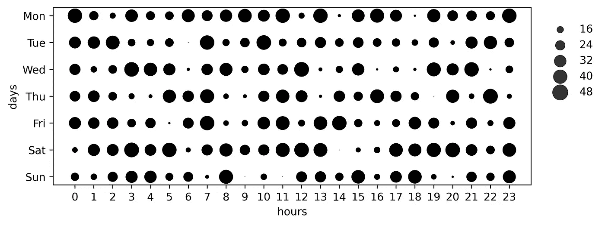
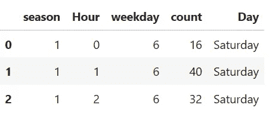
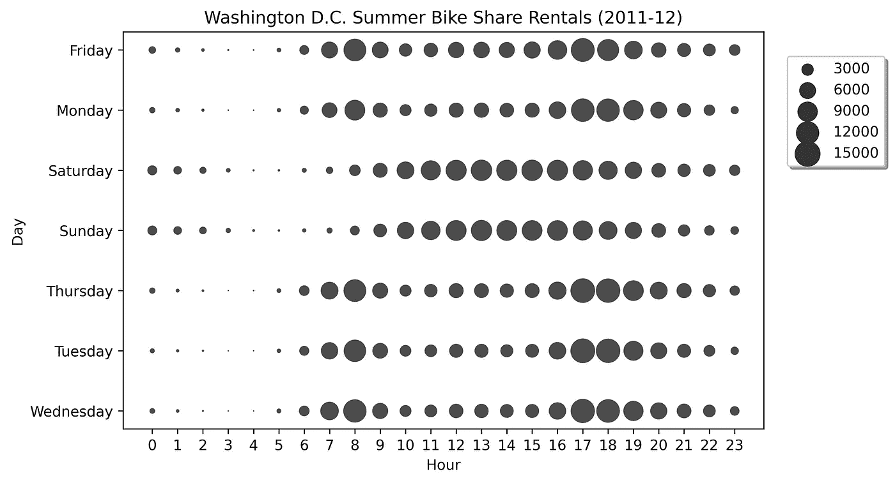
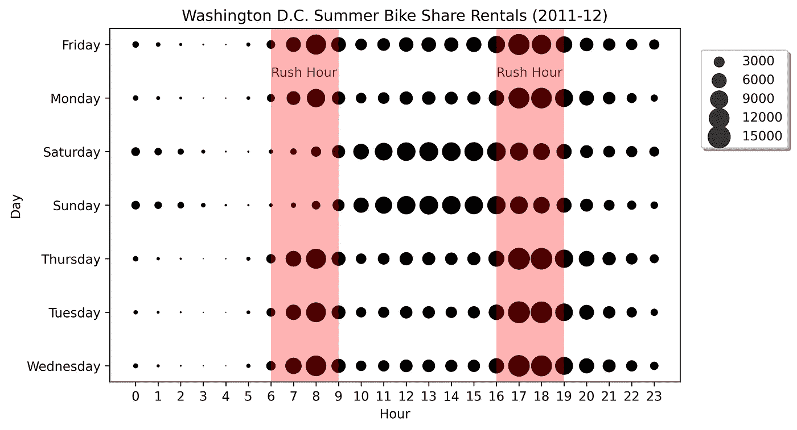
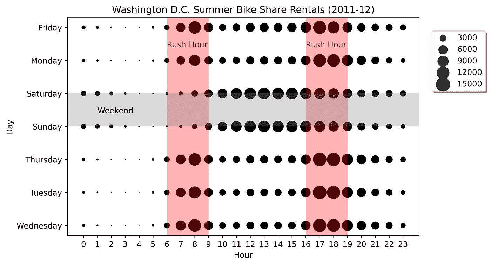
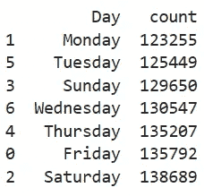
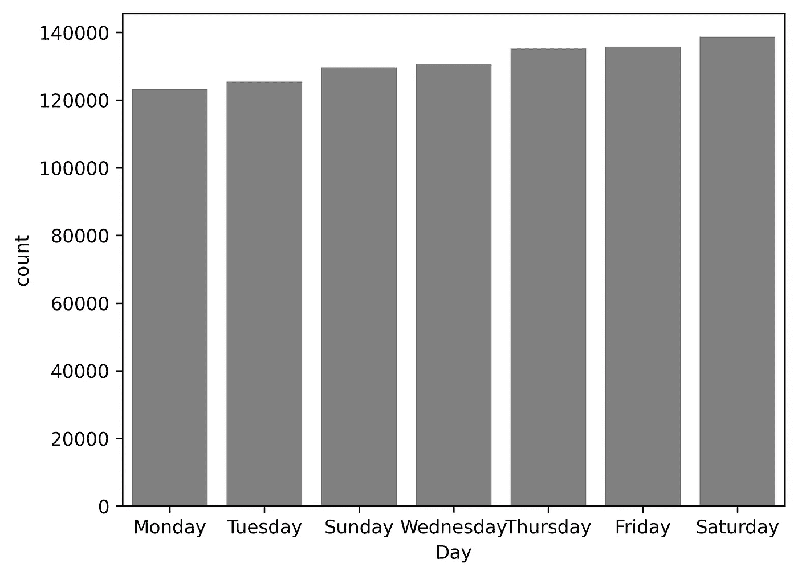

# 使用 Seaborn 制作打卡图

> 原文：[`towardsdatascience.com/make-a-punchcard-plot-with-seaborn-ee8097bee4e1`](https://towardsdatascience.com/make-a-punchcard-plot-with-seaborn-ee8097bee4e1)

## 快速识别周期性趋势

[](https://medium.com/@lee_vaughan?source=post_page-----ee8097bee4e1--------------------------------)[](https://towardsdatascience.com/?source=post_page-----ee8097bee4e1--------------------------------) [Lee Vaughan](https://medium.com/@lee_vaughan?source=post_page-----ee8097bee4e1--------------------------------)

·发布在 [Towards Data Science](https://towardsdatascience.com/?source=post_page-----ee8097bee4e1--------------------------------) ·阅读时间 6 分钟·2023 年 9 月 17 日

--


带有时间卡的打卡钟（图像由 Hennie Stander 提供，来源于 UnSplash）

*打卡图*，也称为*表格气泡图*，是一种用于突出数据中周期性趋势的可视化类型。它以一个固定的*矩阵*或*网格*格式显示数据，通常由一周的天数与一天的小时构成。圆圈代表行和列交点的数据点，其大小传达数据值。颜色可以用来包含额外的信息。



表格气泡图（图像由作者提供）

“打卡”这个名字暗指过去工人用来记录上下班时间的“时间卡”。

要构建打卡图，你需要*时间戳*数据。在这个*快速成功数据科学*项目中，我们将使用 Kaggle 数据集来跟踪在华盛顿特区租借自行车的时间。

# 数据集

Kaggle 上的[*华盛顿特区自行车共享数据集*](https://www.kaggle.com/datasets/marklvl/bike-sharing-dataset)包含了 2011 年和 2012 年在华盛顿特区[*Capital bikeshare system*](https://capitalbikeshare.com/system-data)租借自行车的每小时和每日数据[1]。这些数据在 [CC0 1.0 许可证](https://creativecommons.org/publicdomain/zero/1.0/)下发布。有关数据集内容的详细信息，请访问[*readme* 文件](https://www.kaggle.com/datasets/marklvl/bike-sharing-dataset?select=Readme.txt)。

为了方便，我已经将这些数据下载到一个公共的 [Gist](https://gist.github.com/rlvaugh/26ac62747291143ee06421c0d24131d6)。

# 安装库

除了 Python，你还需要 pandas 数据分析库和 seaborn 绘图库。你可以通过以下命令安装它们：

`conda install pandas seaborn`

或

`pip install pandas seaborn`

# 代码

以下注释代码是在 JupyterLab 中编写的，并由单元描述。

## 导入库和加载数据

在导入 matplotlib 和 seaborn 以进行绘图以及 pandas 以进行数据分析后，我们将把租赁数据的 CSV 文件读入 pandas DataFrame，只保留季节、工作日、小时和数量（租赁次数）这几列。

工作日以数字形式存储（以 0 代表星期日）。为了便于阅读，我们将这些数字映射到星期的名称，并创建一个新的列，称为“Day”来保存这些名称。此外，为了提高可读性，我们将“hrs”和“cnt”列重命名，将“Hours”大写，以便用于图例标签。

```py
import matplotlib.pyplot as plt
import pandas as pd
import seaborn as sns

# Load the data:
df = pd.read_csv('https://bit.ly/3raML6h',
                 usecols=['season', 'weekday', 'hr', 'cnt'])

# Define a dictionary to map numerical values to day names
day_mapping = {0: 'Sunday', 1: 'Monday', 
               2: 'Tuesday', 3: 'Wednesday', 
               4: 'Thursday', 5: 'Friday',
               6: 'Saturday'}

# Map weekday numbers to names and create a new column:
df['Day'] = df['weekday'].map(day_mapping)
df = df.rename(columns={'hr': 'Hour', 'cnt': 'count'})
df.head(3)
```



## 创建夏季月份的数据框

对于这个分析，我们将重点关注夏季，这将提供关于自行车娱乐和商务使用的良好示例。数据集中季节用数字标记，夏季标记为 2。

首先，我们将创建一个仅包含夏季数据的新 DataFrame，然后使用 pandas 的 `groupby()` 和 `sum()` 方法按天和小时汇总租赁数据。由于一天有 7 天，每天有 24 小时，因此这个新 DataFrame 将包含 168 行。

```py
# Create a new DataFrame for the summer season:
df_summer = (df[(df['season'] == 2)].copy()
             .groupby(['Day', 'Hour'])['count']
             .sum().reset_index())
```

## 制作打卡图

为了制作打卡图，我们将使用 seaborn 的 `scatterplot()` 方法。圆形标记的大小由“count”列控制。你可以调整 `sizes` 和 `figsize` 参数，以找到视觉上令人满意的组合。

虽然我们*可以*将小时转换为 datetime，以便“10”变为“10:00”，但我觉得这样会使 x 轴显得拥挤，而没有太大价值。

此外，星期几是按字母顺序绘制的。我更喜欢这样，因为它将周末的天数分组在一起，而不是在图的顶部和底部分开显示。它还将星期五和星期一相邻绘制，这有助于轻松比较工作周开始和结束时的行为。

```py
fig, ax = plt.subplots(figsize=(8, 5))
ax = sns.scatterplot(data=df_summer, 
                     x='Hour', 
                     y='Day', 
                     size='count',
                     color='k', 
                     alpha=0.7,
                     sizes=(1, 300))
ax.legend(loc='right', 
          shadow=True, 
          bbox_to_anchor=(1.2, 0.8), 
          ncol=1)
ax.set_xticks(range(24)) 
ax.set_xticklabels(list(range(24)))
ax.set_title('Washington D.C. Summer Bike Share Rentals (2011-12)');

# Optional code to add a grid:
# sns.set_style('whitegrid')
# ax.grid(True)

# Optional code to save figure as an image:
# plt.savefig('file_name.png', bbox_inches='tight', dpi=600)
```



初始打卡图（作者）

这是一个看起来很酷的图，有几个容易区分的模式。首先，周末的租赁行为与工作周明显不同。其次，工作日的变化很小。星期五和星期一，这两个相邻的日子，显示出非常相似的趋势。第三，工作周期间的早晚高峰时段非常明显。

我们可以通过突出显示如高峰时段和周末等事件，使这个图更容易阅读。

## 突出显示高峰时段

根据互联网的说法，华盛顿特区的高峰时段是早上 6:00 到 9:00 和晚上 4:00 到 7:00。为了突出这些时段，在之前的代码中，将 `scatterplot()` 方法的 `alpha` 参数提高到 `1`，然后添加以下代码到底部并重新运行。

```py
# Add shading for rush hour:
ax.text(x=6, y=0.6, s='Rush Hour', c='firebrick')
ax.axvspan(xmin=6, xmax=9, facecolor='red', alpha=0.3)
ax.text(x=16, y=0.6, s='Rush Hour', c='firebrick')
ax.axvspan(xmin=16, xmax=19, facecolor='red', alpha=0.3);
```



突出显示高峰时段的打卡图（作者）

## 突出显示周末

为了突出显示周末的天数，添加下面的代码并重新绘制图形。

```py
# Add shading for weekend:
ax.axhspan(ymin='Sunday', ymax='Saturday', fc='grey', alpha=0.3)
ax.text(x=1, y=2.6, s='Weekend', c='k');
```



高亮显示高峰时段和周末的打卡图（作者）

尽管这个图表很有用，但很难判断哪些天的租赁率最高和最低。为了检查这一点，我们可以为夏季制作一个新的数据框，只聚合日期。

```py
# Create a new dataframe for summer season:
df_summer_days = (df[(df['season'] == 2)].copy()
                  .groupby(['Day'])['count'].sum().reset_index())
df_summer_days = df_summer_days.sort_values('count')

print(df_summer_days)
```



现在我们可以定量判断不同日期之间的差异。

```py
sns.barplot(data=df_summer_days, x='Day', y='count', color='grey');
```



夏季自行车租赁总数与星期几（作者）

# 解释和使用数据

在打卡图中一个有趣的观察是，*下午*高峰时段的自行车租赁量多于*早晨*高峰时段。这些额外的骑行者可能代表了外出办事或休闲骑行的人群。

在工作周内，进行自行车维护的最佳时间是上午 9:00 到下午 4:00，这时通勤者都在工作。为了增加收入，你需要分析在非高峰时段降低租金，以激励自行车使用。

从“夏季日”数据框中，我们可以看到自行车在星期六的租赁量最多，而星期天则有所下降。这提供了一个机会，通过促销或降价来增加星期天的自行车使用量。同样，工作周内的自行车租赁量稳步上升，再次提示我们需要在周初激励租赁。

# 总结

打卡图是一种有趣的数据可视化方式。就像传统的时间卡可以让你监控员工的工作习惯一样，打卡图帮助你一眼识别周期性趋势。

在这个项目中，我们使用了 seaborn 的`scatterplot()`方法来制作打卡图。seaborn 的一个优点是它建立在 matplotlib 之上，可以利用 matplotlib 的高级自定义选项。在这种情况下，我们通过使用阴影和文本注释来强调重要的时间段，如周末和高峰时段，从而协助数据分析过程。

# 引用

1.  Fanaee-T, Hadi, 和 Gama, Joao, “事件标记结合集成检测器和背景知识”，《人工智能进展》(2013): 页码 1–15，Springer Berlin Heidelberg，doi:10.1007/s13748–013–0040–3。

# 谢谢！

感谢阅读，请关注我，未来将有更多*快速成功数据科学*项目发布。
