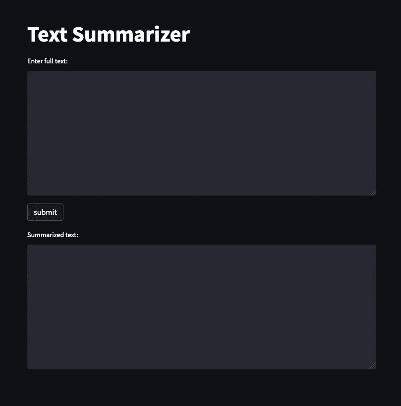
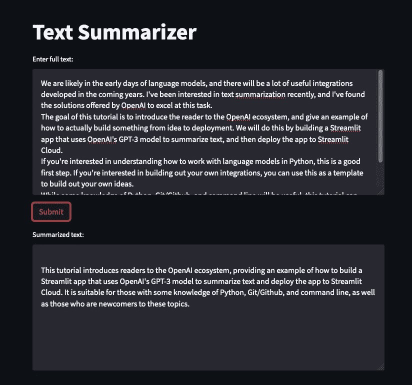
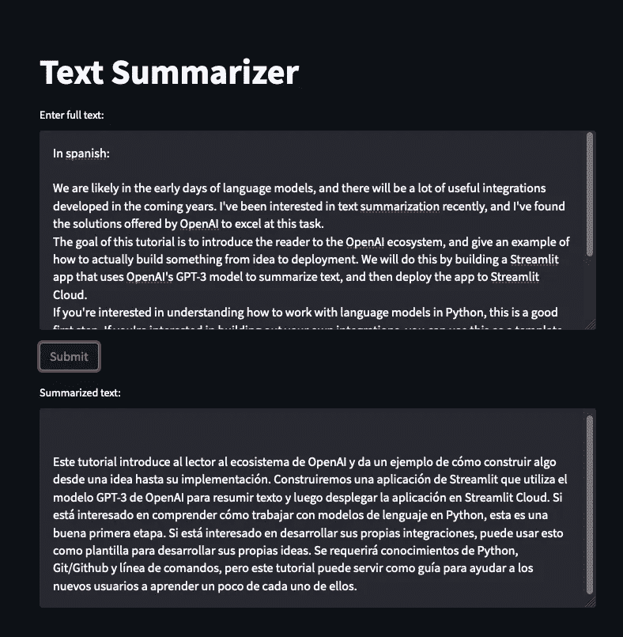

# 使用 GPT-3 创建文本总结器

> 原文：[`towardsdatascience.com/make-a-text-summarizer-with-gpt-3-f0917a07189e`](https://towardsdatascience.com/make-a-text-summarizer-with-gpt-3-f0917a07189e)

## 使用 Python、OpenAI 的 GPT-3 和 Streamlit 的快速教程

[](https://medium.com/@jaypeterman?source=post_page-----f0917a07189e--------------------------------)[](https://towardsdatascience.com/?source=post_page-----f0917a07189e--------------------------------) [Jay Peterman](https://medium.com/@jaypeterman?source=post_page-----f0917a07189e--------------------------------)

·发表于 [Towards Data Science](https://towardsdatascience.com/?source=post_page-----f0917a07189e--------------------------------) ·阅读时间 11 分钟·2023 年 1 月 23 日

--


照片由 [Ed Robertson](https://unsplash.com/@eddrobertson?utm_source=medium&utm_medium=referral) 提供，来源于 [Unsplash](https://unsplash.com/?utm_source=medium&utm_medium=referral)

我们很可能还处于语言模型的早期阶段，未来几年将会有很多有用的集成方案开发出来。我最近对文本总结很感兴趣，并且发现 OpenAI 提供的解决方案在这方面表现出色。

本教程的目标是向读者介绍 OpenAI 生态系统，并给出一个从构思到部署的实际构建示例。我们将通过构建一个使用 OpenAI 的 GPT-3 模型来总结文本的 Streamlit 应用，并将其部署到 Streamlit Cloud 来实现这一目标。

如果你有兴趣了解如何在 Python 中使用语言模型，这是一个很好的第一步。如果你有兴趣构建自己的集成方案，可以将其作为模板来开发自己的想法。

尽管一些 Python、Git/Github 和命令行的知识将是有用的，但本教程可以作为一个指南，帮助新手在学习这些内容的过程中了解一些基本知识。

## 步骤 1：在 Github 上设置 git 代码库，并在本地克隆它

如果你还没有 Github 账户，你需要注册一个。登录后，创建一个新的代码库，命名为 `text-summarizer`（你可以取任何你想要的名字，但我会用这个名字）。

一旦代码库创建完成，你可以在本地克隆它并导航到项目：

```py
git clone <git clone url>
cd text-summarizer
```

我们可以创建一个新的分支来进行工作：

```py
git branch initial_build
git checkout initial_build
```

## 步骤 2：设置 .gitignore 文件

我们需要一个 API 密钥来使用 OpenAI API，并且需要确保不会不小心将其提交到我们的代码库中。你可以像这样创建文件：

```py
echo ".streamlit/" >> .gitignore
```

这确保了 `.streamlit` 目录中的任何内容都不会被添加到你的代码库中。我们还没有创建这个目录，但我喜欢先设置好。

## 步骤 3：设置虚拟环境并安装软件包

这是创建虚拟环境的命令：

```py
python -m venv venv
```

现在你可以激活环境了：

```py
source venv/bin/activate
```

这个应用需要两个软件包：`openai` 和 `streamlit`。首先，让我们升级 pip：

```py
pip install --upgrade pip
```

现在我们可以安装软件包了：

```py
pip install openai streamlit
```

## 步骤 4：设置 secrets.toml

对于本地开发，我们将 API 密钥存储在名为 `secrets.toml` 的文件中，并将其放在 `.streamlit` 目录中。假设你在项目根目录，可以输入以下命令：

```py
mkdir .streamlit
cd .streamlit
touch secrets.toml
```

一旦我们在下一步中生成了 API 密钥，你可以将其存储在这个文件中。

## 步骤 5：获取 OpenAI API 密钥

如果你还没有 OpenAI 账户，可以[在这里](https://openai.com/api/)创建一个账户。创建账户并登录后，你可以点击右上角的名字图标，选择`查看 API 密钥`。

你可以按下显示为 `Create new secret key` 的按钮。复制弹出窗口中的密钥，并将其粘贴到 `secrets.toml` 文件中，如下所示（不要忘记将 API 密钥放在引号中）：

```py
OPENAI_KEY="<paste-your-key-here-with-quotes>"
```

如果你已经用完了免费的 OpenAI 额度并转为付费账户，设置使用限制是个好主意。由于我们将这个应用公开发布，你需要确保不会意外花费超出预期的费用。

## 步骤 6：构建前端

这个应用将非常简单。它将包含一个文本区域，用户可以在其中输入文本，下方的第二个文本框将显示总结后的文本。我们还将添加一个提交按钮。

要开始，我们将在项目根目录下创建一个名为 `app.py` 的新文件：

```py
touch app.py
```

在文本编辑器中打开 `app.py`，并输入以下内容：

```py
import streamlit as st

st.title("Text Summarizer")

input_text = st.text_area(label='Enter full text:', value="", height=250)

st.button("submit")

output_text = st.text_area(label='Summarized text:', value='', height=250)
```

这是一个简单的代码片段，用于创建我们应用的骨架。即使你对 Python 或 Streamlit 一无所知，这段代码也应该很容易理解。我们只是创建了一个标题，两个文本框和一个提交按钮。

要运行这个应用，从你的项目根目录输入以下命令：

```py
streamlit run app.py
```

运行此命令后，浏览器窗口应打开并运行应用。如果没有，你可以在终端中找到 URL，并将其粘贴到浏览器中。这是你应该看到的内容：



来源：作者提供的图片

这展示了 Streamlit 的强大，因为只需几行代码就能做出一些很酷的东西。

## 步骤 7：开始使用 OpenAI 和 GPT-3

现在我们有了应用的骨架，我们需要让它执行一些操作。以下是我们可以用来让 GPT-3 从提示生成文本的基本语法。

```py
import openai
import os

openai.api_key = os.getenv('API_KEY')
prompt = "ENTER TEXT HERE"

openai.Completion.create(
      model="text-davinci-003",
      prompt=prompt,
      temperature=1,
      max_tokens=1000,
  )
```

第一行从你的环境变量中读取 API 密钥。当在 Streamlit 应用的上下文中运行时，`os.getenv` 将能够访问我们存储在 `.streamlit/secrets.toml` 顶层的密钥。

然后，我们调用 OpenAI API 的 `Completion` 端点，并传递以下参数的参数：

+   **模型：** 我们将使用`text-davinci-003`，这是最先进的模型。

+   **prompt:** 这可以是任何任意文本。对于文本总结来说，这将是完整的文本。

+   **temperature:** 这是一个介于 0 和 1 之间的数字，用来定义模型在生成输出时会承担多大的风险。数字越高，模型承担的风险越大。对于文本总结来说，似乎较低的数字会得到更好的结果。你可以对此进行实验。

+   **max_tokens:** 这定义了输出的最大长度（以 tokens 为单位）。一个 token 大约等于 4 个字符。

你可以在[OpenAI 文档](https://beta.openai.com/docs/api-reference/completions/create)中查看所有参数。

如果你想尝试这个代码片段，可以将其保存为`.py`文件并运行。请注意，我们存储在`.streamlit/secrets.toml`中的 OpenAI API 密钥在 Streamlit 应用之外不可访问，因此你需要将密钥添加为环境变量，或者直接将其粘贴到`os.getenv('API_KEY')`中。请务必不要将你的 API 密钥推送到 Github。

这个代码片段最终会被重构成一个由 UI 中的`submit`按钮触发的函数。

## 第 8 步：准备 app.py 以处理来自 OpenAI 的输出

如上所述，`submit`按钮将触发总结函数。我们需要将模型的输出存储在一个变量中，以便填充下方的文本框。我们将通过使用 Streamlit 中的`session_state`对象来解决这个问题。

首先，我们需要初始化一个状态变量，这可以像这样完成：

```py
if "summary" not in st.session_state:
  st.session_state["summary"] = ""
```

`st.session_state`对象是一个 Python `dict`，它在应用程序重新运行时保存数据。上面的代码片段是在测试是否已经有`summary`的条目。如果`summary`不在`st.session_state`中，它将被添加，值设置为空的`str`。

现在我们需要用`summary`的当前状态填充底部文本区域。由于`st.session_state`只是一个 Python `dict`，所以我们只需将`st.session_state["summary"]`传递给第二个`st.text_area`实例的`value`参数即可。

你的`app.py`文件现在应该是这样的：

```py
import streamlit as st

st.title("Text Summarizer")

# initialize state variable 
if "summary" not in st.session_state:
  st.session_state["summary"] = ""

input_text = st.text_area(label='Enter full text:', value="", height=250)

st.button("submit")

# configure text area to populate with current state of summary
output_text = st.text_area(label='Summarized text:', value=st.session_state["summary"], height=250)
```

你可以通过检查 UI 来确保代码正常工作。界面看起来应该没有变化，但不应该有任何错误。

**第 9 步：构建总结文本的函数**

首先，我们要创建一个模块来存储函数，以保持 Streamlit 应用的清洁，你可以从仓库的根目录开始按照这些步骤操作：

```py
mkdir text_summarizer
cd text_summarizer
touch functions.py
```

现在我们可以将其添加到`functions.py`中：

```py
import openai
import streamlit as st

def summarize(prompt):
    augmented_prompt = f"summarize this text: {prompt}"
    st.session_state["summary"] = openai.Completion.create(
        model="text-davinci-003",
        prompt=augmented_prompt,
        temperature=.5,
        max_tokens=1000,
    )["choices"][0]["text"]
```

这与我们在第 7 步中使用的内容变化不大。我们通过在`prompt`前添加`"summarize this text: "`来告诉模型我们希望它总结文本。然后我们运行`openai.Completion.create`并将输出保存到`summary`状态变量中。最后部分只是解析响应以仅抓取我们感兴趣的文本。我已经硬编码了参数，但你可以随意实验。

## 第 10 步：完成 app.py

现在我们已经创建了函数，我们可以完成应用程序。首先，我们需要在顶部导入这个函数：

```py
from text_summarizer.functions import summarize
```

现在我们需要配置 `submit` 按钮，以便在点击时触发 `summarize`。下面是方法：

```py
st.button(
    "Submit",
    on_click=summarize,
    kwargs={"prompt": input_text},
    )
```

`on_click` 参数指定了回调中将使用的可调用函数，在这种情况下我们将使用 `summarize`。如果你不熟悉 `kwargs`，它只是指关键字参数。我们将传递一个包含单个条目的 `dict`（因为函数只有一个参数），并将用户在第一个文本区域中输入的 `str` 传递进去。

我们还需要指定 API 密钥：

```py
openai.api_key = os.getenv('OPENAI_KEY')
```

`app.py` 文件现在应该如下所示：

```py
import streamlit as st
import openai
import os
from text_summarizer.functions import summarize

openai.api_key = os.getenv('OPENAI_KEY')

if "summary" not in st.session_state:
    st.session_state["summary"] = ""

st.title("Text Summarizer")

input_text = st.text_area(label="Enter full text:", value="", height=250)

st.button(
    "Submit",
    on_click=summarize,
    kwargs={"prompt": input_text},
)

output_text = st.text_area(label="Summarized text:", value=st.session_state["summary"], height=250)
```

现在你应该能够运行应用程序并开始总结文本。

## 步骤 11：处理错误

在当前状态下，应用程序对错误的处理不是很好。如果发生错误，用户将会收到暴露了用户不应看到的信息的错误消息。

如果你想模拟错误，可以导航到 `.streamlit/secrets.toml` 并删除你的 API 密钥的最后一个字母。重新运行你的应用程序，然后尝试总结一些文本。你应该会看到一个错误，显示有关你的 API 的 Traceback 和密钥的一部分。

为了将此隐藏于用户之外，我们可以在两个地方添加类似 `try-except` 的模式：

**app.py**

```py
import streamlit as st
import openai
import os
from text_summarizer.functions import summarize

try:
  openai.api_key = os.getenv('OPENAI_KEY')

  if "summary" not in st.session_state:
      st.session_state["summary"] = ""

  st.title("Text Summarizer")

  input_text = st.text_area(label="Enter full text:", value="", height=250)
  st.button(
      "Submit",
      on_click=summarize,
      kwargs={"prompt": input_text},
  )
  output_text = st.text_area(label="Summarized text:", value=st.session_state["summary"], height=250)
except:
  st.write('There was an error =(')
```

**text_summarizer/functions.py**

```py
import openai
import streamlit as st

def summarize(prompt):
    augmented_prompt = f"summarize this text: {prompt}"
    try:
        st.session_state["summary"] = openai.Completion.create(
            model="text-davinci-003",
            prompt=augmented_prompt,
            temperature=.5,
            max_tokens=1000,
        )["choices"][0]["text"]
    except:
        st.write('There was an error =(')
```

## 步骤 12：制作 requirements.txt

由于我们最终将把它部署到 Streamlit Cloud，因此我们需要记录应用程序所需的 Python 包。一个简单的方法是创建一个 `requirements.txt` 文件。假设你已经激活了虚拟环境并安装了所有必要的包，你可以在仓库的根目录下运行这个命令：

```py
pip freeze >> requirements.txt
```

## 步骤 12：提交、推送、合并到主分支

现在代码已经可以工作了，我们可以将文件添加到仓库并提交：

```py
git add app.py requirements.txt text_summarizer/functions.py
```

然后提交更改：

```py
git commit -m "initial commit"
```

然后将你的更改推送到远程 Github 仓库：

```py
git push --set-upstream origin initial_build
```

现在你可以回到 Github 并进入 Pull request 部分。点击 `New pull request` 并将比较分支设置为 `initial_build`。现在你可以简单地创建 Pull request 并合并它。你可以在[这里](https://docs.github.com/en/pull-requests/collaborating-with-pull-requests/proposing-changes-to-your-work-with-pull-requests/creating-a-pull-request)找到有关 PR 的更多详细文档。

## 步骤 12：部署到 Streamlit Cloud

Streamlit Cloud 是一个分享你的 Streamlit 应用程序的超级简单方法，而且是免费的。首先你需要在[这里](https://streamlit.io/cloud)注册，并连接你的 Github 账户。点击 `New app` 按钮，并选择 `From existing repo`。

当你点击 `Repository` 文本框时，你应该会看到来自你 Github 账户的仓库列表。选择 `text-summarizer`。确保选择了正确的分支，并且 `Main file path` 为 `app.py`。

最后，由于我们小心翼翼地没有将 API 密钥推送到 Github，我们需要以安全的方式存储该密钥。幸运的是，Streamlit Cloud 具有内置的秘密管理器。点击 `Advanced settings`，然后你可以在此处粘贴 `.streamlit/secrets.toml` 的内容。现在你可以按 `Deploy`，你的应用将在几分钟内上线。

Streamlit Cloud 将监视你的仓库，并自动部署所有合并的新提交。

你可以在 [这里](https://docs.streamlit.io/streamlit-cloud) 找到有关 Streamlit Cloud 的更详细文档。

## 结果：

这是使用本教程介绍的内容作为输入的应用测试：



来源：作者提供的图片

正如你所看到的，模型在总结提示方面做得相当不错。

## 额外内容：如何使用自定义 URL

Streamlit 和 Streamlit Cloud 具有许多出色的功能，但目前不支持自定义 URL。一种解决方法是托管一个静态网站，将你的应用嵌入为 `iframe`。

如果你想尝试，可以在仓库根目录下创建一个名为 `index.html` 的新文件，并使用此代码：

```py
<!DOCTYPE html>
<html>
  <head>
    <title>Text Summarizer</title>
  </head>
  <body>
    <div style="text-align: center;">
        <iframe src="<URL-TO-YOUR-APP>/?embed=true" width="1000", height="1000"></iframe>
    </div>
  </body>
</html>
```

你只需要从你的 Streamlit 应用中复制 URL，并将其粘贴到 `iframe` 的 `src` 参数中。确保在末尾添加 `?embed=true` [1]。

现在你可以将此文件存储在云存储桶中，如 AWS S3 或 DigitialOcean Spaces，并将自定义 URL 指向暴露的存储桶。

## 限制和可能的改进：

这个应用旨在作为一个入门项目，故意功能简 sparse。因此，有一些明显的限制可以改进。

+   **赋予用户更多控制权：** 你可以添加 Streamlit 小部件，以允许用户为 OpenAI 函数的每个参数指定参数。例如，用户可能希望选择摘要的长度。

+   **使处理较长文本成为可能：** 单次请求能够处理的文本量有限。为了允许用户总结更长的文本，你可以将输入文本拆分成更小的提示，分别处理每个提示，并将各个响应解析成更长的摘要。我还没有尝试过这方法，这可能需要一些工作才能获得令人满意的结果。

+   **引导用户解锁未知功能：** GPT-3 非常灵活，用户可以在不显式构建这些功能的情况下添加许多功能。例如，你可以通过稍微修改提示来获得西班牙语响应：



来源：作者提供的图片

根据 Google 翻译（我不会说西班牙语），响应实际上不是西班牙语的总结，而是西班牙语的翻译。虽然这不是预期的行为，但我相信通过稍微调整提示（或在翻译后通过文本总结器传递翻译），你可以获得你想要的结果。

如果你能找出如何使其运作，你可以简单地添加一个 Streamlit 小部件，允许用户选择语言。然后，你需要修改代码，以将用户输入增强到提示中。

## 结论

你刚刚学会了如何使用 GPT-3 和 Streamlit 制作文本摘要应用程序。这个应用程序显然很简单，但你可以将其作为模板，构建你想尝试的任何新集成。感谢阅读。

## 资源

[1] [`discuss.streamlit.io/t/embeding-streamlit-cloud-url-with-iframe/27511`](https://discuss.streamlit.io/t/embeding-streamlit-cloud-url-with-iframe/27511)
