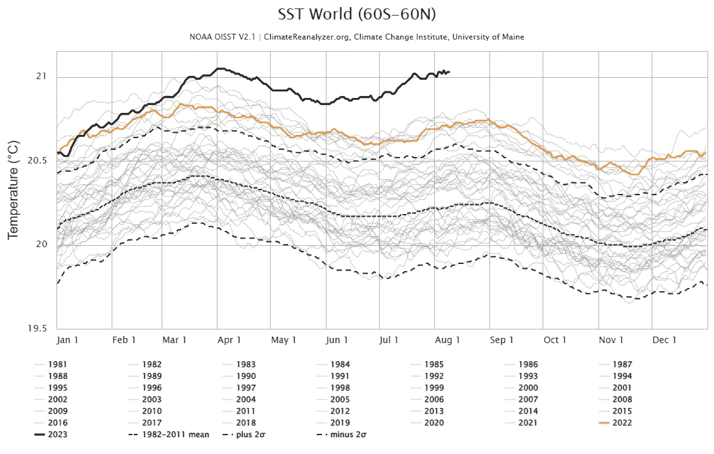
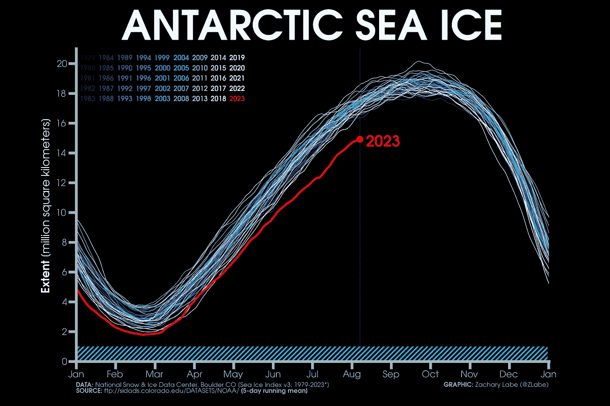

# 使用 Python 制作美观（且有用）的意大利面图

> 原文：[`towardsdatascience.com/make-beautiful-and-useful-spaghetti-plots-with-python-ec4269d7e8c9?source=collection_archive---------3-----------------------#2023-08-16`](https://towardsdatascience.com/make-beautiful-and-useful-spaghetti-plots-with-python-ec4269d7e8c9?source=collection_archive---------3-----------------------#2023-08-16)

## 现在**堆叠折线图**非常热门！

 [Lee Vaughan](https://medium.com/@lee_vaughan?source=post_page-----ec4269d7e8c9--------------------------------)

·

[关注](https://medium.com/m/signin?actionUrl=https%3A%2F%2Fmedium.com%2F_%2Fsubscribe%2Fuser%2F5d604015c08b&operation=register&redirect=https%3A%2F%2Ftowardsdatascience.com%2Fmake-beautiful-and-useful-spaghetti-plots-with-python-ec4269d7e8c9&user=Lee+Vaughan&userId=5d604015c08b&source=post_page-5d604015c08b----ec4269d7e8c9---------------------post_header-----------) 发表在 [Towards Data Science](https://towardsdatascience.com/?source=post_page-----ec4269d7e8c9--------------------------------) ·9 分钟阅读·2023 年 8 月 16 日

--

图片来源：[Hunter Harritt](https://unsplash.com/@hharritt?utm_source=unsplash&utm_medium=referral&utm_content=creditCopyText)在 [Unsplash](https://unsplash.com/photos/Ype9sdOPdYc?utm_source=unsplash&utm_medium=referral&utm_content=creditCopyText)

最近有很多关于*气候变化*的文章，许多文章使用了*堆叠折线图*来总结几十年的数据。这里是来自 [*Climate Reanalyzer*](https://climatereanalyzer.org/clim/sst_daily/) 的一个例子，展示了过去一年半的海洋温度远高于平均水平 [1]：

全球（60S-60N）海表温度（1981–2023）[1]

这里有一个来自扎卡里·拉贝博士的[网站](https://zacklabe.com/antarctic-sea-ice-extentconcentration/)的类似图表，显示了过去 40 多年南极海冰的范围[2]：

南极海冰范围（1978–2023）[2]

这些图表已成为*信息图表*的热门选择，如在[这篇文章](https://www.theguardian.com/world/2023/jul/29/something-weird-is-going-on-search-for-answers-as-antarctic-sea-ice-stays-at-historic-lows)中，但这种受欢迎程度有点令人惊讶[3]。由于很难在这些密集、纠结的图表中跟踪单独的线条，它们通常被回避并被贬低为“意大利面”图。

但是，要成功使用意大利面图（spaghetti plots）有一个秘密。你必须在其他所有线条的*减少*背景下*突出*一两条线。这种策略让你能够放置……
