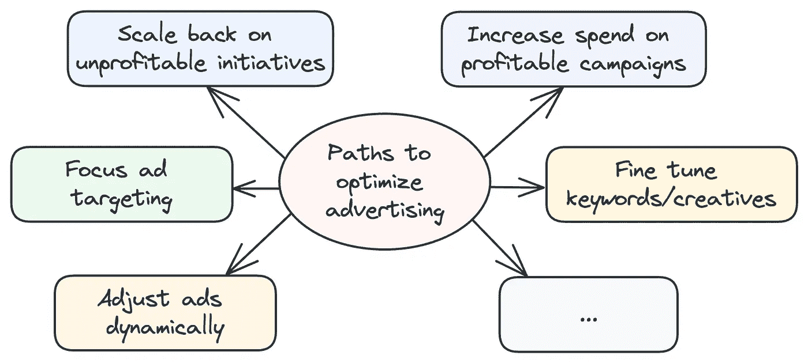
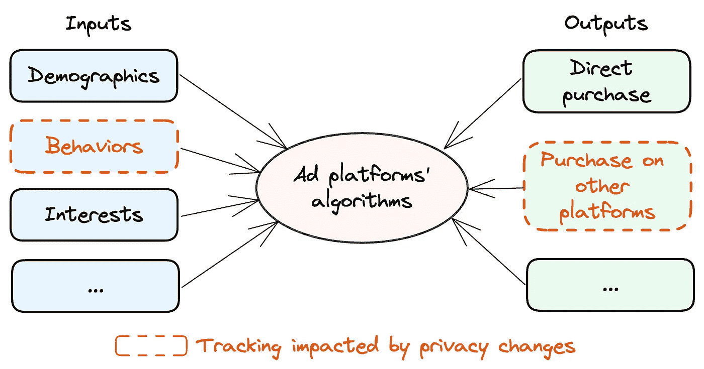
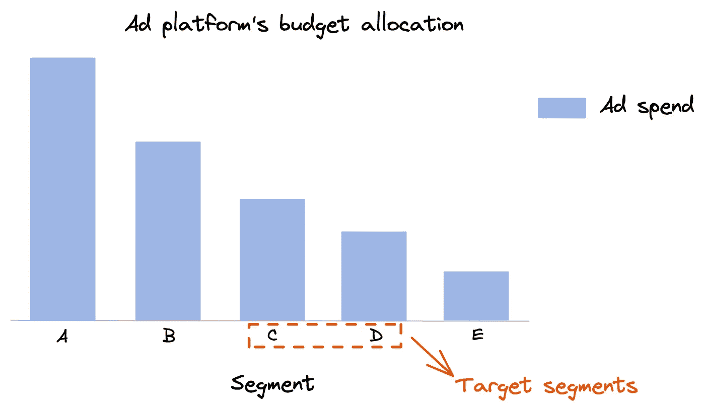
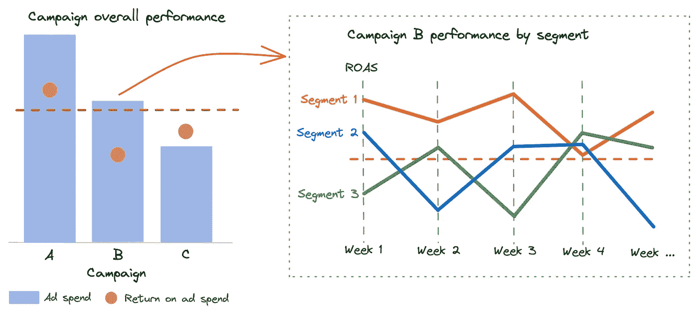
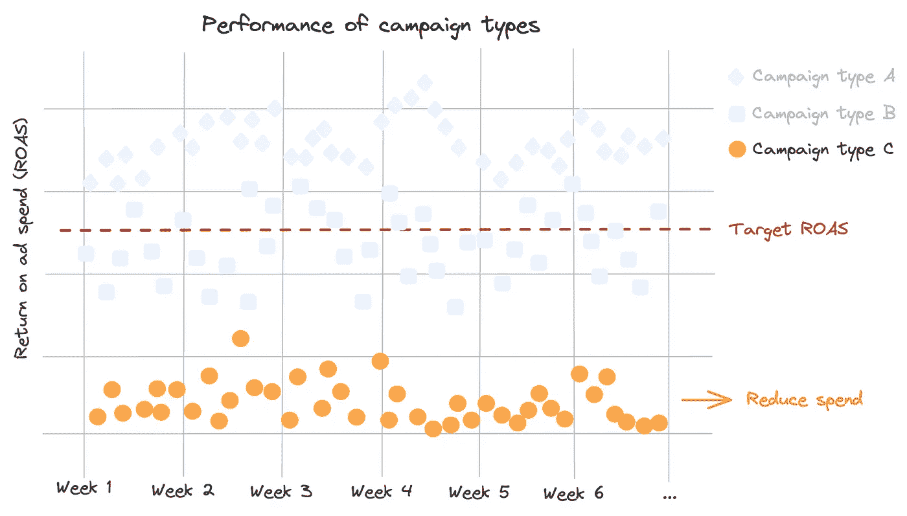
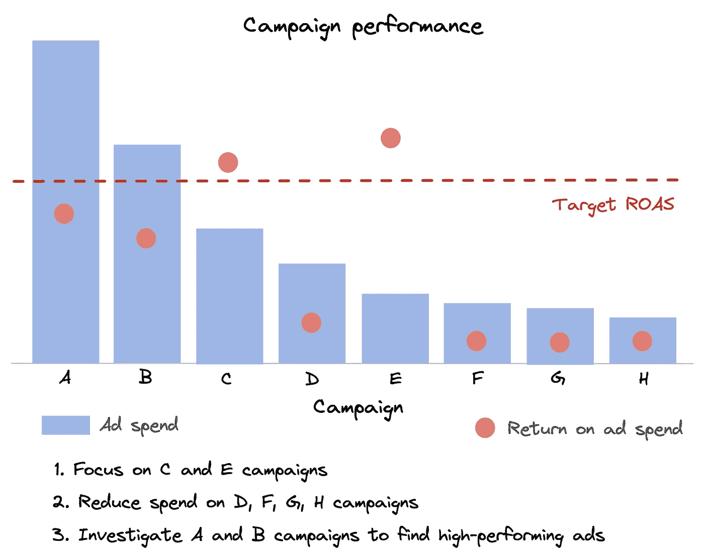
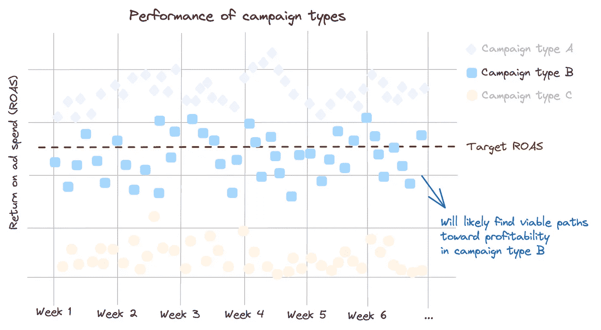
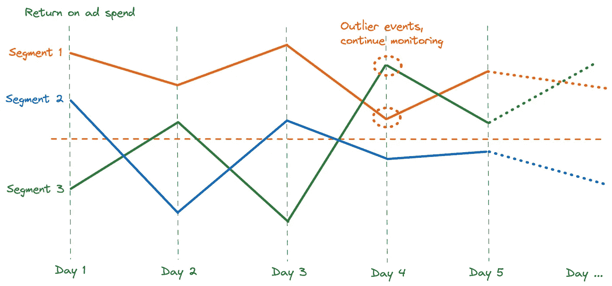

# 用数据科学让每一分钱的营销投资都发挥作用

> 原文：[`towardsdatascience.com/make-every-marketing-dollar-count-with-data-science-157e61714e74?source=collection_archive---------9-----------------------#2023-06-13`](https://towardsdatascience.com/make-every-marketing-dollar-count-with-data-science-157e61714e74?source=collection_archive---------9-----------------------#2023-06-13)

## 当今经济要求我们在广告支出上更加谨慎。幸运的是，找到盈利营销的可行路径可以通过数据来实现。

 [Ivy Liu](https://ivylc.medium.com/?source=post_page-----157e61714e74--------------------------------)

·

[关注](https://medium.com/m/signin?actionUrl=https%3A%2F%2Fmedium.com%2F_%2Fsubscribe%2Fuser%2F71fa5614d897&operation=register&redirect=https%3A%2F%2Ftowardsdatascience.com%2Fmake-every-marketing-dollar-count-with-data-science-157e61714e74&user=Ivy+Liu&userId=71fa5614d897&source=post_page-71fa5614d897----157e61714e74---------------------post_header-----------) 发表在 [Towards Data Science](https://towardsdatascience.com/?source=post_page-----157e61714e74--------------------------------) ·7 min read·Jun 13, 2023

--

今天的经济与几年前截然不同。如今，我们都被要求以更少的资源来运作。在营销方面，这意味着我们需要在所有活动中做到更高的精准度。幸运的是，盈利营销的可行路径可以通过数据找到。

自从我们开始帮助电子商务品牌通过数据驱动的方法优化他们的营销，我们在第一个月内反复发现了显著的优化机会。我们在电子商务领域不断看到相同的优化模式。在这篇文章中，我将分享我们所学到的，并讨论如何通过数据科学的视角在您的组织中找到营销优化机会。

作者提供的图像

# 广泛定位对你的初创企业无效，原因如下

大多数电子商务初创企业都有非常明确的目标受众——否则，这个领域将会被大型竞争者的竞争所挤满。然而，当谈到广告时，行业中存在一种神话，即品牌可以依赖广告平台的广泛定位方法来实现最佳结果。

很明显，这种策略并不适用于所有人，因为许多电子商务初创企业告诉我们，他们在让广泛定位发挥作用方面已经苦苦挣扎了很长时间。让我们探讨一下为什么广泛定位可能对大型品牌或几年前开始广告的品牌有效，但对你的初创企业无效。

广告平台利用人工智能、机器学习和数据科学来改进其算法。然而，这些算法在很大程度上依赖大量的训练数据。一方面，有消费者的人口统计信息、行为和兴趣等输入；另一方面，有像购买这样的转化事件，它们作为输出。向广告平台提供更多的转化事件可以帮助它们更好地识别适合你的理想客户画像。

作者提供的图像

在 iOS 14 的隐私变更和 cookies 之前，广告平台可以追踪到更多的消费者数据，例如跨平台的浏览和购买行为。这为它们的算法提供了更多的输入和输出，即使数据较少也能正常运行。

然而，这些隐私变更显著影响了广告平台的跟踪能力，导致了其定位准确性的降低。在现实世界的案例研究中，我们发现，严重依赖消费者行为跟踪的广告平台比其他平台受到的影响更大。因此，这些平台在市场细分上的预算分配可能与品牌的商业案例不一致。

作者提供的图像

对于初创企业来说，由于转化数据有限，这种不匹配现象更为明显。广告平台将超过 50%的广告支出分配给不属于我们客户目标受众的市场细分并不罕见。

# 聚焦你的广告活动

由于这些行业变化，告知广告平台你的目标受众是实现令人满意广告结果的关键。通过指定目标受众，你可以缩小广告平台算法的搜索和测试范围，缩短学习阶段并提高广告表现。

实际操作中，这些规格可能包括客户的地点、年龄、性别、收入水平、兴趣、喜爱的产品及其他相关因素。你可以评估各个市场细分，确定是否有某些细分市场表现优于其他。

作者提供的图片

我们的客户通过在广告中指定目标受众，迅速获得了盈利结果。即使他们稍后选择扩大目标，他们的广告表现仍保持在高水平，因为广告平台已经为他们的业务案例进行了训练。

如果你使用广泛的定位且无法获得令人满意的结果，尝试通过市场细分分析广告表现。你可能会从这些细分中找到洞察。

# 通过缩减不盈利的项目来抓住低垂果实

如之前讨论过的，品牌可以通过简单地减少对无效项目的预算来获得巨大的增长机会。在我们的客户案例中，我们看到许多这样的机会被忽视，尤其是当品牌大量投资于营销并有众多广告活动时。

下面展示了一个电子商务品牌的广告活动表现示例。

作者提供的图片

如果你正在经历不盈利的广告，并且无法通过分析高层广告表现数据确定原因，尝试检查单个广告活动，以评估低效广告是否影响了你的利润。

作为经验法则，如果一个广告活动运行很长时间但仍远未盈亏平衡，那么减少对该活动的投资可能是明智的。

# 加大对高效广告的投入，以利用有利趋势

低垂果实的另一面是高效广告往往被忽视。在许多客户的案例中，我们发现了值得更多投资的盈利广告。这些有前景的信号之前被低效广告活动产生的噪音掩盖了。

为了突出表现优秀的广告，避免错过任何机会，你首先需要整合你的广告活动和广告。

作者提供的图片

例如，如果你有十个广告活动，其中两个持续盈利，三个表现一般，五个远未盈利，你应该集中精力在两个盈利的广告活动上，减少对五个亏损广告活动的投入，并调查三个表现一般的广告活动，看看是否有表现优秀的广告。

# 不是所有的优化见解从一开始就显而易见。

尽管优化营销的路径有很多，但并不是所有的路径都是立刻明显的。如果超过 50%的广告活动表现不佳，你可能无法从市场细分中获得可操作的见解。

在这种情况下，你应该首先淘汰那些明显表现不佳的营销举措，并根据步骤 1 优先考虑表现良好的举措，缩减无利可图的举措，以及步骤 2，加大对高表现广告的投入。一旦你达到广告活动的一半表现良好，你可以开始分析市场细分，以评估盈利广告的可行路径。

图片来源：作者

# 在进行更改之前，总是要确认趋势的一致性。

需要注意的是，广告表现数据通常会因为异常事件而失真。例如，某个特定客户的高价值购买可能使该市场细分的表现看起来很有利。然而，这些事件可能不可持续。因此，在基于市场细分中的好或坏信号进行任何更改之前，你应该检查该细分的时间序列，以确保这些信号是一致的。

图片来源：作者

一致性的定义取决于广告支出的规模和一年中的时间。例如，如果你的支出较少，确保趋势在一两周内是一致的，因为性能可能会每天波动。相反，如果你的广告支出较高，几天的广告表现就足以说明问题。

此外，在评估趋势时，你应该对促销期间保持警惕。许多广告在促销期间表现良好，但在正常时期回报可能不高。在非促销期间分析广告表现将提供每个市场细分的准确图景。

如果你发现广告回报低且感觉自己已经测试了所有可能的方案，不要灰心。相反，尝试从数据科学的角度来评估情况。我们曾与许多处于相同情况的品牌合作，通过数据快速识别出可盈利的广告路径。

在我的下一篇文章中，我将深入探讨每种方法，并分享来自实际案例研究的更多收获。敬请期待！

如果你需要数据科学方面的帮助或想讨论上述任何方法，请随时通过[LinkedIn](https://www.linkedin.com/in/ivylc/)或 info@ivyliu.io 与我们联系。下次再见。
