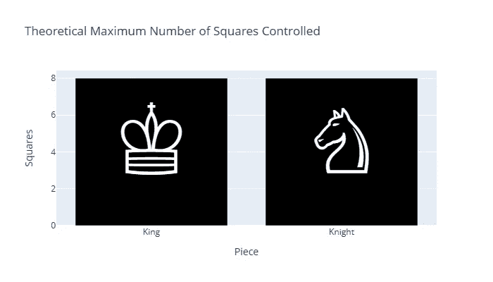

# 使用 UTF-8 让你的图表更出色

> 原文：[`towardsdatascience.com/make-your-charts-great-with-utf-8-f1ec9dcc97d0?source=collection_archive---------9-----------------------#2023-06-14`](https://towardsdatascience.com/make-your-charts-great-with-utf-8-f1ec9dcc97d0?source=collection_archive---------9-----------------------#2023-06-14)

## 在 Plotly Express 中使用自定义图标

 [Lee Vaughan](https://medium.com/@lee_vaughan?source=post_page-----f1ec9dcc97d0--------------------------------)

·

[关注](https://medium.com/m/signin?actionUrl=https%3A%2F%2Fmedium.com%2F_%2Fsubscribe%2Fuser%2F5d604015c08b&operation=register&redirect=https%3A%2F%2Ftowardsdatascience.com%2Fmake-your-charts-great-with-utf-8-f1ec9dcc97d0&user=Lee+Vaughan&userId=5d604015c08b&source=post_page-5d604015c08b----f1ec9dcc97d0---------------------post_header-----------) 发表在 [数据科学前沿](https://towardsdatascience.com/?source=post_page-----f1ec9dcc97d0--------------------------------) ·5 分钟阅读·2023 年 6 月 14 日

--

图片来源：[Le Vu](https://unsplash.com/@xiaowuuuuuuu?utm_source=unsplash&utm_medium=referral&utm_content=creditCopyText) 于 [Unsplash](https://unsplash.com/photos/hf92uVYPGr0?utm_source=unsplash&utm_medium=referral&utm_content=creditCopyText)

Python 的主要绘图库能够直接生成美观的图表，但它们的设计初衷是用于探索性数据分析、专业报告和科学文章。它们可能对普通公众和其他非技术人员来说有些枯燥。

在这个*快速成功的数据科学*项目中，我们将探讨一种使用现成图标来装饰图形的方法，这些图标可以被视为文本。具体来说，我们将使用流行的*Plotly Express*库来制作一个条形图，显示每个棋子在一次中能够控制的理论最大格数（假设棋子在空棋盘的中心）。

为了使其成为更具吸引力的信息图，我们将用 UTF-8 字符集中的符号装饰这些条形。

条形图中装饰条的示例（图像由作者提供）

# 什么是 UTF-8？

根据维基百科，“UTF-8 是用于电子通信的可变长度字符编码标准。由 Unicode 标准定义，名称来源于 Unicode（或通用编码字符集）转换格式—8 位。UTF-8 是主流的编码方式……”
