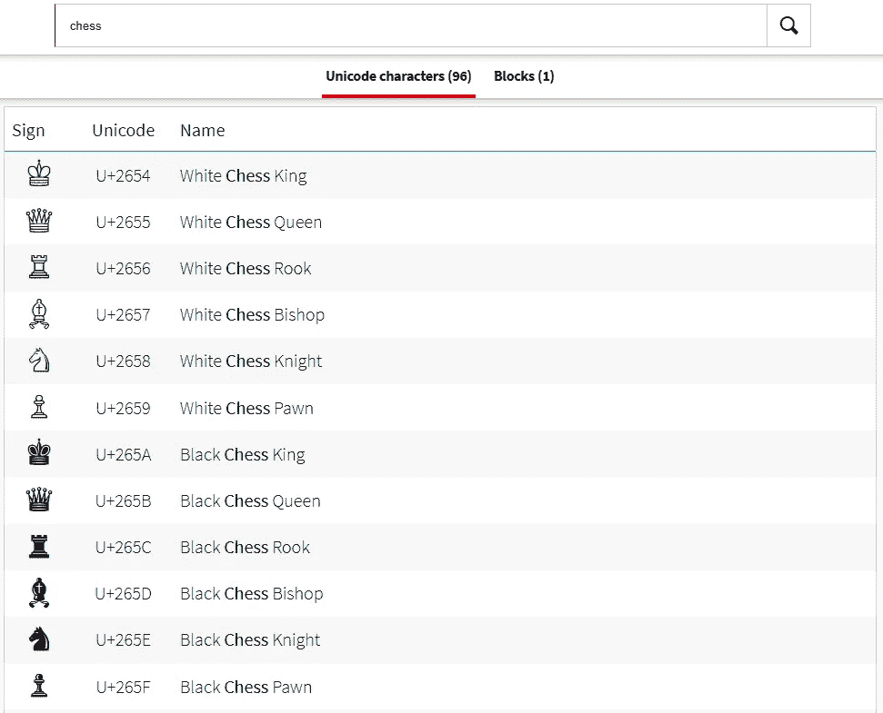
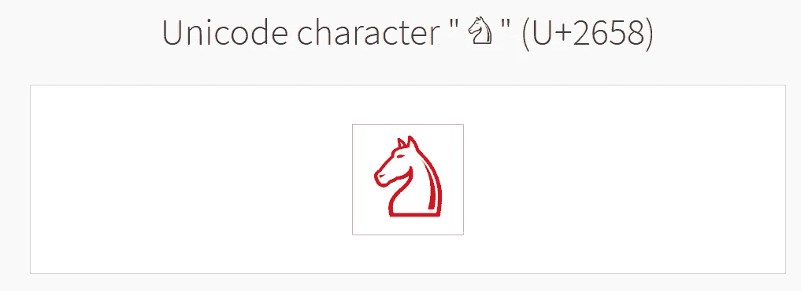
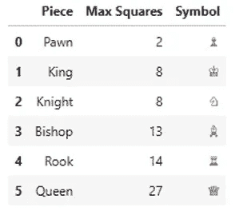
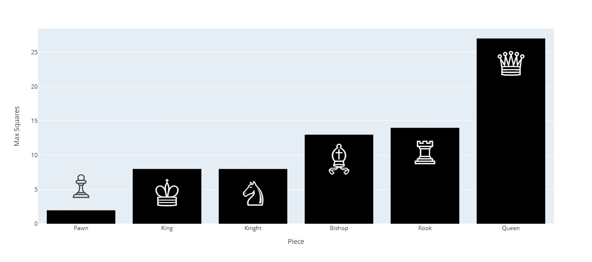

# 用 UTF-8 让你的图表更出色

> 原文：[`towardsdatascience.com/make-your-charts-great-with-utf-8-f1ec9dcc97d0`](https://towardsdatascience.com/make-your-charts-great-with-utf-8-f1ec9dcc97d0)

## 在 Plotly Express 中使用自定义图标

[](https://medium.com/@lee_vaughan?source=post_page-----f1ec9dcc97d0--------------------------------)[](https://towardsdatascience.com/?source=post_page-----f1ec9dcc97d0--------------------------------) [Lee Vaughan](https://medium.com/@lee_vaughan?source=post_page-----f1ec9dcc97d0--------------------------------)

·发表于 [Towards Data Science](https://towardsdatascience.com/?source=post_page-----f1ec9dcc97d0--------------------------------) ·阅读时长 5 分钟·2023 年 6 月 14 日

--


图片由 [Le Vu](https://unsplash.com/@xiaowuuuuuuu?utm_source=unsplash&utm_medium=referral&utm_content=creditCopyText) 提供，来源于 [Unsplash](https://unsplash.com/photos/hf92uVYPGr0?utm_source=unsplash&utm_medium=referral&utm_content=creditCopyText)

Python 的主要图形库可以开箱即用地生成美观的图表，但它们主要是为探索性数据分析、专业报告和科学文章设计的。它们对于普通公众和其他非技术人员可能显得有些枯燥。

在这个*快速成功的数据科学*项目中，我们将探索一种使用现成图标来为你的图形增添趣味的方法，这些图标可以被视为文本。具体来说，我们将使用流行的*Plotly Express*库制作一个条形图，显示每个国际象棋棋子在一次移动中可以控制的理论最大方格数（假设棋子在一个空棋盘的中心）。

为了使这个信息图表更具吸引力，我们将用 UTF-8 字符集中可用的符号装饰条形图。


装饰条形图的示例（图片由作者提供）

# 什么是 UTF-8？

根据维基百科的说法，“UTF-8 是一种用于电子通信的可变长度字符编码标准。由 Unicode 标准定义，其名称源自 Unicode（或通用编码字符集）转换格式—8 位。UTF-8 是万维网（及互联网技术）的主要编码方式。”

使用 UTF-8 编码，每个你可能想用的字符，例如π符号或字母“A”，都被分配了一个独特的代码。除了常见的文本字符，UTF-8 还包括各种类型的图标，从笑脸到喷气式飞机再到蜗牛。这些图标在注释 Plotly Express 图表时可以被视为*文本*。

# 查找 UTF-8 图标

你可以在这个 [网站](https://www.compart.com/de/unicode/) 上搜索 UTF-8 图标。与其搜索每个单独的棋子，不如搜索“chess”。这将返回如下页面，列出兼容的图标。



搜索“chess” 的 Unicode 符号结果（作者提供的图片）

如果你点击白骑士图标，你将看到如下屏幕。



点击白骑士图标的结果（作者提供的图片）

这里是有趣的部分。要使用这个图标，只需高亮并复制大图像。然后，你可以直接将此图像粘贴到你的 Python 代码中，正如我稍后将演示的那样。无需输入实际的 UTF-8 代码。

# Plotly Express 库

为了制作图表，我们将使用 [*Plotly Express*](https://plotly.com/python/plotly-express/)，这是 Plotly 图形库的高级版本。这个库抽象了制作图表中的许多繁琐工作，让你轻松生成具有丰富内置功能的漂亮图形。

Plotly Express 需要 Plotly 作为依赖项。你可以使用 conda 或 pip 安装它。

这里是 conda 安装：

`conda install -c plotly plotly_express`

这里是 pip 版本：

`pip install plotly`

# 代码

以下代码在 JupyterLab 中运行。它以 *单元格* 的形式展示和描述。

## 导入库

Plotly Express 旨在与 *pandas DataFrame* 格式的数据良好配合，因此我们需要同时导入 Plotly Express 和 pandas。Pandas 可以通过 `conda install pandas` 或 `pip install pandas` 安装。

```py
import pandas as pd
import plotly.express as px
```

## 输入数据

我们将数据输入到两个字典中，这些字典使用棋子的名称作为键。其中一个保存每个棋子控制的方格数量，另一个保存 UTF-8 符号。我们将在 *棋子名称* 上合并这些字典，因此这两个字典中的名称应该是相同的。

注意你可以直接从之前提到的 UTF-8 搜索页面粘贴图标。这不是很酷吗？你只需将其括在单引号或双引号中，因为它被视为字符串。

```py
squares = {'King': 8, 
           'Queen': 27, 
           'Rook': 14,
           'Bishop': 13,
           'Knight': 8, 
           'Pawn': 2}

symbols = {'King': '♔', 
           'Queen': '♕', 
           'Rook': '♖',
           'Bishop': '♗',
           'Knight': '♘', 
           'Pawn': '♙'}

df_squares = pd.DataFrame(squares.items(), 
                          columns=['Piece', 'Max Squares'])
df_squares = df_squares.sort_values(by='Max Squares')
df_symbols = pd.DataFrame(symbols.items(), 
                          columns=['Piece', 'Symbol'])
df_merged = df_squares.merge(df_symbols)
df_merged.head(6)
```



合并后的 DataFrame（作者提供的图片）

## 创建图表

Plotly Express 使生成标准图表变得简单，例如条形图、散点图、热图等。在这里，我们将使用 `bar()` 方法制作条形图。一旦你将 DataFrame 的 *名称* 传递给方法，你只需提供 *列名* 以在后续参数中访问数据。这使得代码非常易读。

`text` 参数捕捉 UTF-8 符号，该符号会自动放置在每个条形的顶部附近。要控制符号的大小，请使用 `textfont_size` 参数和 `update_traces()` 方法。`marker_color` 参数指的是 *条形* 颜色，*不是* 符号颜色。

```py
fig = px.bar(df_merged, 
             x='Piece', 
             y='Max Squares',
             height=550,
             text='Symbol')
fig.update_traces(textfont_size=70, marker_color='black')
fig.show()  # optional
```



每个棋子在任何时刻可以控制的理论最大方块数（图片由作者提供）

正如你所见，在 Plotly Express 中制作图表时，UTF-8 图标可以被视为常规文本。这意味着你可以将它们用作文本注释，并将它们放置在你想要的任何位置。在接下来的示例中，我们将一个*红色笑脸*放置在骑士条上方以演示这个过程。

```py
# Add annotation:
fig.add_annotation(dict(font=dict(color='red',
                                  size=50),
                                  x=0.39,
                                  y=0.45,
                                  showarrow=False,
                                  text="☺",
                                  textangle=0,
                                  xanchor='left',
                                  xref="paper",
                                  yref="paper"))
fig.show()  # optional
```


带有红色笑脸贴在骑士条上的条形图（图片由作者提供）

# 结果

UTF-8 图标可以为你的图表增添一些趣味，赋予它们一种“信息图表”的感觉。虽然这对于分析工作或科学文章并非必要或甚至不被期望，但在准备新闻通讯、教程、年度报告和其他面向非技术观众的文档时，以这种方式装饰图表是有益的。

# 谢谢！

感谢阅读，未来请关注我获取更多*快速成功数据科学*项目。
