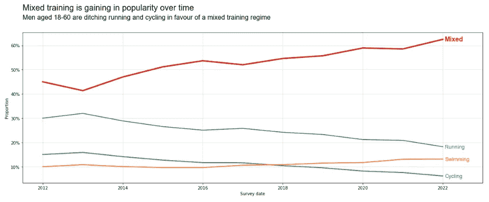

# 让你的图表看起来辉煌

> 原文：[`towardsdatascience.com/make-your-charts-look-glorious-9ce3fa310b70?source=collection_archive---------1-----------------------#2023-01-31`](https://towardsdatascience.com/make-your-charts-look-glorious-9ce3fa310b70?source=collection_archive---------1-----------------------#2023-01-31)

## 一些简单的格式化技巧，使 matplotlib 图表准备就绪

[](https://bradley-stephen-shaw.medium.com/?source=post_page-----9ce3fa310b70--------------------------------)[](https://towardsdatascience.com/?source=post_page-----9ce3fa310b70--------------------------------) [Bradley Stephen Shaw](https://bradley-stephen-shaw.medium.com/?source=post_page-----9ce3fa310b70--------------------------------)

·

[关注](https://medium.com/m/signin?actionUrl=https%3A%2F%2Fmedium.com%2F_%2Fsubscribe%2Fuser%2Fc5cd0a58b5ae&operation=register&redirect=https%3A%2F%2Ftowardsdatascience.com%2Fmake-your-charts-look-glorious-9ce3fa310b70&user=Bradley+Stephen+Shaw&userId=c5cd0a58b5ae&source=post_page-c5cd0a58b5ae----9ce3fa310b70---------------------post_header-----------) 发表在[Towards Data Science](https://towardsdatascience.com/?source=post_page-----9ce3fa310b70--------------------------------) · 12 分钟阅读 · 2023 年 1 月 31 日[](https://medium.com/m/signin?actionUrl=https%3A%2F%2Fmedium.com%2F_%2Fvote%2Ftowards-data-science%2F9ce3fa310b70&operation=register&redirect=https%3A%2F%2Ftowardsdatascience.com%2Fmake-your-charts-look-glorious-9ce3fa310b70&user=Bradley+Stephen+Shaw&userId=c5cd0a58b5ae&source=-----9ce3fa310b70---------------------clap_footer-----------)

--

[](https://medium.com/m/signin?actionUrl=https%3A%2F%2Fmedium.com%2F_%2Fbookmark%2Fp%2F9ce3fa310b70&operation=register&redirect=https%3A%2F%2Ftowardsdatascience.com%2Fmake-your-charts-look-glorious-9ce3fa310b70&source=-----9ce3fa310b70---------------------bookmark_footer-----------)

图片由[Luke Chesser](https://unsplash.com/@lukechesser?utm_source=medium&utm_medium=referral)拍摄，发布在[Unsplash](https://unsplash.com/?utm_source=medium&utm_medium=referral)。

图表无疑是向观众传达信息的最佳方式。没有任何疑问——图片胜于文字。根据你询问的人不同，一张图的价值大约等于一千字。

这并不意味着创建一个好的可视化很简单！创建一个强大且外观良好的展览以传达信息是困难的。如果展览是在现场演示中首次亮相，这就更加具有挑战性：观众不仅会专注于所说的内容（希望如此），还会试图理解图表背后的信息，同时形成问题。

我可能会给你展示很多我自己的图表，这些图表证明了制作一个好的图表是多么困难，但我会省略这些创伤。相反，在这篇文章中，我们将看到如何：

1.  创建“基础”折线图和条形图。

1.  更改标题和标识，以改善图表的视觉效果和信息传递能力。

1.  去除杂乱以提高图表的可读性。

1.  改变图表的外观，以真正强调一个信息。

我们将借用一些我们上次讨论的技巧，那时我们探讨了如何通过格式化`pandas` DataFrames 来改善信息传递和讲故事。我（显然）建议你阅读一下，如果你对展示一些华丽的表格以及优秀的图表感兴趣：

全面指南：格式化 pandas DataFrames | Towards Data Science

让我们开始吧——首先检查如何制作美丽的折线图，然后再尝试绘制条形图。在这两种情况下，我们都将接受我们内心的新年决心，并使用（虚构的）关于运动和训练的数据。

*附注：这里的技巧与* `matplotlib` *有关，这是我在 Python 中绘图的首选包。这并不是说在其他包中，如* `seaborn` *，不能做到相同的技巧和窍门，只是你可能需要调整方法。*

# 折线图

我们将从折线图开始——简单的可视化，当试图传达时间上的趋势或模式时非常有效。

## 数据

我已经捏造了一些数据，捕捉了一个虚构调查的受访者比例，该调查询问 18-60 岁男性他们偏好的运动形式。受访者有 4 个选项可供选择：跑步、骑自行车、游泳和混合方案。

*附注：通过“捏造一些数据”，我真的指的是“在 Excel 中创建示例数据”。*

让我们准备好，查看数据：

```py
# functionality
import pandas as pd
import numpy as np
import os
import matplotlib.pyplot as plt
import matplotlib.dates as mdates
import matplotlib.ticker as mtick

# data import
file_location = r'C:\Users\...\Charts'
file_name = r'data.csv'
df = pd.read_csv(os.path.join(file_location,file_name))

# convert date column to datetime
df['Date'] = pd.to_datetime(df['Date'],format = '%d/%m/%Y')

# set date column to index
df.set_index('Date',inplace = True)

df
```


作者提供的图片

数据集相当简单。让我们从某个地方开始，创建我们的“基础”图表。

## 基础折线图

这里没有什么华丽的——只是一些`matplotlib`：

```py
# plot size and configuration
fig,ax = plt.subplots(figsize = (20,7.5))

# lines
for activity in df.columns:
    plt.plot(df.index,df[activity],marker = '^',label = f'{activity}')

# format y-axis
plt.gca().yaxis.set_major_formatter(mtick.PercentFormatter(1,decimals = 0))

# add title and axis labels
plt.title('Exercise types (survey respondents, men aged 18 - 60)')
plt.ylabel('Proportion')
plt.xlabel('Survey date')

# misc - grid and legend
plt.grid(axis = 'both',alpha = 0.45)
plt.legend(loc = 'best',ncol = 1)

# results
plt.show()
```

……这就给出了：


作者提供的图片

现在，我内心的书呆子可能认为这个可视化展示得完全可以。他可能会说一些类似的话：

+   标题、轴标签和图例条目结合在一起，告诉读者该图表与调查受访者（男性，年龄 18-60 岁）参与某种类型的运动的比例有关。

+   数据随着时间的推移被绘制，所以可能存在某种趋势或模式。

+   事实上，当我们查看图表时，我们看到跑步和骑自行车的受欢迎程度随着时间的推移而下降，而混合模式在这个群体中变得越来越受欢迎。

奇怪的是，这**正是**我们想传达的信息！我们需要找到一种方法来传达这个信息，而不需要观众做那么多繁重的工作。

通常，最好的方法就是直接告诉观众你想说什么。我们通过使标题更有用来做到这一点，仅在副标题增加可视化价值时才使用副标题。

## 使用描述性标题

我们将使用`text`命令¹给图表添加描述性标题。

我们将尽可能清晰地捕捉信息：

+   标题（即标题）的核心是混合模式训练随时间变得越来越受欢迎

+   副标题（即副标题）是混合模式受欢迎程度的提升源于跑步和骑自行车的受欢迎程度下降。

从代码的角度来看，这看起来像是（为方便阅读格式化）：

```py
# plot
fig,ax = plt.subplots(figsize = (20,7.5))

# informative title + subtitle
title = 'Mixed training is gaining in popularity over time'
subtitle = 'Men aged 18-60 are ditching running and 
cycling in favour of a mixed training regime'

# add title + subtitle to plot
plt.text(
    x = 0.125,y = 0.90,s = title,fontname = 'Arial',
    fontsize = 20,ha='left',transform = fig.transFigure
)
plt.text(
    x = 0.125,y = 0.86,s = subtitle,fontname = 'Arial',
    fontsize = 16,ha = 'left',transform = fig.transFigure
)

# lines
for activity in df.columns:
    plt.plot(df.index,df[activity],marker = '^',label = f'{activity}')

# format y-axis
plt.gca().yaxis.set_major_formatter(mtick.PercentFormatter(1,decimals = 0))

# axis labels
plt.ylabel('Proportion')
plt.xlabel('Survey date')

# misc - grid and legend
plt.grid(axis = 'both',alpha = 0.45)
plt.legend(loc = 'best',ncol = 1)

# fiddle with space above chart
plt.subplots_adjust(top=0.8, wspace=0.3)

plt.show()
```

… 这给出了：


图片由作者提供

我认为这是一个很好的改进，因为信息直接呈现在读者面前。图表本身仍然看起来很忙，因此我们将接下来处理这个问题。

*顺便提一下：如果你非常注重细节，你可能会觉得标题和图表之间的间距有点大。现在看来，你可能没错，但继续阅读——我已经为此计划了一些东西。*

## 去除杂乱

杂乱的图表难以阅读。实际上，任何使人分心的东西都会让图表更难以阅读。

在这种情况下，“杂乱”实际上可以指任何东西——坐标轴标签、标记、位置不当的标题，甚至是网格线。我们将查看所有这些元素，但我们将从最大的罪魁祸首——图例开始。

图表的图例可能会非常有争议。一方面，传统观点认为一个好的图表包含一个好的图例：一个可以让读者轻松区分不同数量的图例。

另一方面，如果读者在图表和图例之间来回查看（可能多次），那么图例显然是一种干扰。

我们将通过将图例从几乎独立的图表元素变为集成到可视化中的元素来找到折衷方案。我们将通过**注释³**每一条单独的线条来做到这一点。

所以我们可以得到这样的效果：



图片由作者提供

不错——我们去掉了图例而实际上没有丧失其任何有用性。

一旦你掌握了要领，注释线条是非常简单的：

```py
# annotate
plt.annotate(
    text = 'Running',
    xy = (pd.to_datetime('01-01-2022'),df['Run'][-1]),
    textcoords = 'offset points',
    xytext = (5,-4),fontname = 'Arial',fontsize = 13,color = 'tab:blue'
)
```

我仍然认为网格线和绘图边框（或“脊柱”）是一种干扰。去除它们很简单：

```py
# grid lines
# keep only toned down vertical lines
plt.grid(axis = 'y',alpha = 0.3)

# turn off spines
plt.gca().spines[['left','right', 'top']].set_visible(False)
```


图片由作者提供

我们现在真的开始接近目标了！看了一下，我觉得我们需要在标题和图表本身之间增加更多的间隔。因此，我们将添加一条分隔线。

我们还需要为 y 轴添加一些描述。我们可能在删除“杂乱”时过于严厉，因此我们会在这里添加一些内容。引用信息来源也是一种良好的做法，所以我们将添加一个脚注来实现这一点。


图片由作者提供

从代码角度看，这相当简单：

```py
# line between titles and chart
plt.gca().plot(
    [0.1, .9], # x co-ords
    [.87, .87], # y co-ords
    transform = fig.transFigure,
    clip_on = False,
    color = 'k',
    linewidth = 1.5
)

# axis description
description = 'Proportion of survey respondents (%)'
plt.text(
    x = 0.1,
    y = 0.8,
    s = description,
    fontname = 'Arial',
    fontsize = 14,
    ha='left',
    transform = fig.transFigure
)

# foot note
footnote = "Source: Brad's imagination, January 2023"
plt.text(
    x = 0.1,
    y = 0.05,
    s = footnote,
    fontname = 'Arial',
    fontstyle = 'italic',
    fontsize = 12,
    ha = 'left',
    transform = fig.transFigure
)
```

现在我们可以做最后的一步，以真正强调信息——更改颜色。

尽管图表非常漂亮，但彩色线条可能会分散整体信息。因此，为了强调混合训练随着时间的推移越来越受欢迎，我们将通过以下方式使混合训练线条更突出：

1.  让它变得非常粗体、加粗，并且是红色的。

1.  将其他线条设置为灰色。


图片由作者提供

看，这就是一个出色的图表，信息丰富，易于理解（如果我这么说的话）。

# 条形图

条形图和柱状图通常用于比较不同的定量或定性数据。当你做少量比较时，它们非常有用，但我认为如果你有许多比较要做，或者你试图可视化时间趋势，它们并不适用。

现在，如果你在谷歌上搜索“条形图与柱状图”，你会发现大量文章解释和概述这两种可视化之间的确切区别。

我不会这样做，因为我诚实地说，我不知道区别。对像我这样的“实践者”来说，这些语义是一种干扰。*重要*的是知道在某些情况下，水平条形图比垂直条形图更有用。我们稍后会看到一个很好的例子。

## 数据

让我们创建一些数据来可视化。再次，这将与健身相关，这次捕捉到按时间段访问健身房的比例。为了简单起见，我们的“时间段”变量将大致分为 5 个类别。

```py
# data
df = pd.DataFrame(
    {
        'Time':['Early morning','Morning','Midday','Afternoon','Evening'],
        'Athletes':[0.17,0.075,0.23,0.125,0.4]
    }
)
```

## 基础条形图

再次，我们将创建一个“基础”图表，以便我们可以改进它。一段简单的代码给我们提供了一个相当标准的图表——没有特别之处，但能够完成任务。

```py
# plot
fig,ax = plt.subplots(figsize = (20,7.5))

# bars
plt.bar(df['Time'],df['Athletes'])

# format y-axis
plt.gca().yaxis.set_major_formatter(mtick.PercentFormatter(1,decimals = 0))

# grid line
plt.grid(axis = 'y',alpha = 0.45)

# labels and title
plt.title('Proportion of athletes training, by time of day')
plt.ylabel('Proportion')
plt.xlabel('Time of day')

plt.show()
```


图片由作者提供

我们来看看这个图表并修改一些内容。

目前很明显，晚上时段是去健身房的最受欢迎时间。然而，下一次最受欢迎（或最不受欢迎）的时间并不立刻显现出来。因此，我们将**更改**条形图的绘制顺序。

虽然有些人喜欢按升序排列值（即`ascending = True`），我认为我们应该**更改图表方向**，从上到下绘制最受欢迎的时间。

外观很重要，因此我们将**去除图表杂乱并进行样式调整**。我们还将增加一些设计元素来提升美感。

最后，我们会通过改变一些颜色来**重申信息**。

让我们开始吧。

## 改变方向

…以及一些排序。

没有特别需要强调的内容。DataFrame 已经使用 `sort_values` 重新排序，我们使用 `barh` 而不是 `bar` 来实现水平排列。

这给我们带来了：


图片由作者提供

这已经好多了——看看现在多么容易识别出最繁忙的时间段，并在每个时间段之间进行比较。

读取 x 轴上的精确值有点挑战，因此在改善杂乱和样式时，我们会考虑到这一点。

## 杂乱与样式

现在进行一些外观上的修整：轴标签、网格线和坐标轴将被移除，我们将让标题发挥作用。我们还将添加条形标签，以便在去掉 x 轴时不会丢失任何信息。

当然，我们总是引用和注明我们的数据来源，因此我们会添加脚注。

除此之外，我们还会进行一些美学上的改动，使图表更吸引眼球。由于我们的条形图没有理由做得那么长，部分样式调整将是一些通用的尺寸调整，但最有效的变化将来自于强调信息的改动。

我们已经看到如何做大部分变化，因此接下来的部分代码量会比较少，展示的新概念。

准备好迎接新的改进版图表了吗？我准备好了！


图片由作者提供

这是一个很好的进展。注意使用条形标签如何让我们完全去掉 x 轴。这是一个小的代码变化：

```py
# plot
fig,ax = plt.subplots(figsize = (20,7.5))

# add bars
bars = plt.barh(df['Time'],df['Athletes'],color = 'k')

# add labels
plt.bar_label(
  bars,
  labels = [f'{x:.0%}' for x in bars.datavalues],
  padding = 10,
  fontsize = 14
)
```

红色图形是矩形和直线的组合。拼凑起来有点麻烦，但我认为它给图表增添了一点风格——相当像《经济学人》杂志的风格。

```py
# add a little graphic flair
# rectangle first
plt.gca().add_patch(
    plt.Rectangle(
        (-0.05,.95), # location
        0.0125, # width
        -0.13, # height
        facecolor = 'tab:red',
        transform = fig.transFigure,
        clip_on = False,
        linewidth = 0
    )
)

# now the line
plt.gca().plot(
    [-0.049, .95], # length of line
    [.82, .82], # height
    transform = fig.transFigure,
    clip_on = False,
    color = 'tab:red', 
    linewidth = 3
)
```

最后但绝对重要的是，我们将改变条形图的颜色，以强调大多数人是在晚上锻炼的消息。


图片由作者提供

这是可能最大的图表变化，它由最小的代码变化创建：我们将颜色列表传递给 `barh` 的 `color` 参数，而不是使用单一字符串。

太棒了！

# 总结和闲聊

我有一个越来越不好的习惯，就是同时总结和喋喋不休。

通过一些示例线图和条形图，我们已经看到描述性标题和视觉技巧如何改善图表的信息传达。我们还看到，去除图表杂乱的元素可以让读者更专注于我们想要传达的信息。

现在，我喜欢多彩的图表，我不羞于承认（显然）。但我确实得承认，调整颜色和策略性使用颜色可以真正提升图表向观众传达信息的能力。

就像演示文稿中的幻灯片一样，你需要真正思考图表想要传达什么，然后给它最好的机会去做到这一点。这可能意味着更改图表类型、更换颜色调色板、添加描述性标题，甚至移除一些图表元素。就像出色的室内设计一样，不要害怕做出大胆的决定。如果情况变得更糟，你总可以重新编写图表代码！

如果你缺乏设计灵感，我推荐查看《经济学人》和《金融时报》这类出版物——它们通常在用优美的图表传达信息方面表现出色。我通过阅读`matplotlib`文档和浏览各种 StackOverflow 帖子，学到了很多代码技巧和窍门。

我最后一个——也是可能最重要的——建议是多加练习，然后回顾你的图表。更好的是，请其他人审阅你的图表，看看他们是否“理解”你试图传达的信息。我知道这听起来很无聊，但这确实有帮助。

如果你能读到这里，谢谢你。我希望你阅读这篇文章的体验和我写作时一样愉快（制作图表意外地具有宣泄作用）。我仍在学习和练习如何制作更好的图表，所以任何技巧或窍门都非常感激！

# 参考资料和资源

一些让我的工作更轻松的官方文档：

1.  [matplotlib.pyplot.text — Matplotlib 3.6.3 文档](https://matplotlib.org/stable/api/_as_gen/matplotlib.pyplot.text.html)

1.  [matplotlib.pyplot.bar_label — Matplotlib 3.6.3 文档](https://matplotlib.org/stable/api/_as_gen/matplotlib.pyplot.bar_label.html)

1.  [matplotlib.pyplot.annotate — Matplotlib 3.6.3 文档](https://matplotlib.org/stable/api/_as_gen/matplotlib.pyplot.annotate.html)
