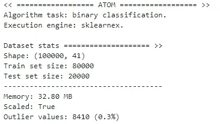
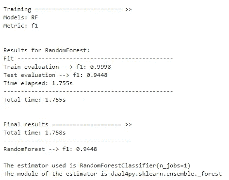
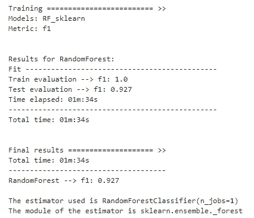
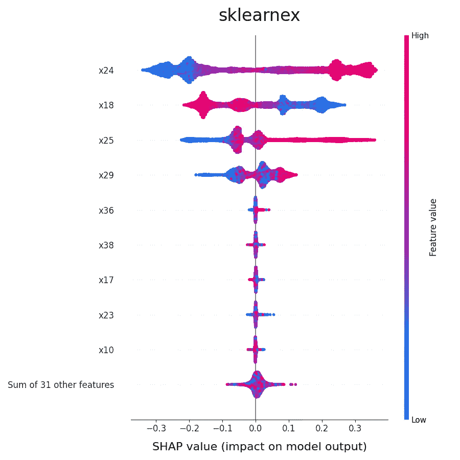
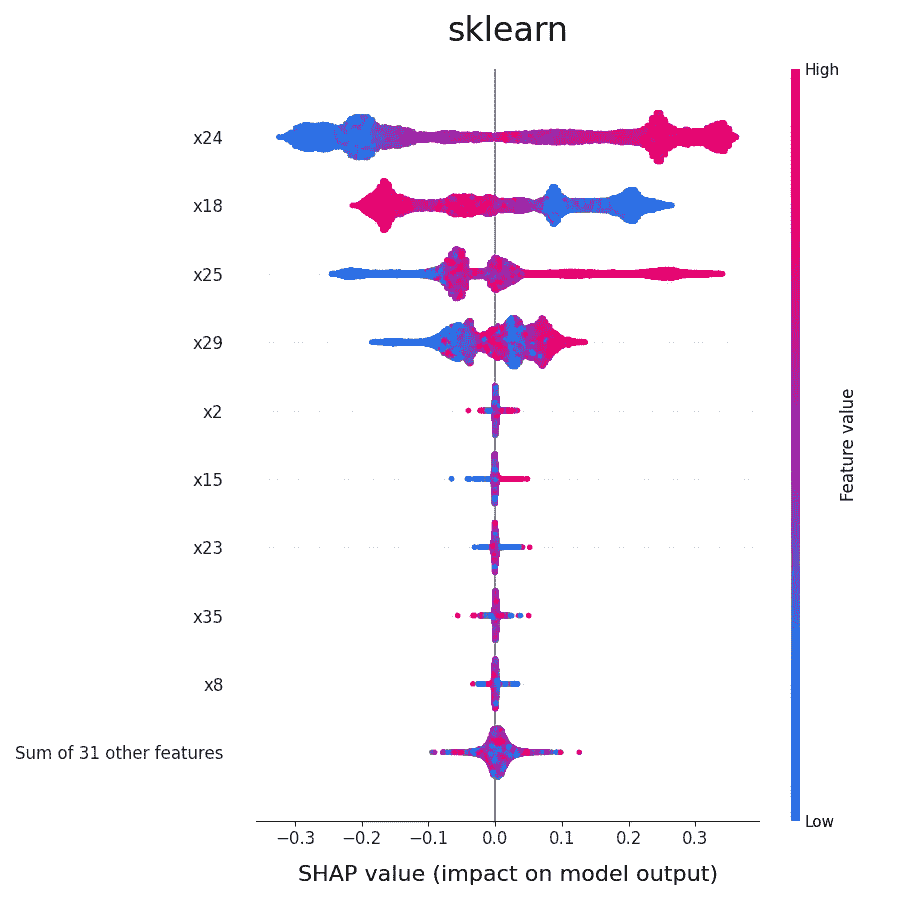

# 让你的 sklearn 模型速度提高最多 100 倍

> 原文：[`towardsdatascience.com/make-your-sklearn-models-up-to-100-times-faster-563bb682665e?source=collection_archive---------5-----------------------#2023-03-16`](https://towardsdatascience.com/make-your-sklearn-models-up-to-100-times-faster-563bb682665e?source=collection_archive---------5-----------------------#2023-03-16)

## 如何仅通过更改 1 行代码显著减少训练时间

  [Marco vd Boom](https://tvdboom.medium.com/?source=post_page-----563bb682665e--------------------------------)

·

[关注](https://medium.com/m/signin?actionUrl=https%3A%2F%2Fmedium.com%2F_%2Fsubscribe%2Fuser%2Fe2091b627921&operation=register&redirect=https%3A%2F%2Ftowardsdatascience.com%2Fmake-your-sklearn-models-up-to-100-times-faster-563bb682665e&user=Marco+vd+Boom&userId=e2091b627921&source=post_page-e2091b627921----563bb682665e---------------------post_header-----------) 发表在[Towards Data Science](https://towardsdatascience.com/?source=post_page-----563bb682665e--------------------------------) · 4 分钟阅读·2023 年 3 月 16 日

--


照片由[Markus Winkler](https://unsplash.com/@markuswinkler?utm_source=medium&utm_medium=referral)拍摄，发布在[Unsplash](https://unsplash.com/?utm_source=medium&utm_medium=referral)上。

## 介绍

使用[Intel® Extension for Scikit-learn](https://intel.github.io/scikit-learn-intelex/index.html)包（简称*sklearnex*），你可以加速 sklearn 模型和变换器，同时保持与 sklearn API 的完全兼容。Sklearnex 是一个免费的 AI 加速器，可以让你的 sklearn 代码速度提升 10 到 100 倍。

软件加速是通过使用向量指令、IA 硬件特定的内存优化、线程处理以及对即将推出的所有 Intel 平台的优化来实现的。

在这个故事中，我们将解释如何使用[ATOM](https://github.com/tvdboom/ATOM)库来利用 sklearnex 的速度。ATOM 是一个开源的 Python 包，旨在帮助数据科学家探索机器学习管道。如果你想要温和地了解这个库，可以阅读另一个故事。

## 硬件要求

需要考虑的 sklearnex 附加硬件要求：

+   处理器必须具有 x86 架构。

+   处理器必须至少支持 SSE2、AVX、AVX2、AVX512 中的一种指令集。

+   ARM*架构**不**支持。

+   Intel®处理器提供的性能优于其他 CPU。

**注意：** sklearnex 和 ATOM 也可以通过 GPU 加速，但在这个故事中我们不会讨论这一选项。目前，让我们集中讨论 CPU 加速。

## 示例

让我们通过一个例子来了解如何开始。我们以通常的方式初始化*atom*，并指定`engine`参数。引擎参数规定了使用哪个库来处理模型。选项包括：

+   sklearn（默认）

+   sklearnex（我们在这个故事中的选择）

+   cuml（用于 GPU 加速）

```py
from atom import ATOMClassifier
from sklearn.datasets import make_classification

# Create a dummy dataset
X, y = make_classification(n_samples=100000, n_features=40)

atom = ATOMClassifier(X, y, engine="sklearnex", n_jobs=1, verbose=2)
```



接下来，调用`[run](https://tvdboom.github.io/ATOM/latest/API/ATOM/atomclassifier/#atomclassifier-run)`方法来训练模型。请查看[这里](https://tvdboom.github.io/ATOM/latest/user_guide/accelerating/#supported-estimators)以获取支持 sklearnex 加速的模型列表。

```py
atom.run(models="RF")

print(f"\nThe estimator used is {atom.rf.estimator}")
print(f"The module of the estimator is {atom.rf.estimator.__module__}")
```



训练和验证模型花费了 1.7 秒。请注意，该模型来自于[daal4py](https://intelpython.github.io/daal4py/)。这个库是 sklearnex 的后台引擎。

为了比较，我们还训练了另一个随机森林模型，但这次是在 sklearn 而不是 sklearnex 上。我们也可以直接在`run`方法中指定`engine`参数。

```py
atom.run(models="LR_sklearn", engine="sklearn")

print(f"\nThe estimator used is {atom.rf.estimator}")
print(f"The module of the estimator is {atom.rf.estimator.__module__}")
```



这次花费了 1.5 分钟，而不是仅仅几秒钟！前者的模型几乎快了 60 倍，而且在测试集上的表现略好。

让我们可视化结果。

```py
atom.plot_results(metric="time")
```

需要注意的是，这些模型之间没有显著的差异，无论是在性能方面还是在模型做出预测时使用的逻辑方面。后者的情况可以通过[特征重要性图](https://tvdboom.github.io/ATOM/latest/API/plots/plot_feature_importance/#plot_feature_importance)（特征重要性相似）和[SHAP 决策图](https://tvdboom.github.io/ATOM/latest/API/plots/plot_shap_decision/#prediction-plots)（决策模式匹配）来可视化。

```py
atom.plot_feature_importance(show=10)
```

```py
atom.rf.plot_shap_decision(show=10, title="sklearnex")
```



```py
atom.rf_sklearn.plot_shap_decision(show=10, title="sklearn")
```



## 结论

我们已经学习了如何利用 ATOM 库轻松加速 sklearn 模型的训练。此加速在 CPU 上实现。如何在 GPU 上实现这一点将是未来故事的重点，敬请期待。

欲了解更多关于 ATOM 的信息，请查看该包的[文档](https://tvdboom.github.io/ATOM/)。如有 bug 或功能请求，请随时在[GitHub](https://github.com/tvdboom/ATOM)上提交问题或发送电子邮件给我。

相关故事：

+   Atom：快速探索机器学习管道的 Python 包

+   如何用几行 Python 代码测试多个机器学习管道

+   从原始数据到 Web 应用部署：使用 Atom 和 Streamlit

+   深度学习管道探索简化

+   深度特征合成 vs 遗传特征生成

+   在不到 30 行 Python 代码中从原始文本到模型预测

+   如何制作 40 个交互式图表来分析你的机器学习管道

+   多输出数据集上的机器学习：快速指南

+   [使用 MLflow 和 Atom 跟踪所有机器学习实验，无需额外代码](https://medium.com/towards-data-science/using-mlflow-with-atom-to-track-all-your-machine-learning-experiments-without-additional-code-583128687d45)

参考文献：

+   所有图表和图像（除特色图像外）均由作者创建。
