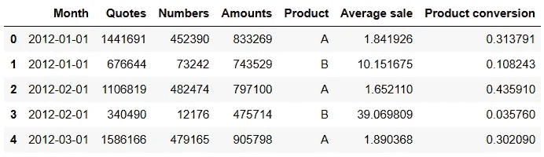
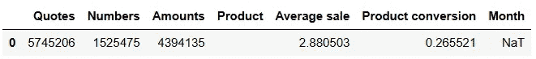

# 让你的表格看起来更华丽

> 原文：[`towardsdatascience.com/make-your-tables-look-glorious-2a5ddbfcc0e5?source=collection_archive---------2-----------------------#2023-01-10`](https://towardsdatascience.com/make-your-tables-look-glorious-2a5ddbfcc0e5?source=collection_archive---------2-----------------------#2023-01-10)

## 简单的格式化技巧，让你的 pandas DataFrames 准备好展示

[](https://bradley-stephen-shaw.medium.com/?source=post_page-----2a5ddbfcc0e5--------------------------------)[](https://towardsdatascience.com/?source=post_page-----2a5ddbfcc0e5--------------------------------) [Bradley Stephen Shaw](https://bradley-stephen-shaw.medium.com/?source=post_page-----2a5ddbfcc0e5--------------------------------)

·

[关注](https://medium.com/m/signin?actionUrl=https%3A%2F%2Fmedium.com%2F_%2Fsubscribe%2Fuser%2Fc5cd0a58b5ae&operation=register&redirect=https%3A%2F%2Ftowardsdatascience.com%2Fmake-your-tables-look-glorious-2a5ddbfcc0e5&user=Bradley+Stephen+Shaw&userId=c5cd0a58b5ae&source=post_page-c5cd0a58b5ae----2a5ddbfcc0e5---------------------post_header-----------) 发布于 [Towards Data Science](https://towardsdatascience.com/?source=post_page-----2a5ddbfcc0e5--------------------------------) ·13 分钟阅读·2023 年 1 月 10 日[](https://medium.com/m/signin?actionUrl=https%3A%2F%2Fmedium.com%2F_%2Fvote%2Ftowards-data-science%2F2a5ddbfcc0e5&operation=register&redirect=https%3A%2F%2Ftowardsdatascience.com%2Fmake-your-tables-look-glorious-2a5ddbfcc0e5&user=Bradley+Stephen+Shaw&userId=c5cd0a58b5ae&source=-----2a5ddbfcc0e5---------------------clap_footer-----------)

--

[](https://medium.com/m/signin?actionUrl=https%3A%2F%2Fmedium.com%2F_%2Fbookmark%2Fp%2F2a5ddbfcc0e5&operation=register&redirect=https%3A%2F%2Ftowardsdatascience.com%2Fmake-your-tables-look-glorious-2a5ddbfcc0e5&source=-----2a5ddbfcc0e5---------------------bookmark_footer-----------)

图片由 [Pierre Bamin](https://unsplash.com/@bamin?utm_source=medium&utm_medium=referral) 提供，来源于 [Unsplash](https://unsplash.com/?utm_source=medium&utm_medium=referral)。

2023 年带来了我们所有人希望和梦想的一切，新的一年也带来了其他东西：年终报告和演示文稿。

不管我们喜欢与否，视觉印象都很重要。虽然图形通常比一系列数字更易于理解，更能传达信息，但有时我们仍不得不使用数据表。但这并不意味着表格不能漂亮！

现在，公平地说——Jupyter notebooks 确实能生成看起来不错的表格，但仅使用`pandas`，我们可以进行相当多的自定义，从而真正使表格属于我们，并且——更重要的是——传达我们的信息。

在这篇文章中，我们将看到如何：

1.  格式化日期

1.  格式化绝对数值

1.  格式化货币

1.  格式化比率

1.  导出格式化的 DataFrames

让我们开始吧，假设我们在 Widget 公司，向内部销售团队展示两种类型的部件的销售数据。

*附注：当然，你不会仅在一月份报告结果、预测和总结，因此我在这里总结的技巧希望能更具长远性。*

# 数据

我们将从创建一个虚拟数据集开始。这里没有什么花哨的——只是使用`pandas`和`numpy`进行一点模拟。

```py
import pandas as pd
import numpy as np

# simulated data for widget A
df_a = pd.DataFrame(
    {
        'Month':pd.date_range(
            start = '01-01-2012',
            end = '31-12-2022',
            freq = 'MS'
        ),
        'Quotes':np.random.randint(
            low = 1_000_000,
            high = 2_500_000,
            size = 132
        ),
        'Numbers':np.random.randint(
            low = 300_000,
            high = 500_000,
            size = 132
        ),
        'Amounts':np.random.randint(
            low = 750_000,
            high = 1_250_000,
            size = 132
        )
    }
)

df_a['Product'] = 'A'

# simulated data for widget B
df_b = pd.DataFrame(
    {
        'Month':pd.date_range(
            start = '01-01-2012',
            end = '31-12-2022',
            freq = 'MS'
        ),
        'Quotes':np.random.randint(
            low = 100_000,
            high = 800_000,
            size = 132
        ),
        'Numbers':np.random.randint(
            low = 10_000,
            high = 95_000,
            size = 132
        ),
        'Amounts':np.random.randint(
            low = 450_000,
            high = 750_000,
            size = 132
        )
    }
)

df_b['Product'] = 'B'

# put it together & sort
df = pd.concat([df_a,df_b],axis = 0)
df.sort_values(by = 'Month',inplace = True)
df.reset_index(drop = True,inplace = True)
```

到目前为止，都很简单。让我们计算一些“有趣”的统计数据——平均销售金额和产品转化率：

```py
# average sale
df['Average sale'] = df['Amounts'] / df['Numbers']

# conversion
df['Product conversion'] = df['Numbers'] / df['Quotes']
```

……这给我们带来了以下（缩写的）DataFrame：



作者提供的图片

这里有一个相当典型的总结表格，我们可能希望向利益相关者展示：数字、货币金额和一些比率都表示在时间跨度中。

让我们逐步处理数据集，逐个格式化元素。

*为了简洁，接下来的 DataFrame 图片将仅显示前六行数据，但任何代码片段都适用于整个 DataFrame。*

# 格式化日期

首先是日期列。

格式化方面可以说没有什么*错误*，但可以更好。例如，由于所有的月度数据都是以每月第一天为基准的，因此保留每个`Month`条目的日期元素意义不大，因为它对读者提供的信息很少。

*敏锐的读者会注意到我没有使用美国常见的日期格式；当然，我建议使用在你所在地区普遍接受的格式。*

让我们只显示年份和月份：

```py
# remove day of month from month column
df.style.format({'Month':'{:%Y-%m}'})
```


作者提供的图片

小改动，但已经好多了！

现在，我们可以通过使用每个月的名称而不是月份数字来进一步提高可读性，而且我们可以**不必更改基础数据**。

```py
# use full name of month
df.style.format({'Month':'{:%B %Y}'})
```


作者提供的图片

现在可能有点啰嗦——让我们改用缩写（例如“Jan”代替“January”）。

```py
# use abbreviated month name
df.style.format({'Month':'{:%b %Y}'})
```


作者提供的图片

简短而简洁。我想重新处理年份和月份数字，目标是比`YYYY-MM`格式更具可读性，但又不使用名称（无论是缩写还是完整名称）。所以，让我们重新格式化数据，但不使用`YYYY-MM`格式，而是使用年份和月份数字，由字母“M”分隔。

```py
# year and month number, separated by letter 'M'
df.style.format({'Month':'{:%Y M%m}'})
```


作者提供的图片

还不错，但我更喜欢简写的名称，因此我们将使用它。

*附注：如果你对使用上面提到的* `YYYY M-MM` *格式感兴趣，但不喜欢前导零的外观，可以使用格式字符串* `{:%Y M%#m}` *来去掉那个讨厌的零。*

# 用千位分隔符格式化数字

在这里，我们通过用逗号分隔成千上万的 `Quotes` 和 `Numbers`，体验了相当直接的格式化过程。

然而需要注意的是，如果我们还希望保留应用于 `Month` 列的格式（我们希望保留），那么我们需要扩展格式化字典。

```py
# thousands separator for absolute numbers
df.style.format(
    {
        'Month':'{:%b %Y}',
        'Quotes':'{:,.0f}',
        'Numbers':'{:,.0f}'
    }
)
```


图片来源：作者

这看起来还不错——更容易感知这些绝对数字的规模。

接下来是货币金额，在这里重要的是要反映出数字的大小和货币的面值。

# 格式化货币

小工具公司刚好在一个使用 £ 符号的国家生产和销售它的产品（希望比我赚取 £ 的国家更温暖、更阳光明媚）。

让我们在表格中体现这一点，并提醒自己：

+   从整体上看，使用小数点可能有点过多

+   在更低的层次上——比如说，平均销售值——使用小数点可能会很有用。

因此，我们将货币格式化添加到 `Amounts` 和 `Average sale` 的格式化字典中：

```py
# currency formatting
df.style.format(
    {
        'Month':'{:%b %Y}',
        'Quotes':'{:,.0f}',
        'Numbers':'{:,.0f}',
        'Amounts':'£{:,.0f}',
        'Average sale':'£{:,.2f}'
    }
)
```


图片来源：作者

有多种显示货币的方式，改变格式也很简单——例如，如果我们想将 `Average sale` 显示为数字后跟货币符号，我们可以这样做：

```py
# different currency representation
df.style.format(
    {
        'Month':'{:%b %Y}',
        'Quotes':'{:,.0f}',
        'Numbers':'{:,.0f}',
        'Amounts':'£{:,.0f}',
        'Average sale':'{:,.2f} (£)'
    }
)
```


图片来源：作者

就个人而言，我更喜欢 `货币符号 -- 数字` 格式，但当然我们也可以应用数字格式化，并将货币符号包括在列名中——例如 `Average sale (£)`。

# 格式化百分比

另一个相当直接的格式化步骤，当以百分比形式表示比率时，比用浮点数表示要更容易查看。

我再次建议根据使用场景调整确切的格式。如果不需要很高的精度，在百分比中使用较少（或没有）小数可以使表格看起来更整洁。

无论如何，我们的格式化代码现在变成了：

```py
# percentage formatting
df.style.format(
    {
        'Month':'{:%b %Y}',
        'Quotes':'{:,.0f}',
        'Numbers':'{:,.0f}',
        'Amounts':'£{:,.0f}',
        'Average sale':'£{:,.2f}',
        'Product conversion':'{:.2%}'
    }
)
```


图片来源：作者

我认为我们的数据现在已经格式化得相当不错了。让我们进入影响表格整体外观和感觉的更改。

# 隐藏索引

我觉得默认的 DataFrame 索引很丑。好了，我说出来了。

这些索引显然很重要，但它们可能会显得很碍眼，甚至更糟，成为干扰。设身处地考虑一下利益相关者的感受：你看到的表格不仅有多余的行号，而且编号从零开始！如果你不习惯使用 Python，这就显得相当奇怪了。

当然，我们可以用多种方法来解决这个问题。我们可以将 `Month` 设为 DataFrame 的索引（更好的是，设置为 `Month x Product` 多级索引）。或者，为了展示的美观，我们可以将索引设置为一个空字符串数组。

或者，我们 *可以* 只是隐藏显示中的索引。这样更干净，并且不干扰 DataFrame 的索引。

```py
# suppress the index
df.style.format(
    {
        'Month':'{:%b %Y}',
        'Quotes':'{:,.0f}',
        'Numbers':'{:,.0f}',
        'Amounts':'£{:,.0f}',
        'Average sale':'£{:,.2f}',
        'Product conversion':'{:.2%}'
    }
).hide_index()
```


图片作者提供

现在我们在接近目标。

# 条件格式化

高亮显示数据中的某些元素是传达信息或引起观众对数据某一方面关注的好方法。

我们将从高亮显示行开始，如果该行的某个元素满足给定条件——在这种情况下，高亮显示所有包含与产品 A 相关的信息的行。

我们分两步完成这个：

1.  定义函数 `highlight_product`，当给定条件满足时返回一个字符串（即，如果该行与指定产品相关）。该字符串包含一个格式命令，我们将传递给 `Styler`。

1.  生成的格式命令通过 `apply` 命令传递。

```py
# function to conditionally highlight rows based on product
def highlight_product(s,product,colour = 'yellow'):
    r = pd.Series(data = False,index = s.index)
    r['Product'] = s.loc['Product'] == product

    return [f'background-color: {colour}' if r.any() else '' for v in r]

# apply the formatting
df.style\
.apply(highlight_product,product = 'A',colour = '#DDEBF7', axis = 1)\
.format(
    {
        'Month':'{:%b %Y}',
        'Quotes':'{:,.0f}',
        'Numbers':'{:,.0f}',
        'Amounts':'£{:,.0f}',
        'Average sale':'£{:,.2f}',
        'Product conversion':'{:.2%}'
    }
).hide_index()
```


图片作者提供

因此，与产品 A 相关的行得到了高亮显示。非常简单。

实际上，这也使得表格更具可读性，因为现在更容易区分这两种产品类型。

*专业提示：我们可以向* `pandas`* 提供颜色十六进制代码，使得定制格式化更为便捷——这个特定的蓝色其实是我最喜欢的 Microsoft Excel 颜色之一。将高亮颜色定制为匹配公司的颜色方案是一个非常棒的细节。*

我们当然可以使用不同的条件测试。这是对 `Average sale` 应用条件阈值的示例：

```py
# function to highlight rows based on average sale
def highlight_average_sale(s,sale_threshold = 5):
    r = pd.Series(data = False,index = s.index)
    r['Product'] = s.loc['Average sale'] > sale_threshold

    return ['background-color: yellow' if r.any() else '' for v in r]

# apply the formatting
df.iloc[:6,:].style\
.apply(highlight_average_sale,sale_threshold = 20, axis = 1)\
.format(
    {
        'Month':'{:%b %Y}',
        'Quotes':'{:,.0f}',
        'Numbers':'{:,.0f}',
        'Amounts':'£{:,.0f}',
        'Average sale':'£{:,.2f}',
        'Product conversion':'{:.2%}'
    }
).hide_index()
```


图片作者提供

……我们可以看到 `Average sale > £20` 的行被非常明显地高亮显示为黄色。

我们可以将格式化更改限制为 DataFrame 的一个子集，而不是对整行应用高亮。例如，我们会对 `Product conversion` 应用两个阈值测试，如果条件满足则更改字体颜色和粗细。

如常，我们需要首先指定一些格式化函数：

```py
# functions to change font colour based on a threshold
def colour_threshold_lessthan(value,threshold,colour = 'red'):
    if value < threshold:
        return f'color: {colour}'
    else:
        return ''

def colour_threshold_morethan(value,threshold,colour = 'green'):
    if value > threshold:
        return f'color: {colour}'
    else:
        return ''

# functions to change font weight based on a threshold    
def weight_threshold_lessthan(value,threshold):
    if value < threshold:
        return f'font-weight: bold'
    else:
        return ''

def weight_threshold_morethan(value,threshold):
    if value > threshold:
        return f'font-weight: bold'
    else:
        return ''

# apply the formatting
df.style\
.apply(highlight_product,product = 'A',colour = '#DDEBF7', axis = 1)\
.applymap(colour_threshold_lessthan,threshold = 0.05,subset = ['Product conversion'])\
.applymap(weight_threshold_lessthan,threshold = 0.05,subset = ['Product conversion'])\
.applymap(colour_threshold_morethan,threshold = 0.2,subset = ['Product conversion'])\
.applymap(weight_threshold_morethan,threshold = 0.2,subset = ['Product conversion'])\
.format(
    {
        'Month':'{:%b %Y}',
        'Quotes':'{:,.0f}',
        'Numbers':'{:,.0f}',
        'Amounts':'£{:,.0f}',
        'Average sale':'£{:,.2f}',
        'Product conversion':'{:.2%}'
    }
)\
.hide_index()
```


图片作者提供

不错！

注意我们在这里使用 `applymap` 而不是 `apply`，并使用 `subset` 参数将格式化限制为 DataFrame 的 *子集*。

我想在这里做两个更改：

+   在代码方面，我会使用 lambda 函数，而不是定义如此多类似的辅助函数。那样代码会更简洁。

+   我会犹豫不决地展示一个表格，其中某些单元格具有不同的字体格式，除非格式应用于行或列的总计。

# 表格级别的更改：文本对齐和标题

只是一个简单的整体改进——我们会对齐文本，并为我们的 DataFrame 添加标题（明确的标识总是好的！）。

```py
# align the text
df.style\
.set_properties(**{’text-align’:’center’})\
.apply(highlight_product,product = 'A’,colour = '#DDEBF7’, axis = 1)\
.applymap(lambda u: 'color: red' if u < 0.15 else '’,subset = [’Product conversion’])\
.applymap(lambda u: 'font-weight: bold' if u < 0.15 else '’,subset = [’Product conversion’])\
.applymap(lambda u: 'color: green' if u > 0.2 else '’,subset = [’Product conversion’])\
.applymap(lambda u: 'font-weight: bold' if u > 0.2 else '’,subset = [’Product conversion’])\
.format(
    {
        'Month’:’{:%b %Y}’,
        'Quotes’:’{:,.0f}’,
        'Numbers’:’{:,.0f}’,
        'Amounts’:’£{:,.0f}’,
        'Average sale’:’£{:,.2f}’,
        'Product conversion’:’{:.2%}'
    }
)\
.set_caption(’Sales data <br> Produced by Team X’)\
.hide_index() 
```

……这产生了：


作者提供的图像

*专业提示：在指定多行标题时，换行符应使用* `<br>` *而不是* `\n`。

# 将所有内容整合在一起

现在让我们把这些技巧和窍门结合起来，包括在 DataFrame 底部添加一列“总计”。

列总计需要一些额外的工作：

+   我们通过取和得到原始总计。

+   平均值和转换需要使用新的总计重新计算。

+   对于 `Product` 列没有有意义的“总计”计算，因此我们将该元素替换为空字符串。

+   我们将 `Month` 条目替换为缺失值，以便可以覆盖它而不使事情变得复杂（狡猾！）。

```py
# create a total "row" - i.e. column total
total = df.sum()
total['Month'] = pd.NaT
total['Product'] = ''
total['Average sale'] = total['Amounts'] / total['Numbers']
total['Product conversion'] = total['Numbers'] / total['Quotes']
total = total.to_frame().transpose()
```



作者提供的图像

然后，通过使用 `pd.concat` 将总计添加到 DataFrame 中非常简单。我们还编写了一个快速函数来使总计行中的文本**加粗**。

```py
# function to highlight the total row
def highlight_total(s):
    r = pd.Series(data = False,index = s.index)
    r['Month'] = pd.isnull(s.loc['Month'])

    return ['font-weight: bold' if r.any() else '' for v in r]
```

把所有内容放在一起，使用我们新连接的 DataFrame `d`：

```py
# stack and reset index
d = pd.concat([df,total],axis = 0)
d.reset_index(drop = True,inplace = True)

# apply formatting
d.style\
.set_properties(**{'text-align':'center'})\
.apply(highlight_product,product = 'A',colour = '#DDEBF7',axis = 1)\
.apply(highlight_total,axis = 1)\
.format(
    {
        'Month':'{:%b %Y}',
        'Quotes':'{:,.0f}',
        'Numbers':'{:,.0f}',
        'Amounts':'£{:,.0f}',
        'Average sale':'£{:,.2f}',
        'Product conversion':'{:.2%}'
    },
    na_rep = 'Total'
)\
.set_caption('Sales data <br> Produced by Team X')\
.hide_index()
```

… 完成！


作者提供的图像

不错！

*专业提示：注意我们如何在* `Month` *中使用了缺失值，以及* `na_rep` *参数来用字符串填充缺失值。这是一种在日期时间列中使用字符串的简单方法。*

# 导出魔法

如果你仍然在为工作演示使用 PowerPoint，那么你可能会熟悉将 Jupyter 笔记本的屏幕截图粘贴到幻灯片中的痛苦。

这显然非常低效（更不用说无聊了），但有一个好消息——你可以使用*代码*将表格导出为图像。更好的消息是，有一个方便的 Python 包可以做到这一点——介绍 `dataframe_image`²：

```py
import dataframe_image as dfi

# style the table
d_styled = d.style\
.set_properties(**{'text-align':'center'})\
.apply(highlight_product,product = 'A',colour = '#DDEBF7',axis = 1)\
.apply(highlight_total,axis = 1)\
.format(
    {
        'Month':'{:%b %Y}',
        'Quotes':'{:,.0f}',
        'Numbers':'{:,.0f}',
        'Amounts':'£{:,.0f}',
        'Average sale':'£{:,.2f}',
        'Product conversion':'{:.2%}'
    },
    na_rep = 'Total'
)\
.set_caption('Sales data <br> Produced by Team X')\
.hide_index()

# export the table to PNG
export_destination = r'C:\Users\...\Presentations'
dfi.export(
    d_styled,
    os.path.join(
        export_destination,
        'styled_dataframe.png'
    )
)
```


作者提供的图像

结果的*图像*与我们在笔记本中看到的略有不同，但它看起来非常好（如果我这么说的话！）。

# 总结

让我们总结一下。

这篇文章有点偏重于图像，但这对于演示如何使用 `pandas` 格式化日期、绝对数字、货币和比率是必要的。我们还使用了 `dataframe_image` 将我们花哨的表格导出为图像格式。

我们在这里已经覆盖了相当多的内容，但这绝不是详尽的讨论。使用一些更高级的功能和一点 HTML 可以制作出非常酷的表格；不幸的是，我对 HTML 有点生疏，所以很快就达到了我的能力极限。我建议查看官方文档³，以了解实际可能性；你还会在那里找到对 `Styler` 的更好解释，以及 `apply` 和 `applymap` 之间的区别。

最后，尽管我对 `dataframe_image` 是新手，但我发现它真的很简单使用，并且它确实如宣传所述功能实现。`nbconvert` 用户可能永远不需要使用它，但它是一个非常有用的工具。

希望这篇文章能为你的一年精彩的数据表格奠定基础。告诉我你是如何传达（表格）信息的——我总是很乐意了解更好的沟通方式！

# 参考资料和资源

1.  [string — 常见字符串操作 — Python 3.11.1 文档](https://docs.python.org/3/library/string.html#format-specification-mini-language)。

1.  [GitHub — dexplo/dataframe_image: 一个将 pandas DataFrames 嵌入为图像的 Python 包，用于 pdf 和 markdown 文档](https://github.com/dexplo/dataframe_image)。

1.  [表格可视化 — pandas 1.5.2 文档 (pydata.org)](https://pandas.pydata.org/docs/user_guide/style.html)。

日期格式的有用总结：[datetime — 基本日期和时间类型 — Python 3.11.1 文档](https://docs.python.org/3/library/datetime.html#strftime-and-strptime-behavior)。
