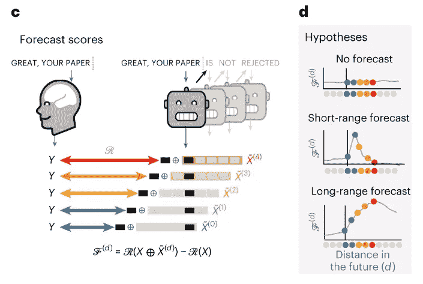
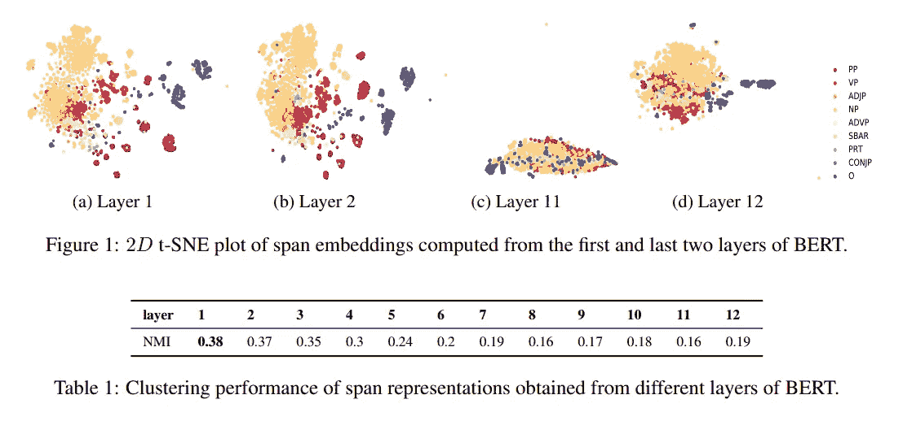

# 让语言模型更像人脑

> 原文：[`towardsdatascience.com/making-language-models-similar-to-human-brain-b6ea8270be08`](https://towardsdatascience.com/making-language-models-similar-to-human-brain-b6ea8270be08)

## 神经科学 | 人工智能 | 自然语言处理

## 在自然语言处理领域，语言模型（LMs）与人脑之间仍存在差距，这激励人工智能（AI）去弥补这一差距。

 [Salvatore Raieli](https://salvatore-raieli.medium.com/?source=post_page-----b6ea8270be08--------------------------------)

·发表于 [Towards Data Science](https://towardsdatascience.com/?source=post_page-----b6ea8270be08--------------------------------) ·14 分钟阅读·2023 年 3 月 23 日

--

图片由作者使用 OpenAI DALL-E 生成

地球上有数千种脊椎动物物种，但只有一种能够通过语言传达无限的概念。语言传递对人类至关重要，并使他们能够塑造我们所知的故事。

> 语言模型是否无法匹配这种人类能力？为什么？

一项新的研究尝试基于语言模型和神经科学来回答这个问题。

 [## 人脑在听语音时的预测编码层级证据 - Nature Human…](https://www.nature.com/articles/s41562-022-01516-2?source=post_page-----b6ea8270be08--------------------------------)

### 最近，在自然语言处理领域取得了显著进展：深度学习算法越来越…

[Nature 网站](https://www.nature.com/articles/s41562-022-01516-2?source=post_page-----b6ea8270be08--------------------------------)

# 人工大脑和自然大脑如何进行交流？

最近，我们看到 [语言模型](https://en.wikipedia.org/wiki/Language_model)（LMs）在[文本生成](https://huggingface.co/tasks/text-generation)、[翻译](https://huggingface.co/tasks/translation)和补全等任务上取得了重大进展。这一切都归功于一个简单却有效的想法：我们可以通过上下文来预测一个词。

尽管这个想法看起来如此简单，但它却是从 BERT 到 ChatGPT 的所有语言模型的基础。每个变换器都基于 [嵌入](https://www.tensorflow.org/text/guide/word_embeddings) 和 [自注意力](https://en.wikipedia.org/wiki/Self-attention)（这使我们能够将句子中的词关联起来）。

 [## 关于 ChatGPT 你需要了解的一切

### 现状、最新消息、影响因素以及正在发生的变化。所有这些都在一篇文章中。

medium.com](https://medium.com/data-driven-fiction/everything-but-everything-you-need-to-know-about-chatgpt-546af7153ee2?source=post_page-----b6ea8270be08--------------------------------)

多年来，作者们尝试检测这些模式的激活与人脑对语言和文本的反应之间是否存在映射关系。多项研究表明，这种映射是线性的，取决于模型预测序列中未来单词的能力。

最近，一项研究显示，甚至可以利用人工智能可视化一个人观察到的图像。表明可以从脑活动记录中重建一个人所见的内容。

 [## 稳定扩散与大脑：人工智能如何读取我们的思想

### 研究人员能够使用 fMRI 数据重建图像。

levelup.gitconnected.com](https://levelup.gitconnected.com/stable-diffusion-and-the-brain-how-ai-can-read-our-minds-45398b395ea9?source=post_page-----b6ea8270be08--------------------------------)

> **人工智能算法是否已经赶上了人类的能力？**

不，而且我们对人类语言或相关脑过程的理解也不充分。

> 然而，人类与这些算法之间仍然存在差距：尽管有大量的训练数据，当前的语言模型在长篇故事生成、总结和连贯对话以及信息检索方面仍然面临挑战；它们未能捕捉到几种句法结构和语义属性，其语言理解仍然肤浅。（[来源](https://www.nature.com/articles/s41562-022-01516-2)）

“即使在大量人类上下文和强大的 GPT-2 大语言模型下，Beam Search（大小 32）会导致退化重复（蓝色高亮），而纯采样则导致不连贯的胡言乱语（红色高亮）”来源（[这里](https://arxiv.org/pdf/1904.09751.pdf)）

示例展示了即使是最新的语言模型在识别嵌套短语中的主语及其依赖关系时仍然存在问题。无论如何，作者指出，单纯优化下一词预测往往会导致生成不一致且平淡的序列（有时还会出现重复循环）。

[预测编码理论](https://en.wikipedia.org/wiki/Predictive_coding) 可能为为什么语言模型仍然落后于人类语言提供了解释。**这到底是什么？**

> 根据预测编码假说，皮层的结构实现了一种自上而下的预测算法，不断地预测即将到来的感觉刺激。每个皮层区域都拥有一个环境的内部模型，该模型通过汇总支配过去输入的统计规律生成。 ([source](https://www.pnas.org/doi/full/10.1073/pnas.1117807108))

换句话说，大脑保持（并不断更新）对周围环境的心理模型。大脑有一个[空间层次](https://www.nature.com/articles/nrn2113)（或概念的层次）表示。实际上，皮层是从最简单到最复杂的层次结构组织的。

因此，人脑并不是预测序列中的下一个词，而是在多个时间尺度和不同的表征层次上进行预测，向上层级递进。

“深度语言算法通常训练以从其紧密上下文中预测单词。与这些算法不同，大脑根据预测编码理论进行（1）长程和（2）层次预测。” 图片来源：[here](https://www.nature.com/articles/s41562-022-01516-2)，许可证：[here](https://creativecommons.org/licenses/by/4.0/)

> 在语言的背景下，这一理论包含可测试的假设，例如大脑应不断预测一个从音素（什么声音可能出现）到单词甚至短语（可能传达什么意义）的语言表征层次。 ([source](https://www.nature.com/articles/s41562-023-01534-8))

例如，以前的研究表明，当[参与者听到短语“从前有一个……”](https://www.nature.com/articles/s41593-022-01026-4)时，可以从脑部记录中追踪到单词“时间”（即使在其被发音之前）。

虽然我们对基本原理有一个大致的了解，但实际过程仍不明确。事实上，我们不知道在语言表达过程中，大脑如何实现多层次的预测。

> 我们为什么关心这个问题？

更好地理解这一过程是修改大型语言模型的第一步。使大型语言模型更类似于人脑，可以帮助我们减少人类与语言模型之间的差距。第三，正如之前所示，映射大脑与模型之间的关系还可以帮助我们更好地理解模型本身。

# 如何将模型映射到大脑

自然故事听觉范式和数据来源的示意图。来源：[here](https://www.nature.com/articles/s41597-021-01033-3)，许可证：[here](https://creativecommons.org/licenses/by/4.0/)

第一步是，我们能否将神经网络的激活映射到大脑上？它们之间有关系吗？

作者们从叙事数据集开始。该数据集由 345 名受试者在约 4.6 小时内（超过 40,000 个独特单词）听取 27 个不同故事组成。

作者们定义：

+   *w* 作为一系列 *M* 词（受试者听到的故事中的词汇）

+   *Y* 作为由 *w* 诱发的 fMRI 记录

+   X 作为用 *w* （从 GPT-2 第 12 层提取）输入的深度语言模型的激活

首先，作者决定量化 fMRI 听觉（Y）与深度语言算法（X）激活之间的相似性，当模型输入相同的故事时。为此，他们创建了一种所谓的“脑评分”。

图片来源：[这里](https://www.nature.com/articles/s41562-022-01516-2)，许可证：[这里](https://creativecommons.org/licenses/by/4.0/)

作者们取用了患者听到的故事中的相同词序列（数据集中包含了转录，并与 fMRI 记录对齐），并将其用作模型的输入。因此，通过输入网络计算一个词的向量（模型根据一个序列预测下一个词）。

一旦获得这些数据，作者们尝试将 Y 激活与音频故事的反应和 X 模式激活进行映射：

> 为此，我们在训练集上拟合了线性岭回归 *W*，以预测 fMRI 扫描结果。然后，我们通过计算预测的 fMRI 扫描和实际 fMRI 扫描之间的 Pearson 相关性来评估这种映射 ([source](https://www.nature.com/articles/s41562-022-01516-2))

换句话说，他们在获得 X 的线性投影后，将 X 和 Y 相关联。

图片来源：[这里](https://www.nature.com/articles/s41562-022-01516-2)，许可证：[这里](https://creativecommons.org/licenses/by/4.0/)

结果与之前的研究一致，表明[GPT-2](https://en.wikipedia.org/wiki/GPT-2)的激活准确映射到分布在大脑两个半球的区域。脑评分在[听觉皮层](https://en.wikipedia.org/wiki/Auditory_cortex)以及前颞叶和上颞叶区域达到了顶峰。

此外，这不仅限于 GPT-2，还适用于分析过的其他变换器模型。换句话说，这种映射可以推广到其他最先进的语言模型。

> 总体而言，这些结果确认深度语言模型线性映射到大脑对口语故事的反应上。 ([source](https://www.nature.com/articles/s41562-022-01516-2#Sec2))

图片来源：[这里](https://www.nature.com/articles/s41562-022-01516-2)，许可证：[这里](https://creativecommons.org/licenses/by/4.0/)

# 大脑如何预测长距离的词？

照片 [Jessica Yap](https://unsplash.com/fr/@jcyapsf) 来自 Unsplash

[变换器](https://en.wikipedia.org/wiki/Transformer_(machine_learning_model)) 替代了 [递归神经网络](https://en.wikipedia.org/wiki/Recurrent_neural_network)（RNNs），因为它能够建模长期依赖（输出依赖于过去的输入）。这全因 [自注意力](https://en.wikipedia.org/wiki/Attention_(machine_learning)) 使其能够使用更长的序列作为输入。

正如我们所说，尽管语言模型取得了巨大的进展，但它们与人类之间仍存在很大差距。

通常，在阅读文本、听演讲或对话中，会有许多长期依赖。大脑往往能够轻松地从上下文中预测下一个单词或短语。**但大脑是如何处理这些的呢？**

> 接下来，我们测试了增强语言模型的激活与长期预测是否会导致更高的大脑得分。 ([source](https://www.nature.com/articles/s41562-022-01516-2#Sec10))

**换句话说，如果我们添加预测表示，它能否提高我们预测大脑的能力？**

作者定义了一个**预测窗口**，其中包含未来一定数量的单词信息。模型保持不变，只是在这种情况下，输入也附加了预测表示（预测窗口）。对于距离 d（单词数量），预测窗口是当前单词的七个连续单词的网络激活的串联。

我们不将未来的单词串联在序列中，而是将模型的激活进行串联，因此我们并不将未来的单词提供给模型，而是它们的表示。

“预测得分”简单来说就是“将预测窗口与当前 GPT-2 激活拼接时，大脑得分的增益。” 或者用简单的话说，就是对下一个单词的表示在多大程度上有助于我们预测大脑活动。

**“c**，测试是否添加未来单词的表示能改善这种相关性。**d**，上图中，一个平坦的预测得分在不同距离下表明预测表示并没有使算法更类似于大脑。下图中，相反，预测得分在*d* > 1 处达到峰值则表明模型缺乏类脑预测。Fd 的峰值指示了算法需要预测表示的未来距离，以便与大脑最相似。” 图像来源：[这里](https://www.nature.com/articles/s41562-022-01516-2)，许可证：[这里](https://creativecommons.org/licenses/by/4.0/)

> 我们的结果表明，**F** 在 *d* = 8 个词的距离处达到最大值，并在通常与语言处理相关的区域达到峰值（图 [2b–d](https://www.nature.com/articles/s41562-022-01516-2#Fig2)）。作为比较，刺激中每秒平均有 2.54 个词。因此，8 个词对应于 3.15 秒的音频（两个连续 fMRI 扫描的时间）。 ([来源](https://www.nature.com/articles/s41562-022-01516-2#Sec10))

简而言之，作者注意到几个有趣的事项：

+   从零到 10 的每个词都有助于这种预测效果。

+   最佳窗口大小大约是八个词。

+   随机预测表示未能帮助预测脑部活动。

+   你甚至可以使用 GPT-2 生成的词代替序列中的真实词（未来词）。这显示了类似的结果，但效果较小。

图片来源: [这里](https://www.nature.com/articles/s41562-022-01516-2)，许可证: [这里](https://creativecommons.org/licenses/by/4.0/)

> 综合来看，这些结果揭示了大脑中的长程预测表示，代表了大脑评分的 23%（±9% 跨个体）的改善。 ([来源](https://www.nature.com/articles/s41562-022-01516-2#Sec10))

作者换句话说，这些数据确认了过去和当前的词表示占据了语言理解中涉及的大脑信号的很大一部分。确实，这些信号映射到以前定义的 [语言网络](https://www.nature.com/articles/nature17637)。

大脑解剖学研究表明，皮层是按层级组织的。输入和信息以层级方式处理，因此低级声学、音素和语义由大脑中的不同结构按照精确的层级编码。

这是不同区域如何在自然语言中编码不同任务的示例。来源 ([这里](https://www.biorxiv.org/content/10.1101/2020.04.02.022822v4.full.pdf))

因此，作者提出了一个问题：“这一皮层层级的不同层次是否预测相同的时间窗口？”

换句话说，他们测试了预测范围在皮层层级中的变化。他们随后研究了不同区域如何影响预测分数及其在词距离 d 上的变化。

> 结果表明，前额叶区域的预测平均而言，比颞叶区域更偏向未来。 ([来源](https://www.nature.com/articles/s41562-022-01516-2#Sec10))

已经展示了区域之间存在差异，仍然有几个问题。**这种时间差异与上下文有什么关系？在句法和语义内容方面是否存在差异？**

如所示，变换器编码语言表示的方式具有层次结构。例如，[BERT](https://arxiv.org/abs/1810.04805)的各层捕获了不同的表示。较低的层捕获短语级别的信息，然后这些信息会被稀释。各种语言信息是以层次化的方式学习的，较低层学习表面特征，中间层学习句法特征，高层学习语义特征。

图片来源: [here](https://hal.inria.fr/hal-02131630/document)，许可证: [here](https://creativecommons.org/licenses/by/4.0/)

为此，作者计算了预测得分，但使用了不同级别的 GPT-2。然后，他们将这些预测得分按级别映射到脑区。

图片来源: [here](https://www.nature.com/articles/s41562-022-01516-2)，许可证: [here](https://creativecommons.org/licenses/by/4.0/)

> 总的来说，这些结果表明，额顶皮层的长期预测比低级脑区的短期预测更具上下文关联性和更高层次。 ([source](https://www.nature.com/articles/s41562-022-01516-2#Sec10))

换句话说，模型各层的不同表示（正如我们上面所说的，模型层的复杂性随着选择的层的深度而增加）在大脑中的映射方式不同。预测的深度与皮层层级之间存在对应关系。

低级预测（低级信息）在处理高层预测（中颞叶、顶叶和额叶区域，这些区域处理预测和复杂信息整合）的脑区之外的不同脑区（具体来说是上颞沟和脑回）中进行预测和分析。

作者然后提取了句法和语义预测表示，对于每个词及其上下文，他们生成了 10 个可能的未来，这些未来具有与原始句子相同的句法。实际上，给定一个句子开头，他们生成了 10 种不同单词的续写，但具有相同的句法属性（词性和依赖树）。然而，这些句子具有不同的语义（即不同的含义）。

然后，他们提取了 GPT-2 的激活（第 8 层），并对这十种可能的未来进行了平均，以提取各个未来的共同句法组件。进一步地，他们将这种平均（句法表示）从实际词序列的激活中减去（以获得纯粹的语义表示）。然后，他们构建了一个语义和语义分开的预测窗口：

> 我们通过分别连接七个连续未来词的句法和语义组件，构建了句法和语义预测窗口。 ([source](https://www.nature.com/articles/s41562-022-01516-2#Sec10))

图像来源：[这里](https://www.nature.com/articles/s41562-022-01516-2)，许可：[这里](https://creativecommons.org/licenses/by/4.0/)

这种方法允许将激活分解为两个组件，一个是语义的，另一个是句法的。一旦完成这些操作，作者计算了预测评分，如之前所见，显示出大脑活动的差异。

> 结果显示，语义预测是长距离的（*d** = 8），并涉及一个分布广泛的网络，主要集中在额叶和顶叶。相比之下，句法预测（图 [4b](https://www.nature.com/articles/s41562-022-01516-2#Fig4)）相对短距离（*d** = 5），并局限于上颞叶和左额叶区域（图 [4c,d](https://www.nature.com/articles/s41562-022-01516-2#Fig4)）。 ([source](https://www.nature.com/articles/s41562-022-01516-2#Sec10))

正如作者所指出的，这些结果表明大脑进行多层次的预测，不同区域有不同的任务：

> 上颞叶皮层主要预测短期、浅层和句法的表示，而下额叶和顶叶区域主要预测长期、上下文、较高层次和语义的表示。 ([source](https://www.nature.com/articles/s41562-022-01516-2#Sec10))

图像来源：[这里](https://www.nature.com/articles/s41562-022-01516-2)，许可：[这里](https://creativecommons.org/licenses/by/4.0/)

# 我们可以在语言模型中实现预测编码吗？

他们从之前的结果中注意到了他：

> 这些结果显示，将 GPT-2 当前和未来词的表示进行串联，可以更好地模拟大脑活动，特别是在额顶区。 ([source](https://www.nature.com/articles/s41562-022-01516-2#Sec10))
> 
> 这些原则可以转化为 GPT-2 训练吗？

换句话说，使用微调是否可以让模型学习预测更长范围、更有上下文且更高层次的表示？如果可以，这是否改善了模型的脑图谱？

为了测试这一点，作者决定对 Wikipedia 上的 GPT-2 进行微调。他们决定改变目标训练方式，而不是使用语言建模方法（即给定前一个词序列预测下一个词），他们决定在经典目标的基础上增加高层次和长距离目标，模型还必须预测序列中远离的词的高层次表示。

具体而言，模型不仅需要预测下一个词，还需要预测后续词的表示。模型还必须预测序列中距离为 d=8 的单词的未微调 GPT-2（第 8 层）模型的隐藏状态。然后，模型还会学习序列中下一个词的长期、高层次和更具上下文的表示。

图片来源：[这里](https://www.nature.com/articles/s41562-022-01516-2)，许可证：[这里](https://creativecommons.org/licenses/by/4.0/)

> 结果表明，GPT-2 在高层次和长范围建模下的微调最能解释前额顶叶反应（图 [5](https://www.nature.com/articles/s41562-022-01516-2#Fig5)，在 IFG 和角回/上缘回平均增益>2%，所有*P* < 0.001）。这些结果进一步强化了前额顶叶区域在预测长距离、上下文和高层次语言表示中的作用。 ([source](https://www.nature.com/articles/s41562-022-01516-2#Sec10))

简单来说，提供这种上下文表示使模型更能预测大脑活动。

# 结束语

图片由 [Anete Lūsiņa](https://unsplash.com/fr/@anete_lusina) 在 Unsplash 提供

这项研究在更好地理解大脑如何理解语言和作出反应方面提出了有趣的观点，并且探讨了神经科学与机器学习之间的联系。

通过更好地理解这些机制，我们可以设计出与人脑更为相似的人工智能模型。当前的语言模型在给定前文的情况下预测下一个词，但人脑考虑的是上下文和未来的可能性。实际上，大脑预测传感器输入，然后将其预测与现实进行比较，然后更新自身的内部模型表示。

因此，未来的模型在训练过程中可能需要考虑未来单词的远程和抽象表示。在这项研究中，他们展示了甚至不需要改变模型的架构，但未来的模型可以重新调整其结构以提高效果。

此外，正如在其他背景中所示，未来的观察（例如，未来待分类的图像）确实保持不确定，其潜在表示更加稳定。这就是为什么像对比学习这样的办法已被证明更有效。所以，如果这已被证明有效，为何不在具有更多上下文信息和更多关于未来潜在表示的信息的语言模型架构和训练中实施它呢？

作者指出，然而，这项研究仍处于初步阶段：

> 最后，目前测试的预测编码架构仍然很初步。需要对这一方法在自然语言处理基准上的系统性推广、扩展和评估，以证明使模型更接近大脑的有效实用性。 ([source](https://www.nature.com/articles/s41562-022-01516-2#Sec10))

无论如何，自从 Transformer 发布以来，模型变得更大了，但结构几乎保持不变。为了克服当前语言模型的局限性，我们需要对架构和训练进行修改。**还有什么比人脑更好的灵感来源呢？**

# 如果你觉得这很有趣：

你可以查看我的其他文章，你也可以[**订阅**](https://salvatore-raieli.medium.com/subscribe)以便在我发布文章时获得通知，还可以通过[**LinkedIn**](https://www.linkedin.com/in/salvatore-raieli/)**与我联系**。

这是我的 GitHub 仓库链接，我计划在这里收集与机器学习、人工智能等相关的代码和资源。

 [## GitHub - SalvatoreRa/tutorial：关于机器学习、人工智能、数据科学的教程……

### 关于机器学习、人工智能、数据科学的教程，包含数学解释和可重用的代码（用 Python 编写……

[GitHub](https://github.com/SalvatoreRa/tutorial?source=post_page-----b6ea8270be08--------------------------------)

或许你会对我最近的一篇文章感兴趣：

 [## Google Med-PaLM：AI 临床医生

### Google 的新模型经过训练可以回答医学问题。如何做到这一点？

[META 的 LLaMA：小型语言模型战胜巨头](https://medium.com/mlearning-ai/metas-llama-a-small-language-model-beating-giants-5065948e0b7f?source=post_page-----b6ea8270be08--------------------------------)  [## META 的 LLaMA：小型语言模型战胜巨头

### META 开源模型将帮助我们理解语言模型偏见的产生

[META 的 LLaMA：小型语言模型战胜巨头](https://medium.com/mlearning-ai/metas-llama-a-small-language-model-beating-giants-5065948e0b7f?source=post_page-----b6ea8270be08--------------------------------)  [## 稳定扩散技术填补医学图像数据的空白

### 一项新的研究表明，稳定扩散技术可能有助于医学图像分析和稀有疾病研究。如何做到这一点？

[为什么我们有巨大的语言模型和小型视觉变换器？](https://levelup.gitconnected.com/stable-diffusion-to-fill-gaps-in-medical-image-data-b78a2a7d6c9d?source=post_page-----b6ea8270be08--------------------------------)  [## 为什么我们有巨大的语言模型和小型视觉变换器？

### Google ViT-22 为新的大型变换器铺平道路，革新计算机视觉

[为什么我们有巨大的语言模型和小型视觉变换器？](https://levelup.gitconnected.com/stable-diffusion-to-fill-gaps-in-medical-image-data-b78a2a7d6c9d?source=post_page-----b6ea8270be08--------------------------------)
