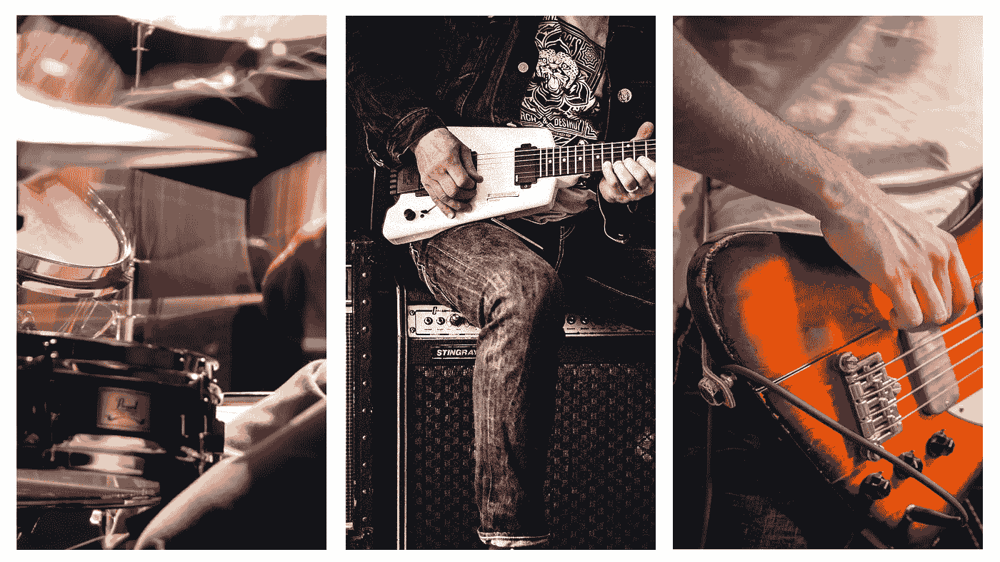
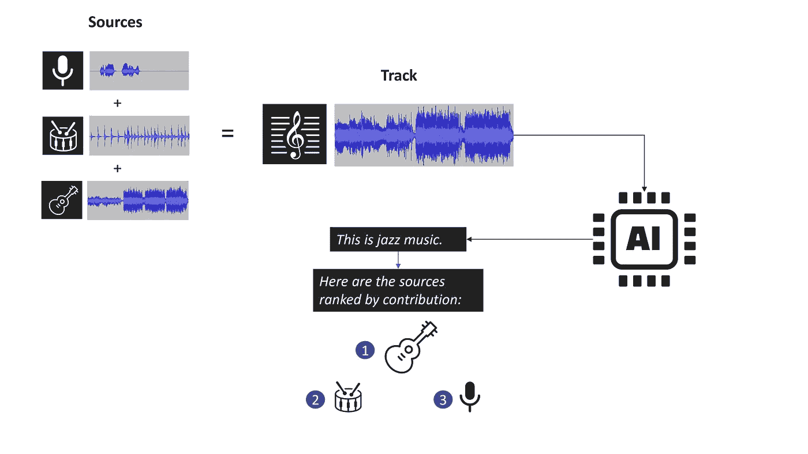
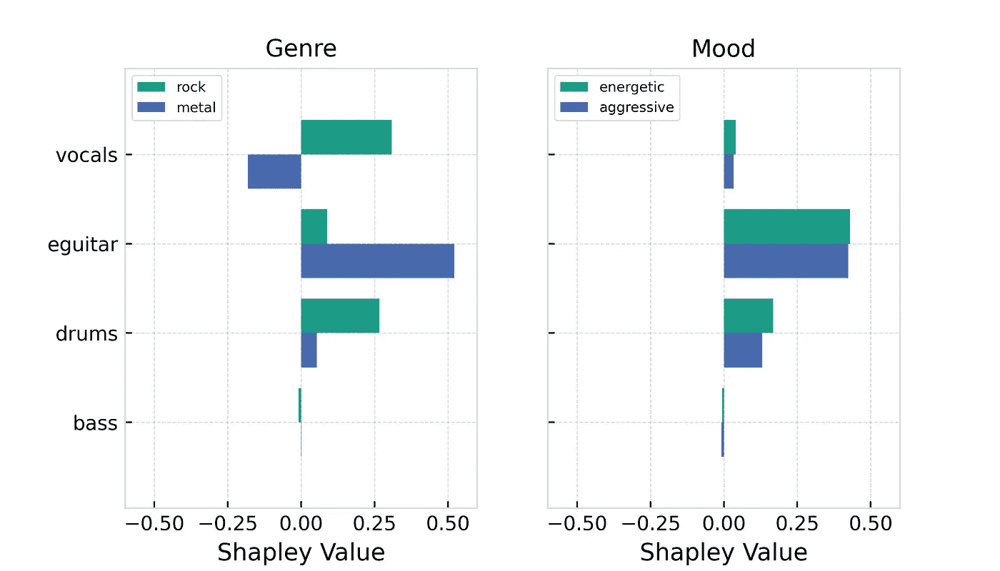
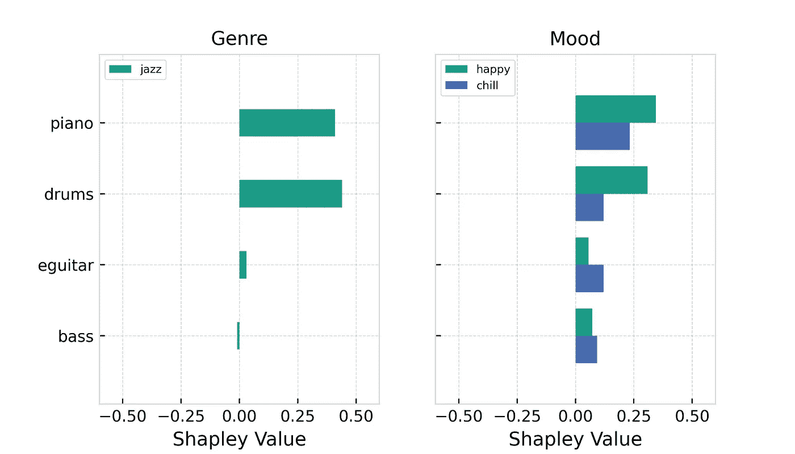
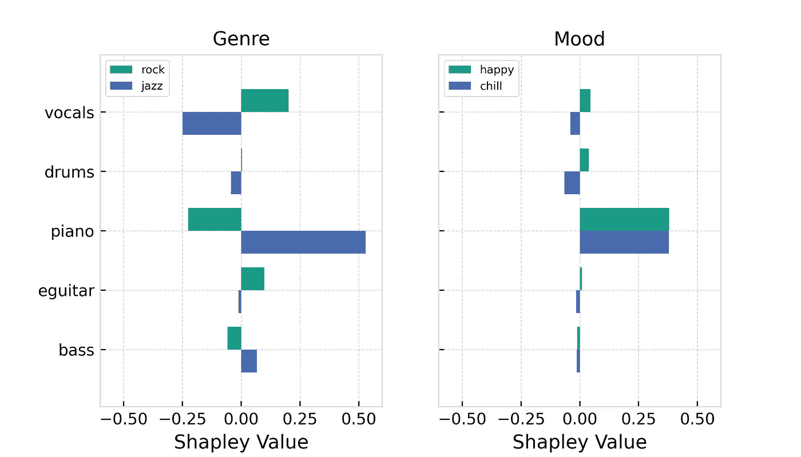

# 通过源分离实现音乐标记 AI 的可解释性

> 原文：[`towardsdatascience.com/making-music-tagging-ai-explainable-through-source-separation-2d9493547a7e?source=collection_archive---------10-----------------------#2023-04-04`](https://towardsdatascience.com/making-music-tagging-ai-explainable-through-source-separation-2d9493547a7e?source=collection_archive---------10-----------------------#2023-04-04)

## 让我们打开黑匣子

 [Max Hilsdorf](https://medium.com/@maxhilsdorf?source=post_page-----2d9493547a7e--------------------------------)

·

[关注](https://medium.com/m/signin?actionUrl=https%3A%2F%2Fmedium.com%2F_%2Fsubscribe%2Fuser%2Fd0c085a74ae8&operation=register&redirect=https%3A%2F%2Ftowardsdatascience.com%2Fmaking-music-tagging-ai-explainable-through-source-separation-2d9493547a7e&user=Max+Hilsdorf&userId=d0c085a74ae8&source=post_page-d0c085a74ae8----2d9493547a7e---------------------post_header-----------) 发表于[Towards Data Science](https://towardsdatascience.com/?source=post_page-----2d9493547a7e--------------------------------) ·10 min read·Apr 4, 2023

--

图片由[Jadson Thomas](https://www.pexels.com/de-de/foto/mann-der-trommel-spielt-542553/)，[Clem Onojeghuo](https://www.pexels.com/de-de/foto/mann-sitzt-auf-gitarrenverstarker-und-spielt-e-gitarre-375893/)和[Dmitry Demidov](https://www.pexels.com/de-de/foto/mann-im-weissen-t-shirt-das-braune-e-gitarre-spielt-3807838/)提供。

# 介绍

## 为什么我们需要这个？

音乐标记的 AI 系统已经存在了一段时间。自 2010 年代中期以来，音乐流媒体服务一直在竞争最具创新性的音乐推荐系统，后台使用复杂的标记 AI。逐渐地，制作音乐库和音乐标签公司开始关注标记 AI，用于对其庞大的音乐数据库进行分类、过滤和查询。今天，甚至艺术家们也在使用自动标记系统，以获得对自己音乐的客观见解，找到合适的受众。

尽管自动标签系统广泛存在，但其内部工作原理鲜为人知。由于音频数据复杂且高维，深度学习模型在音乐标记任务中始终优于传统的机器学习方法。深度学习的问题是显而易见的：通过构建越来越复杂和高效的模型，我们牺牲了可解释性。深度学习模型实际上是黑箱，我们无法确切了解内部发生了什么。

## 本项目的目标

本项目旨在通过将音轨拆分成其乐器来源（stem）并观察分类如何变化，来阐释音乐标记 AI 系统的行为。这种方法受到了一个著名的可解释 AI（XAI）概念的启发，称为**Shapley 值**。

Shapley 值来源于合作博弈论。假设我们有不同的玩家，他们可以组成“联盟”来实现共同目标。目标是为每个玩家分配一个值，表示将他们加入联盟通常如何改善结果，即确定他们的公平份额。那么，这个概念与音乐标记和乐器源分离有什么关系呢？

*图 1* 帮助你理解博弈论与音乐分类器之间的类比。如果一首曲目被 AI 标记系统指定为“爵士”风格，我们可能会想知道乐队中的每种乐器（鼓、吉他、声乐）对这一分类的贡献有多大。换句话说：我们想找出每种乐器对使曲目听起来像“爵士”音乐有多重要。

**图 1**：本项目目标的插图。图像由作者提供。

# 方法

## 示例音乐

所有用于此分析的示例曲目均取自[Free Music Archive (FMA)](https://github.com/mdeff/fma)，这是一个包含成千上万的免版权音乐片段的数据集。第一个示例是一首包含多个失真的吉他、重鼓和开头较柔和男声的曲目。这首曲目将作为我们的**“摇滚”示例**。

摘自 Aviv Mark 的《Wonder 的面貌》（CC BY-NC-ND 3.0 许可证）。

下一段音乐包含步伐感强的贝斯、扫帚鼓、轻松的吉他和一个主导的即兴钢琴。这将作为我们的**“爵士”示例**。

摘自 Quantum Jazz 的《Jingle Jazz》（CC BY-SA 3.0 许可证）。

第三条也是最后一条轨道是“爵士”和“摇滚”流派的混合，结合了布鲁斯风格的钢琴、带有轻微摆动的鼓、失真的电吉他和更像摇滚的声音。这一片段将作为我们的**“混合流派”示例**。

摘自 Sakee Sed 的《Vermouth 和 Baby》（CC BY-NC-ND 3.0 许可证）。

## 源分离与重组

对于这个项目，我使用了[LALAL.AI 的源分离工具](https://www.lalal.ai/)，这是一家专门从事此技术的初创公司。虽然还有许多其他竞争解决方案，如 Spleeter 或 Vocalremover.org，但在我对他们的在线演示印象深刻之后，我选择了 LALAL.AI。此外，他们还非常友好地提供了进行本文所需源分离工作的资源。

在将三条轨道拆分成其乐器源后，我将这些孤立的源组合起来，形成每条轨道的所有可能源组合。对于具有 4 个源（“摇滚”和“爵士”）的轨道，这导致了 15 个新的音频文件，从单一的鼓轨道到完整的乐队设置。而对于有 5 种乐器的“混合流派”轨道，总共有 31 种组合可能。每种组合都类似于 Shapley 值博弈理论中的“联盟”概念。

## 流派与心情标记

至于自动标记 AI，我使用了另一个名为[“Cyanite AI”](https://cyanite.ai/)的服务。Cyanite 是一个自动标记工具，提供来自不同类别的标签，如流派、心情或乐器。虽然还有其他自动标记提供商，如 AudioRanger 和 Songtradr 的 musicube，但我对 Cyanite 的产品非常熟悉，因为我曾作为工作学生为其做过贡献。Cyanite 还慷慨地为我提供了分析本项目示例轨道的资源。

自动标记器为每个标签输出 0 到 1 之间的分数，表示标签与轨道的匹配程度（1 表示非常匹配，0 表示不匹配）。这个输出值可以解释为轨道是“摇滚”、“金属”还是“悲伤”或“愤怒”的程度。

## 计算 Shapley 值

对于每条轨道，我分析了所有源联盟的两个最显著的流派和心情。为了获得乐器的 Shapley 值，我计算了每个乐器缺席的联盟与该乐器存在的联盟之间的流派和心情评分差异。这些差异的平均值，即将该乐器添加到混音中的平均贡献，就是 Shapley 值。

# 结果

## 摇滚轨道

摘自 Aviv Mark 的《Wonder 的外观》（CC BY-NC-ND 3.0 许可证）。

“摇滚”轨道被自动标记工具标记为“摇滚”和“金属”流派，以及“充满活力”和“攻击性”心情。

**图 2**：基于 Stem 的“摇滚”轨道 Shapley 值。图像来源：作者。

## 我们能看到什么？

*图 2* 显示了每个乐器来源对各自标签的贡献。例如，我们可以看到，电吉他平均增加了“金属”评分超过 50 个百分点。另一方面，“摇滚”评分仅增加了大约 5 个百分点。从中我们可以看出，电吉他的声音更像是一把“金属”吉他，而不是“摇滚”吉他。对于人声，则正好相反：人声显著提高了“摇滚”评分，同时降低了“金属”评分。这告诉我们，这首歌中的人声和电吉他在风格上相互对比。这不是很酷吗？

从情绪的角度来看，我们可以看到电吉他在表达这首曲目的“充满活力”和“攻击性”情绪方面特别重要。与风格图不同，所有乐器似乎都传达了相同的情绪，只是程度不同。有趣的是，贝斯乐器似乎对风格或情绪评分没有贡献。这可能是因为贝斯的表现不够鲜明，要么是因为它比较安静，要么是因为它的演奏方式不具备某种特定风格或情绪的特点。

## 我们能用它做什么？

Shapley 值方法已经帮助我们通过分析哪些乐器以何种方式对我们感兴趣的特定风格或情绪做出贡献（或相反），来理解自动标记系统的输出。例如，如果我们希望这首曲目获得更高的“金属”评分，我们应该考虑用不同的歌手或唱腔重新录制人声。为了使其更“摇滚”而不那么“金属”，我们可以尝试降低电吉他的失真度。

## 爵士曲目

摘自 Quantum Jazz 的《Jingle Jazz》（CC BY-SA 3.0 许可证）。

对于“爵士”曲目，唯一的音乐风格输出为“爵士”，情绪输出为“愉快”和“放松”。

**图 3**：基于 Stem 的 Shapley 值用于“爵士”曲目。图像由作者提供。

## 我们能看到什么？

**图 3** 显示了钢琴和鼓使这首歌听起来特别“爵士”。虽然从音乐的角度来看，贝斯和电吉他在录音中也表现得非常“爵士”，但突出钢琴和鼓是有道理的，因为它们在混音中更为突出，似乎承载了歌曲的“风格重量”，在我听来。单凭鼓和钢琴就能做出一首听起来很棒的爵士曲目，而如果只有吉他和贝斯，没有其他乐器的话则会显得奇怪。

情绪分析揭示了所有乐器对相同情绪的积极贡献。然而，钢琴和鼓比对“轻松”情绪的贡献更多地提高了“快乐”分数。电吉他和贝斯则相反，它们对曲子的“轻松”分数贡献更多。这一点很有趣，因为尽管钢琴和鼓也是情绪标签中最重要的乐器，但如果没有电吉他和贝斯或它们的演奏方式不同，这首曲子会显著地少一些“轻松”感。

## 我们可以用它做什么？

通过我们的分析，我们再次获得了哪些乐器对曲目标签最重要的见解。此外，我们还可以看到，通过改变一些乐器的演奏、录制或混音方式，我们现在可以操控歌曲的情绪特征。

## 混音曲目

摘自 Sakee Sed 的《Vermouth and Baby》（CC BY-NC-ND 3.0 许可证）。

正如预期，这首曲子被标记为“摇滚”和“爵士”。至于情绪，“快乐”和“轻松”也被标记了。

**图 4**: “爵士”曲目的基于干音的 Shapley 值。作者提供的图像。

## 我们可以看到什么？

*图 4*中展示的结果令我非常惊讶！首先，我们的方法识别出钢琴非常“爵士”，并且不太适合“摇滚”风格。另一方面，声乐非常不典型于“爵士”，更倾向于“摇滚”分类。其他乐器也是对比性的，即它们指向两个风格方向中的任何一个，但它们的整体贡献分数确实很低。

我们首次看到了一些对比性的情绪分数贡献，尽管数值较小。图表暗示，声乐和鼓使得这首曲子更“快乐”而更少“轻松”。然而，大部分的权重还是由钢琴承担的，这使得曲子更“快乐”且更“轻松”。

## 我们可以用它做什么？

这项分析为我们提供了一些关于哪些乐器对自动标记 AI 的风格和情绪输出有贡献的宝贵建议。我们还可以看到，去掉或改变钢琴部分会使这首曲子少一些“爵士”风格，但同时也可能减少其“快乐”和“轻松”感。

# 讨论

## 什么效果良好？

本文的整体目标是找到一种算法解决方案，通过源分离为黑箱自动标记系统提供局部解释，这一目标已经达成。生成的解释提供了每种乐器如何对自动标记系统的风格和情绪输出做出贡献的见解。尽管我们只查看了几个选定的风格和情绪，但这种方法可以扩展到其他标签，如年代、品牌价值、地点等，而无需额外的努力。

我可以看到这种方法可以在两个用例中对音乐家的工作有所帮助。

1.  音乐家可以使用它来检查他们的音乐是否以他们认为合适的方式被 AI 解读。如果不是这样，Shapley 值会给出关于哪些乐器可以更改以实现这一目标的建议。这可以帮助音乐家在音乐目录或流媒体服务中获得更好的可见性。

1.  最后，这种方法对创作和制作过程本身可能是有用的。音乐家可以分析他们的演示，并获得一些关于歌曲中每个乐器的特征，如哪些流派、情绪等的 AI 反馈。这可以帮助作曲家进一步完善他们的作品或尝试新的风格方法。

## 有哪些方面表现不佳？

提议的算法主要问题是资源效率低。输入的音乐轨道必须被拆分成所有存在的乐器/乐器组。这本身就需要很长时间，因为音乐源分离系统复杂且需要大量计算能力。然后，所有乐器源的组合被生成并分别输入到 AI 自动标签器中。如果我们在轨道中有 6 个乐器源，这意味着自动标签器需要处理 31 条轨道而不是仅仅一条。一旦完成，Shapley 值至少可以非常高效地计算。总的来说，对少量轨道进行这种处理是可行的，但在当前技术下，规模化应用此算法可能超出了范围。

这种方法的另一个弱点是，尽管源分离工具在过去几年中取得了显著进步，但结果仍然不完美。如果我们自动化算法而不逐个检查每个分离的源，我们将无法发现分离效果不佳的情况。这可能会严重扭曲分析结果。

## 下一步可能是什么？

提议的方法具有较高的算法复杂性，因此在轨道中乐器数量增加时不易扩展。此外，目前我们是否可以充分依赖源分离系统的质量尚不清楚。随着计算资源变得更便宜以及源分离工具的质量进一步提高，这两个挑战将不再是问题。然而，算法复杂性仍将是一个问题，除非找到并开发出一种高效的近似算法。

为这篇博客文章编写的代码远非高效，仅仅是为了文章目的而创建的。虽然我会在[GitHub](https://github.com/MaxHilsdorf/music_stem_shapley_values)上发布代码，但我建议不要将其作为实际应用该算法的基础。我认为，最好从头开始构建一个高效的多阶段处理流程，并注重细节。基于云的实现看起来很有前途，因为大多数处理过程可以通过利用并行计算来大幅加速。

从宏观角度来看，这种方法将 Shapley 值的概念应用于音乐作品的抽象特征，而不是 AI 所看到的“真实”数据（例如，光谱图或波形的值）。我相信这种特征抽象的方法在其他使用非表格数据训练 AI 模型的领域也有其他应用（例如图像、文本、语音）。例如，我们可以将一段文本拆分成单独的句子，并尝试类似于我们在这里做的事情。通过这种方法，我们可能能够识别出邮件中哪个句子导致邮件被分类为垃圾邮件。一定还有更多类似的应用等待发现和实施！

> **非常感谢你的阅读！**

我写了很多关于 AI 和音乐的文章。以下是一些相关的帖子，你可能会感兴趣：

+   使用 Spotify 的 Pedalboard 进行自然音频数据增强

+   [使用 Whisper 进行零-shot 歌曲歌词转录](https://medium.com/mlearning-ai/zero-shot-song-lyrics-transcription-using-whisper-3f360499bcfe)

+   使用分治法 CRNN 进行音乐分类
