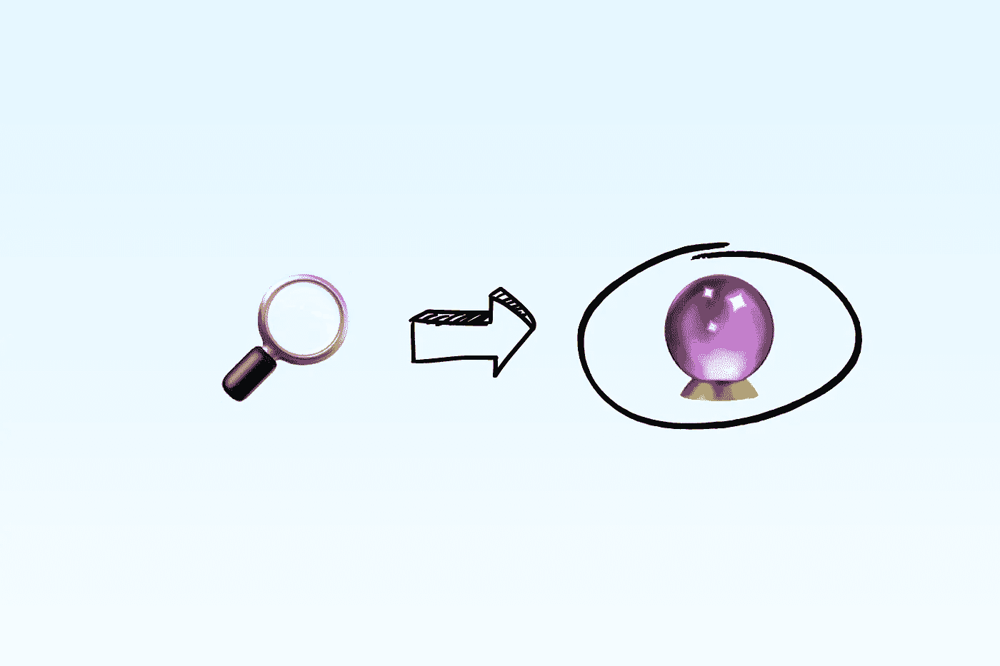

# 2023 年从数据分析师转型为数据科学家的步骤

> 原文：[`towardsdatascience.com/making-the-jump-from-data-analyst-to-data-scientist-in-2023-74e2cf7fc139?source=collection_archive---------1-----------------------#2023-01-02`](https://towardsdatascience.com/making-the-jump-from-data-analyst-to-data-scientist-in-2023-74e2cf7fc139?source=collection_archive---------1-----------------------#2023-01-02)

## 你需要的技能和资源，以便从数据分析师过渡到数据科学家职位。

 [Mary Newhauser](https://medium.com/@mary.newhauser?source=post_page-----74e2cf7fc139--------------------------------)

·

[关注](https://medium.com/m/signin?actionUrl=https%3A%2F%2Fmedium.com%2F_%2Fsubscribe%2Fuser%2F6b27bdb820b9&operation=register&redirect=https%3A%2F%2Ftowardsdatascience.com%2Fmaking-the-jump-from-data-analyst-to-data-scientist-in-2023-74e2cf7fc139&user=Mary+Newhauser&userId=6b27bdb820b9&source=post_page-6b27bdb820b9----74e2cf7fc139---------------------post_header-----------) 发表在 [Towards Data Science](https://towardsdatascience.com/?source=post_page-----74e2cf7fc139--------------------------------) ·12 min read·2023 年 1 月 2 日

--

图片由作者使用 [Canva](http://www.canva.com) 创建。

冒名顶替综合症、挫败感、怀疑。这些只是我在 2018 年尝试从数据分析师转型为数据科学家时经历的一些感受。在过去的五年里，人工智能的进步带来了如大型语言和[变换器模型](https://jalammar.github.io/illustrated-transformer/)、[扩散模型](https://www.assemblyai.com/blog/diffusion-models-for-machine-learning-introduction/)和改进的[计算机视觉模型](https://www.forbes.com/sites/sabbirrangwala/2022/10/04/advances-in-computer-vision-propel-transportation-autonomy/?sh=62e60f44147f)等改变世界的技术。虽然过去五年里用于自学数据科学的资源数量和质量激增，但从数据分析转型为数据科学角色所需的技能依然不变。

我从数据分析师转型为数据科学家的过程让人感到不堪重负。我对自己资格的理解有限，不知道自己是否申请了正确的职位，而且在数据科学领域没有一个可以咨询的人。本文包含了我在自己转型过程中学到的一切，以及我希望从一开始就知道的内容，包括如何利用现有技能、如何自学数据科学、需要掌握的基本技能，以及一系列将你转变为数据科学家的特定（免费）资源。
