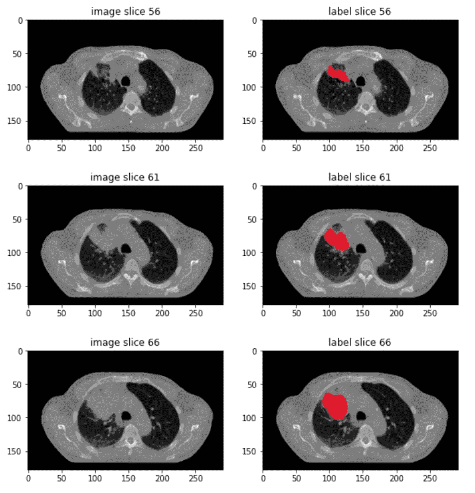

# 使用 PyTorch、ONNX 和 TensorRT 将视觉变换器预测速度提高 9 倍

> 原文：[`towardsdatascience.com/making-vision-transformers-predict-9-times-faster-with-pytorch-onnx-tensorrt-and-multi-threading-dc1f09b6814?source=collection_archive---------4-----------------------#2023-06-04`](https://towardsdatascience.com/making-vision-transformers-predict-9-times-faster-with-pytorch-onnx-tensorrt-and-multi-threading-dc1f09b6814?source=collection_archive---------4-----------------------#2023-06-04)

## 如何使用 16 位浮点数、TensorRT、网络重写和多线程来显著加速深度学习模型预测

 [Wei Yi](https://jasonweiyi.medium.com/?source=post_page-----dc1f09b6814--------------------------------)

·

[关注](https://medium.com/m/signin?actionUrl=https%3A%2F%2Fmedium.com%2F_%2Fsubscribe%2Fuser%2F1b4bd5317a6e&operation=register&redirect=https%3A%2F%2Ftowardsdatascience.com%2Fmaking-vision-transformers-predict-9-times-faster-with-pytorch-onnx-tensorrt-and-multi-threading-dc1f09b6814&user=Wei+Yi&userId=1b4bd5317a6e&source=post_page-1b4bd5317a6e----dc1f09b6814---------------------post_header-----------) 发表在 [Towards Data Science](https://towardsdatascience.com/?source=post_page-----dc1f09b6814--------------------------------) · 11 分钟阅读 · 2023 年 6 月 4 日 

--

图片来源于 [Sanjeevan SatheesKumar](https://unsplash.com/@sanjeevan_s?utm_source=medium&utm_medium=referral) 在 [Unsplash](https://unsplash.com/?utm_source=medium&utm_medium=referral)

视觉变换器如[UNET](https://en.wikipedia.org/wiki/U-Net)、[SwinUNETR](https://openaccess.thecvf.com/content/CVPR2022/html/Tang_Self-Supervised_Pre-Training_of_Swin_Transformers_for_3D_Medical_Image_Analysis_CVPR_2022_paper.html)在计算机视觉任务中，如语义分割，处于最前沿。但这样的模型进行预测需要很长时间。本文展示了如何将这种模型的预测速度提高 9 倍。这一改进为许多实时或近实时应用铺平了道路。

# 肿瘤分割任务

为了设定场景，我使用了 SwinUNETR 模型来分割肺部肿瘤，这些是单通道的灰度 3D 图像。这里是一个例子：

来自公共[NSCLC-Radiomics 数据集](https://wiki.cancerimagingarchive.net/display/Public/NSCLC-Radiomics)的图像

+   左侧列展示了来自 3D CT 扫描图像的一些 2D 切片，位于轴向平面。两个弯月形的黑色区域是肺部。

+   右侧列显示了肺部肿瘤的人工标注。

胸部 CT 扫描图像的尺寸通常为 512×512×300，大小大约为 60 到 90 兆字节…
