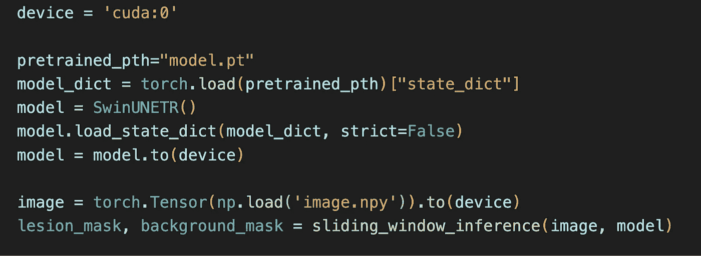

# 使用 PyTorch、ONNX 和 TensorRT 将视觉变换器的预测速度提高 9 倍

> 原文：[`towardsdatascience.com/making-vision-transformers-predict-9-times-faster-with-pytorch-onnx-tensorrt-and-multi-threading-dc1f09b6814`](https://towardsdatascience.com/making-vision-transformers-predict-9-times-faster-with-pytorch-onnx-tensorrt-and-multi-threading-dc1f09b6814)

## 如何使用 16 位浮点数、TensorRT、网络重写和多线程来显著加速深度学习模型预测

 [Wei Yi](https://jasonweiyi.medium.com/?source=post_page-----dc1f09b6814--------------------------------)

·发表于[Towards Data Science](https://towardsdatascience.com/?source=post_page-----dc1f09b6814--------------------------------) ·阅读时间 11 分钟·2023 年 6 月 4 日

--

[Sanjeevan SatheesKumar](https://unsplash.com/@sanjeevan_s?utm_source=medium&utm_medium=referral)拍摄于[Unsplash](https://unsplash.com/?utm_source=medium&utm_medium=referral)

诸如[UNET](https://en.wikipedia.org/wiki/U-Net)、[SwinUNETR](https://openaccess.thecvf.com/content/CVPR2022/html/Tang_Self-Supervised_Pre-Training_of_Swin_Transformers_for_3D_Medical_Image_Analysis_CVPR_2022_paper.html)这样的视觉变换器在计算机视觉任务中，如语义分割，都是最先进的。然而，这些模型进行预测需要大量时间。本文展示了如何将这种模型的预测速度提高 9 倍。这一改进为许多实时或接近实时的应用铺平了道路。

# 肿瘤分割任务

为了设置场景，我使用 SwinUNETR 模型从胸部 CT 扫描图像中分割肺肿瘤，这些图像是单通道灰度 3D 图像。以下是一个示例：

来自公共[NSCLC-Radiomics 数据集](https://wiki.cancerimagingarchive.net/display/Public/NSCLC-Radiomics)

+   左侧列展示了来自 3D CT 扫描图像的几幅 2D 切片，处于轴向平面。两个弯月形的黑色区域是肺部。

+   右侧列显示了肺肿瘤的手动标注。

胸部 CT 扫描通常尺寸为 512×512×300，存储在磁盘上大约需要 60 到 90 兆字节。它们不是小图像。

我使用 PyTorch 训练了一个 SwinUNETR 模型来分割肺肿瘤。经过训练的模型对胸部 CT 扫描进行预测大约需要 10 秒。因此，每张图像 10 秒是我的起点。

在我们讨论速度优化之前，先来看一下模型的输入和输出，以及它是如何进行预测的。

## 模型输入和输出形状

模型输入和输出，由作者提供

+   输入是一个表示胸部 CT 扫描的 3D numpy 数组。

+   SwinUNETR 模型无法处理整个图像，因为它太大了。一个解决方案是将图像切割成较小的块，称为感兴趣区域（ROIs）。在我的设置中，感兴趣区域的大小为 96×96×96。

+   SwinUNETR 模型一次只看到一个感兴趣区域，输出两个二值分割掩码，一个用于肿瘤类别，另一个用于背景类别。这两个掩码的大小都是感兴趣区域的大小，即 96×96×96。更准确地说，SwinUNETR 输出两个未归一化的类别概率掩码。在后续步骤中，这些未归一化的掩码通过*softmax*归一化为 0 到 1 之间的概率，然后通过*argmax*转化为二值掩码。

+   这些掩码根据对应感兴趣区域的切割方式进行合并，以生成两个全尺寸的分割掩码——肿瘤掩码和背景掩码——每个掩码的大小与整个胸部 CT 扫描相同。请注意，尽管模型返回了两个分割掩码，但我们只关注肿瘤掩码，会忽略背景掩码。

+   输入和输出数组，以及模型，使用的是 32 位浮点数。

## 滑动窗口推断

以下伪代码实现了上述预测思路。

滑动窗口推断，作者提供的图像

注意本文中的代码片段是伪代码，以保持简洁。根据相同的逻辑，像*split_image*这样的实现显而易见的方法留给读者自行实现。

+   *sliding_window_inference*方法接受完整的 CT 扫描*image*和一个 PyTorch *model*。它还接受一个*batch_size*，因为一个感兴趣区域很小，GPU 可以同时处理多个区域进行预测。*batch_size*指定了发送到 GPU 的感兴趣区域的数量。*sliding_window_inference*返回二值肿瘤分割和背景掩码。

+   该方法首先将整个图像划分为感兴趣区域，然后将这些区域分组为*batch*，每组包含*batch_size*个感兴趣区域。在这里，我假设感兴趣区域的数量可以被*batch_size*整除，以简化代码。

+   每个*batch*会被发送到*model*以生成一批预测结果。每个预测结果对应一个单独的感兴趣区域。

+   最终，所有感兴趣区域的预测结果被合并形成两个全尺寸的分割掩码。合并过程还包括*softmax*和*argmax*。

## 对图像进行预测的代码片段

以下代码片段调用了*sliding_window_inference*方法，以对加载到第一个 GPU “cuda:0” 的图像文件进行预测，图像作为 PyTorch 张量：

调用模型预测的代码片段，由作者提供

在上述设置下，我现在介绍一组策略，以加快模型预测速度。

# 策略 1：在 16 位浮点数中进行预测

默认情况下，训练好的 PyTorch 模型使用 32 位浮点数。但通常情况下，16 位浮点数精度足以提供非常相似的分割结果。使用单个 PyTorch API *half* 就可以轻松将 32 位模型转换为 16 位模型：

16 位浮点数精度的预测，作者图片

这个策略将预测时间从 10 秒减少到 **7.7 秒**。

# 策略 2：将模型转换为 TensorRT

[TensorRT](https://developer.nvidia.com/tensorrt) 是 Nvidia 提供的一款软件，旨在为深度学习模型提供快速推理。它通过将通用模型（如 PyTorch 模型或 TensorFlow 模型，能够在多种硬件上运行）转换为仅在特定硬件上运行的 TensorRT 模型来实现这一目标——即你进行模型转换的硬件。在转换过程中，TensorRT 还进行许多速度优化。

来自 TensorRT 安装的 *trtexec* 可执行文件执行转换。问题是，有时将 PyTorch 模型转换为 TensorRT 模型会失败。在 PyTorch SwinUNETR 模型上失败。特定的失败消息并不重要，你会遇到自己的错误。

重要的是要知道有一个解决方法。解决方法是首先将 PyTorch 模型转换为中间格式，[ONNX](https://onnx.ai/)，然后再将 ONNX 模型转换为 TensorRT 模型。

ONNX 是一种开源格式，用于表示机器学习模型。ONNX 定义了一组通用的操作符——机器学习和深度学习模型的构建块——以及一个通用的文件格式，使 AI 开发者能够在各种框架、工具、运行时和编译器中使用模型。

好消息是，将 ONNX 模型转换为 TensorRT 模型的支持优于将 PyTorch 模型转换为 TensorRT 模型的支持。

## 将 PyTorch 模型转换为 ONNX 模型

以下代码片段将 PyTorch 模型转换为 ONNX 模型：

将 PyTorch 模型转换为 ONNX 模型，作者提供

它首先为单个兴趣区域创建随机输入。然后使用已安装的*onnx* Python 包中的 *export* 方法来执行转换。此转换会生成一个名为 *swinunetr.onnx* 的文件。参数 *dynamic_axes* 指定 TensorRT 模型应支持输入的第 0 维的动态大小，即批量维度。

## 将 ONNX 模型转换为 TensorRT 模型

现在我们可以调用 *trtexec* 命令行工具将 ONNX 模型转换为 TensorRT 模型：

将 ONNX 模型转换为 TensorRT 模型的 trtexec 命令行，作者提供

+   *onnx=swinunetr.onnx* 命令行选项指定了 onnx 模型的位置。

+   *saveEngine=swinunetr_1_8_16.plan* 选项指定生成的 TensorRT 模型的文件名，称为计划。

+   *fp16* 选项要求转换后的模型以 16 位浮点精度运行。

+   *minShapes=modelInput:1×1×96×96×96* 指定生成的 TensorRT 模型的最小输入大小。

+   *maxshapes=modelInput:16×1×96×96×96* 指定生成的 TensorRT 模型的最大输入大小。由于在 PyTorch 转换为 ONNX 的过程中，我们只允许第 0 维，即批量维度，支持动态大小，因此在 minShapes 和 maxShapes 中，只有第一个数字可以改变。它们一起告诉 *trtexec* 工具输出一个可以用于批量大小在 1 到 16 之间的输入的模型。

+   *optShapes=modelInput:8×1×96×96×96* 指定生成的 TensorRT 模型在批量大小为 8 时运行最快。

+   *workspace=10240* 选项为 *trtexec* 提供 10G 的 GPU 内存来进行模型转换。

*trtexec* 将运行 10 到 20 分钟，并输出生成的 TensorRT 计划文件。

## 使用 TensorRT 模型进行预测

以下代码片段加载 TensorRT 模型计划文件，并使用从[stackoverflow](https://stackoverflow.com/questions/59280745/inference-with-tensorrt-engine-file-on-python)中改编的 TrtModel：

使用 TensorRT 模型进行预测，由作者提供

请注意，即使在 *trtexec* 命令行中，我们指定了 *fp16* 选项，在加载计划时，我们仍然需要指定 32 位浮点数。很奇怪。

对从 stackoverflow 获得的 TrtModel 需要进行一些小调整，但你会解决的。这并不难。

使用这个战术，预测时间为 **2.89 秒**！

# 战术 3：包装模型以返回一个掩码

我们的 SwinUNETR 模型返回两个分割掩码，一个用于肿瘤，一个用于背景，以未归一化概率的形式。这两个掩码首先从 GPU 转移到 CPU。然后在 CPU 中，这些未归一化的概率会被 *softmax* 转换为 0 和 1 之间的适当概率，最后通过 *argmax* 生成二值掩码。

由于我们只使用肿瘤掩码，因此模型无需返回背景掩码。GPU 和 CPU 之间的数据传输需要时间，而 *softmax* 等计算也需要时间。

要获得只返回单一掩码的模型，我们可以创建一个新的类来包装 SwinUNETR 模型：

SwinUNETR 包装器以返回单一掩码，由作者提供

下图展示了新的模型输入输出：

SwinWrapper 输入和输出，由作者提供

forward 方法通过神经网络的前向传递处理一批感兴趣区域以进行预测。在这个方法中：

+   原始模型首先在传入的感兴趣区域上调用，以获取两个分割类别的预测。输出形状为 Batch×2×Width×Height×Depth，因为在当前的肿瘤分割任务中，有两个类别——肿瘤和背景。结果存储在*out*变量中。

+   然后对两个未归一化的分割掩码应用*softmax*，将它们转换为介于 0 和 1 之间的归一化概率。

+   然后仅选择肿瘤类别，即类别 1，返回给调用者。

实际上，这个封装器实现了两个优化：

1.  仅返回一个分割掩码，而不是两个。

1.  将*softmax*操作从 CPU 移到 GPU 中。

那么*argmax*操作呢？由于只返回一个分割掩码，所以不需要*argmax*。相反，为了创建原始的二进制分割掩码，我们将进行*tumour_segmentation_probability ≥ 0.5*，其中*tumour_segmentation_probability*是 SwinWrapper 中的*forward*方法的结果。

由于 SwinWrapper 是一个 PyTorch 模型，我们需要再次进行 PyTorch 到 ONNX 和 ONNX 到 TensorRT 的转换步骤。

在将 SwinWapper 模型转换为 ONNX 模型时，唯一需要更改的是使用封装模型：

将封装的 SwinUNETR 模型转换为 ONNX，由作者提供

将 ONNX 模型转换为 TensorRT 计划的*trtexec*命令行保持不变，所以我不会在这里重复。

这个策略将预测时间从 2.89 秒减少到**2.42 秒**。

# 策略 4：将感兴趣区域分配到多个 GPU

以上所有策略仅使用一个 GPU，但有时我们希望使用更昂贵的多 GPU 机器以实现更快的预测。

其思路是将相同的 TensorRT 模型加载到*n*个 GPU 中，在*sliding_window_inference*中，我们进一步将一批 ROIs 分割为*n*个部分，并将每部分发送到不同的 GPU。这种方式下，SwinWrapper 网络的耗时前向传递可以并行处理不同部分。

我们需要将*sliding_window_inference*方法改为以下的*sliding_window_inference_multi_gpu*：

多 GPU 滑动窗口推断，由作者提供

+   和之前一样，我们将感兴趣区域分成不同的批次。

+   我们根据提供的 GPU 数量将每个批次拆分成多个部分。

+   对于每个部分*batch_per_gpu*，我们将任务提交到 ThreadPoolExecutor 中。该任务对传入的部分执行模型推断。

+   *submit*方法立即返回一个 future 对象，表示任务完成时的结果。*submit*方法在任务完成前立即返回是至关重要的，这样我们可以在不等待的情况下将其他任务提交到不同的线程，实现并行处理。

+   在内层*for 循环*中提交所有任务后，等待所有 future 对象完成。

+   在任务完成后，从期望中读取结果并合并结果。

要调用这个新版本的*sliding_window_inference_multi_gpu*，请使用以下代码片段：

使用多个 GPU 进行模型预测，作者

+   我使用了两个 GPU，因此我创建了两个 TensorRT 模型，每个模型分别放在不同的 GPU 上，“cuda:0”和“cuda:1”。

+   然后我创建了一个包含两个线程的 ThreadPoolExecutor。

+   我将模型和执行器传递给*sliding_window_inference_multi_gpu*方法，类似于单 GPU 的情况，以获得肿瘤类别分割掩码。

这个策略将预测时间从 2.42 秒减少到**1.38 秒**！

现在我们有四种策略，将 SwinUNETR 模型的预测速度提高了 9 倍。还不错。但我们是否为了速度牺牲了预测精度？

# 我们是否为了速度牺牲了预测精度？

在这里“精度”一词指的是最终模型对肿瘤的分割效果，而不是浮点预测精度，例如 16 位、32 位精度。

为了回答这个问题，我们需要查看 DICE 指标，这个指标用于衡量分割模型的性能。

DICE 分数是通过预测的肿瘤与实际肿瘤重叠的比例来计算的。DICE 分数介于 0 和 1 之间；分数越高，模型预测越好：

+   DICE 1 表示完美预测，

+   DICE 0 表示完全错误的预测，或者根本没有预测。

让我们看看测试图像的 DICE 分数：

不同策略下的 Dice 分数，作者

我们可以看到，只有当我们在策略 1 中将 32 位 PyTorch 模型转换为 16 位模型时，DICE 分数从 0.93 略微下降到 0.91。其他策略不会降低 DICE 分数。这表明这些策略可以在仅有微小精度损失的情况下实现更快的预测速度。

# 结论

本文介绍了四种策略，通过使用 ONNX、TensorRT 和多线程等工具，使视觉变换器预测速度大大提升。

# 致谢

我要感谢我的朋友 Chunyu Jin。他向我展示了快速深度学习模型推断的可能性。他为我制作了第一个运行的 TensorRT SwinUNETR 模型，并建议了我在这里尝试的许多策略。

 [## 通过我的推荐链接加入 Medium - Wei Yi

### 阅读 Wei Yi（以及 Medium 上的成千上万其他作者）的每一个故事。如果你喜欢我的故事，请考虑…

medium.com](https://medium.com/@jasonweiyi/membership?source=post_page-----dc1f09b6814--------------------------------)
