# 使用 ipywidgets 让你的数据分析变得生动

> 原文：[`towardsdatascience.com/making-your-data-analytics-come-to-life-using-ipywidgets-cfa9538279f7`](https://towardsdatascience.com/making-your-data-analytics-come-to-life-using-ipywidgets-cfa9538279f7)

## 了解如何使用小部件动态更新数据分析

[](https://weimenglee.medium.com/?source=post_page-----cfa9538279f7--------------------------------)[](https://towardsdatascience.com/?source=post_page-----cfa9538279f7--------------------------------) [Wei-Meng Lee](https://weimenglee.medium.com/?source=post_page-----cfa9538279f7--------------------------------)

·发表于[Towards Data Science](https://towardsdatascience.com/?source=post_page-----cfa9538279f7--------------------------------) ·8 分钟阅读·2023 年 2 月 21 日

--


图片由[John Schnobrich](https://unsplash.com/@johnschno?utm_source=medium&utm_medium=referral)拍摄，来源于[Unsplash](https://unsplash.com/?utm_source=medium&utm_medium=referral)。

对于我日常的数据分析任务，我最喜欢的开发环境绝对是 Jupyter Notebook。Jupyter Notebook 允许我快速修改代码并重新运行单元格以查看更新。然而，这一功能对使用我的 Jupyter Notebook 查看数据分析结果的用户并不友好。如果用户可以在不修改代码的情况下与我的程序进行交互，那将非常有用。这就是**ipywidgets**包发挥作用的地方。

**ipywidgets**是一个包含 Jupyter Notebook 交互式 HTML 小部件的包。通过使用 ipywidgets 中的小部件，你的 Jupyter 笔记本将变得生动，用户可以直接控制他们的数据并可视化数据的变化。在本文中，我将带你深入了解如何将 ipywidgets 与数据集一起使用。

# 安装 ipywidgets

在你的 Jupyter 笔记本中，按如下方式安装**ipywidgets**和**widgetsnbextension**包：

```py
!pip install ipywidgets widgetsnbextension
```

然后，如下启用**widgetsnbextension**：

```py
!jupyter nbextension enable --py widgetsnbextension --sys-prefix
```

# 使用`interact`函数

对于我们的示例，我将使用位于[`www.kaggle.com/datasets/teertha/ushealthinsurancedataset?resource=download.`](https://www.kaggle.com/datasets/teertha/ushealthinsurancedataset?resource=download.)的**保险**数据集。

> ***许可证***:* [*CC0: 公共领域*](https://creativecommons.org/publicdomain/zero/1.0/)*.* ***描述*** *— 该数据集包含 1338 行被保险数据，其中保险费用是针对被保险人的以下属性给出的：年龄、性别、BMI、子女数量、是否吸烟和区域。这些属性包括数字变量和分类变量。*

让我们首先将 CSV 文件加载到 Pandas DataFrame 中：

```py
import pandas as pd

df = pd.read_csv('insurance.csv')
df
```

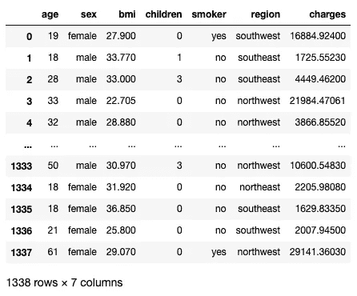

所有图片由作者提供

## 滑块控件

假设我想检索所有包含 3 个子项的行。我可以这样做：

```py
df.query(f'children == 3')
```

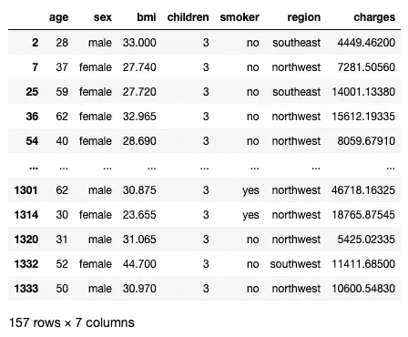

如果我想检索具有 4 个子项的行，那么我必须修改我的语句并重新运行单元格。显然，这不是很高效。

这时，`ipywidgets`包中的`interact`函数就非常有用了：

```py
from ipywidgets import interact

def f(children):
    display(df.query(f'children == {children}'))
```

在上述代码片段中，我定义了一个名为`f`的函数，该函数接受一个参数——`children`。该函数将查询数据框并显示结果。接下来的语句就是魔法发生的地方：

```py
interact(f, children = 5) 
```

`interact()`函数（`ipywidgets.interact`）会自动创建用户界面（UI）控件（称为*小部件*），并将它们绑定到你指定的函数上。上述语句将生成一个包含**IntSlider**控件以及数据框的输出：

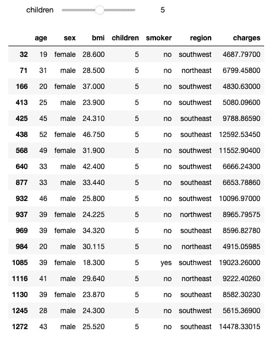

> 你传入`children`参数的值将决定生成什么类型的用户界面控件。在这里，你传入了一个整数，因此生成了一个滑块控件。如果你传入`n`，它将生成一个取值范围为[-n,+3*n]的整数值滑块控件。

去拖动滑块吧。当你拖动时，数据框将动态更新。

我们可以对**年龄**字段做同样的操作，但这次我们要设置可选择的年龄范围：

```py
def f(age):
    display(df.query(f'age > {age}'))

interact(f, age = (df['age'].min(), df['age'].max()))
```

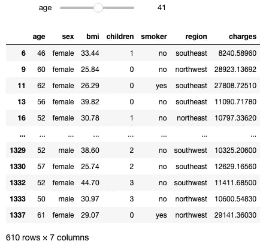

最小年龄为 18 岁，最大年龄为 64 岁。当前滑块的值将显示在中间位置——41（即(18+64)/2）。

如果你传入一个浮点数，比如 BMI：

```py
def f(bmi):
    display(df.query(f'bmi > {bmi}'))

interact(f, bmi = (df['bmi'].min(), df['bmi'].max()))
```

然后会显示一个**FloatSlider**控件：

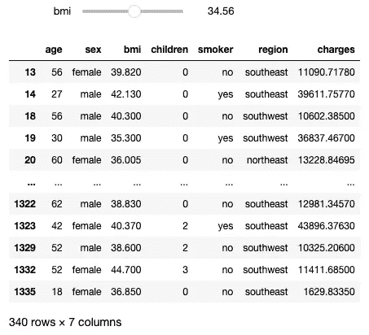

## 下拉控件

那么选择区域呢？我们可以将区域作为列表传入：

```py
def f(region):
    display(df.query(f'region == "{region}"'))    

interact(f, region = df['region'].unique())
```

现在你可以使用下拉控制选择四个区域中的一个：

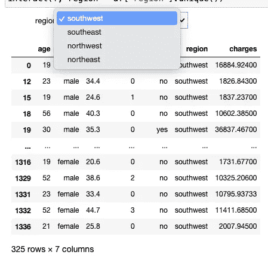

如果我想选择*所有*区域呢？为此，你需要发挥创造力。首先，我会创建一个包含四个区域的元组列表：

```py
regions = [(i.capitalize(),i) for i in df['region'].unique()]
```

上面的代码片段生成了以下列表：

```py
[('Southwest', 'southwest'), ('Southeast', 'southeast'), ('Northwest', 'northwest'), ('Northeast', 'northeast')]
```

> 每个元组中的第一个元素是显示给用户的内容。第二个元素是所选项的值。

然后，将一个元组—`(‘All Regions’,’@*’)`，添加到列表中：

```py
regions.append(('All Regions','@*'))
```

现在`regions`变量看起来是这样的：

```py
[('Southwest', 'southwest'),
 ('Southeast', 'southeast'),
 ('Northwest', 'northwest'),
 ('Northeast', 'northeast'),
 ('All Regions', '@*')]
```

现在你可以将`regions`变量传递给`interact()`函数：

```py
def f(region):
    display(df.query(f'region.str.contains("{region}")'))    

interact(f, region = regions)
```

请注意，我需要更改查询语句以使用 `contains()` 函数。你现在可以选择**所有区域**项，以从所有区域中选择行：

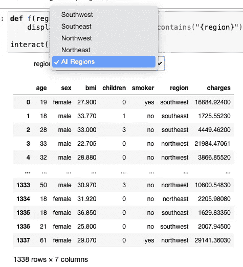

## 复选框小部件

当你向 `interact()` 函数传入布尔值时，它会显示一个 `CheckBox` 小部件。考虑以下示例：

```py
YES, NO = 'yes', 'no'

def f(smoker):
    display(df.query(f'smoker == "{YES if smoker == True else NO}"'))    

interact(f, smoker = True)
```

上面的代码片段显示了一个复选框。取消选中它，所有非吸烟者将会显示出来：

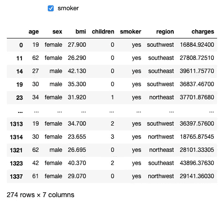

## 文本小部件

假设你希望用户在区域中输入而不是从下拉控制中选择。很简单，只需将字符串传递给 `interact()` 函数，如下所示：

```py
def f(region):
    display(df.query(f'region.str.contains("{region}")'))   

interact(f, region = "")
```

现在你将看到一个文本框，你可以在其中输入区域：

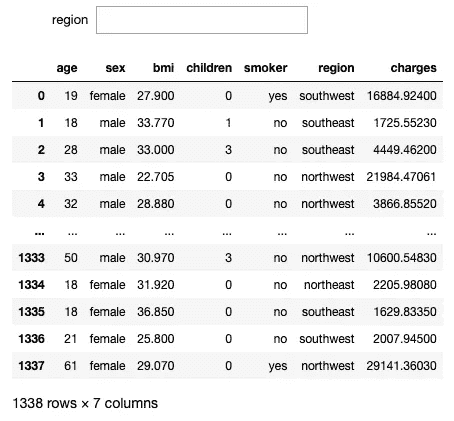

有一个问题。观察到当你输入时，数据框会自动更新。这个功能被称为**连续更新**。对于大型数据框，这将是一个问题，因为每次你更改文本框的内容时，它都会重新查询数据框，这可能会耗费时间。

你可以通过显式指定 `Text` 小部件（控制）然后将 `continuous_update` 参数设置为 `False` 来禁用连续更新：

```py
from ipywidgets import widgets

def f(region):
    display(df.query(f'region.str.contains("{region}")'))

interact(f, region = widgets.Text('', continuous_update = False));
```

数据框现在会在你输入查询并按下 Return/Enter 键后更新：

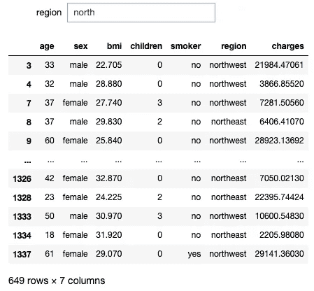

## 单选按钮小部件

单选按钮是另一种让用户从预定的值列表中进行选择的方式。对于我们的数据集，你可以使用它来让用户在吸烟者和非吸烟者之间进行选择：

```py
def f(smoker):
    display(df.query(f'smoker == "{smoker}"'))    

interact(f, smoker = widgets.RadioButtons(options=["yes", "no"], value="no"));
```

> 对于单选按钮，你需要手动指定 `widgets.RadioButtons()` 类。

上面的代码片段显示了一组单选按钮，用于选择吸烟者和非吸烟者：

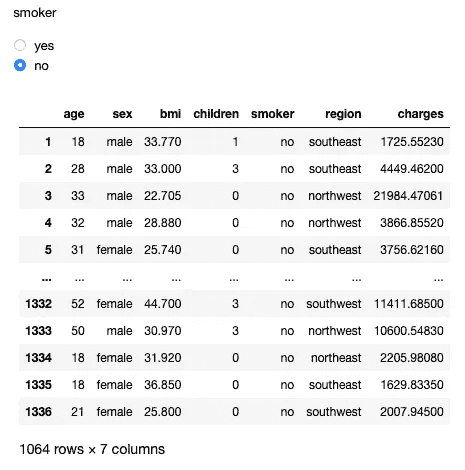

# 使用 Interactive 函数

到目前为止，一切顺利。你已经能够创建和使用各个小部件来过滤数据框中的不同字段。但是如果你想将它们全部组合成一个大过滤器怎么办？这时 `interactive()` 函数就派上用场了。

`interactive()` 函数类似于 `interact()` 函数，但它允许你传入多个值以创建多个小部件。以下 `f()` 函数接收六个参数，这些参数通过 `interactive()` 函数传入：

```py
from ipywidgets import interactive
import ipywidgets as widgets

report_output = widgets.Output()
display(report_output)

def f(age, bmi, children, region, sex, smoker):
    filtered = df.query(f'age >= {age} and bmi >= {bmi} and smoker == "{smoker}" and region.str.contains("{region}") and sex=="{sex}" and children=={children}')
    with report_output:
        report_output.clear_output()
        display(filtered)

regions = [(i.capitalize(),i) for i in df['region'].unique()]
regions.append(('All Regions','@*'))

interactive(f, 
            age = (df['age'].min(), df['age'].max()), 
            bmi = (df['bmi'].min(), df['bmi'].max()), 
            children = (df['children'].min(), df['children'].max()),
            region = regions,           
            sex = widgets.RadioButtons(options=["female", "male"], value="female"),
            smoker = widgets.RadioButtons(options=["yes", "no"], value="no"),             
           )
```

在运行代码片段的地方，你将看到以下内容：


当你与小部件互动时，数据框会自动更新。如果你有一个大型数据框，你可能会发现每次控制中的值发生变化时更新数据框是比较麻烦的（你的屏幕会因为这些小变化而刷新），因此，最好避免在用户希望查看更新的数据框之前刷新数据框。为此，将第二个参数 (`{‘manual’: True}`) 插入到 `interactive()` 函数中：

```py
interactive(f, 
            {'manual': True},
            age = (df['age'].min(), df['age'].max()), 
            bmi = (df['bmi'].min(), df['bmi'].max()), 
            children = (df['children'].min(), df['children'].max()),
            region = regions,           
            sex = widgets.RadioButtons(options=["female", "male"], value="female"),
            smoker = widgets.RadioButtons(options=["yes", "no"], value="no"),             
           )
```

现在将出现一个标有**运行互动**的按钮。你可以在小部件中更改值，当你准备好查看更改时，点击**运行互动**按钮，数据框将会更新。

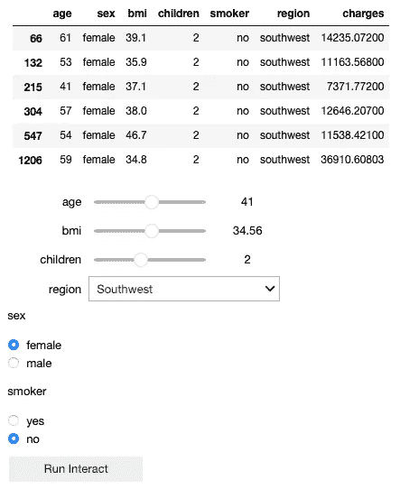

**如果你喜欢阅读我的文章并且这些文章对你的职业/学习有帮助，请考虑注册成为 Medium 会员。每月$5，它可以让你无限访问 Medium 上的所有文章（包括我的）。如果你通过以下链接注册，我将获得少量佣金（对你没有额外费用）。你的支持意味着我将能够投入更多时间撰写类似的文章。**

[## 通过我的推荐链接加入 Medium - Wei-Meng Lee](https://weimenglee.medium.com/membership?source=post_page-----cfa9538279f7--------------------------------)

### 阅读 Wei-Meng Lee 的每一个故事（以及 Medium 上的其他数千名作者的故事）。你的会员费直接支持…

[weimenglee.medium.com](https://weimenglee.medium.com/membership?source=post_page-----cfa9538279f7--------------------------------)

# 总结

本文简要介绍了使用`interact()`和`interactive()`函数生成小部件并绑定到函数的过程。以下是根据你提供的数据类型创建的小部件类型的快速总结：

+   **IntSlider**或**FloatSlider** — 当你传入一个数字值或一对数字值的元组时

+   **下拉菜单** — 当你传入一个值的列表（或元组的列表）时

+   **文本** — 当你传入一个字符串值时

+   **复选框** — 当你传入一个布尔值（`True`或`False`）时

还有其他类型的小部件需要你在`interact()`和`interactive()`函数中手动指定，例如**单选按钮**及其他很多。在我的下一篇文章中，我将详细讲述在这篇文章中没有机会讨论的其他小部件。在此之前，祝你玩得开心！
