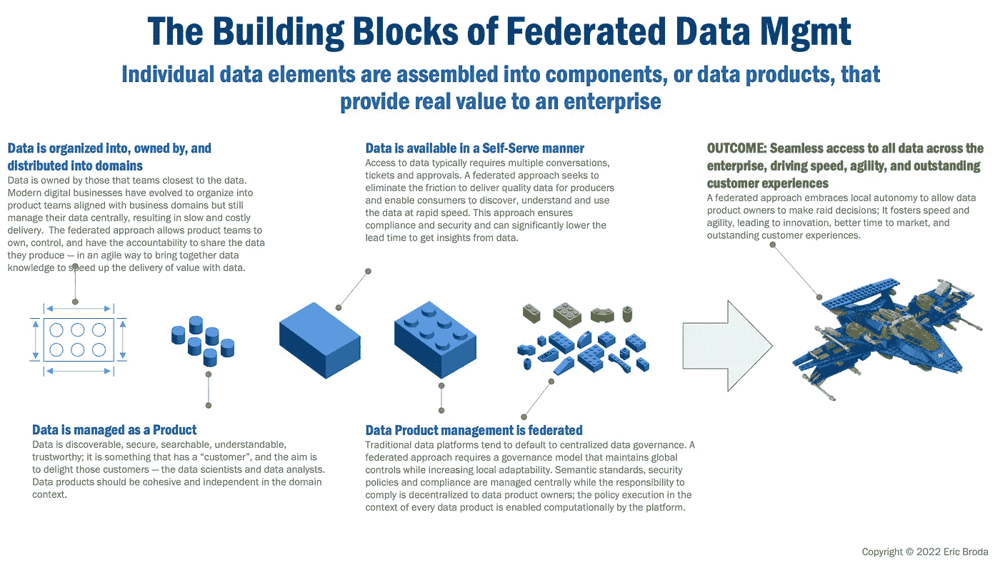
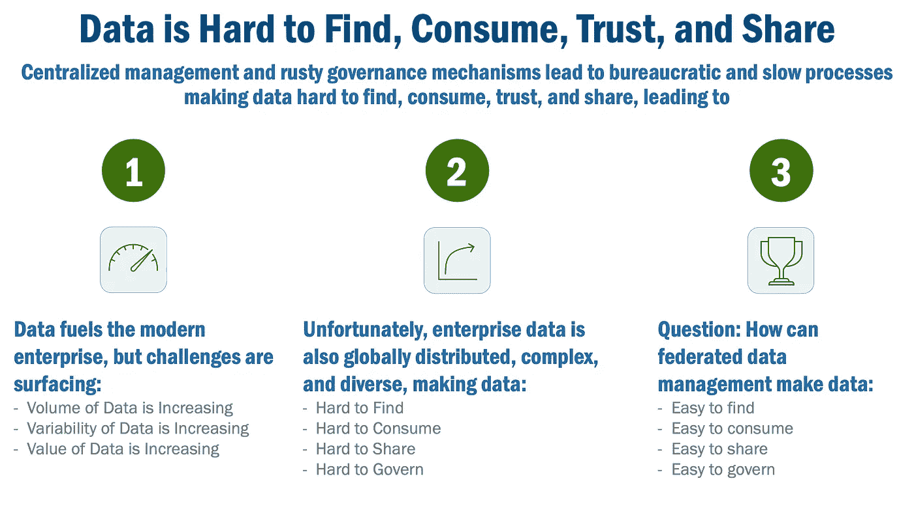
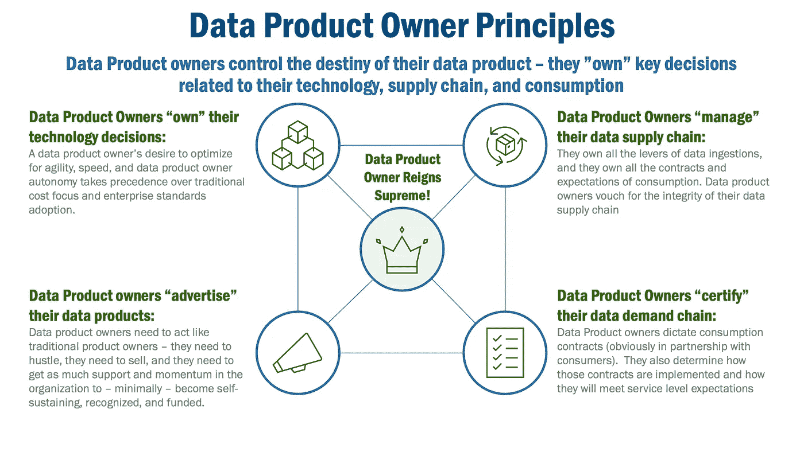
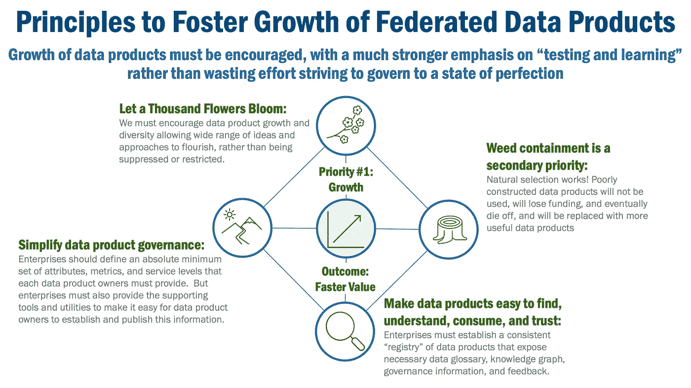

# 管理一个联邦数据产品生态系统

> 原文：[`towardsdatascience.com/managing-a-federated-data-product-ecosystem-3c6bff94c728`](https://towardsdatascience.com/managing-a-federated-data-product-ecosystem-3c6bff94c728)

## 随着数据网格的成熟，企业在管理不断增长的联邦数据产品生态系统时遇到了困难。如何管理这个快速发展的生态系统？

 [Eric Broda](https://medium.com/@ericbroda?source=post_page-----3c6bff94c728--------------------------------)

·发布于 [Towards Data Science](https://towardsdatascience.com/?source=post_page-----3c6bff94c728--------------------------------) ·阅读时间 9 分钟·2023 年 1 月 11 日

--

图片由 [L B](https://unsplash.com/@iliketobike?utm_source=unsplash&utm_medium=referral&utm_content=creditCopyText) 提供，[Unsplash](https://unsplash.com/photos/mluSdDeOksc?utm_source=unsplash&utm_medium=referral&utm_content=creditCopyText)

# 企业数据管理未兑现的承诺

我们都知道数据的体量、种类和复杂性正在指数增长。然而，我们当前的方式——集中式数据管理——正在失败。企业被提供了更大控制的幻想，但却看到缓慢、缺乏灵活性和官僚化的过程，这些过程阻碍了创新。

因此，企业在不同的数据管理方法中进行实验也就不足为奇了。数据网格就是这些“实验”之一。早期迹象表明，情况在向好的方向发展。

但数据网格仍在发展和成熟中。数据联邦——数据网格所基于的——在其路径上仍然存在一些障碍。

本文描述了数据网格如何拥抱数据的联邦——以及数据管理的联邦——以显著提高速度、促进敏捷性并实现本地自治。但成功的障碍以及如何克服这些障碍也将被讨论。在这方面，将讨论几个主题，包括：

+   数据网格作为联邦数据和联邦数据管理的关键推动者

+   扩展数据网格的潜在挑战

+   在数据网格中联邦数据的新原则

+   使用数据网格扩展数据联邦的新原则

# 数据网格的承诺

数据网格是一种相对较新的方法，提供了一组新的数据管理原则。简单来说，这些原则将数据视为具有明确所有权和责任的一级产品，支持自助服务平台和联邦治理。关于这方面的资料已经有很多[这里](https://www.amazon.com/Data-Mesh-Delivering-Data-Driven-Value/dp/1492092398/)、这里和这里讨论过，所以我不会专门深入探讨数据网格。

我建议还有一些更为根本的关于数据网格的内容值得讨论。简单来说，数据网格的承诺在于它实现了数据和数据管理的联邦化，促进了地方自治，从而推动了在今天快速变化市场中所需的速度、灵活性和创新。

# 联邦数据的演变概念

但我们从头开始：什么是“联邦数据”和“联邦数据管理”？是什么让它变得更好？

让我们从基础开始：数据是现代企业的“乐高积木”。就像一个单独的乐高积木，单个数据元素的价值有限。但当它们结合在一起时，积木可以组装成更大的组件，称为“数据产品”。

*图 1，数据网格——企业数据的乐高积木*

数据产品结合了数据网格的原则，包括明确的边界、授权的所有者、自助服务功能，从而实现了企业内部数据产品的“联邦化”。数据产品分布在整个企业中，没有中央流程或团队将它们绑定在一起。

# 大规模联邦数据的观察

今天，许多企业在充满活力但规模较小的生态系统中运行多个数据产品。但随着这些生态系统的发展，我们发现数据产品变成了：

+   **难以找到**，因为没有一个“注册表”作为数据产品的可搜索目录；而且一旦找到，它们的文档很少或不一致，使得数据产品难以理解，尤其是当它们的使用超出原始创建者组时。

+   **难以访问和获取**，因为获取数据访问权限的方法简单或一致的方式非常少；有一种名称解析服务将数据产品标识转换为端点，就像互联网的 DNS 一样；而且一旦获得访问权限，数据产品很难使用，因为访问各种数据产品的一致机制非常少。

+   **难以操作、观察和安全**，因为每个数据产品有不同的安全需求，甚至有更为多样化的实现。观察性工具不一致，安全需求的多样化导致复杂性过高，操作性推迟到生产问题需要解决时才会考虑。

+   **难以信任**，因为数据的来源、其转换过程以及数据供应链中不可避免的错误会使人怀疑数据产品的质量和可靠性；对于需要深入了解数据的受监管行业而言，数据产品不幸的是难以管理，因为数据产品提供的统计数据和指标不一致，导致手动处理增加。

*图 2，数据难以找到、消费、信任和共享*

这些问题是所谓的“规模问题”的症状。成功——在这种情况下，即组织中涌现出的大量数据产品——显然有一些负面影响。但是，我们如何驯服联邦的混乱演变，克服这些规模问题呢？

根据我在发展大型数据生态系统方面的经验，我认为出现了一套新的原则，这将使联邦数据管理能够以实际和高效的方式扩展。这些原则分为两个类别：一组适用于数据产品及其负责人，另一组则促进快速增长。

# 联邦数据产品的实用原则

联邦数据产品依赖于许多因素：愿景的清晰性、实际权衡的考量以及对实施卓越的持续关注。但增长你的联邦数据产品生态系统的关键成功因素是实践性地实施和制度化一个单一的概念：**数据产品负责人至高无上**。

那么，实际上，这意味着什么？我想这意味着字面上的意思：数据产品负责人对其数据产品的所有元素拥有最终决策权——以及否决权。是的，所有决定。并且，他们需要在良好的企业行为的正常范围内工作——他们必须遵守高级管理政策、监管限制，在某些情况下，还要承担盈亏责任。但他们有权**决定**如何实施这些政策，如何适应监管限制，如何达到他们的收入（或成本）目标。他们**决定**！

所以，毫无疑问，在数据产品负责人被赋权并拥有真正的决策权的地方，你会发现一个成功的数据产品生态系统以及不断增长的数据产品集合。

*图 3，数据产品负责人原则*

所以，为了实现“数据产品负责人至高无上”，我提供以下新的数据产品负责人原则：

1.  **数据产品负责人“拥有”他们的技术决策**；数据产品负责人可以使用他们认为最有效的任何技术——即使这些技术与当前的企业标准相悖——来构建他们的数据产品。例如，数据产品负责人的目标是优先考虑灵活性、速度和数据产品负责人的自主权，这些优先于传统的成本关注和企业标准采纳。现在，要明确的是，他们显然应优先考虑现有企业标准产品，但他们并不依赖于这些标准。是的，他们可能需要承担引入新技术所需的额外开销。但他们自己做决定。

1.  **数据产品负责人“管理”他们的数据供应链**：数据产品负责人保证他们的数据供应链的完整性。他们掌握数据摄取的所有杠杆：数据产品团队，而非中央管道团队，负责他们的数据摄取管道的规格；数据产品负责人还具备设计和构建摄取管道的技能。从实际角度来看，数据产品负责人推动管理实践、工具和仪器的投资，以主动识别、诊断数据供应链中的质量、稳定性或可用性问题。

1.  **数据产品负责人“认证”他们的数据需求链**：数据产品负责人证明——或认证——数据的安全性、可信度、质量以及对服务水平的遵守。数据产品负责人制定消费合同（显然是与消费者合作）。他们还决定这些合同如何实施，以及如何满足服务水平期望。他们还主动衡量并公开报告质量指标，以确保数据期望得到满足。

1.  **数据产品负责人“销售”他们的数据产品**：数据产品，像企业提供给消费者的其他产品一样，拥有生命周期。虽然生命周期类似，但在企业中的重点几乎总是截然不同。虽然传统产品的负责人（即向消费者提供并由消费者支付的产品）预计要达到收入和成本目标，但内部产品几乎从不如此。同样，数据产品负责人需要像传统产品负责人一样行动——他们需要积极推进，他们需要销售，他们需要获得尽可能多的组织支持和动力，以便——至少——成为自给自足、被认可并获得资助。

# **促进联合数据产品成长的实用原则**

尽管拥有了授权的负责人，但事情仍然可能偏离轨道。发生问题时，会发现理解上的差距以及限制数据产品生态系统成长的不必要约束。

因此，让我提供一些对我来说效果良好的原则。对一些人来说，这些原则可能显得相悖，对另一些人来说可能不切实际，对其他人来说可能与企业指令不一致。但它们有效！

这些原则优先考虑灵活性和速度，而不是成本控制。它们选择测试和学习而非追求完美。它们提供创新和加速市场时间，而不是不必要的一致性。

*图 4，促进联邦数据产品增长的原则*

所以，这些就是新的原则，以及它们如何促进联邦数据产品的增长。

1.  **“让百花齐放”**：我们必须鼓励数据产品的增长和多样性，允许各种想法和方法繁荣，而不是被压制或限制。为了让“百花齐放”变得更容易，企业应该使创建安全、可靠、可观察和可操作的数据产品变得简单。企业应该强烈倡导一种“测试和学习”的方法，容忍实验。

1.  **“杂草控制是次要优先事项”**。继续我们的类比……在一片花海中，难免会有杂草。修剪杂草比为花朵提供食物和光照（是的，这个类比有些牵强）要不那么重要。关键是培养最有前景和最有价值的数据产品，同时允许自然选择过程的发生——并让学习哪些有效、哪些无效的过程得以进行。是的，构造不良的数据产品不会被使用，会失去资金，并最终应该被淘汰。但更重要的是，有价值的数据产品将取而代之，并希望能够蓬勃发展。

1.  **让数据产品易于查找、理解、使用和信任**：企业必须建立一个一致的数据产品“注册表”，其中展示必要的数据词汇表、知识图谱、治理信息和反馈。然而，企业还必须确保数据生产者能够轻松创建、认证和管理注册表中的数据产品。为了使数据值得信赖，数据产品的消费者（和生产者）必须能够向数据产品所有者提供反馈。用现代的说法，他们应该能够“点赞”、“投票”或“收藏”数据产品。这个“众包”模式在软件（GitHub “stars”）和社交媒体（Facebook “likes”）中效果极佳，为数据产品所有者提供了宏观的数据产品质量和可信度视图，同时为数据产品所有者提供了宝贵的信息。不言而喻，“企业”的角色是提供工具和设施，使反馈提供变得简单。

1.  **简化和优化数据产品治理**：企业应定义每个数据产品所有者必须提供的绝对最小属性、指标和服务水平。但企业还必须提供支持工具和设施，以便数据产品所有者能够轻松建立和发布这些信息。

# 结论

本文描述了数据网格如何拥抱数据联邦——以及数据管理——以显著提高速度，促进敏捷性，并实现地方自主。我们展示了数据网格作为数据联邦和数据管理的关键推动因素，并指出了在扩展数据网格时的潜在挑战。但我们也提出了在数据网格中联邦数据的新原则，同时提供了与数据网格一起扩展数据联邦的新原则。

正因如此，我希望不仅能够助力于您的企业数据网格之旅，更重要的是，加速其成长！

***

*除非另有说明，本文档中的所有图片均由 Eric Broda（本文作者）创建。所有图片中使用的图标均为库存 PowerPoint 图标和/或不受版权保护。*

*本文中表达的观点仅代表我个人，不一定反映我的客户的观点。*
