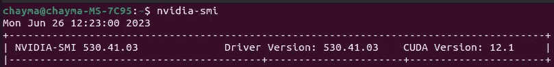
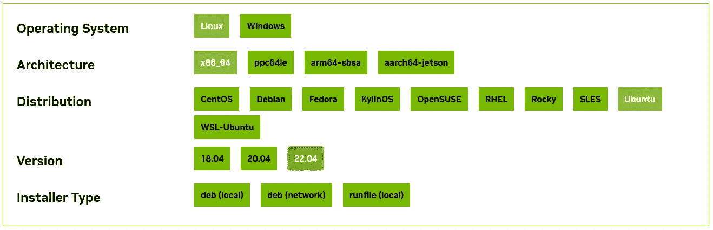

# 在单台机器上管理多个 CUDA 版本：全面指南

> 原文：[`towardsdatascience.com/managing-multiple-cuda-versions-on-a-single-machine-a-comprehensive-guide-97db1b22acdc`](https://towardsdatascience.com/managing-multiple-cuda-versions-on-a-single-machine-a-comprehensive-guide-97db1b22acdc)

## 如何在开发环境中处理不同的 CUDA 版本

[](https://medium.com/@chimso1994?source=post_page-----97db1b22acdc--------------------------------)[](https://towardsdatascience.com/?source=post_page-----97db1b22acdc--------------------------------) [Chayma Zatout](https://medium.com/@chimso1994?source=post_page-----97db1b22acdc--------------------------------)

· 发表在[Towards Data Science](https://towardsdatascience.com/?source=post_page-----97db1b22acdc--------------------------------) ·阅读时间 6 分钟·2023 年 10 月 27 日

--


照片由[Nikola Majksner](https://unsplash.com/@majksner?utm_source=medium&utm_medium=referral)提供，发布在[Unsplash](https://unsplash.com/?utm_source=medium&utm_medium=referral)

在我以前的 AI 顾问角色中，我负责利用虚拟环境作为管理和隔离 Python 环境的工具。鉴于该项目依赖 GPU 加速，我遇到了已安装的 CUDA 版本与项目所需版本不匹配的情况。为了解决这个问题，我不得不安装必要的 CUDA 版本并配置我的环境以使用它，而不影响系统的 CUDA 设置。据我所知，针对这种特定需求的全面教程非常稀缺。因此，本教程为那些寻求了解如何在项目中安全管理多个 CUDA 工具包版本的人提供了宝贵的资源。

***目录：***

· 1\. 介绍

· 2\. CUDA 可用版本

· 3\. 下载和提取二进制文件

· 4\. 安装 CUDA 工具包

· 5\. 项目设置

· 6\. 结论

# 1\. 介绍

在系统上安装多个版本的 CUDA 工具包可能会产生多种影响和后果，其中一些可能会影响你的系统：

+   这可能会导致系统`PATH`和环境变量中的冲突。如果管理不当，这些冲突可能会影响默认使用的 CUDA 版本。

+   这可能需要特定的 GPU 驱动程序版本以实现最佳性能和兼容性。安装新版本可能需要更新你的 GPU 驱动程序。

+   一些库和软件可能依赖于特定的 CUDA 版本。安装新版本可能会破坏与这些依赖项的兼容性。

+   依赖于 CUDA 的应用程序可能需要进行调整，以便与新版本兼容。不兼容可能会导致错误或意外行为。

+   不正确地管理多个 CUDA 版本可能导致系统不稳定或 GPU 加速应用程序出现错误。

因此，为了安全地管理项目的多个 CUDA Toolkit 版本，请按照以下步骤操作：

1.  检查系统当前的 CUDA 版本。

1.  下载并解压所需版本的二进制文件。

1.  执行安装程序，仅安装工具包。

在本教程中，我将提供一个详细的逐步示例，说明如何完成此操作。此外，我将指导您在成功安装二进制文件后设置虚拟环境。

# 2\. 可用的 CUDA 版本

通过运行命令 `nvidia-smi` 来查看系统当前使用的 CUDA 版本：



如您所见，CUDA 版本为 12.1。

现在让我们显示我机器上可用的 CUDA 版本：

```py
$ ls /usr/local/ | grep cuda
cuda
cuda-11.7
cuda-12
cuda-12.1
```

我的机器上有三个不同的版本。

# 3\. 下载并解压二进制文件

假设我将要处理的项目需要 CUDA Toolkit 版本 11.8。要获取它，我们首先访问 NVIDIA CUDA Toolkit Archive 网站：[这里](https://developer.nvidia.com/cuda-toolkit-archive)。我们找到项目所需的特定版本的 CUDA Toolkit。重要的是确保我们选择与操作系统兼容的版本。在我的例子中，我选择了目标平台：



我的目标平台：Linux — x86_64 — Ubuntu — 22.04

选择与您的操作系统对应的 CUDA Toolkit 的`runfile (local)`版本。此文件通常带有 `.run` 扩展名。选择 `runfile (local)` 时，网站会提供安装说明。在我的情况下，提供的说明如下：

```py
wget https://developer.download.nvidia.com/compute/cuda/11.8.0/local_installers/cuda_11.8.0_520.61.05_linux.run
sudo sh cuda_11.8.0_520.61.05_linux.run
```

然而，必须牢记，我们的目标不是安装此版本，因为已经有一个更新版本。因此，我们只需按照第一条说明下载文件：

```py
wget https://developer.download.nvidia.com/compute/cuda/11.8.0/local_installers/cuda_11.8.0_520.61.05_linux.run
```

可以通过将 MD5 校验和与下载文件的校验和进行比较来验证下载。请访问 [此链接](https://developer.download.nvidia.com/compute/cuda/12.3.0/docs/sidebar/md5sum.txt) 进行验证。

> “本地安装程序是自包含的。它是一个大型文件，只需从互联网下载一次即可，在多个系统上安装。本地安装程序是推荐的安装类型，适用于带宽较低的互联网连接，或者在无法使用网络安装程序的情况下（例如由于防火墙限制）。” [1]

此时，打开终端，进入您传输 CUDA runfile 的目录，并使 CUDA runfile 可执行：

```py
chmod +x cuda_11.8.0_520.61.05_linux.run
```

# 4\. 安装 CUDA 工具包

现在，我们使用`--silent`和`--toolkit`标志运行 CUDA runfile，以进行 CUDA Toolkit 的静默安装：

```py
sudo ./cuda_11.8.0_520.61.05_linux.run --silent --toolkit
```

其中：

+   `--silent` : 进行无进一步用户输入和最小命令行输出的安装。

+   `--toolkit` : 仅安装 CUDA Toolkit 并保留当前驱动程序。

如果系统要求你接受协议，请接受以继续安装。

到此为止，CUDA 工具包二进制文件已被提取。我们可以通过再次运行以下命令来确认：

```py
$ ls /usr/local/ | grep cuda
cuda
cuda-11.7
cuda-11.8
cuda-12
cuda-12.1
```

如你所见，`cuda-11.8` 现在在我的机器上可用，系统当前版本保持不变（你可以通过运行`nvidia-smi`确认）。

这些步骤允许你安装 CUDA 版本的二进制文件。在下一节中，我将展示如何设置项目以使用所需的 CUDA 版本。

# 5\. 项目设置

在处理多个项目时，建议使用虚拟环境。我们从创建一个虚拟环境开始。在我的情况下，需要`python3.8`。要创建虚拟环境，我们可以使用以下命令。我在`venv`文件夹中创建了一个名为`my_venv`的环境，这是我放置虚拟环境的文件夹：

```py
python3.8 -m venv venv/my_env
source venv/my_env/bin/activate
```

让我们看看当前使用的 CUDA 版本：

```py
$ nvcc --version
nvcc: NVIDIA (R) Cuda compiler driver
Copyright (c) 2005-2021 NVIDIA Corporation
Built on Thu_Nov_18_09:45:30_PST_2021
Cuda compilation tools, release 11.5, V11.5.119
Build cuda_11.5.r11.5/compiler.30672275_0
```

如你所见，创建的环境没有使用所需的 CUDA 版本，因此我们需要通过更新 activate 文件并添加以下行来手动设置：

```py
export PATH=/usr/local/cuda-11.8/bin:$PATH
export LD_LIBRARY_PATH=/usr/local/cuda-11.8/lib64:$LD_LIBRARY_PATH
```

你可以使用你喜欢的编辑器更新 activate 文件，或者你可以简单地运行以下命令将文本追加到文件末尾：

```py
echo "export PATH=/usr/local/cuda-11.8/bin:$PATH" >> venv/my_env/bin/activate
echo "LD_LIBRARY_PATH=/usr/local/cuda-11.8/lib64:$LD_LIBRARY_PATH" >> venv/my_env/bin/activate
```

最后，我们需要重新激活环境并再次运行`nvcc`命令：

```py
$ source venv/nerfstudio/bin/activate
$ nvcc --version
nvcc: NVIDIA (R) Cuda compiler driver
Copyright (c) 2005-2022 NVIDIA Corporation
Built on Wed_Sep_21_10:33:58_PDT_2022
Cuda compilation tools, release 11.8, V11.8.89
Build cuda_11.8.r11.8/compiler.31833905_0
```

就这些！现在项目已经配置为运行所需的 CUDA 版本，并且没有冲突！

# 6\. 结论

按照本教程中的步骤，你可以成功地在系统上维护多个 CUDA 版本，而不会遇到安装之间的冲突。这种灵活性使每个项目能够使用其所需的确切 CUDA 版本，通过配置环境变量来实现。

感谢阅读。希望你喜欢本教程。如果你喜欢我的教程，请通过关注和订阅来支持我。这样，你将收到有关我新文章的通知。如果你有任何问题或建议，请随时在下面留言。

# **参考文献**

[1] [`developer.nvidia.com/cuda-12-2-2-download-archive?target_os=Linux&target_arch=x86_64&Distribution=Ubuntu&target_version=22.04&target_type=runfile_local`](https://developer.nvidia.com/cuda-12-2-2-download-archive?target_os=Linux&target_arch=x86_64&Distribution=Ubuntu&target_version=22.04&target_type=runfile_local)

# 图片来源

本文中所有未在标题中提及来源的图像和图形均由作者提供。
