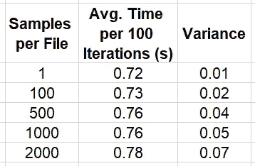
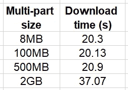
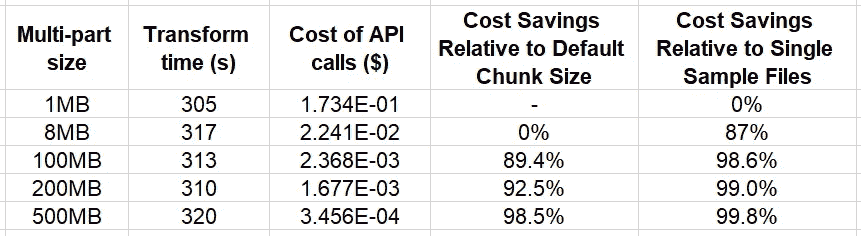

# 管理大数据应用程序的云存储成本

> 原文：[`towardsdatascience.com/managing-the-cloud-storage-costs-of-big-data-applications-e3cbd92cf51c?source=collection_archive---------15-----------------------#2023-06-26`](https://towardsdatascience.com/managing-the-cloud-storage-costs-of-big-data-applications-e3cbd92cf51c?source=collection_archive---------15-----------------------#2023-06-26)

## 降低使用基于云的存储成本的技巧

[](https://chaimrand.medium.com/?source=post_page-----e3cbd92cf51c--------------------------------)[](https://towardsdatascience.com/?source=post_page-----e3cbd92cf51c--------------------------------) [Chaim Rand](https://chaimrand.medium.com/?source=post_page-----e3cbd92cf51c--------------------------------)

·

[关注](https://medium.com/m/signin?actionUrl=https%3A%2F%2Fmedium.com%2F_%2Fsubscribe%2Fuser%2F9440b37e27fe&operation=register&redirect=https%3A%2F%2Ftowardsdatascience.com%2Fmanaging-the-cloud-storage-costs-of-big-data-applications-e3cbd92cf51c&user=Chaim+Rand&userId=9440b37e27fe&source=post_page-9440b37e27fe----e3cbd92cf51c---------------------post_header-----------) 发表在 [Towards Data Science](https://towardsdatascience.com/?source=post_page-----e3cbd92cf51c--------------------------------) · 11 分钟阅读 · 2023 年 6 月 26 日[](https://medium.com/m/signin?actionUrl=https%3A%2F%2Fmedium.com%2F_%2Fvote%2Ftowards-data-science%2Fe3cbd92cf51c&operation=register&redirect=https%3A%2F%2Ftowardsdatascience.com%2Fmanaging-the-cloud-storage-costs-of-big-data-applications-e3cbd92cf51c&user=Chaim+Rand&userId=9440b37e27fe&source=-----e3cbd92cf51c---------------------clap_footer-----------)

--

[](https://medium.com/m/signin?actionUrl=https%3A%2F%2Fmedium.com%2F_%2Fbookmark%2Fp%2Fe3cbd92cf51c&operation=register&redirect=https%3A%2F%2Ftowardsdatascience.com%2Fmanaging-the-cloud-storage-costs-of-big-data-applications-e3cbd92cf51c&source=-----e3cbd92cf51c---------------------bookmark_footer-----------)

图片由 [JOSHUA COLEMAN](https://unsplash.com/@joshstyle?utm_source=unsplash&utm_medium=referral&utm_content=creditCopyText) 提供，来源于 [Unsplash](https://unsplash.com/s/photos/storage?orientation=landscape&license=free&utm_source=unsplash&utm_medium=referral&utm_content=creditCopyText)

随着对不断增长的数据量的依赖，现代公司比以往任何时候都更加依赖高容量和高度可扩展的数据存储解决方案。对于许多公司来说，这种解决方案通常表现为云存储服务，如[Amazon S3](https://aws.amazon.com/s3/)、[Google Cloud Storage](https://cloud.google.com/storage)和[Azure Blob Storage](https://azure.microsoft.com/en-us/products/category/storage/)，这些服务都提供了丰富的 API 和功能（例如，[多层存储](https://aws.amazon.com/s3/storage-classes/intelligent-tiering/)），支持各种数据存储设计。当然，云存储服务也有相关的成本。这些成本通常包括多个组成部分，包括你使用的存储空间的总体大小，以及如将数据传入、传出或在云存储中传输等活动。例如，Amazon S3 的价格（截至本文撰写时）包括[六个成本组成部分](https://aws.amazon.com/s3/pricing/?p=pm&c=s3&z=4)，每个部分都需要考虑。可以看出，管理云存储成本可能变得复杂，因此开发了指定的计算器（例如，[这里](https://calculator.aws/#/)）来协助处理这一问题。

在一篇近期文章中，我们扩展了设计数据和数据使用的重要性，以降低与数据存储相关的成本。我们在那里关注的是使用数据压缩作为减少数据总体大小的一种方法。在这篇文章中，我们关注的是一个有时被忽视的云存储成本组成部分 —— [对你的云存储桶和数据对象进行的 API 请求成本](https://aws.amazon.com/s3/pricing/?nc=sn&loc=4)。我们将通过示例展示为什么这个组成部分常常被低估，以及如果管理不当，它如何可能成为你大数据应用成本的重要组成部分。然后我们将讨论几种简单的方法来控制这一成本。

## 免责声明

尽管我们的演示将使用 Amazon S3，但本文的内容同样适用于任何其他云存储服务。请不要将我们选择 Amazon S3 或我们提到的任何其他工具、服务或库解读为对其使用的支持。最适合你的选项将取决于你自己项目的具体细节。此外，请记住，关于如何存储和使用数据的任何设计选择都会有其利弊，这些利弊应根据你自己项目的细节权衡。

本文将包括在 [Amazon EC2 c5.4xlarge](https://aws.amazon.com/ec2/instance-types/c5/) 实例（具有 16 个 vCPUs 和 [“高达 10 Gbps” 的网络带宽](https://docs.aws.amazon.com/AWSEC2/latest/UserGuide/ec2-instance-network-bandwidth.html)）上运行的一系列实验。我们将分享这些实验的输出，作为你可能看到的比较结果的示例。请注意，输出结果可能会因实验运行的环境而有很大不同。请不要将这里呈现的结果作为你自己设计决策的依据。我们强烈建议你在决定自己项目的最佳方案之前，运行这些以及其他额外的实验。

# 一个简单的思考实验

假设你有一个数据转换应用程序，处理来自 S3 的 1 MB 数据样本，并生成 1 MB 数据输出，然后将其上传到 S3。假设你的任务是通过在合适的 [Amazon EC2 实例](https://aws.amazon.com/ec2/) 上运行你的应用程序来转换 10 亿个数据样本（与 S3 存储桶位于同一地区，以避免数据传输成本）。现在假设 [Amazon S3 收费](https://aws.amazon.com/s3/pricing/) 每 1000 次 GET 操作收费 $0.0004，每 1000 次 PUT 操作收费 $0.005（截至本文撰写时）。乍一看，这些成本似乎如此低，以至于与数据转换相关的其他成本相比，几乎可以忽略不计。然而，简单的计算显示，单是我们的 Amazon S3 API 调用就会产生**$5,400**的费用!! 这可能是你项目中最主要的成本因素，甚至比计算实例的成本还要高。我们将在本文最后回到这个思考实验。

# 将数据批量归为大文件

降低 API 调用成本的显而易见方法是将样本归为大文件，并在样本批次上进行转换。将我们的批量大小记作*N*，这种策略可能将我们的成本降低*N*倍（假设没有使用多部分文件传输——见下文）。这种技术不仅在 PUT 和 GET 调用上节省了费用，还能在**所有**与对象文件数量相关的 Amazon S3 成本组成部分上节省开支，而不是数据的整体大小（例如，[生命周期转换请求](https://aws.amazon.com/s3/pricing/?trk=c8974be7-bc21-436d-8108-722e8ab912e1&sc_channel=ps&ef_id=Cj0KCQjw7aqkBhDPARIsAKGa0oJZYkx6SjrewVcE--kFsSRWT1-nzsS07TMivfP1P1SVqRSO4mKx_MIaAkCBEALw_wcB%3AG%3As&s_kwcid=AL%214422%213%21645125274431%21e%21%21g%21%21s3+pricing%2119574556914%21145779857032))。

将样本组合在一起有一些缺点。例如，当你单独存储样本时，你可以随时访问其中的任何一个。当样本组合在一起时，这就变得更加具有挑战性。（有关将样本批处理成大文件的优缺点，请参见这篇文章）。如果你选择将样本组合在一起，那么最大的疑问是如何选择大小 *N*。较大的 *N* 可能会降低存储成本，但可能会引入延迟，增加计算时间，并由此增加计算成本。找到最佳数量可能需要一些实验，考虑到这些以及其他额外的因素。

但我们不要自欺欺人。进行这种更改并不容易。你的数据可能有很多消费者（包括人类和人工智能），每个人都有自己特定的需求和限制。将样本存储在单独的文件中可以更容易地让每个人满意。找到一个能够满足所有人需求的批处理策略将会很困难。

## 可能的折衷方案：批量 PUT，单独 GET

你可以考虑的一种折衷方案是上传包含分组样本的大文件，同时允许访问单个样本。实现这一点的一种方法是维护一个索引文件，其中包含每个样本的位置（其所在的文件、起始偏移量和结束偏移量），并向每个消费者提供一个轻量的 API 层，以便他们可以自由下载单个样本。该 API 将使用索引文件和一个允许从对象文件中提取特定范围的 S3 API（例如，Boto3 的 [get_object](https://boto3.amazonaws.com/v1/documentation/api/latest/reference/services/s3/client/get_object.html) 函数）来实现。虽然这种解决方案不会节省 GET 调用的费用（因为我们仍然要提取相同数量的单个样本），但由于我们上传的是较少的较大文件，因此更昂贵的 PUT 调用将会减少。请注意，这种解决方案对我们与 S3 交互所使用的库有一些限制，因为它依赖于一个允许从大型文件对象中提取部分块的 API。在之前的帖子中（例如，[这里](https://medium.com/towards-data-science/streaming-big-data-files-from-cloud-storage-634e54818e75)），我们讨论了与 S3 接口的不同方式，其中许多方式**不**支持此功能。

下面的代码块演示了如何实现一个简单的 [PyTorch 数据集](https://pytorch.org/docs/stable/data.html)（使用 PyTorch 版本 1.13），该数据集使用 [Boto3 get_object](https://boto3.amazonaws.com/v1/documentation/api/latest/reference/services/s3.html#S3.Client.get_object) API 从包含分组样本的大文件中提取单个 1 MB 样本。我们将这种方式迭代数据的速度与迭代存储在单独文件中的样本的速度进行比较。

```py
import os, boto3, time, numpy as np
import torch
from torch.utils.data import Dataset
from statistics import mean, variance

KB = 1024
MB = KB * KB
GB = KB ** 3

sample_size = MB
num_samples = 100000

# modify to vary the size of the files
samples_per_file = 2000 # for 2GB files
num_files = num_samples//samples_per_file
bucket = '<s3 bucket>'
single_sample_path = '<path in s3>'
large_file_path = '<path in s3>'

class SingleSampleDataset(Dataset):
    def __init__(self):
        super().__init__()
        self.bucket = bucket
        self.path = single_sample_path
        self.client = boto3.client("s3")

    def __len__(self):
        return num_samples

    def get_bytes(self, key):
        response = self.client.get_object(
            Bucket=self.bucket,
            Key=key
        )
        return response['Body'].read()

    def __getitem__(self, index: int):
        key = f'{self.path}/{index}.image'
        image = np.frombuffer(self.get_bytes(key),np.uint8)
        return {"image": image}

class LargeFileDataset(Dataset):
    def __init__(self):
        super().__init__()
        self.bucket = bucket
        self.path = large_file_path
        self.client = boto3.client("s3")

    def __len__(self):
        return num_samples

    def get_bytes(self, file_index, sample_index):
        response = self.client.get_object(
            Bucket=self.bucket,
            Key=f'{self.path}/{file_index}.bin',
            Range=f'bytes={sample_index*MB}-{(sample_index+1)*MB-1}'
        )
        return response['Body'].read()

    def __getitem__(self, index: int):
        file_index = index // num_files
        sample_index = index % samples_per_file
        image = np.frombuffer(self.get_bytes(file_index, sample_index),
                              np.uint8)
        return {"image": image}

# toggle between single sample files and large files
use_grouped_samples = True

if use_grouped_samples:
    dataset = LargeFileDataset()
else:
    dataset = SingleSampleDataset()

# set the number of parallel workers according to the number of vCPUs
dl = torch.utils.data.DataLoader(dataset, shuffle=True,
                                 batch_size=4, num_workers=16)

stats_lst = []
t0 = time.perf_counter()
for batch_idx, batch in enumerate(dl, start=1):
    if batch_idx % 100 == 0:
        t = time.perf_counter() - t0
        stats_lst.append(t)
        t0 = time.perf_counter()

mean_calc = mean(stats_lst)
var_calc = variance(stats_lst)
print(f'mean {mean_calc} variance {var_calc}')
```

下表总结了不同样本分组大小 *N* 的数据遍历速度。



不同分组策略对数据遍历时间的影响（作者）

注意，尽管这些结果强烈暗示将样本分组到大文件中对单独提取它们的性能影响相对较小，但我们发现比较结果会根据样本大小、文件大小、文件偏移量的值、对同一文件的并发读取次数等有所变化。虽然我们无法了解 Amazon S3 服务的内部工作原理，但考虑到内存大小、内存对齐和限制等因素对性能的影响也不足为奇。找到适合你数据的最佳配置可能需要一些实验。

一个可能干扰我们在这里描述的节省成本的分组策略的重要因素是多部分下载和上传的使用，我们将在下一节中讨论。

# 使用可以控制多部分数据传输的工具

许多云存储服务提供商支持对象文件的多部分上传和下载选项。在多部分数据传输中，大于某个阈值的文件被划分为多个部分并同时传输。如果你想加速大文件的数据传输，这是一项关键功能。AWS [建议对大于 100 MB 的文件使用多部分上传](https://docs.aws.amazon.com/AmazonS3/latest/userguide/mpuoverview.html)。在以下简单示例中，我们比较了将 2 GB 文件的多部分 *阈值* 和 *分块大小* 设置为不同值时的下载时间：

```py
import boto3, time
KB = 1024
MB = KB * KB
GB = KB ** 3

s3 = boto3.client('s3')
bucket = '<bucket name>'
key = '<key of 2 GB file>'
local_path = '/tmp/2GB.bin'
num_trials = 10

for size in [8*MB, 100*MB, 500*MB, 2*GB]:
    print(f'multi-part size: {size}')
    stats = []
    for i in range(num_trials):
        config = boto3.s3.transfer.TransferConfig(multipart_threshold=size,
                                              multipart_chunksize=size)
        t0 = time.time()
        s3.download_file(bucket, key, local_path, Config=config)
        stats.append(time.time()-t0)
    print(f'multi-part size {size} mean {mean(stats)}')
```

此实验的结果总结在下面的表格中：



多部分分块大小对下载时间的影响（作者）

请注意，相对比较将大大依赖于测试环境，特别是实例与 S3 存储桶之间的通信速度和带宽。我们的实验是在与存储桶位于同一区域的实例上运行的。然而，随着距离的增加，使用多部分下载的影响也会增加。

关于我们讨论的话题，重要的是要注意多部分数据传输的成本影响。具体来说，当你使用多部分数据传输时，[你会为每个文件部分的 API 操作收费](https://docs.aws.amazon.com/AmazonS3/latest/userguide/mpuoverview.html#mpuploadpricing)。因此，使用多部分上传/下载将限制将数据样本批量处理成大文件的成本节省潜力。

许多 API**默认**使用多部分下载。如果你的主要关注点是减少与 S3 的交互延迟，这种做法是很好的。但是，如果你的关心是限制成本，那么这种默认行为对你来说并不有利。例如，Boto3 是一个流行的 Python API，用于从 S3 上传和下载文件。如果未指定，boto3 的 S3 API 如 [upload_file](https://boto3.amazonaws.com/v1/documentation/api/latest/reference/services/s3/client/upload_file.html) 和 [download_file](https://boto3.amazonaws.com/v1/documentation/api/latest/reference/services/s3/client/download_file.html) 将使用默认的 [TransferConfig](https://boto3.amazonaws.com/v1/documentation/api/latest/reference/customizations/s3.html#boto3.s3.transfer.TransferConfig)，该配置将对任何大于 8 MB 的文件应用 8 MB 的块大小的多部分上传/下载。如果你负责控制组织中的云成本，你可能会惊讶地发现这些 API 被广泛使用其默认设置。在许多情况下，你可能会发现这些设置是不必要的，增加多部分*阈值*和*块大小*值，或完全禁用多部分数据传输，对应用程序的性能影响很小。

## 示例 — 多部分文件传输大小对速度和成本的影响

在下面的代码块中，我们创建一个简单的多进程转换函数，并测量多部分块大小对其性能和成本的影响：

```py
import os, boto3, time, math
from multiprocessing import Pool
from statistics import mean, variance

KB = 1024
MB = KB * KB

sample_size = MB
num_files = 64
samples_per_file = 500
file_size = sample_size*samples_per_file
num_processes = 16
bucket = '<s3 bucket>'
large_file_path = '<path in s3>'
local_path = '/tmp'
num_trials = 5
cost_per_get = 4e-7
cost_per_put = 5e-6

for multipart_chunksize in [1*MB, 8*MB, 100*MB, 200*MB, 500*MB]:
    def empty_transform(file_index):
        s3 = boto3.client('s3')
        config = boto3.s3.transfer.TransferConfig(
                             multipart_threshold=multipart_chunksize,
                             multipart_chunksize=multipart_chunksize
                             )
        s3.download_file(bucket, 
                         f'{large_file_path}/{file_index}.bin', 
                         f'{local_path}/{file_index}.bin', 
                         Config=config)
        s3.upload_file(f'{local_path}/{file_index}.bin',
                       bucket,
                       f'{large_file_path}/{file_index}.out.bin',
                       Config=config)

    stats = []
    for i in range(num_trials):
        with Pool(processes=num_processes) as pool:
            t0 = time.perf_counter()
            pool.map(empty_transform, range(num_files))
            transform_time = time.perf_counter() - t0
            stats.append(transform_time)

    num_chunks = math.ceil(file_size/multipart_chunksize)
    num_operations = num_files*num_chunks
    transform_cost = num_operations * (cost_per_get + cost_per_put)
    if num_chunks > 1:
        # if multi-part is used add cost of
        # CreateMultipartUpload and CompleteMultipartUpload API calls
        transform_cost += 2 * num_files * cost_per_put
    print(f'chunk size {multipart_chunksize}')
    print(f'transform time {mean(stats)} variance {variance(stats)}
    print(f'cost of API calls {transform_cost}')
```

在这个例子中，我们将文件大小固定为 500 MB，并对下载和上传应用了相同的多部分设置。一个更完整的分析将会变化数据文件的大小和多部分设置。

在下表中，我们总结了实验的结果。



多部分块大小对数据转换速度和成本的影响（作者）

结果表明，至多达到 500 MB 的多部分块大小（我们文件的大小），数据转换时间的影响是最小的。另一方面，与使用 Boto3 的默认块大小（8MB）相比，云存储 API 成本的潜在节省是显著的，最多可达 98.4%。这个例子不仅展示了将样本分组的成本效益，而且还暗示了通过适当配置多部分数据传输设置获得额外节省的机会。

# 结论

让我们将上一个示例的结果应用到我们在本文开头介绍的思维实验中。我们展示了如果数据样本存储在单独的文件中，对 1 亿个数据样本应用简单转换的费用将是$5,400。如果我们将样本分组为 200 万个文件，每个文件有 500 个样本，并且在不使用多部分数据传输的情况下（如上述示例的最后一次试验），API 调用的成本将减少到$10.8！！同时，假设测试环境相同，我们预期的整体运行时间的影响（基于我们的实验）将相对较低。我认为这是一个相当不错的交易。你觉得呢？

# 摘要

在开发基于云的大数据应用时，了解我们活动的**所有**成本细节至关重要。在这篇文章中，我们专注于 Amazon S3 定价策略中的“请求与数据检索”组件。我们演示了这个组件如何成为大数据应用总体成本的重要组成部分。我们讨论了可能影响这一成本的两个因素：数据样本的分组方式和多部分数据传输的使用方式。

自然，仅优化一个成本组件可能会以某种方式增加其他组件，从而提高整体成本。数据存储的适当设计需要考虑**所有**潜在成本因素**并且将大大依赖于你的具体数据需求和使用模式**。

一如既往，请随时提出评论和修正。
