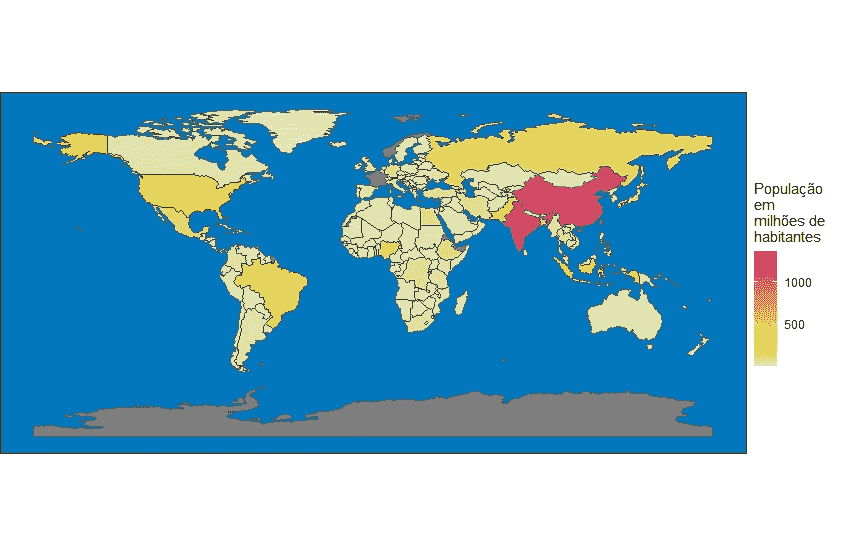
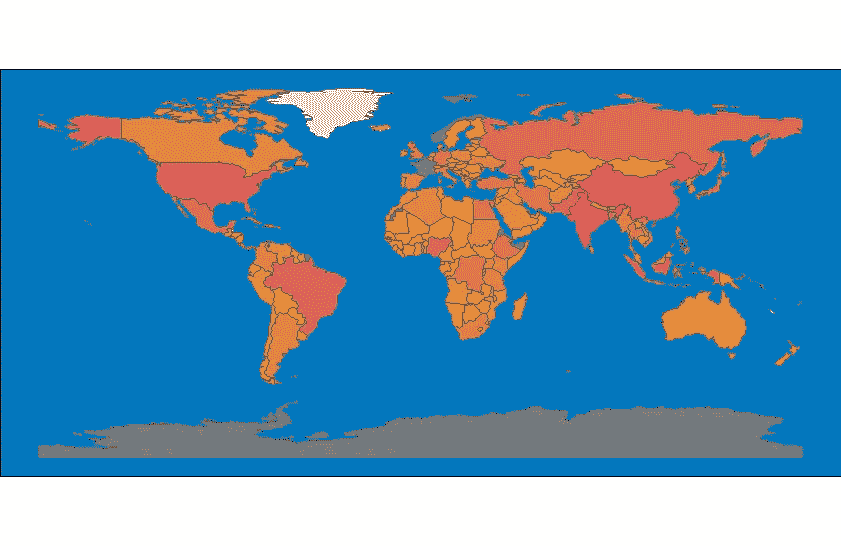
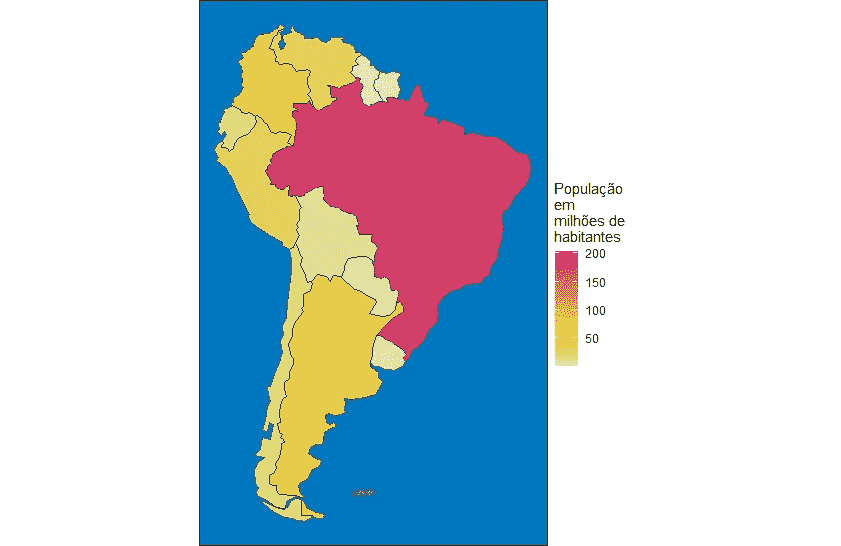
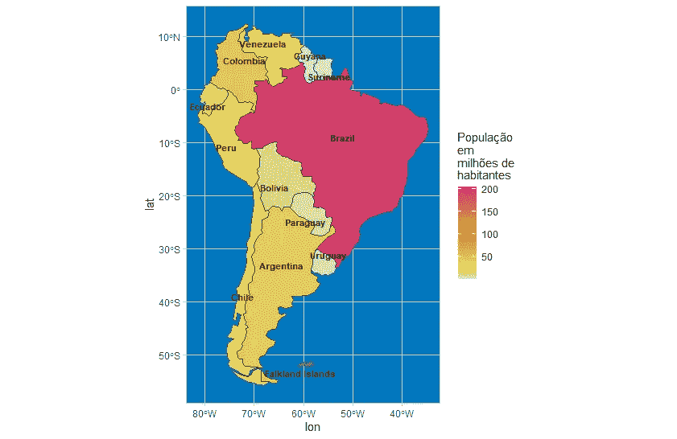
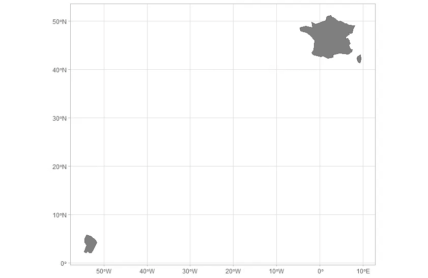
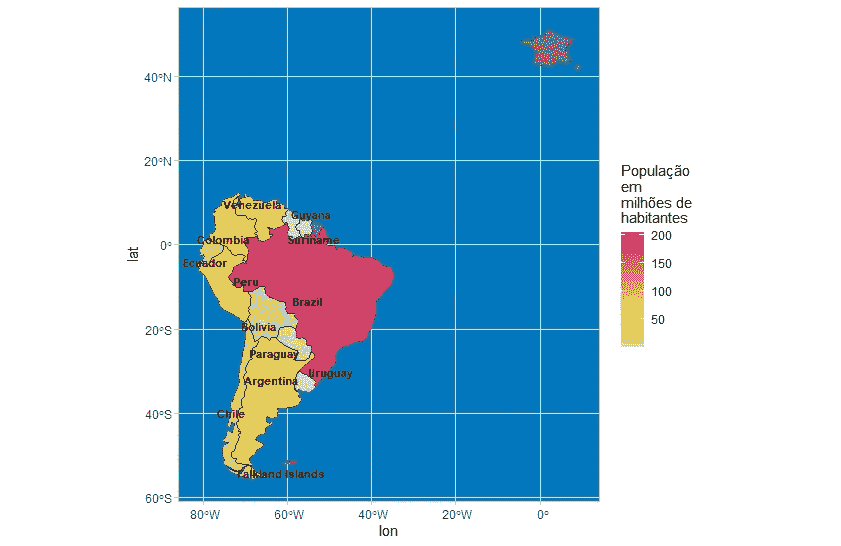
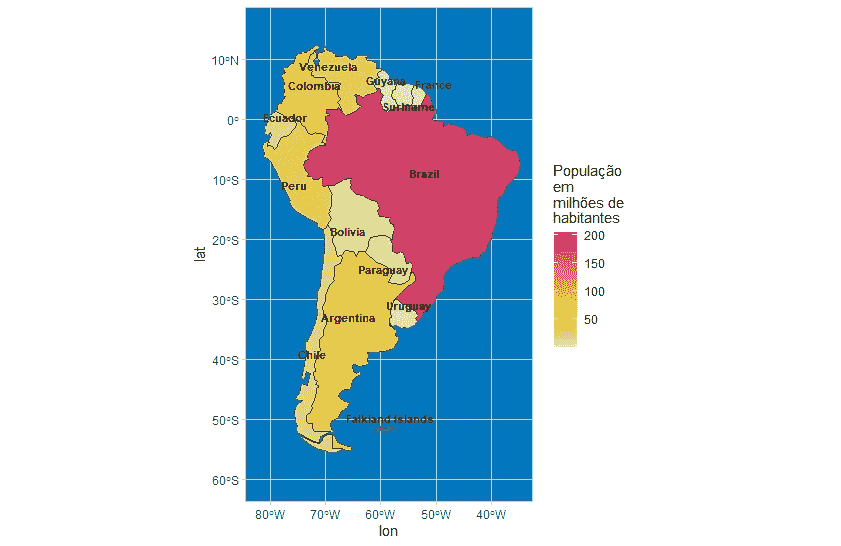
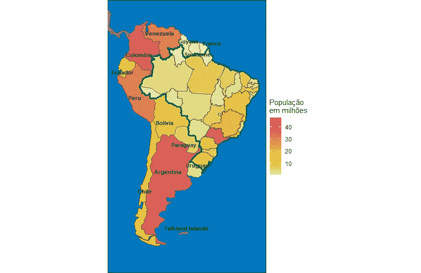
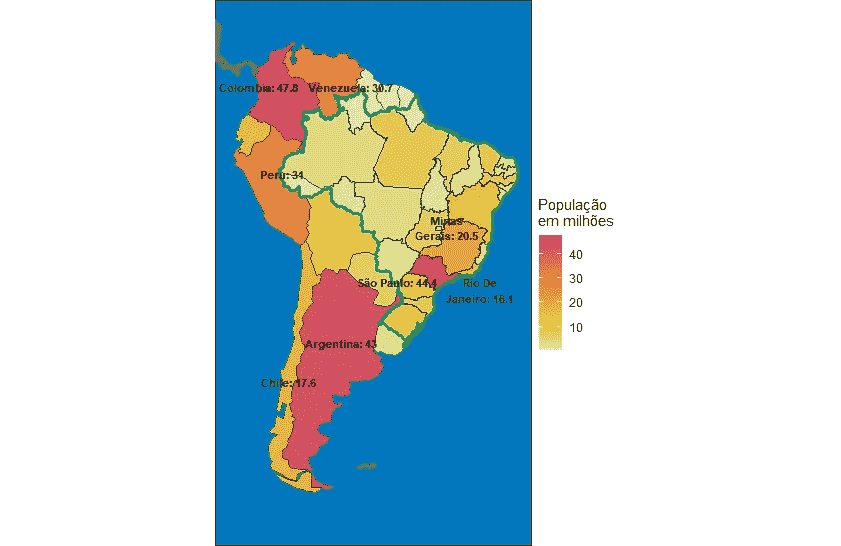

# 使用 R 绘制南美洲地图：深入探讨地理可视化

> 原文：[`towardsdatascience.com/mapping-south-america-with-r-a-deep-dive-into-geo-visualization-2fc8e34ec263?source=collection_archive---------5-----------------------#2023-08-30`](https://towardsdatascience.com/mapping-south-america-with-r-a-deep-dive-into-geo-visualization-2fc8e34ec263?source=collection_archive---------5-----------------------#2023-08-30)

## 导航数据集、地缘政治细节和编码挑战，描绘大陆的全貌

[](https://fernandobarbalho.medium.com/?source=post_page-----2fc8e34ec263--------------------------------)[](https://towardsdatascience.com/?source=post_page-----2fc8e34ec263--------------------------------) [Fernando Barbalho](https://fernandobarbalho.medium.com/?source=post_page-----2fc8e34ec263--------------------------------)

·

[关注](https://medium.com/m/signin?actionUrl=https%3A%2F%2Fmedium.com%2F_%2Fsubscribe%2Fuser%2Fdcaa8c7ce010&operation=register&redirect=https%3A%2F%2Ftowardsdatascience.com%2Fmapping-south-america-with-r-a-deep-dive-into-geo-visualization-2fc8e34ec263&user=Fernando+Barbalho&userId=dcaa8c7ce010&source=post_page-dcaa8c7ce010----2fc8e34ec263---------------------post_header-----------) 发表在 [Towards Data Science](https://towardsdatascience.com/?source=post_page-----2fc8e34ec263--------------------------------) · 8 分钟阅读 · 2023 年 8 月 30 日 [](https://medium.com/m/signin?actionUrl=https%3A%2F%2Fmedium.com%2F_%2Fvote%2Ftowards-data-science%2F2fc8e34ec263&operation=register&redirect=https%3A%2F%2Ftowardsdatascience.com%2Fmapping-south-america-with-r-a-deep-dive-into-geo-visualization-2fc8e34ec263&user=Fernando+Barbalho&userId=dcaa8c7ce010&source=-----2fc8e34ec263---------------------clap_footer-----------)

--

[](https://medium.com/m/signin?actionUrl=https%3A%2F%2Fmedium.com%2F_%2Fbookmark%2Fp%2F2fc8e34ec263&operation=register&redirect=https%3A%2F%2Ftowardsdatascience.com%2Fmapping-south-america-with-r-a-deep-dive-into-geo-visualization-2fc8e34ec263&source=-----2fc8e34ec263---------------------bookmark_footer-----------)

图片由 [Alexander Schimmeck](https://unsplash.com/@alschim?utm_source=unsplash&utm_medium=referral&utm_content=creditCopyText) 提供，来源于 [Unsplash](https://unsplash.com/photos/Aohf8gqa7Zc?utm_source=unsplash&utm_medium=referral&utm_content=creditCopyText)

所以你是那种从小就喜欢地图和地理的数据科学家和业余 Medium 作者。你正在寻找一个适合你后续图表工作，特别是地图的好主题，当你意识到你所在的国家巴西的官方统计局发布了最新的普查数据时。为什么不呢？为什么不对比一下巴西与其南美洲邻国的情况呢？这可能是使用 R 和所有优秀包的简单任务。让我们来做吧。

在做出这个决定的瞬间，意识到这个简单的任务实际上是一个英雄的旅程，包含了发现最合适的数据集与形状文件、信息缺乏、形状文件互操作性、纬度和经度数学、地理概念中的文化差异，甚至地缘政治问题，如如何将法国海外领土的地图和数据正确地放在南美洲中。

接下来的段落解释了在世界地图的限定区域绘制人口信息的一些可能路径。下面描述的逐步过程可能对所有那些对国际比较有兴趣的地理可视化方法者有用，即使他们的目的只是比较非洲国家的水资源获取情况或北美的肥胖率。

## [**帕查玛玛**](https://en.wikipedia.org/wiki/Pachamama)

让我们从整体图像开始：R 版的*世界地图*。请见下图和代码。



世界地图：图片由作者提供

```py
library(readxl)
library(geobr)
library(tidyverse)
library(sf)
library(spData)
library(ggrepel)
library(colorspace)

data("world")

#mapa mundi

world %>%
  ggplot() +
  geom_sf(aes(fill=pop/10⁶)) +
  scale_fill_continuous_sequential(palette= "Heat 2" )+
  theme_void() +
  theme(
    panel.background = element_rect(fill="#0077be")
  ) +
  labs(
    fill= str_wrap("População em milhões de habitantes", 10)
  )
```

我使用[{spData}](https://cran.r-project.org/web/packages/spData/spData.pdf)包作为具有全球领土形状文件几何信息的数据框的参考。aes 函数使用人口信息填充形状。众所周知，中国和印度是世界上人口最多的国家，每个国家都有超过 10 亿人。热度颜色显示了与其他国家的对比。大多数顺序颜色较弱。我们几乎无法理解图片中的颜色渐变。如果你想要更好的颜色分布，对数是最佳选择。见下文。



对数刻度的世界地图。图片由作者提供

```py
world %>%
  ggplot() +
  geom_sf(aes(fill=pop)) +
  scale_fill_continuous_sequential(palette= "Heat 2", trans= "log2" )+
  theme_void() +
  theme(
    panel.background = element_rect(fill="#0077be"),
    legend.position = "none"
  )
```

在代码中，你可以看到 `scale_fill_continuous_sequential` 函数中的对数变换。

在世界数据框结构中，有一个“Continent”列。因此，使用该列筛选数据以获取南美洲地图是显而易见的。请查看代码，紧接着是地图。



南美洲地图：第一版。图片由作者提供

```py
world %>%
  filter(continent == "South America") %>%
  ggplot() +
  geom_sf(aes(fill=pop/10⁶)) +
  scale_fill_continuous_sequential(palette= "Heat 2" )+
  theme_void() +
  theme(
    panel.background = element_rect(fill="#0077be")
  ) +
  labs(
    fill= str_wrap("População em milhões de habitantes", 10)
  )
```

如你所见，dplyr 过滤函数运作良好；这正是我们想要看到的地图。但这真的正确吗？

气候变化是一个巨大的问题，但海平面尚未上升到淹没曾经出现在南美洲北部的明显区域的程度。这到底发生了什么？让我们现在借助坐标绘制另一张地图，并命名多边形。



南美洲地图：第二版。作者图片

```py
southamerica<-
  world %>%
  filter(continent=="South America") 

southamerica$lon<- sf::st_coordinates(sf::st_centroid(southamerica$geom))[,1]   
southamerica$lat<- sf::st_coordinates(sf::st_centroid(southamerica$geom))[,2]

southamerica %>%
  ggplot() +
  geom_sf(aes(fill=pop/10⁶)) +
  scale_fill_continuous_sequential(palette= "Heat 2" )+
  theme_light() +
  theme(
    panel.background = element_rect(fill="#0077be")
  ) +
  labs(
    fill= str_wrap("População em milhões de habitantes", 10)
  )+
  geom_text_repel(aes(x=lon, y=lat, label= str_wrap(name_long,20)), 
                  color = "black", 
                  fontface = "bold", 
                  size = 2.8)
```

`theme_light` 代替 `theme_void` 足以显示坐标。多边形命名花费了更多工作。我们必须计算每个多边形的质心，然后将这些信息用作 `geom_text_repel` 函数中的 x 和 y 坐标。

使用这个新地图版本和一些先前的知识，我们发现缺失的领土是法属圭亚那，它位于北纬 0º 和 10º 之间，西经 53º 和 55º 之间。我们的下一个任务是了解如何获取法属圭亚那的信息：多边形、人口以及一些坐标来填补我们的地图。

## [**La Mer**](https://open.spotify.com/intl-pt/track/1ZK8WJqkD1XhEYI1AlkMHG?si=254b1ac4ba1646d1)

我必须将法国从世界其他地方隔离开来，以理解 {spData} 包如何处理这个国家地图的数据。见下文结果。



法国地图。作者图片

```py
france<-
  world %>%
  filter(iso_a2 == "FR")

france %>%
  ggplot() +
  geom_sf(aes(fill=pop)) +
  scale_fill_continuous_sequential(palette= "Heat 2", trans= "log2" )+
  theme_light() +
  theme(
    #panel.background = element_rect(fill="#0077be")
  ) +
  labs(
    fill= str_wrap("População", 30)
  )
```

法国有许多所谓的海外领土。*{spData}* 包的方法是仅表示主要领土，加上科西嘉岛（地中海中的一个岛屿）和法属圭亚那，它位于精确的坐标范围内，这个范围正好填补了我们南美洲最后一张地图中的空白。

我的下一个尝试是将包含法国几何数据的数据框添加到我的南美洲过滤器中，但我知道我还需要更多。见下文



南美洲 + 法国。作者图片

```py
southamerica %>%
  bind_rows(france) %>%
  ggplot() +
  geom_sf(aes(fill=pop/10⁶)) +
  scale_fill_continuous_sequential(palette= "Heat 2" )+
  theme_light() +
  theme(
    panel.background = element_rect(fill="#0077be")
  ) +
  labs(
    fill= str_wrap("População em milhões de habitantes", 10)
  )+
  geom_text_repel(aes(x=lon, y=lat, label= str_wrap(name_long,20)), 
                  color = "black", 
                  fontface = "bold", 
                  size = 2.8)
```

正如你在代码中看到的，我使用 `bind_row` 将南美洲领土与法国的 shapefile 结合起来。这样我们现在就有了良好定位的法属圭亚那。另一方面，地图上没有人口信息，而法国在殖民历史的反面作为南美洲的一部分。

换句话说，我想要的是这张地图。



法属圭亚那在南美洲地图上。作者图片

```py
data_guiana<-
  insee::get_idbank_list('TCRED-ESTIMATIONS-POPULATION') %>%
  filter(str_detect(REF_AREA_label_fr,"Guyane")) %>%
  filter(AGE == "00-") %>% #all ages
  filter(SEXE == 0) %>% #men and women
  pull(idbank) %>%
  insee::get_insee_idbank() %>%
  filter(TIME_PERIOD == "2023") %>% 
  select(TITLE_EN,OBS_VALUE) %>%
  mutate(iso_a2 = "FR")

data_guiana <- janitor::clean_names(data_guiana)

southamerica %>%
  bind_rows(france) %>%
  left_join(data_guiana) %>%
  mutate(pop=ifelse(iso_a2=="FR",obs_value,pop))%>%
  mutate(lon= ifelse(iso_a2=="FR", france[[11]][[1]][[1]][[1]][1,1], lon),
         lat= ifelse(iso_a2=="FR",france[[11]][[1]][[1]][[1]][1,2], lat)) %>%
  ggplot() +
  geom_sf(aes(fill=pop/10⁶)) +
  scale_fill_continuous_sequential(palette= "Heat 2" )+
  geom_text_repel(aes(x=lon, y=lat, label= str_wrap(name_long,20)), 
                  color = "black", 
                  fontface = "bold", 
                  size = 2.8)+
  coord_sf(xlim = c(-82,-35), ylim=c(-60,15))+
  theme_light() +
  theme(
    panel.background = element_rect(fill="#0077be")
  ) +
  labs(
    fill= str_wrap("População em milhões de habitantes", 10)
  )
```

正如你所看到的，我使用了由法国官方统计办公室制作的 [R 包](https://www.data.gouv.fr/en/reuses/insee-package-r/) 来获取圭亚那的人口。此外，我将地图限制在适当的坐标范围内，以查看南美洲。

## [**Emolduram e aquarelam o meu Brasil**](https://www.youtube.com/watch?v=VHN2TVwNhEo)

现在地图英雄终于解决了南美洲的问题，并与法国演奏了 [pipes of peace](https://www.youtube.com/watch?v=9MBFyU7FhGs&t=220s)，是时候回到巴西的数据和地图了。记住，我想将一些巴西的人口普查细节与巴拿马以南其他国家和地区进行比较。

数据普查可以在 [R 包](https://github.com/rpradosiqueira/sidrar) 或 [API](https://servicodados.ibge.gov.br/api/docs/agregados?versao=3) 地址上找到。我选择了使用 API 的更具挑战性的选项。另一次使用其他选项可能是个好主意。查看下面的代码和地图，我展示了巴西各州的人口与其他南美洲领土的对比。



南美洲 + 巴西各州。图片由作者提供

```py
central_america<-
  world %>%
  filter(subregion == "Central America")

brasil<- geobr::read_country()
estados<- geobr::read_state()

#dados de população

ibge2022<-
  get_municipalies_data()

estados<-
  estados %>%
  inner_join(
    ibge2022 %>%
      rename(abbrev_state = uf) %>%
      summarise(.by=abbrev_state,
                pop = sum(populacao_residente)
      )
  )

southamerica %>%
  filter(iso_a2!="BR") %>%
  bind_rows(france) %>%
  left_join(data_guiana) %>%
  mutate(pop=ifelse(iso_a2=="FR",obs_value,pop))%>%
  mutate(lon= ifelse(iso_a2=="FR", france[[11]][[1]][[1]][[1]][1,1], lon),
         lat= ifelse(iso_a2=="FR",france[[11]][[1]][[1]][[1]][1,2], lat)) %>%
  ggplot() +
  geom_sf(aes(fill=pop/10⁶)) +
  geom_sf(data=estados, aes(fill=pop/10⁶)) +
  geom_sf(data=brasil,fill=NA, color="#00A859", lwd=1.2)+
  geom_sf(data= central_america,fill= "#808080")+
  scale_fill_continuous_sequential(palette= "Heat 2" )+
  geom_text_repel(aes(x=lon, y=lat, 
                      label= str_wrap(name_long,20)), 
                  color = "black", 
                  fontface = "bold", 
                  size = 2.8)+
  coord_sf(xlim = c(-82,-35), ylim=c(-60,15))+
  theme_void() +
  theme(
    panel.background = element_rect(fill="#0077be")
  ) +
  labs(
    fill= str_wrap("População em milhões", 10)
  )
```

我使用上述 API 编写了函数 get_municipalites_data。代码可以在我的 [gist](https://gist.github.com/fernandobarbalho/04429d85a499f2bc80cec88878d61287) 上找到。还请注意提供用于绘制巴西及其子区域边界的两个函数：read_country 和 read_states。这些函数在 [{geobr}](https://github.com/ipeaGIT/geobr) 包中。

我使用了世界数据框中的另一个筛选器。在这种情况下，目的是显示中美洲次大陆的起始部分，并用灰色阴影绘制其地图。在这里，我们面临了一种文化差异，因为我们在巴西了解到美洲有三个次大陆：北美、中美洲和南美洲。对于数据集的作者来说，中美洲是北美的一个子区域。

现在是时候结束我的工作了。我想在地图上显示八个最人口稠密的领土的名称。即使在最后的冲刺阶段，也有一些代码技巧。



最人口密集的领土。图片由作者提供

```py
estados$lon<- sf::st_coordinates(sf::st_centroid(estados$geom))[,1]   
estados$lat<- sf::st_coordinates(sf::st_centroid(estados$geom))[,2]

most_populated<-
  southamerica %>%
  filter(iso_a2 !="BR") %>%
  rename(name= name_long) %>%
  as_tibble() %>%
  select(name, pop, lat, lon) %>%

  bind_rows(
    estados %>%
      rename(name= name_state) %>%
      as_tibble() %>%
      select(name, pop, lat, lon)
  ) %>%
  slice_max(order_by = pop, n=8)

southamerica %>%
  filter(iso_a2!="BR") %>%
  bind_rows(france) %>%
  left_join(data_guiana) %>%
  mutate(pop=ifelse(iso_a2=="FR",obs_value,pop))%>%
  mutate(lon= ifelse(iso_a2=="FR", france[[11]][[1]][[1]][[1]][1,1], lon),
         lat= ifelse(iso_a2=="FR",france[[11]][[1]][[1]][[1]][1,2], lat)) %>%
  ggplot() +
  geom_sf(aes(fill=pop/10⁶)) +
  geom_sf(data=estados, aes(fill=pop/10⁶)) +
  geom_sf(data=brasil,fill=NA, color="#00A859", lwd=1.2)+
  geom_sf(data= central_america,fill= "#808080")+
  scale_fill_continuous_sequential(palette= "Heat 2" )+
  geom_text_repel(data= most_populated,
                  aes(x=lon, y=lat, 
                      label= str_c(str_wrap(name,10),": ",round(pop/10⁶,1))), 
                  color = "black", 
                  fontface = "bold", 
                  size = 2.9)+
  coord_sf(xlim = c(-82,-35), ylim=c(-60,15))+
  theme_void() +
  theme(
    panel.background = element_rect(fill="#0077be")
  ) +
  labs(
    fill= str_wrap("População em milhões", 10)
  ) 
```

三个巴西州位于南美洲最人口稠密的八个领土中。实际上，圣保罗是地图上第二个最有人口的地区，仅次于哥伦比亚。

现在，专注于代码，你可以看到我创建了一个新的数据框，通过结合两个不同的 sf 对象来建立这个排名。我选择了一部分列，并将类型从 sf 更改为 tibble，以便进行行绑定。

就这样。英雄完成了一个可能的路径，并留下了下一次旅程的足迹。现在轮到你了。记住所有可能通过地图表示得到显著改善的项目。根据上述操作步骤，收集有关人口、社会经济问题等的所有数据，只需选择一个变量来填充多边形。

# 代码和数据

完整代码可以在 [gist](https://gist.github.com/fernandobarbalho/04429d85a499f2bc80cec88878d61287) 上找到。

所有巴西数据集被认为是公共领域的数据，因为这些数据是由联邦政府机构生产的，作为主动透明度在互联网上提供，并且受到巴西信息公开法的约束。

[IBGE](https://apisidra.ibge.gov.br/values/t/4714/n6/all/v/all/p/all/d/v614%202): 巴西人口普查数据

[IPEA](https://github.com/ipeaGIT/geobr): 巴西 shapefiles

法国的数据可以从[开放数据门户](https://www.data.gouv.fr/en/datasets/population/)获取，并标注为[开放许可](https://www.etalab.gouv.fr/wp-content/uploads/2014/05/Licence_Ouverte.pdf)，允许将信息用于商业目的。
