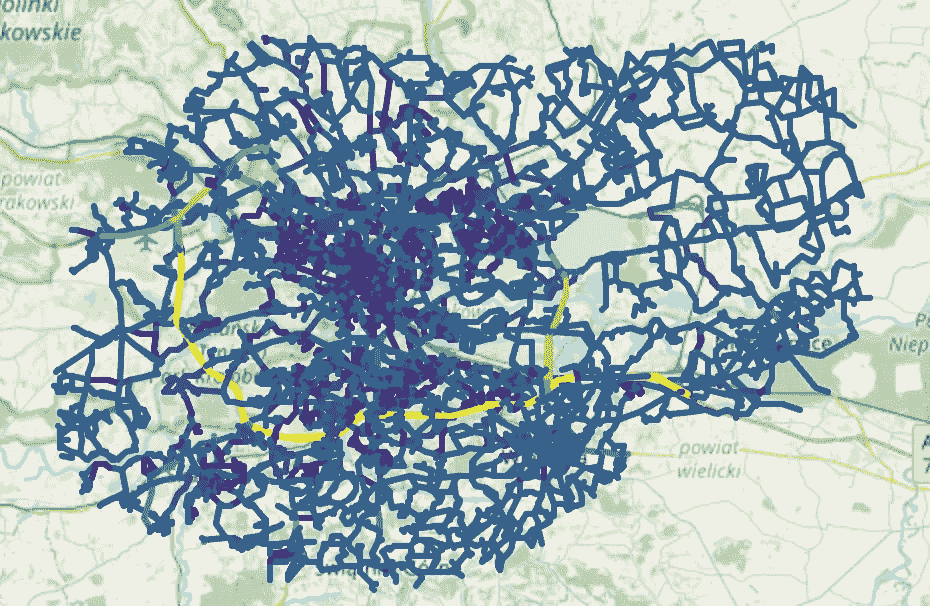

# 《交通拥堵分析：使用图论》

> 原文：[`towardsdatascience.com/mapping-the-jams-traffic-analysis-using-graph-theory-a387135ea748?source=collection_archive---------0-----------------------#2023-08-19`](https://towardsdatascience.com/mapping-the-jams-traffic-analysis-using-graph-theory-a387135ea748?source=collection_archive---------0-----------------------#2023-08-19)

## 学习如何使用图论找到城市基础设施中的潜在关键点

 [Mateusz Praski](https://medium.com/@mateusz.praski?source=post_page-----a387135ea748--------------------------------)

·

[关注](https://medium.com/m/signin?actionUrl=https%3A%2F%2Fmedium.com%2F_%2Fsubscribe%2Fuser%2F61bf49684bbc&operation=register&redirect=https%3A%2F%2Ftowardsdatascience.com%2Fmapping-the-jams-traffic-analysis-using-graph-theory-a387135ea748&user=Mateusz+Praski&userId=61bf49684bbc&source=post_page-61bf49684bbc----a387135ea748---------------------post_header-----------) 发布于 [Towards Data Science](https://towardsdatascience.com/?source=post_page-----a387135ea748--------------------------------) ·10 分钟阅读·2023 年 8 月 19 日

--

图论在现实问题中有很多应用，例如社交网络、分子生物学或地理空间数据。今天，我将展示最后一种应用，即分析城市的道路布局，以预测关键街道、交叉口，以及基础设施的变化如何影响这些因素。但首先，让我们从基础知识开始。

# 图及其中心性度量

图是顶点及其边的集合：

集合 E 是无序元组 (x, y) 的子集，其中 x 和 y 是图的顶点，且 x 不等于 y。[图像由作者提供]

边表示节点之间的连接。如果边没有方向，我们称之为无向图。无向图的一个现实例子可以是化学分子，其中顶点是原子，化学键表示为边。

血清素分子是一个简单无向图的例子。 [[来源](https://commons.wikimedia.org/wiki/File:Serotonin-Spartan-HF-based-on-xtal-3D-balls-web.png)]

然而，有时我们需要了解边是从 *u* 到 *v*，从 *v* 到 *u*，还是双向的。例如，如果马克喜欢爱丽丝，并不一定意味着这是双向的（ ☹ ）。在这些情况下，我们可以将边定义为有序元组而不是无序元组。

方括号表示公式中的无序元组，而圆括号表示有序元组。[图片由作者提供]

人际互动可以使用有向图来描述。[图片由作者提供]

使用图结构，我们可以定义一个中心性度量。这是一个用于回答以下问题的指标：

> 这个顶点/边在图中的重要性有多大？

而且有许多方法可以回答这个问题。

# 评估图组件重要性的不同方法

根据任务的不同，我们可以从不同的角度来评估中心性。最常见的度量指标有：度、紧密性和中介性。我们将使用扎卡里·卡拉泰俱乐部图来讨论这些指标 [[更多信息]](https://en.wikipedia.org/wiki/Zachary%27s_karate_club)。它展示了不同空手道俱乐部成员之间的联系。你可以在[这里](https://github.com/Thematiq/cracow-roads-capacity/blob/master/vis-to-article.ipynb)找到用于生成图片的代码。

## 度中心性

最基本的中心性。它仅定义在顶点上，等于顶点的度数（即邻接顶点的数量）。例如，我们可以回想一下人际关系图，在人际友谊的情况下，这个指标将回答以下问题：

> “这个人有多受欢迎？”

空手道俱乐部图的节点度中心性。中心性度量标准按图的最大度数（即节点数减一）进行了归一化。[图片由作者提供]

## 图中的路径

对于接下来的两个中心性，我们需要将一些概念引入到图论知识中。所有这些都是非常直观的，从边的权重开始。我们可以给边添加权重，以标记它们之间的差异。例如，在交通图的情况下，这可以是道路长度。

在图中，我们可以定义路径，即从 A 到 B 需要遍历的顶点列表。路径中的连续顶点是邻居，第一个顶点是 A，最后一个是 B。路径距离是沿途边的权重之和。A 和 B 之间的最短路径是距离最小的路径。

A 和 F 之间的最短路径是 [A, C, E, D, F]，距离为 20。 [[source]](https://en.wikipedia.org/wiki/Shortest_path_problem#/media/File:Shortest_path_with_direct_weights.svg)

## 近似中心性

拥有所有这些新知识后，我们可以回到我们的指标。下一个是近似中心性，它告诉我们一个节点离图中其余部分的距离。它对特定顶点的定义是图中所有其他顶点的最短路径的平均值的倒数。这样，较短的平均路径转化为更高的近似中心性。

Karate Club 图中的节点近似中心性。 [图片由作者提供]

## 介数中心性

介数中心性提供了图中哪些节点对交通流量至关重要的信息。想象一个拥有广泛道路网络的城市，其中每个交汇点都是一个节点。这些节点中的一些在日常通勤中作为关键连接点，而其他的可能是交通流量几乎没有影响的死胡同。前者的介数中心性得分较高，计算方法是通过交汇点的最短路径的比例。

Karate Club 图中的节点介数中心性。 [图片由作者提供]

# 城市规划作为图

现在，我们拥有了描述和分析图的工具，可以开始将城市规划提取为图形形式。为此，我们可以使用 **Open Street Maps** (OSM)，通过 [osmnx](https://github.com/gboeing/osmnx) 库将其导入 Python 作为 NX 图。我们将从一个较小的示例开始，讨论为了提高工作效率和时间的处理过程。

Grzegórzki 是克拉科夫市的十八个区之一，有两个复杂的环形交叉口——Mogilskie 和 Grzegórzeckie，以及许多交汇点。因此，我们将能够看到数据工程中的大多数潜在陷阱。

Grzegórzki 的行政边界。 [©Google]

让我们从将 OSM 仓库中的数据导入到 Python 图中，并绘制结果开始：

原始 OSM 数据导入。白点是节点，代表道路交汇点。 [图片由作者提供]

这个图表有些问题——你能发现是什么吗？

我们为单一道路部分获取了多个边缘，结果图形中有近 3000 个“交汇点”。这并没有提供正确的表示（我们不能在路中间掉头，并且每个节点都会使计算变得更慢）。为了解决这种情况，我们将通过删除两个交汇点之间道路上的所有节点来进行**图拓扑简化**。在 OSMnx 中，我们有一个名为*ox.simplify_graph()*的函数来实现这一点。

拓扑简化后的道路布局。现在每个节点表示道路交叉点。[作者提供的图片]

还有一个问题——如你所见，我们大多数道路都有两个边缘，每个方向一个。因此，每个交汇点都有多个节点，这是一种不希望出现的行为。想象一下我们在一个交汇点上，我们要左转，而没有专用的左转车道（或者已经满了）。只要我们不能完成转弯，其他车辆就会被阻挡。在我们当前的图形中，这不是真实的。左转由两个独立的节点组成，一个是左转节点，另一个是跨越对面车道的节点。这会表示这些是两个独立的操作，但实际上并非如此。

这就是为什么我们要合并交汇点，这意味着我们将把相互靠近的多个节点合并为一个。我们会选择一个足够大的合并半径，以将交汇点的多个部分合并为一个，但另一方面保持环形交汇点为多个节点结构，因为它们只能部分被阻塞。为此，我们将使用 osmnx 函数*ox.consolidate_intersections()*。

交汇点合并后的道路布局。[作者提供的图片]

交汇点的比较。之前和之后。[作者提供的图片]

在这些操作之后，我们几乎准备好进行分析了。最后一个问题是克拉科夫的市政边界——由于许多人从邻近城镇旅行，而图形分析仅包括图形中的数据，我们需要包含这些区域。我将在下一章中介绍不这样做的影响。这里是我们的图形：

颜色表示最大速度。颜色越亮，值越高。我们可以看到 A4 高速公路用黄色标记。大多数道路，用蓝色标记，为 50 km/h。[作者提供的图片]

你可以在这个[jupyter notebook](https://github.com/Thematiq/cracow-roads-capacity/blob/master/cracow-analysis.ipynb)中找到用于生成此地图的源代码以及下一章中使用的所有图形。

# 道路布局的介数中心性

在这个案例研究中，我们将专注于使用介数中心性测量来估计道路交通。未来，这可能会扩展到图论中的其他技术，包括**GNN**（图神经网络）使用。

我们将从计算道路布局表示中所有节点和边的介数中心性开始。为此，我们将使用[**NetworkX**](https://networkx.org/)库。

克拉科夫每个道路段的介数中心性。 [作者提供的图片]

由于图中道路数量众多，很难看出哪些组件在交通中最关键。让我们查看图的中心性度量分布。

克拉科夫道路布局中街道和交叉口的中心性度量分布。 [作者提供的图片]

我们可以使用这些分布来过滤掉不太重要的交叉口和街道。我们将选择每个前 2% 的部分，其阈值如下：

+   节点的中心性为 0.047，

+   边的中心性为 0.021。

中心性度量在阈值处理后的图。 [作者提供的图片]

我们可以看到，介数中心性最高的道路段是：

+   A4 高速公路和 S7 作为克拉科夫的环城高速（注意克拉科夫没有北部环城道路），

+   第二环路的西部以及其与 A4 的连接，

+   第三环路的北部（替代缺失的北部环城道路），

+   Nowohucka 街道连接第二环路和城市的东北部，

+   Wielicka 道路从市中心通向东南部高速公路部分。

让我们将这些信息与 Google Maps 上克拉科夫的实际交通地图进行比较：

克拉科夫周一通勤的典型交通 [©2023 Google, [source](https://www.google.com/maps/@50.0527231,19.8925913,12z/data=!5m1!1e1?entry=ttu)]

我们可以看到我们的见解与交通雷达的结果相符。其背后的机制很简单——那些在图中具有高介数中心性的组件是最常用来通行最短路径的。如果驾驶员选择最佳路线，那么交通量最高的街道和交叉口将具有最高的介数中心性。

让我们回到图形工程的最后部分——扩展图形边界。我们可以检查如果仅将城市边界纳入分析会发生什么：

克拉科夫道路的介数中心性，未考虑邻近城镇。 [作者提供的图片]

A4 高速公路，由于其环城性质，是最重要的组件之一，但在整个图中的中心性度量却是最低的！这是因为 A4 位于城市的边缘，大部分交通来自外部，我们不能将这一因素纳入介数中心性。

# 如何使用介数中心性分析布局变化对交通的影响，

让我们来看看图分析的不同场景。假设我们想预测道路封闭（例如由于事故）如何影响交通。我们可以使用中心性测量来比较两个图之间的差异，从而检查中心性的变化。

在本研究中，我们将模拟 A4–7 高速公路段上的汽车事故，这是一个常见的情况。事故将导致该段完全封闭。

我们将通过从图中去除 A4–7 段并重新计算中心性测量来创建一个新的道路网络。

新布局的中心性测量。红色的 A4 部分代表缺失部分。[作者提供的图片]

让我们来看看中心性分布：

去除 A4–7 高速公路段后的克拉科夫道路布局中街道和交叉口的中心性测量分布。[作者提供的图片]

我们可以看到它仍然与原始情况非常相似。为了检查中心性测量的变化，我们将计算**残差图**，其中中心性测量是原始道路布局与事故后之间的差异。正值将表示事故后的更高中心性。在其中一个图中缺失的节点和交叉口（如 A4–7）将不会被包含在残差图中。以下是残差的测量分布：

去除 A4–7 高速公路段后的中心性变化分布。[作者提供的图片]

再次，我们将筛选出受影响的前 2%的街道和节点。这次的阈值是：

+   节点的测量值为 0.018，

+   边的测量值为 0.017。

去除 A4–7 高速公路段后，介于中介中心性增加最大的街道和交叉口。[作者提供的图片]

我们可以看到，连接环路分段到市中心的道路有所增加，其中第二环路位于城市的西侧，包含两座横跨维斯瓦河的桥梁之一的变化最大。

# 图的中心性分析无法在道路网络上实现的内容

在图分析中，有一些我们无法考虑的因素。在本分析中我们可以看到的两个最重要的因素是：

+   图的中心性分析假设节点之间的流量分布是均匀的。

这在大多数情况下是错误的，因为乡村和城市的人口密度不同。然而，还有其他因素可以减少这种影响，例如，相比于生活在城市中心的人，居住在邻近乡村的人更倾向于选择汽车作为通勤方式。

+   图分析仅考虑图中存在的事物。

在提供的示例中，这一点不易察觉，尤其是对克拉科夫以外的人来说。我们来看一下**Zakopianka**。它是连接市中心和克拉科夫南部大多数市镇的主要交通干道，也是贯穿全国的 DK7（国家公路 7 号）的组成部分。

DK7 公路 #/media/Plik:Mapa_DK7.png) — 绿色部分表示快速路。 [[source]](https://pl.wikipedia.org/wiki/Droga_krajowa_nr_7_(Polska)#/media/Plik:Mapa_DK7.png)

如果我们将克拉科夫的 DK7 典型交通情况与我们的中心性测量进行比较，它们完全不同。平均介数中心性约为 0.01，这比前 2%的阈值小两倍。然而在现实中，它是最拥堵的路段之一。

Zakopianka 的平均拥堵情况与介数中心性进行比较。 [©2023 Google, [source](https://www.google.com/maps/@49.9953143,19.9187393,14.47z/data=!5m1!1e1?entry=ttu)]

# 总结

图论及其分析在多个场景中都有应用，例如本研究中展示的交通分析。通过对图进行基本操作和度量，我们可以在比建立整个模拟模型更短的时间内获得有价值的见解。

这个完整的分析可以通过几十行 Python 代码来完成，并且不限于一种道路布局。我们也可以很容易地过渡到图论的其他分析工具。

像所有事物一样，这种方法也有其缺点。主要缺点是对均匀交通分布的假设以及范围仅限于图结构。

包含本研究中使用的代码的 Github 仓库可以在[这里](https://github.com/Thematiq/cracow-roads-capacity)找到。
