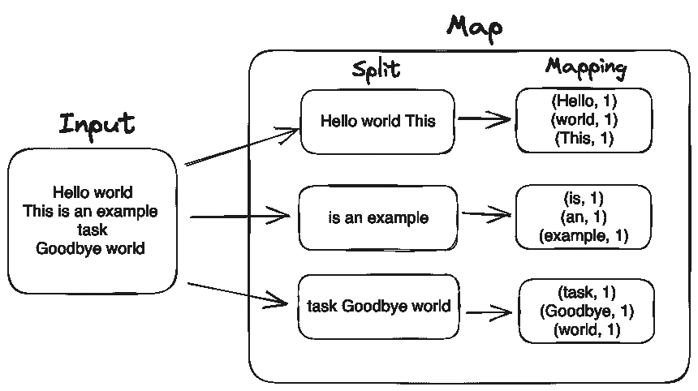
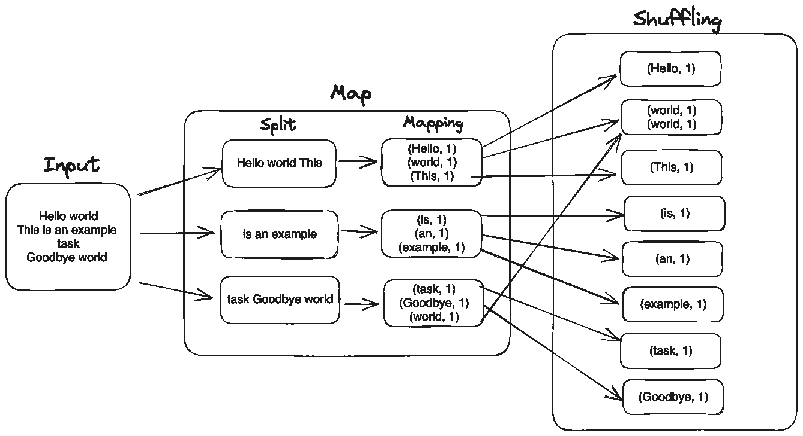
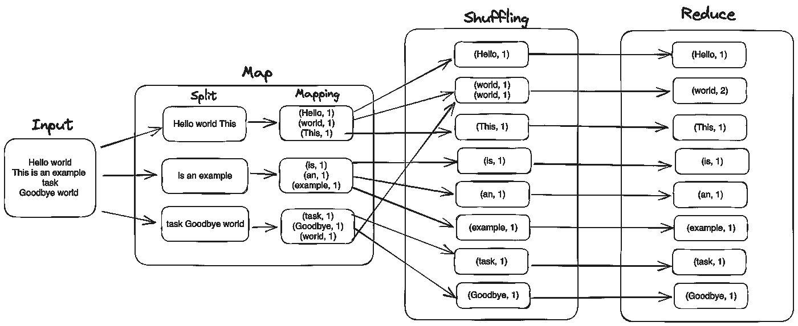

# 使用 MapReduce 进行大规模数据处理

> 原文：[`towardsdatascience.com/mapreduce-f0d8776d0fcf`](https://towardsdatascience.com/mapreduce-f0d8776d0fcf)

## 深入探讨 MapReduce 和并行化

 [Giorgos Myrianthous](https://gmyrianthous.medium.com/?source=post_page-----f0d8776d0fcf--------------------------------)

·发布于 [Towards Data Science](https://towardsdatascience.com/?source=post_page-----f0d8776d0fcf--------------------------------) ·4 分钟阅读·2023 年 7 月 19 日

--

图片由 [Luca Nicoletti](https://unsplash.com/@luca_nicoletti?utm_source=unsplash&utm_medium=referral&utm_content=creditCopyText) 提供，发布在 [Unsplash](https://unsplash.com/photos/fkA-hGDs-Y8?utm_source=unsplash&utm_medium=referral&utm_content=creditCopyText)

在当前的市场环境中，组织必须进行数据驱动的决策，以保持竞争力并促进创新。因此，每天都会收集大量数据。

尽管数据持久性问题在很大程度上已得到解决，这要归功于云存储的广泛可用性和价格实惠，现代组织仍然面临着高效有效处理大量数据的挑战。

在过去几十年中，出现了许多编程模型来解决大规模处理大数据的挑战。毫无疑问，MapReduce 是最受欢迎和有效的方法之一。

## 什么是 MapReduce

MapReduce 是一个分布式编程框架，最初由 [Jeffrey Dean 和 Sanjay Ghemawat 于 2004 年在 Google 开发](https://research.google/pubs/pub62/)，并受到函数式编程基本概念的启发。他们的提案涉及一个包含两个步骤的并行数据处理模型；*map* 和 *reduce*。

简单来说，*map* 步骤涉及将原始数据分割成小块，以便对每个数据块应用转换逻辑。因此，可以在创建的块上并行处理数据，最后，*reduce* 步骤将汇总/整合处理过的块，并将最终结果返回给调用者。

## MapReduce 算法如何工作

尽管 MapReduce 算法通常被认为是一个两步过程，但它实际上包含三个不同的阶段。

**1\. Map：** 在这个第一步骤中，数据被拆分成更小的块，并分布到通常属于处理单元集群的多个节点上。每个创建的块被分配给一个 *mapper*。Mapper 的输入是一组 `<key, value>` 对。数据处理执行后（依然是 `<key, value>` 形式），Mapper 会将生成的输出写入临时存储。

例如，我们可以考虑以下例子，其中输入文本首先被拆分到三个 Mapper 上，输入以键值对的形式提供。

MapReduce 算法的映射步骤 — 来源：作者

**2\. Shuffling：** 在这个步骤中，算法将数据洗牌，以便具有相同键的记录被分配到相同的工作节点。这通常是整个 MapReduce 过程生命周期中最昂贵的操作。

MapReduce 中的洗牌步骤 — 来源：作者

**3\. Reduce：** 在这最后一步中，每个 Reducer 将接受对应 Mapper 输出的 `<key, value>` 对作为输入。所有具有相同键的 Mapper 输出将分配给相同的 Reducer，Reducer 将汇总这些值，并将汇总结果以 `<key, value>` 对的形式返回。

Reduce 步骤中的 MapReduce — 来源：作者

## MapReduce 和 Hadoop

MapReduce 是 Apache Hadoop 框架的一部分，用于访问存储在 Hadoop 分布式文件系统（HDFS）中的数据。Hadoop 由四个基本模块组成：

+   *Hadoop Distributed File System (HDFS)*：这是一个分布式文件系统，可以以容错的方式存储大型数据集

+   *Yet Another Resource Negotiation (YARN)*：这是一个节点管理器，监控集群和资源，同时也作为作业调度器。

+   *MapReduce*

+   *Hadoop Common*：这是一个提供常用 Java 库的模块

之前我们提到过，Mapper 和 Reducer 在计算机集群的独立节点上运行。实际上，这些工作节点是 Hadoop 框架的一部分，该框架决定了每种情况下所需的 Mapper 数量，这取决于输入大小的体积。

Hadoop 设计时提供了容错功能。在节点发生故障时，Hadoop 会在另一个映射节点上重新运行任务并生成所需的输出。

## 最后的思考

MapReduce 在分布式计算中是一个突破性的概念，使许多组织能够处理大量数据并提取有价值的洞察。

熟悉这个概念至关重要，特别是在利用如 Spark 等依赖于 MapReduce 框架的技术时。

👉 [**成为会员**](https://gmyrianthous.medium.com/membership) **，在 Medium 上阅读所有故事。您的会员费直接支持我和您阅读的其他作者。您还将获得对 Medium 上每个故事的全面访问权限。**

 [## 通过我的推荐链接加入 Medium — Giorgos Myrianthous

### 成为 Medium 会员后，您的会员费的一部分将分配给您阅读的作者，并且您可以全面访问每个故事…

gmyrianthous.medium.com](https://gmyrianthous.medium.com/membership?source=post_page-----f0d8776d0fcf--------------------------------)
