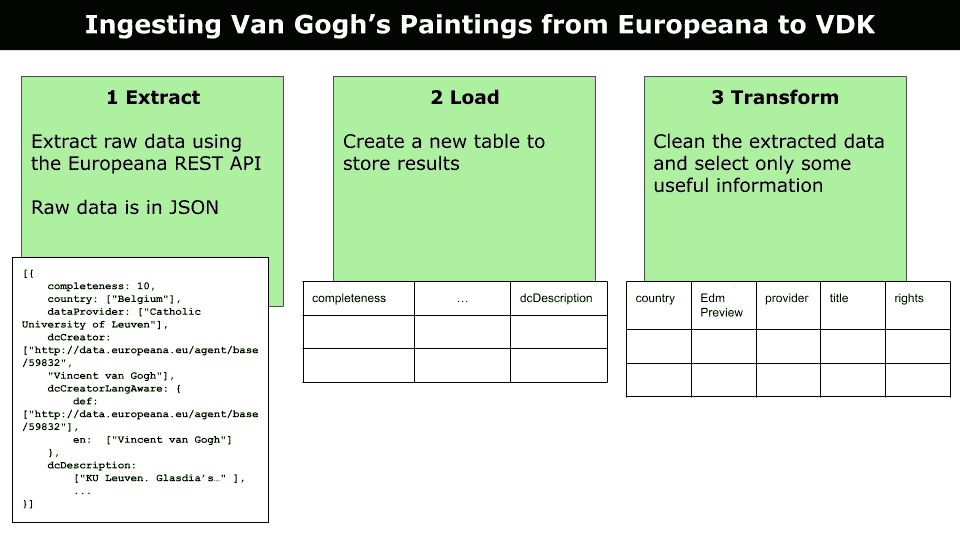
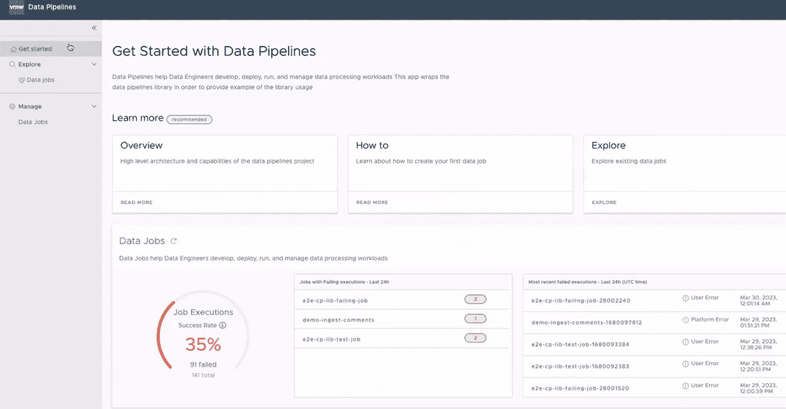

# 使用 Versatile Data Kit (VDK) 掌握批量数据处理

> 原文：[`towardsdatascience.com/mastering-batch-data-processing-with-versatile-data-kit-vdk-e631454819aa?source=collection_archive---------14-----------------------#2023-11-17`](https://towardsdatascience.com/mastering-batch-data-processing-with-versatile-data-kit-vdk-e631454819aa?source=collection_archive---------14-----------------------#2023-11-17)

## 数据管理

## 使用 VDK 进行批量数据处理的教程

[](https://alod83.medium.com/?source=post_page-----e631454819aa--------------------------------)[](https://towardsdatascience.com/?source=post_page-----e631454819aa--------------------------------) [Angelica Lo Duca](https://alod83.medium.com/?source=post_page-----e631454819aa--------------------------------)

·

[关注](https://medium.com/m/signin?actionUrl=https%3A%2F%2Fmedium.com%2F_%2Fsubscribe%2Fuser%2Ff8bc34d63aee&operation=register&redirect=https%3A%2F%2Ftowardsdatascience.com%2Fmastering-batch-data-processing-with-versatile-data-kit-vdk-e631454819aa&user=Angelica+Lo+Duca&userId=f8bc34d63aee&source=post_page-f8bc34d63aee----e631454819aa---------------------post_header-----------) 发布于 [Towards Data Science](https://towardsdatascience.com/?source=post_page-----e631454819aa--------------------------------) ·5 分钟阅读·2023 年 11 月 17 日[](https://medium.com/m/signin?actionUrl=https%3A%2F%2Fmedium.com%2F_%2Fvote%2Ftowards-data-science%2Fe631454819aa&operation=register&redirect=https%3A%2F%2Ftowardsdatascience.com%2Fmastering-batch-data-processing-with-versatile-data-kit-vdk-e631454819aa&user=Angelica+Lo+Duca&userId=f8bc34d63aee&source=-----e631454819aa---------------------clap_footer-----------)

--

[](https://medium.com/m/signin?actionUrl=https%3A%2F%2Fmedium.com%2F_%2Fbookmark%2Fp%2Fe631454819aa&operation=register&redirect=https%3A%2F%2Ftowardsdatascience.com%2Fmastering-batch-data-processing-with-versatile-data-kit-vdk-e631454819aa&source=-----e631454819aa---------------------bookmark_footer-----------)

图片由 [Mika Baumeister](https://unsplash.com/@mbaumi?utm_source=medium&utm_medium=referral) 提供，来源于 [Unsplash](https://unsplash.com/?utm_source=medium&utm_medium=referral)

[Versatile Data Kit](https://github.com/vmware/versatile-data-kit) (VDK) 是一个开源的数据摄取和处理框架，旨在简化数据管理的复杂性。虽然 VDK 能够处理各种数据集成任务，包括实时流处理，本文将重点介绍如何在批量数据处理中的应用。

本文涵盖：

+   介绍批量数据处理

+   在 VDK 中创建和管理批量处理管道

+   监控 VDK 中的批量数据处理

# 1 介绍批量数据处理

批量数据处理是一种在指定时间间隔处理大量数据的方法。批量数据必须是：

+   **时间独立**：数据不需要立即处理，通常不受实时要求的限制。与需要即时处理的流数据不同，批量数据可以在计划的时间间隔或资源可用时处理。

+   **可分块处理**：批量数据可以分成较小、更易于管理的段，而不是在单次资源密集型操作中处理整个数据集。这些段可以根据数据处理系统的能力，顺序或并行处理。

此外，批量数据可以离线处理，这意味着它不需要持续连接到数据源或外部服务。当数据源可能是间歇性的或暂时不可用时，这一特性尤为宝贵。

ELT（提取、加载、转换）是批量数据处理的典型用例。ELT 包括三个主要阶段：

+   **提取 (E)**：数据从多个不同格式的来源中提取，包括结构化和非结构化的数据。

+   **加载 (L)**：数据被加载到目标位置，例如数据仓库。

+   **转换 (T)**：提取的数据通常需要初步处理，例如清理、协调和转换为统一格式。

现在你已经了解了什么是批量数据处理，让我们进入下一步：在 VDK 中创建和管理批量处理管道。

# 2 在 VDK 中创建和管理批量处理管道

VDK 采用组件化的方法，允许你快速构建数据处理管道。有关 VDK 的介绍，请参见我之前的文章 多功能数据工具概述。本文假设你已经在计算机上安装了 VDK。

为了说明 VDK 中的批量处理管道是如何工作的，我们考虑一个需要执行 ELT 任务的场景。

想象一下，你想在 VDK 中导入和处理 [欧洲数字图书馆](https://www.europeana.eu/en) 上提供的文森特·梵高的画作，欧洲数字图书馆是一个著名的欧洲文化遗产聚合器。欧洲数字图书馆通过其公共 [REST API](https://pro.europeana.eu/page/intro#access) 提供所有文化遗产对象。关于文森特·梵高，欧洲数字图书馆提供了超过 700 件作品。

下图展示了在此场景下批量数据处理的步骤。



作者提供的图片

让我们逐点探讨。你可以在 [VDK GitHub 仓库](https://github.com/vmware/versatile-data-kit/tree/main/examples/online-exhibition) 中找到实现此场景的完整代码。

## 2.1 提取和加载

该阶段包括 VDK 作业调用 Europeana REST API 提取原始数据。具体而言，它定义了三个作业：

+   job1 — 删除现有的表（如果有的话）

+   job2 — 创建一个新表

+   job3 — 直接从 REST API 导入表格值。

此示例需要一个有效的互联网连接才能正确工作，以访问 Europeana REST API。此操作是一个批处理过程，因为它仅下载一次数据，不需要流式处理。

我们将把提取的数据存储在一个表中。这个任务的难点在于构建 REST API 之间的映射，这在 job3 中完成。

编写 job3 仅涉及编写 Python 代码来执行此映射，但不是将提取的文件保存到本地文件中，而是调用 VDK 函数（`job_input.send_tabular_data_for_ingestion`）将文件保存到 VDK，如下代码片段所示：

```py
import inspect
import logging
import os

import pandas as pd
import requests
from vdk.api.job_input import IJobInput

def run(job_input: IJobInput):
    """
    Download datasets required by the scenario and put them in the data lake.
    """
    log.info(f"Starting job step {__name__}")

    api_key = job_input.get_property("api_key")

    start = 1
    rows = 100
    basic_url = f"https://api.europeana.eu/record/v2/search.json?wskey={api_key}&query=who:%22Vincent%20Van%20Gogh%22"
    url = f"{basic_url}&rows={rows}&start={start}"

    response = requests.get(url)
    response.raise_for_status()
    payload = response.json()
    n_items = int(payload["totalResults"])

    while start < n_items:
        if start > n_items - rows:
            rows = n_items - start + 1

        url = f"{basic_url}&rows={rows}&start={start}"
        response = requests.get(url)
        response.raise_for_status()
        payload = response.json()["items"]

        df = pd.DataFrame(payload)
        job_input.send_tabular_data_for_ingestion(
            df.itertuples(index=False),
            destination_table="assets",
            column_names=df.columns.tolist(),
        )
        start = start + rows
```

有关完整代码，请参见 [GitHub 示例](https://github.com/vmware/versatile-data-kit/blob/main/examples/online-exhibition/online-exhibition/03_ingest_table_assets.py)。请注意，你需要一个免费的 API 密钥来从 Europeana 下载数据。

在提取阶段产生的输出是一个包含原始值的表格。

## 2.2 转换

该阶段涉及清理数据并提取相关信息。我们可以通过两个作业在 VDK 中实现相关工作：

+   job4 — 删除现有的表（如果有的话）

+   job5 — 创建清理后的表。

Job5 仅涉及编写 SQL 查询，如下代码片段所示：

```py
CREATE TABLE cleaned_assets AS (
    SELECT
        SUBSTRING(country, 3, LENGTH(country)-4) AS country,
        SUBSTRING(edmPreview, 3, LENGTH(edmPreview)-4) AS edmPreview,
        SUBSTRING(provider, 3, LENGTH(provider)-4) AS provider,
        SUBSTRING(title, 3, LENGTH(title)-4) AS title,
        SUBSTRING(rights, 3, LENGTH(rights)-4) AS rights
    FROM assets
)
```

在 VDK 中运行此作业将生成另一个名为 `cleaned_asset` 的表，包含处理后的值。最后，我们准备在某个地方使用清理后的数据。在我们的例子中，我们可以构建一个显示提取画作的 Web 应用程序。你可以在 [VDK GitHub 仓库](https://github.com/vmware/versatile-data-kit/blob/main/examples/online-exhibition/view.py) 中找到执行此任务的完整代码。

# 3 在 VDK 中监控批量数据处理

VDK 提供了 VDK UI，一个用于监控数据作业的图形用户界面。要安装 VDK UI，请按照 [此链接](https://www.youtube.com/watch?v=DLRGCCGUp0U) 中的官方 VDK 视频操作。下图显示了 VDK UI 的快照。



作者提供的图片

主要有两个页面：

+   **探索**：此页面使你能够探索数据作业，例如作业执行成功率、过去 24 小时内失败的作业以及过去 24 小时内失败次数最多的作业。

+   **管理**：此页面提供更多工作细节。你可以按列排序工作，搜索多个参数，通过某些列进行过滤，查看特定工作的来源，添加其他列等等。

观看以下官方 VDK 视频，了解如何使用 VDK UI。

# 总结

恭喜！你刚刚学会了如何在 VDK 中实现批量数据处理！这只需要接收原始数据，进行处理，然后最终将其用于你的目的！你可以在[VDK GitHub 仓库](https://github.com/vmware/versatile-data-kit/tree/main/examples)中找到许多其他示例。

关注[VDK](https://github.com/vmware/versatile-data-kit/tree/main)的最新数据处理进展和最佳实践。不断探索和完善你的专业技能！

# 其他你可能感兴趣的文章……

[## 多功能数据工具包概述](https://towardsdatascience.com/an-overview-of-versatile-data-kit-a812cfb26de7?source=post_page-----e631454819aa--------------------------------)

### 开始使用多功能数据工具包，这是一个让数据工程师工作更高效的框架

[## 在多功能数据工具包中处理缺失值](https://towardsdatascience.com/handling-missing-values-in-versatile-data-kit-bb4f2a907b9c?source=post_page-----e631454819aa--------------------------------)

### 如何使用 VDK 构建数据管道以处理缺失值的教程

[在多功能数据工具包中处理缺失值](https://towardsdatascience.com/handling-missing-values-in-versatile-data-kit-bb4f2a907b9c?source=post_page-----e631454819aa--------------------------------) [## 从原始数据到清洗数据库：深入探索多功能数据工具包

### 使用多功能数据工具包（VMware 最近发布的框架）和 Trino DB 的完整示例

[从原始数据到清洗数据库：深入探索多功能数据工具包](https://towardsdatascience.com/from-raw-data-to-a-cleaned-database-a-deep-dive-into-versatile-data-kit-ab5fd992a02e?source=post_page-----e631454819aa--------------------------------)
