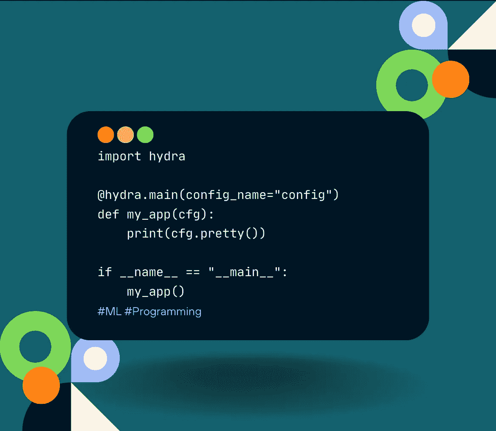

# 使用 Hydra 掌握机器学习中的配置管理

> 原文：[`towardsdatascience.com/mastering-configuration-ml-with-hydra-ef138f1c1852?source=collection_archive---------7-----------------------#2023-06-15`](https://towardsdatascience.com/mastering-configuration-ml-with-hydra-ef138f1c1852?source=collection_archive---------7-----------------------#2023-06-15)

## 掌握机器学习

## **深入现实世界的示例，以改变您在机器学习应用中的配置管理**

 [Joseph Robinson, Ph.D.](https://jvision.medium.com/?source=post_page-----ef138f1c1852--------------------------------)

·

[关注](https://medium.com/m/signin?actionUrl=https%3A%2F%2Fmedium.com%2F_%2Fsubscribe%2Fuser%2F8049fa781539&operation=register&redirect=https%3A%2F%2Ftowardsdatascience.com%2Fmastering-configuration-ml-with-hydra-ef138f1c1852&user=Joseph+Robinson%2C+Ph.D.&userId=8049fa781539&source=post_page-8049fa781539----ef138f1c1852---------------------post_header-----------) 发表在 [Towards Data Science](https://towardsdatascience.com/?source=post_page-----ef138f1c1852--------------------------------) ·18 min read·2023 年 6 月 15 日

--

# 概述

欢迎来到《使用 Hydra 掌握机器学习中的配置管理》！本教程旨在带您从 Hydra 的基础知识到高级配置管理技巧。我们还将探讨 Hydra 与高性能计算环境和流行机器学习框架的集成。无论是机器学习新手还是资深从业者，本教程将为您提供知识和技能，以提升您的机器学习工作流程。

由作者创建的图示。

# 目录

· I. 介绍

· II. Hydra 基础知识

∘ Hydra 的安装

∘ Hydra 应用程序的结构

∘ 理解 Hydra 的主要组件

· III. 层次化配置

∘ 定义和理解层次化配置文件

· IV. 配置组

∘ 理解配置组的概念

∘ 定义不同的设置：开发、暂存、生产

∘ 展示对可重复性和调试的影响

· V. 动态配置

∘ 解释…
