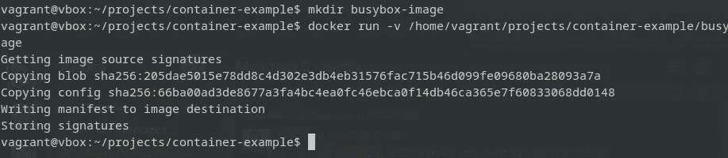
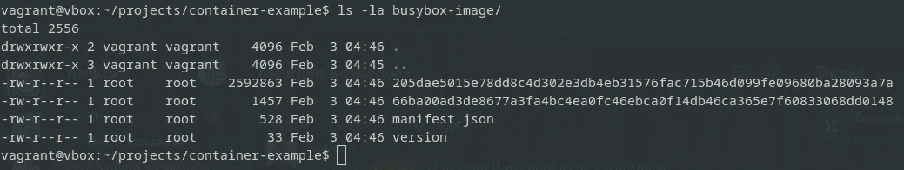
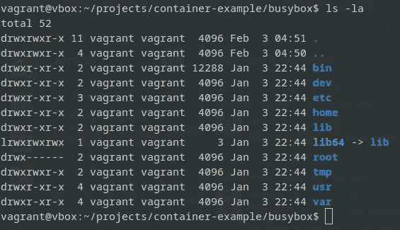
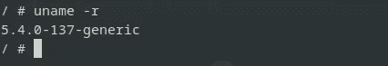
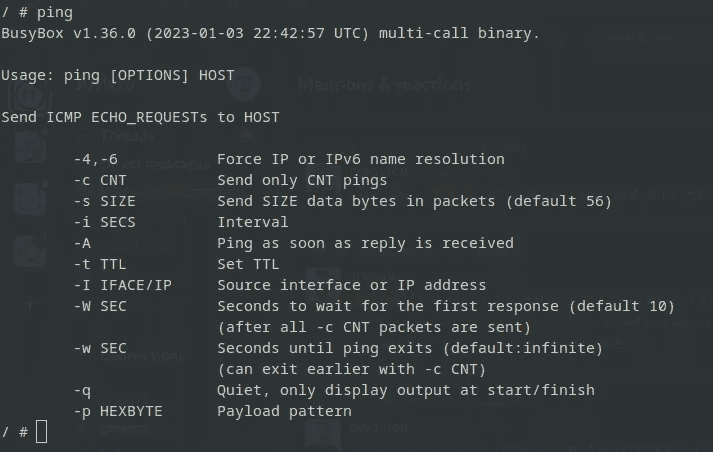

# 精通容器化：创建类似 Docker 环境的指南

> 原文：[`towardsdatascience.com/mastering-containerization-a-guide-to-creating-docker-like-environments-without-docker-121b3f444d2f`](https://towardsdatascience.com/mastering-containerization-a-guide-to-creating-docker-like-environments-without-docker-121b3f444d2f)

## 解锁容器化的力量：构建类似容器环境的逐步教程。

  [Dimitris Poulopoulos](https://dpoulopoulos.medium.com/?source=post_page-----121b3f444d2f--------------------------------)

·发布于 [Towards Data Science](https://towardsdatascience.com/?source=post_page-----121b3f444d2f--------------------------------) ·6 分钟阅读·2023 年 2 月 4 日

--


图片由 [Timelab Pro](https://unsplash.com/it/@timelabpro?utm_source=medium&utm_medium=referral) 提供，来源于 [Unsplash](https://unsplash.com/?utm_source=medium&utm_medium=referral)

容器彻底改变了我们部署和管理应用程序的方式，提供了无与伦比的便携性、可扩展性和一致性。

然而，你不应被 Docker 光鲜的外表吓到——是时候深入探讨使容器化成为可能的机制了。通过了解 Docker 的内部工作原理，你将更深刻地欣赏这项技术，并对你的操作系统有更广泛的理解。

本系列的最后三篇文章铺平了道路。我们讨论了名称空间、控制组（cgroups）和覆盖文件系统。这些是我们今天用来创建自己容器环境的基础组件。

[## 容器：它们如何在幕后工作，以及为何它们正在占领数据科学世界](https://towardsdatascience.com/containers-how-they-work-under-the-hood-and-why-theyre-taking-over-the-data-science-world-6b94702609aa?source=post_page-----121b3f444d2f--------------------------------)

### 初学者理解 Docker 魔力的指南

[## Linux Cgroups 的力量：容器如何控制它们的资源](https://towardsdatascience.com/the-power-of-linux-cgroups-how-containers-take-control-of-their-resources-ba564fef13b0?source=post_page-----121b3f444d2f--------------------------------)

### 使用 Linux 控制组优化容器资源分配

towardsdatascience.com](/the-power-of-linux-cgroups-how-containers-take-control-of-their-resources-ba564fef13b0?source=post_page-----121b3f444d2f--------------------------------) [](/exploring-the-power-of-overlay-file-systems-in-linux-containers-d846724ec06d?source=post_page-----121b3f444d2f--------------------------------) ## 探索 Linux 容器中 Overlay 文件系统的力量

### 利用独特而简单的分层概念解锁容器化的潜力

towardsdatascience.com

这篇教育性博客文章将指导你在不依赖 Docker 的情况下构建轻量级的隔离环境。你还不能完全取代 Docker！这仅仅是为了教育目的。Docker 提供的功能远不止创建容器。然而，过程才是最重要的。

你准备好揭开操作系统的秘密，并将你对容器化的理解提升到一个新的水平吗？系好安全带，拿上一杯咖啡，深入探索无 Docker 的容器化世界吧！

> [学习速率](https://www.dimpo.me/newsletter?utm_source=medium&utm_medium=article&utm_campaign=dockerless)是一个针对那些对 MLOps 世界感兴趣的人的新闻通讯。MLOps 是一个广泛的领域，旨在以高效和可重复的方式将 ML 模型投入生产。容器在这一流程中起着至关重要的作用。如果你想了解更多类似的话题，可以在[这里](https://www.dimpo.me/newsletter?utm_source=medium&utm_medium=article&utm_campaign=dockerless)订阅。你将会在每个月的最后一个星期六收到我的更新和关于最新 MLOps 新闻和文章的见解！

# 快速回顾

在这篇文章中，我们将深入探索容器的激动人心的世界。五分钟内，你应该能够在自己构建的类似容器的环境中运行你自己的 Linux 发行版。

正如我们在前言中所说，我们已经研究了今天要使用的基本概念。为了完整性，这里有一个快速回顾：

+   命名空间：命名空间是内核特性，允许你在单个 Linux 系统中创建隔离的环境。每个命名空间都有自己对系统的视图，这意味着在一个命名空间中的进程对其他命名空间中的进程毫无察觉。

+   控制组：Linux 控制组或 cgroups，是一种内核特性，允许管理员将 CPU、内存和 I/O 带宽等资源分配给进程组。

+   Overlay 文件系统：Overlay 文件系统允许将多个底层叠加在一起，创建数据的统一视图。在 Linux 容器的上下文中，Overlay 文件系统用于将容器所做的更改层叠在基础镜像之上，同时保持原始镜像完好无损。

现在我们知道了我们将使用的每个工具的功能，让我们开始使用它们。

# 头脑风暴

BusyBox 的磁盘占用大小在 1 到 5MB 之间（取决于变体），它是制作空间高效分发版的非常好的一种成分。

要创建一个 BusyBox 容器，你通常会运行以下命令：

```py
docker run -it --rm busybox
```

这个命令会在一个 BusyBox 容器内给你一个 shell。今天我们将尝试在不运行`docker run`命令的情况下实现类似的效果。

所以，首先，我们需要下载镜像。为此，我们将使用一个叫做[Skopeo](https://github.com/containers/skopeo)的工具。这一系列文章都涉及到容器，因此让我们利用它们的功能来下载我们想要的镜像，而无需安装 Skopeo。

创建一个名为`busybox-image`的目录，位置随你喜欢，然后运行以下命令：

```py
docker run -v /home/vagrant/projects/container-example/busybox-image:/busybox-image quay.io/skopeo/stable copy docker://docker.io/library/busybox:latest dir:/busybox-image
```

这是你应该看到的输出：



图片由作者提供

这个命令会将你创建的目录作为卷挂载到 Skopeo 容器中。然后，它会指示容器在该目录中下载 BusyBox 镜像。因此，如果你现在运行`ls`命令，你将能够在你创建的目录中看到下载的镜像：

```py
ls -la busybox-image/
```



图片由作者提供

你会看到一堆文件。我们关心的是最大文件的大小。让我们在一个新目录中解压它。首先，创建一个新目录并进入它：

```py
mkdir busybox && cd busybox
```

现在在`busybox`目录中解压镜像：

```py
tar xf ../busybox-image/205dae5015e78dd8c4d302e3db4eb31576fac715b46d099fe09680ba28093a7a
```

再次运行`ls`命令；你将看到 BusyBox 镜像的根文件系统：



图片由作者提供

返回上级目录，创建三个新目录：`upper`目录、`workdir`和`root`。我们在关于叠加文件系统的帖子中已经讲解了这些内容：

```py
mkdir upper workdir root
```

现在，让我们创建我们的叠加文件系统：

```py
sudo mount -t overlay -o lowerdir=busybox,upperdir=upper,workdir=workdir none root
```

太好了！现在，如果你运行`ls -la root`，你应该能够看到在你创建的`root`目录中 BusyBox 镜像的内容。正如我们在叠加文件系统教程中看到的，`root`目录提供了`lower`和`upper`目录的统一视图。然而，`lower`目录仍然是只读的，你所做的任何更改都将记录在`upper`目录中。这将保持我们的`busybox`基础镜像完整。

最后，让我们使用以下命令创建一个类似容器的环境：

```py
unshare -mipunUrf chroot ROOTFS /bin/bash
```

就这样！你完成了！运行`uname -r`来验证我们是否在 BusyBox 容器中：



图片由作者提供

你甚至可以运行一个熟悉的命令如`ping`，观察到你实际上调用的是 BusyBox 版本的命令：



图片由作者提供

目前，仍然有很多东西缺失。例如，你没有访问互联网的权限。运行 `ping` 或 `wget` 将不会有任何结果。但这需要等到另一个时间来处理。正如我们所说，这将不是一个生产就绪的环境，而是为了揭示 Docker 做的一些事情。

如果你想限制你的容器玩具的资源消耗，可以查看介绍中链接的控制组文章。这比你想象的要简单。

# 结论

总结一下，创建一个类似容器的环境而不使用 Docker 对任何开发者来说都是一种有价值的技能。无论你是想探索替代技术、解决兼容性问题，还是仅仅扩展对容器化的理解，这篇文章中涵盖的技术和工具都将帮助你实现目标。

通过遵循这个逐步教程，你可以自信且轻松地构建自己的轻量级、隔离的环境。会成功吗？还不能！请耐心等待下一篇文章！

记住，容器化是一个不断发展的领域，总有更多需要学习的东西。所以，继续探索、实验，并推动可能性极限吧！

# 关于作者

我的名字是 [Dimitris Poulopoulos](https://www.dimpo.me/?utm_source=medium&utm_medium=article&utm_campaign=dockerless)，我是 [Arrikto](https://www.arrikto.com/) 的机器学习工程师。我为欧洲委员会、欧洲统计局、国际货币基金组织、欧洲中央银行、经济合作与发展组织和宜家等主要客户设计和实施了人工智能和软件解决方案。

如果你有兴趣阅读更多关于机器学习、深度学习、数据科学和数据操作的文章，可以在 [Medium](https://towardsdatascience.com/medium.com/@dpoulopoulos/follow)、[LinkedIn](https://www.linkedin.com/in/dpoulopoulos/) 或 Twitter 上关注 [@james2pl](https://twitter.com/james2pl)。

所表达的观点仅代表我个人，并不代表我雇主的观点或意见。
