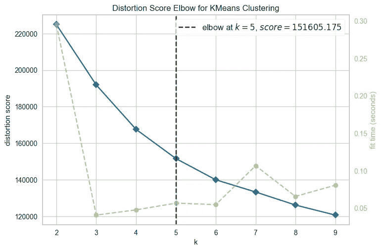

# 掌握客户细分的终极技巧

> 原文：[`towardsdatascience.com/mastering-customer-segmentation-with-llm-3d9008235f41?source=collection_archive---------0-----------------------#2023-09-26`](https://towardsdatascience.com/mastering-customer-segmentation-with-llm-3d9008235f41?source=collection_archive---------0-----------------------#2023-09-26)

## 利用 LLM 解锁高级客户细分技术，并通过先进技术改进你的聚类模型

[](https://medium.com/@damiangilgonzalez?source=post_page-----3d9008235f41--------------------------------)[](https://towardsdatascience.com/?source=post_page-----3d9008235f41--------------------------------) [Damian Gil](https://medium.com/@damiangilgonzalez?source=post_page-----3d9008235f41--------------------------------)

·

[关注](https://medium.com/m/signin?actionUrl=https%3A%2F%2Fmedium.com%2F_%2Fsubscribe%2Fuser%2F87864cbc1dda&operation=register&redirect=https%3A%2F%2Ftowardsdatascience.com%2Fmastering-customer-segmentation-with-llm-3d9008235f41&user=Damian+Gil&userId=87864cbc1dda&source=post_page-87864cbc1dda----3d9008235f41---------------------post_header-----------) 发布于 [Towards Data Science](https://towardsdatascience.com/?source=post_page-----3d9008235f41--------------------------------) ·24 分钟阅读·2023 年 9 月 26 日

--

[](https://medium.com/m/signin?actionUrl=https%3A%2F%2Fmedium.com%2F_%2Fbookmark%2Fp%2F3d9008235f41&operation=register&redirect=https%3A%2F%2Ftowardsdatascience.com%2Fmastering-customer-segmentation-with-llm-3d9008235f41&source=-----3d9008235f41---------------------bookmark_footer-----------)

# 内容目录

**·** **简介** **·** **数据** **·** **方法 1: Kmeans** **·** **方法 2: K-Prototype** **·** **方法 3: LLM + Kmeans** **·** **结论**

# 简介

客户细分项目可以通过多种方式进行。在这篇文章中，我将教你高级技术，不仅是定义簇，还包括分析结果。此帖面向那些希望掌握多种工具以解决聚类问题并向成为资深数据科学家迈进的数据科学家。

> 我们在这篇文章中会看到什么？

让我们来看看三种方法来处理这种类型的项目：

+   **Kmeans**

+   **K-Prototype**

+   **LLM + Kmeans**

作为一个小预览，我将展示以下不同模型创建的二维表示（PCA）的比较：


**三种方法的图形比较**（图片由作者提供）。

你还将学习诸如以下的降维技术：

+   **PCA**

+   **t-SNE**

+   **MCA**

结果如下：


**三种降维方法的图形比较**（图片由作者提供）。

你可以在[**这里**](https://github.com/damiangilgonzalez1995/Clustering-with-LLM)找到带有笔记本的项目。你也可以查看我的 github：

[](https://github.com/damiangilgonzalez1995?source=post_page-----3d9008235f41--------------------------------) [## damiangilgonzalez1995 - 概述

### 对数据充满热情，我从物理学转行到了数据科学。曾在 Telefonica、HP 工作，现在担任 CTO…

github.com](https://github.com/damiangilgonzalez1995?source=post_page-----3d9008235f41--------------------------------)

一个非常重要的说明是，这不是一个完整的项目。这是因为我们跳过了这种类型项目中最重要的部分之一：**探索性数据分析（EDA）阶段或变量选择。**

# 数据

本项目使用的原始数据来自公开的 Kaggle：[银行数据集 — 市场营销目标](https://www.kaggle.com/datasets/prakharrathi25/banking-dataset-marketing-targets)。此数据集中的每一行包含有关公司客户的信息。一些字段是数值型的，其他的是分类的，我们将看到这扩展了处理问题的可能方法。

我们只会保留前 8 列。我们的数据集如下所示：


让我们简要了解一下数据集中的列：

+   **年龄**（数值型）

+   **工作**：工作类型（分类： “行政”，“未知”，“失业”，“管理”，“家政”，“企业家”，“学生”，“蓝领”，“自雇”，“退休”，“技术人员”，“服务”）

+   **婚姻状况**：婚姻状态（分类： “已婚”，“离婚”，“单身”；注：“离婚”指离婚或丧偶）

+   **教育**（分类： “未知”，“中等”，“小学”，“高等”）

+   **违约**：是否有信用违约？（二元： “是”，“否”）

+   **余额**：年平均余额，单位欧元（数值型）

+   **住房**：是否有住房贷款？（二元： “是”，“否”）

+   **贷款**：是否有个人贷款？（二元： “是”，“否”）

对于这个项目，我利用了 Kaggle 提供的训练数据集。[**在项目仓库**](https://github.com/damiangilgonzalez1995/Clustering-with-LLM)中，你可以找到***“data”***文件夹，其中存储了用于项目的压缩数据集文件。此外，你还会在压缩文件内找到两个 CSV 文件，一个是 Kaggle 提供的训练数据集**（train.csv）**，另一个是经过嵌入处理后的数据集（**embedding_train.csv**），我们将在稍后进一步解释。

为了进一步澄清项目的结构，展示了项目树：

```py
clustering_llm
├─ data
│  ├─ data.rar
├─ img
├─ embedding.ipynb
├─ embedding_creation.py
├─ kmeans.ipynb
├─ kprototypes.ipynb
├─ README.md
└─ requirements.txt
```

# 方法 1：Kmeans

这是最常见的方法，也是你一定熟悉的方法。无论如何，我们将研究它，因为我将在这些情况下展示高级分析技巧。你可以在名为[**kmeans.ipynb**](https://github.com/damiangilgonzalez1995/Clustering-with-LLM/blob/main/kmeans.ipynb)的 Jupyter 笔记本中找到完整的过程。

## 预处理

变量的预处理如下：

1.  这包括将分类变量转换为数值变量。

    我们将对名义变量应用 Onehot 编码器，对序数特征（*教育*）应用 OrdinalEncoder。

1.  我们尝试确保数值变量具有高斯分布。为此，我们将应用 PowerTransformer。

让我们看看它在代码中是如何表现的。

```py
import pandas as pd # dataframe manipulation
import numpy as np # linear algebra

# data visualization
import matplotlib.pyplot as plt
import matplotlib.cm as cm
import plotly.express as px
import plotly.graph_objects as go
import seaborn as sns
import shap

# sklearn 
from sklearn.cluster import KMeans
from sklearn.preprocessing import PowerTransformer, OrdinalEncoder
from sklearn.pipeline import Pipeline
from sklearn.manifold import TSNE
from sklearn.metrics import silhouette_score, silhouette_samples, accuracy_score, classification_report

from pyod.models.ecod import ECOD
from yellowbrick.cluster import KElbowVisualizer

import lightgbm as lgb
import prince

# Read file
df = pd.read_csv("train.csv", sep = ";")
df = df.iloc[:, 0:8]

# Preprocessing part
categorical_transformer_onehot = Pipeline(
    steps=[
        ("encoder", OneHotEncoder(handle_unknown="ignore", drop="first", sparse=False))
    ])

categorical_transformer_ordinal = Pipeline(
    steps=[
        ("encoder", OrdinalEncoder())
    ])

num = Pipeline(
    steps=[
        ("encoder", PowerTransformer())
    ])

preprocessor  = ColumnTransformer(transformers = [
                ('cat_onehot', categorical_transformer_onehot, ["default", "housing", "loan", "job", "marital"]),
                ('cat_ordinal', categorical_transformer_ordinal, ["education"]),
                ('num', num, ["age", "balance"])
                ])

pipeline = Pipeline(
    steps=[("preprocessor", preprocessor)]
    )
pipe_fit = pipeline.fit(df)

data = pd.DataFrame(pipe_fit.transform(df), columns = pipe_fit.get_feature_names_out().tolist())

print(data.columns.tolist())

# OUTPUT
['cat_onehot__default_yes',
 'cat_onehot__housing_yes',
 'cat_onehot__loan_yes',
 'cat_onehot__job_blue-collar',
 'cat_onehot__job_entrepreneur',
 'cat_onehot__job_housemaid',
 'cat_onehot__job_management',
 'cat_onehot__job_retired',
 'cat_onehot__job_self-employed',
 'cat_onehot__job_services',
 'cat_onehot__job_student',
 'cat_onehot__job_technician',
 'cat_onehot__job_unemployed',
 'cat_onehot__job_unknown',
 'cat_onehot__marital_married',
 'cat_onehot__marital_single',
 'cat_ordinal__education',
 'num__age',
 'num__balance']
```

输出：


## 异常值

关键在于我们的数据中异常值要尽可能少，因为 Kmeans 对异常值非常敏感。我们可以使用 z 分数的典型方法来选择异常值，但在这篇文章中我将展示一种更高级且酷的方法。

那么，这种方法是什么呢？我们将使用[Python 异常检测（PyOD）库](https://pyod.readthedocs.io/en/latest/)。这个库专注于检测不同情况下的异常值。更具体来说，我们将使用**ECOD**方法（“**用于异常检测的经验累积分布函数**”）。

该方法旨在获取数据的分布，从而了解哪些值的概率密度较低（异常值）。如果你想的话，可以看看[Github](https://medium.com/r?url=https%3A%2F%2Fgithub.com%2Fyzhao062%2Fpyod)。

```py
from pyod.models.ecod import ECOD

clf = ECOD()
clf.fit(data)
outliers = clf.predict(data) 

data["outliers"] = outliers

# Data without outliers
data_no_outliers = data[data["outliers"] == 0]
data_no_outliers = data_no_outliers.drop(["outliers"], axis = 1)

# Data with Outliers
data_with_outliers = data.copy()
data_with_outliers = data_with_outliers.drop(["outliers"], axis = 1)

print(data_no_outliers.shape) -> (40690, 19)
print(data_with_outliers.shape) -> (45211, 19) 
```

## 建模

使用 Kmeans 算法的一个缺点是你必须选择要使用的簇数。在这种情况下，为了获取这些数据，我们将使用[肘部法则](https://www.geeksforgeeks.org/elbow-method-for-optimal-value-of-k-in-kmeans/)。它的原理是计算簇内点与其质心之间的失真。目标很明确，尽量减少失真。在这种情况下，我们使用以下代码：

```py
from yellowbrick.cluster import KElbowVisualizer

# Instantiate the clustering model and visualizer
km = KMeans(init="k-means++", random_state=0, n_init="auto")
visualizer = KElbowVisualizer(km, k=(2,10))

visualizer.fit(data_no_outliers)        # Fit the data to the visualizer
visualizer.show() 
```

输出：



**不同簇数的肘部评分**（作者提供的图片）。

我们看到从**k=5**开始，失真没有明显变化。理想的情况是，从 k=5 开始，行为几乎保持平坦。这种情况很少发生，可以应用其他方法来确定最优的集群数量。为了确保，我们可以进行[**Silhouette**](https://www.scikit-yb.org/en/latest/api/cluster/silhouette.html) **可视化**。代码如下：

```py
from sklearn.metrics import davies_bouldin_score, silhouette_score, silhouette_samples
import matplotlib.cm as cm

def make_Silhouette_plot(X, n_clusters):
    plt.xlim([-0.1, 1])
    plt.ylim([0, len(X) + (n_clusters + 1) * 10])
    clusterer = KMeans(n_clusters=n_clusters, max_iter = 1000, n_init = 10, init = 'k-means++', random_state=10)
    cluster_labels = clusterer.fit_predict(X)
    silhouette_avg = silhouette_score(X, cluster_labels)
    print(
        "For n_clusters =", n_clusters,
        "The average silhouette_score is :", silhouette_avg,
    )
# Compute the silhouette scores for each sample
    sample_silhouette_values = silhouette_samples(X, cluster_labels)
    y_lower = 10
    for i in range(n_clusters):
        ith_cluster_silhouette_values = sample_silhouette_values[cluster_labels == i]
        ith_cluster_silhouette_values.sort()
        size_cluster_i = ith_cluster_silhouette_values.shape[0]
        y_upper = y_lower + size_cluster_i
        color = cm.nipy_spectral(float(i) / n_clusters)
        plt.fill_betweenx(
            np.arange(y_lower, y_upper),
            0,
            ith_cluster_silhouette_values,
            facecolor=color,
            edgecolor=color,
            alpha=0.7,
        )
        plt.text(-0.05, y_lower + 0.5 * size_cluster_i, str(i))
        y_lower = y_upper + 10
        plt.title(f"The Silhouette Plot for n_cluster = {n_clusters}", fontsize=26)
        plt.xlabel("The silhouette coefficient values", fontsize=24)
        plt.ylabel("Cluster label", fontsize=24)
        plt.axvline(x=silhouette_avg, color="red", linestyle="--")
        plt.yticks([])  
        plt.xticks([-0.1, 0, 0.2, 0.4, 0.6, 0.8, 1])

range_n_clusters = list(range(2,10))

for n_clusters in range_n_clusters:
    print(f"N cluster: {n_clusters}")
    make_Silhouette_plot(data_no_outliers, n_clusters)   
    plt.savefig('Silhouette_plot_{}.png'.format(n_clusters))
    plt.close()

OUTPUT:

"""
N cluster: 2
For n_clusters = 2 The average silhouette_score is : 0.18111287366156115
N cluster: 3
For n_clusters = 3 The average silhouette_score is : 0.16787543108034586
N cluster: 4
For n_clusters = 4 The average silhouette_score is : 0.1583411958880734
N cluster: 5
For n_clusters = 5 The average silhouette_score is : 0.1672987260052535
N cluster: 6
For n_clusters = 6 The average silhouette_score is : 0.15485098506258177
N cluster: 7
For n_clusters = 7 The average silhouette_score is : 0.1495307642182009
N cluster: 8
For n_clusters = 8 The average silhouette_score is : 0.15098396457075294
N cluster: 9
For n_clusters = 9 The average silhouette_score is : 0.14842917303536465
"""
```

可以看出，最高的轮廓得分是在 n_cluster=9 时获得的，但如果与其他得分比较，得分的变化确实很小。目前，之前的结果并没有提供太多信息。另一方面，之前的代码创建了轮廓可视化，这为我们提供了更多信息：


**不同集群数量的轮廓方法的图形表示**（作者提供的图片）。

由于深入理解这些表示并不是本文的目标，我将总结为似乎没有非常明确的决定哪个数字最好。在查看了之前的表示后，我们可以选择**K=5 或 K=6**。这是因为对于不同的集群，它们的轮廓得分都高于平均值，并且集群大小没有不平衡。此外，在某些情况下，市场部门可能会希望拥有最少的集群/客户类型（这可能会或不会发生）。

最后，我们可以创建 Kmeans 模型，K=5。

```py
km = KMeans(n_clusters=5,
            init='k-means++', 
            n_init=10,
            max_iter=100, 
            random_state=42)

clusters_predict = km.fit_predict(data_no_outliers)

"""
clusters_predict -> array([4, 2, 0, ..., 3, 4, 3])
np.unique(clusters_predict) -> array([0, 1, 2, 3, 4])
"""
```

## 评估

评估 kmeans 模型的方法比其他模型稍微开放一些。我们可以使用

+   指标

+   可视化

+   解释（对公司来说非常重要）。

关于**模型评估指标**，我们可以使用以下代码：

```py
from sklearn.metrics import silhouette_score
from sklearn.metrics import calinski_harabasz_score
from sklearn.metrics import davies_bouldin_score

"""
The Davies Bouldin index is defined as the average similarity measure 
of each cluster with its most similar cluster, where similarity 
is the ratio of within-cluster distances to between-cluster distances.

The minimum value of the DB Index is 0, whereas a smaller 
value (closer to 0) represents a better model that produces better clusters.
"""
print(f"Davies bouldin score: {davies_bouldin_score(data_no_outliers,clusters_predict)}")

"""
Calinski Harabaz Index -> Variance Ratio Criterion.

Calinski Harabaz Index is defined as the ratio of the 
sum of between-cluster dispersion and of within-cluster dispersion.

The higher the index the more separable the clusters.
"""
print(f"Calinski Score: {calinski_harabasz_score(data_no_outliers,clusters_predict)}")

"""
The silhouette score is a metric used to calculate the goodness of 
fit of a clustering algorithm, but can also be used as 
a method for determining an optimal value of k (see here for more).

Its value ranges from -1 to 1.
A value of 0 indicates clusters are overlapping and either
the data or the value of k is incorrect.

1 is the ideal value and indicates that clusters are very 
dense and nicely separated.
"""
print(f"Silhouette Score: {silhouette_score(data_no_outliers,clusters_predict)}")

OUTPUT:

"""Davies bouldin score: 1.676769775662788
Calinski Score: 6914.705500337112
Silhouette Score: 0.16729335453305272
"""
```

据显示，我们没有一个特别好的模型。**Davies 得分**告诉我们集群之间的距离相当小。

这可能由几个因素造成，但请记住，模型的能量就是数据；如果数据没有足够的预测能力，你不能期望得到卓越的结果。

对于**可视化**，我们可以使用**降维方法，PCA**。我们将使用[**Prince**](https://github.com/MaxHalford/prince)库，专注于探索性分析和降维。如果你愿意，也可以使用 Sklearn 的 PCA，它们是相同的。

首先，我们将计算 3D 中的主成分，然后进行表示。这是前面步骤执行的两个功能：

```py
import prince
import plotly.express as px

def get_pca_2d(df, predict):

    pca_2d_object = prince.PCA(
    n_components=2,
    n_iter=3,
    rescale_with_mean=True,
    rescale_with_std=True,
    copy=True,
    check_input=True,
    engine='sklearn',
    random_state=42
    )

    pca_2d_object.fit(df)

    df_pca_2d = pca_2d_object.transform(df)
    df_pca_2d.columns = ["comp1", "comp2"]
    df_pca_2d["cluster"] = predict

    return pca_2d_object, df_pca_2d

def get_pca_3d(df, predict):

    pca_3d_object = prince.PCA(
    n_components=3,
    n_iter=3,
    rescale_with_mean=True,
    rescale_with_std=True,
    copy=True,
    check_input=True,
    engine='sklearn',
    random_state=42
    )

    pca_3d_object.fit(df)

    df_pca_3d = pca_3d_object.transform(df)
    df_pca_3d.columns = ["comp1", "comp2", "comp3"]
    df_pca_3d["cluster"] = predict

    return pca_3d_object, df_pca_3d

def plot_pca_3d(df, title = "PCA Space", opacity=0.8, width_line = 0.1):

    df = df.astype({"cluster": "object"})
    df = df.sort_values("cluster")

    fig = px.scatter_3d(
          df, 
          x='comp1', 
          y='comp2', 
          z='comp3',
          color='cluster',
          template="plotly",

          # symbol = "cluster",

          color_discrete_sequence=px.colors.qualitative.Vivid,
          title=title).update_traces(
              # mode = 'markers',
              marker={
                  "size": 4,
                  "opacity": opacity,
                  # "symbol" : "diamond",
                  "line": {
                      "width": width_line,
                      "color": "black",
                  }
              }
          ).update_layout(
                  width = 800, 
                  height = 800, 
                  autosize = True, 
                  showlegend = True,
                  legend=dict(title_font_family="Times New Roman",
                              font=dict(size= 20)),
                  scene = dict(xaxis=dict(title = 'comp1', titlefont_color = 'black'),
                              yaxis=dict(title = 'comp2', titlefont_color = 'black'),
                              zaxis=dict(title = 'comp3', titlefont_color = 'black')),
                  font = dict(family = "Gilroy", color  = 'black', size = 15))

    fig.show()
```

不用过于担心这些功能，按如下方式使用它们：

```py
pca_3d_object, df_pca_3d = pca_plot_3d(data_no_outliers, clusters_predict)
plot_pca_3d(df_pca_3d, title = "PCA Space", opacity=1, width_line = 0.1)
print("The variability is :", pca_3d_object.eigenvalues_summary)
```

输出：


**PCA 空间及模型创建的集群**（作者提供的图片）。

可以看出，集群之间几乎没有分隔，也没有明确的划分。这与指标提供的信息一致。

> 需要牢记的一点是 PCA 和 **特征向量的变异性**，这是很少有人关注的。

假设每个领域包含一定量的信息，这会增加它的信息量。如果前 3 个主要组件的累积和约为 80% 的变异性，我们可以说这是可以接受的，并且在表示中获得了良好的结果。如果这个值较低，我们必须对可视化结果持保留态度，因为我们遗漏了其他特征向量中包含的大量信息。

> 接下来的问题很明显：PCA 执行的变异性是多少？

答案如下：


如图所示，我们用前三个组件的变异性为 27.98%，这不足以得出有根据的结论。

当我们应用 PCA 方法时，由于它是线性算法，它无法捕捉更复杂的关系。幸运的是，有一种称为 **t-SNE** 的方法，能够捕捉到 ***这些复杂的多项式关系***。这可以帮助我们进行可视化，因为我们之前的方法效果不佳。

如果你在自己的计算机上尝试，请记住这会有较高的计算成本。因此，我对原始数据集进行了抽样，但仍然花了大约 5 分钟才得到结果。代码如下：

```py
from sklearn.manifold import TSNE

sampling_data = data_no_outliers.sample(frac=0.5, replace=True, random_state=1)
sampling_clusters = pd.DataFrame(clusters_predict).sample(frac=0.5, replace=True, random_state=1)[0].values

df_tsne_3d = TSNE(
                  n_components=3, 
                  learning_rate=500, 
                  init='random', 
                  perplexity=200, 
                  n_iter = 5000).fit_transform(sampling_data)

df_tsne_3d = pd.DataFrame(df_tsne_3d, columns=["comp1", "comp2",'comp3'])
df_tsne_3d["cluster"] = sampling_clusters
plot_pca_3d(df_tsne_3d, title = "PCA Space", opacity=1, width_line = 0.1)
```

结果，我得到了以下图像。它显示了聚类之间更清晰的分离，但不幸的是，我们仍然没有得到很好的结果。


**t-SNE 空间和模型创建的聚类**（作者提供的图像）。

实际上，我们可以比较 **PCA 和 t-SNE 在 2 维中的降维效果**。使用第二种方法的改进是显而易见的。


**不同降维方法和模型定义的聚类的不同结果**（作者提供的图像）。

最后，让我们稍微探讨一下模型的工作原理，哪些特征最重要，以及聚类的主要特征是什么。

为了查看每个变量的重要性，我们将使用这种情况中的典型“技巧”。我们将创建一个分类模型，其中“X”是 Kmeans 模型的输入，而“y”是 Kmeans 模型预测的聚类。

选择的模型是 [**LGBMClassifier**](https://lightgbm.readthedocs.io/en/latest/pythonapi/lightgbm.LGBMClassifier.html)。这个模型非常强大，并且能很好地处理分类和数值变量。在训练好新模型后，使用 [**SHAP**](https://shap.readthedocs.io/en/latest/) 库，我们可以获取每个特征在预测中的重要性。代码如下：

```py
import lightgbm as lgb
import shap

# We create the LGBMClassifier model and train it
clf_km = lgb.LGBMClassifier(colsample_by_tree=0.8)
clf_km.fit(X=data_no_outliers, y=clusters_predict)

#SHAP values
explainer_km = shap.TreeExplainer(clf_km)
shap_values_km = explainer_km.shap_values(data_no_outliers)
shap.summary_plot(shap_values_km, data_no_outliers, plot_type="bar", plot_size=(15, 10))
```

输出：


**模型中变量的重要性**（作者提供的图像）。

可以看出特征***age***具有最大的预测能力。还可以看出，簇编号 3（绿色）主要通过***balance***变量区分。

最终，我们必须分析簇的特征。这部分研究对业务至关重要。我们将为每个簇获取数据集中每个特征的均值（对于数值变量）和最频繁的值（对于分类变量）：

```py
df_no_outliers = df[df.outliers == 0]
df_no_outliers["cluster"] = clusters_predict

df_no_outliers.groupby('cluster').agg(
    {
        'job': lambda x: x.value_counts().index[0],
        'marital': lambda x: x.value_counts().index[0],
        'education': lambda x: x.value_counts().index[0],
        'housing': lambda x: x.value_counts().index[0],
        'loan': lambda x: x.value_counts().index[0],
        'contact': lambda x: x.value_counts().index[0],
        'age':'mean',
        'balance': 'mean',
        'default': lambda x: x.value_counts().index[0],

    }
).reset_index()
```

输出：


我们看到**job=blue-collar**的簇在特征之间没有很大的差异，除了年龄特征。这是不理想的，因为很难区分每个簇的客户。在**job=management**的情况下，我们得到更好的差异化。

经过不同方式的分析，它们得出了相同的结论：**“我们需要改进结果”**。

# 方法 2：K-Prototype

如果我们记住原始数据集，我们会看到我们有分类和数值变量。不幸的是，Skelearn 提供的 Kmeans 算法不接受分类变量，迫使原始数据集被修改并严重改变。

幸运的是，你与我和我的帖子一起前进。但最重要的是，感谢**ZHEXUE HUANG**及其文章[**Extensions to the k-Means Algorithm for Clustering Large Data Sets with Categorical Values**](https://citeseerx.ist.psu.edu/viewdoc/download?doi=10.1.1.15.4028&rep=rep1&type=pdf)，存在一种接受分类变量的聚类算法。这个算法叫做**K-Prototype**。提供它的书店是[**Prince**](https://github.com/MaxHalford/prince/blob/master/README.md)。

程序与之前的情况相同。为了不让这篇文章变得冗长，我们直接进入最有趣的部分。但请记住，您可以通过[**Jupyter notebook 这里**](https://github.com/damiangilgonzalez1995/Clustering-with-LLM/blob/main/kprototypes.ipynb)访问。

## 预处理

由于我们有数值变量，我们必须对其进行某些修改。通常建议所有数值变量处于类似的尺度上，并且分布尽可能接近高斯分布。我们将用于创建模型的数据集是这样创建的：

```py
pipe = Pipeline([('scaler', PowerTransformer())])

df_aux = pd.DataFrame(pipe_fit.fit_transform(df_no_outliers[["age", "balance"]] ), columns = ["age", "balance"])
df_no_outliers_norm = df_no_outliers.copy()
# Replace age and balance columns by preprocessed values
df_no_outliers_norm = df_no_outliers_norm.drop(["age", "balance"], axis = 1)
df_no_outliers_norm["age"] = df_aux["age"].values
df_no_outliers_norm["balance"] = df_aux["balance"].values
df_no_outliers_norm
```


## 异常值

由于我提出的异常值检测方法**(ECOD)**仅接受数值变量，因此必须进行与 kmeans 方法相同的转换。我们应用异常值检测模型，这将告诉我们要删除哪些行，最后留下我们将作为 K-Prototype 模型输入的数据集：


## 建模

我们创建模型，为此我们首先需要获得最佳的 k。为此，我们使用**Elbow Method**和这段代码：

```py
# Choose optimal K using Elbow method
from kmodes.kprototypes import KPrototypes
from plotnine import *
import plotnine
cost = []
range_ = range(2, 15)
for cluster in range_:

        kprototype = KPrototypes(n_jobs = -1, n_clusters = cluster, init = 'Huang', random_state = 0)
        kprototype.fit_predict(df_no_outliers, categorical = categorical_columns_index)
        cost.append(kprototype.cost_)
        print('Cluster initiation: {}'.format(cluster))

# Converting the results into a dataframe and plotting them
df_cost = pd.DataFrame({'Cluster':range_, 'Cost':cost})
# Data viz
plotnine.options.figure_size = (8, 4.8)
(
    ggplot(data = df_cost)+
    geom_line(aes(x = 'Cluster',
                  y = 'Cost'))+
    geom_point(aes(x = 'Cluster',
                   y = 'Cost'))+
    geom_label(aes(x = 'Cluster',
                   y = 'Cost',
                   label = 'Cluster'),
               size = 10,
               nudge_y = 1000) +
    labs(title = 'Optimal number of cluster with Elbow Method')+
    xlab('Number of Clusters k')+
    ylab('Cost')+
    theme_minimal()
)
```

输出：


**不同聚类数量的肘部评分**（图像由作者提供）。

我们可以看到，最佳选项是**K=5**。

小心，因为这个算法比通常使用的算法要慢一点。对于之前的图表，需要 86 分钟，这一点需要注意。


好的，我们现在已经明确了聚类数量，只需要创建模型：

```py
# We get the index of categorical columns
numerics = ['int16', 'int32', 'int64', 'float16', 'float32', 'float64']
categorical_columns = df_no_outliers_norm.select_dtypes(exclude=numerics).columns
print(categorical_columns)
categorical_columns_index = [df_no_outliers_norm.columns.get_loc(col) for col in categorical_columns]

# Create the model
cluster_num = 5
kprototype = KPrototypes(n_jobs = -1, n_clusters = cluster_num, init = 'Huang', random_state = 0)
kprototype.fit(df_no_outliers_norm, categorical = categorical_columns_index)
clusters = kprototype.predict(df_no_outliers , categorical = categorical_columns_index)

print(clusters) " -> array([3, 1, 1, ..., 1, 1, 2], dtype=uint16)"
```

我们已经有了我们的模型及其预测，现在只需要对其进行评估。

## 评估

正如我们之前所见，我们可以应用多种可视化方法来直观地了解模型的好坏。不幸的是，PCA 方法和 t-SNE 不接受分类变量。但不用担心，因为[**Prince**](https://github.com/MaxHalford/prince/blob/master/README.md)库包含了[**MCA（多重对应分析）**](https://maxhalford.github.io/prince/mca/)方法，并且可以接受混合数据集。事实上，我鼓励你访问这个库的[**Github**](https://github.com/MaxHalford/prince)，它有许多非常有用的方法适用于不同情况，见下图：


**不同类型案例的降维方法**（图像由作者和 Prince 文档提供）。

好吧，计划是应用 MCA 来减少维度并进行图形表示。为此我们使用以下代码：

```py
from prince import MCA

def get_MCA_3d(df, predict):
    mca = MCA(n_components =3, n_iter = 100, random_state = 101)
    mca_3d_df = mca.fit_transform(df)
    mca_3d_df.columns = ["comp1", "comp2", "comp3"]
    mca_3d_df["cluster"] = predict
    return mca, mca_3d_df

def get_MCA_2d(df, predict):
    mca = MCA(n_components =2, n_iter = 100, random_state = 101)
    mca_2d_df = mca.fit_transform(df)
    mca_2d_df.columns = ["comp1", "comp2"]
    mca_2d_df["cluster"] = predict
    return mca, mca_2d_df
"-------------------------------------------------------------------"
mca_3d, mca_3d_df = get_MCA_3d(df_no_outliers_norm, clusters)
```

**记住，如果你想完全按照每一步操作，可以查看** [**Jupyter notebook.**](https://github.com/damiangilgonzalez1995/Clustering-with-LLM/blob/main/kprototypes.ipynb)

名为***mca_3d_df***的数据集包含了这些信息：


我们来绘制一个使用 MCA 方法提供的降维结果的图：


**MCA 空间和模型创建的聚类**（图像由作者提供）

哇，这看起来不太好……无法区分各个聚类。那么我们可以说模型不够好，对吗？

我希望你说了类似的话：

> **“嘿，Damian，别这么快！！你看过 MCA 提供的 3 个组件的变异性吗？”**

实际上，我们必须查看前三个组件的变异性是否足够以得出结论。MCA 方法允许我们以非常简单的方式获得这些值：

```py
mca_3d.eigenvalues_summary
```


啊哈，这里有一些有趣的东西。由于我们的数据，基本上获得了零变异性。

> **换句话说，我们不能仅凭 MCA 提供的降维信息得出明确的结论。**

通过展示这些结果，我尝试举例说明实际数据项目中会发生什么。好结果并不总是能获得，但一个好的数据科学家知道如何识别原因。

我们还有一个最后的选项来直观地确定 K-Prototype 方法创建的模型是否合适。这个路径很简单：

1.  这就是对经过预处理的数据集应用 PCA，将分类变量转换为数值变量。

1.  获取 PCA 的组件

1.  使用 PCA 组件制作表示图，例如轴线和点的颜色，以预测 K-Prototype 模型。

请注意，PCA 提供的组件将与方法 1 中的 Kmeans 相同，因为它使用的是相同的数据框。

让我们看看我们得到什么…


**PCA 空间和模型创建的簇**（图片由作者提供）。

看起来不错，实际上与 Kmeans 得到的结果有一定的相似性。

最后，我们获得簇的平均值以及每个变量的重要性：


**模型中变量的重要性。表格表示每个簇中最常见的值**（图片由作者提供）。

权重大的是数值变量，特别是看到这两个特征的限制几乎足以区分每个簇。

简而言之，可以说得到的结果与 Kmeans 类似。

# 方法 3：LLM + Kmeans

这种组合可能非常强大，并且能提高获得的结果。直接进入正题！

**LLMs**无法直接理解书面文本，我们需要对这种类型模型的输入进行转换。为此，**句子** **嵌入**被执行。它包括将文本转换为数值向量。以下图像可以阐明这个概念：


**嵌入和相似性的概念**（图片由作者提供）。

这种编码是智能完成的，即具有相似含义的短语将具有更相似的向量。请参见下图：


**嵌入和相似性的概念**（图片由作者提供）。

句子嵌入是通过所谓的变换进行的，这些算法专门用于这种编码。通常可以选择来自这种编码的数值向量的大小。这里是一个关键点：

> 由于嵌入创建的向量维度较大，可以更精确地观察数据中的小变化。

**因此，如果我们向信息丰富的 Kmeans 模型提供输入，它将返回更好的预测。** 这是我们追求的目标，以下是步骤：

1.  通过句子嵌入转换我们的原始数据集

1.  创建一个 Kmeans 模型

1.  评估一下

首先一步是通过句子嵌入（Sentence embedding）来编码信息。目的是将每个客户的信息整合成包含其所有特征的文本。这部分需要大量计算时间。因此，我创建了一个脚本来完成这项工作，脚本名为[**embedding_creation.py**](https://github.com/damiangilgonzalez1995/Clustering-with-LLM/blob/main/embedding_creation.py)。这个脚本收集训练数据集中包含的值，并创建一个由嵌入提供的新数据集。这是脚本的代码：

```py
import pandas as pd # dataframe manipulation
import numpy as np # linear algebra
from sentence_transformers import SentenceTransformer

df = pd.read_csv("data/train.csv", sep = ";")

# -------------------- First Step --------------------
def compile_text(x):

    text =  f"""Age: {x['age']},  
                housing load: {x['housing']}, 
                Job: {x['job']}, 
                Marital: {x['marital']}, 
                Education: {x['education']}, 
                Default: {x['default']}, 
                Balance: {x['balance']}, 
                Personal loan: {x['loan']}, 
                contact: {x['contact']}
            """

    return text

sentences = df.apply(lambda x: compile_text(x), axis=1).tolist()

# -------------------- Second Step --------------------

model = SentenceTransformer(r"sentence-transformers/paraphrase-MiniLM-L6-v2")
output = model.encode(sentences=sentences,
         show_progress_bar=True,
         normalize_embeddings=True)

df_embedding = pd.DataFrame(output)
df_embedding
```

由于这一步骤的理解非常重要。我们逐点来看：

+   **第 1 步**：为每一行创建文本，其中包含完整的客户/行信息。我们还将其存储在一个 Python 列表中以备后用。请参见下面的图片进行示例。


**第一步的图示**（图片作者提供）。

+   **第 2 步**：这是调用转换器的阶段。为此，我们将使用存储在[**HuggingFace**](https://huggingface.co)上的模型。这个模型专门用于句子级别的嵌入，而不是**Bert 模型**，后者专注于令牌和单词级别的编码。要调用模型，你只需提供存储库地址，这里的地址是 ***“sentence-transformers/paraphrase-MiniLM-L6-v2”***。返回给我们的每个文本的数值向量将被归一化，因为 Kmeans 模型对输入的尺度敏感。创建的向量长度为**384**。我们用这些向量创建一个具有相同列数的数据框。请参见下面的图片：


**第二步的图示**（图片作者提供），

最终我们从嵌入中获得数据框，这将作为我们 Kmeans 模型的输入。


这一步是最有趣和重要的步骤之一，因为我们已经为即将创建的 Kmeans 模型创建了输入。

创建和评估过程类似于上面所示。为了不使帖子过于冗长，只展示每个点的结果。别担心，所有代码都包含在[**名为 *embedding* 的 jupyter notebook**](https://github.com/damiangilgonzalez1995/Clustering-with-LLM/blob/main/embedding.ipynb)**中**，所以你可以自己复现结果。

此外，应用句子嵌入后得到的数据集已保存为 csv 文件。该 csv 文件名为 ***embedding_train.csv***。在 Jupyter notebook 中，你将看到我们如何访问该数据集并基于此创建我们的模型。

```py
# Normal Dataset
df = pd.read_csv("data/train.csv", sep = ";")
df = df.iloc[:, 0:8]

# Embedding Dataset
df_embedding = pd.read_csv("data/embedding_train.csv", sep = ",")
```

## 预处理

我们可以将嵌入视为预处理。

## 离群点

我们应用了之前介绍的方法来检测离群点，即**ECOD**。我们创建了一个不包含这些类型点的数据集。

```py
df_embedding_no_out.shape  -> (40690, 384)
df_embedding_with_out.shape -> (45211, 384)
```

## 建模

首先我们必须找出最佳的簇数。为此我们使用**肘部法则**。


**不同簇数量的肘部得分**（图片来源：作者）。

在查看了图表后，我们选择**k=5**作为簇的数量。

```py
n_clusters = 5
clusters = KMeans(n_clusters=n_clusters, init = "k-means++").fit(df_embedding_no_out)
print(clusters.inertia_)
clusters_predict = clusters.predict(df_embedding_no_out)
```

## 评估

下一步是创建我们的 Kmeans 模型，k=5。接下来我们可以获得一些类似于这些的指标：

```py
Davies bouldin score: 1.8095386826791042
Calinski Score: 6419.447089002081
Silhouette Score: 0.20360442824114108
```

从而看到这些值与之前获得的值非常相似。我们来看一下通过 PCA 分析获得的表示：


**PCA 空间和模型创建的簇**（图片来源：作者）。

可以看出，簇的区分比传统方法好得多。这是好消息。我们要记住，考虑到 PCA 分析中前三个组件的变异性是很重要的。根据经验，当变异性在 50%左右（3D PCA）时，可以得出比较明确的结论。


**PCA 空间和模型创建的簇。还显示了 PCA 前三个组件的变异性**（图片来源：作者）。

我们看到 3 个组件的累积变异性为 40.44%，这虽然可以接受，但不理想。

我可以通过修改 3D 表示中点的透明度来直观地查看簇的紧凑程度。这意味着当点在某个空间中聚集时，可以观察到黑点。为了理解我的意思，我展示以下 gif：

```py
plot_pca_3d(df_pca_3d, title = "PCA Space", opacity=0.2, width_line = 0.1)
```


**PCA 空间和模型创建的簇**（图片来源：作者）。

从图中可以看出，空间中存在几个点，其中同一簇的点聚集在一起。这表明它们与其他点区分良好，且模型能相当准确地识别它们。

即便如此，可以看出有些簇无法很好地区分（例如：簇 1 和簇 3）。因此，我们进行**t-SNE**分析，记住这是一种能够考虑复杂多项式关系的降维方法。


**t-SNE 空间和模型创建的簇**（图片来源：作者）。

显著的改进可以观察到。簇之间没有重叠，点之间的区分很清晰。使用第二种降维方法获得的改进是显著的。我们来看一下 2D 对比：


**不同降维方法和模型定义的簇的不同结果**（图片来源：作者）。

再次可以看出，t-SNE 中的集群比 PCA 中的集群更为分离和区分。此外，两个方法在质量上的差异比传统 Kmeans 方法时要小。

为了理解我们的 Kmeans 模型依赖于哪些变量，我们进行与之前相同的操作：我们创建一个*分类模型（LGBMClassifier）并分析特征的重要性。*


**模型中变量的重要性**（图像来源：作者）。

我们看到这个模型主要基于“***婚姻状态***”和“***职业***”变量。另一方面，我们看到有些变量提供的信息不多。在实际情况中，应该创建一个不包含这些信息较少的变量的新版本模型。

**Kmeans + 嵌入模型更为优化，因为它需要的变量更少，就能提供良好的预测**。好消息！

我们结束于最具揭示性和重要的部分。

> 管理者和业务方对 PCA、t-SNE 或嵌入并不感兴趣。他们想要的是能够了解主要特征，这里指的是他们客户的主要特征。

为此，我们创建了一张表格，列出我们在每个集群中可以找到的主要特征信息：


发生了一个非常有趣的现象：集群中最频繁的职位是“***管理***”的有 3 个。在这些集群中，我们发现一个非常特殊的行为，单身的管理者较年轻，已婚者较年长，而离婚者则较老。另一方面，余额的行为则不同，单身人士的平均余额高于离婚人士，已婚人士的平均余额更高。上述情况可以在以下图像中总结：


**模型定义的不同客户档案**（图像来源：作者）。

这一揭示与现实和社会方面一致。它还揭示了非常具体的客户档案。**这就是数据科学的魅力。**

# 结论

结论很明确：


（图像来源：作者）

你必须拥有不同的工具，因为在实际项目中，并非所有策略都有效，你必须有资源来增值。显然，利用 LLMs 创建的模型表现突出。

*感谢您的阅读！*

*如果你觉得我的工作有用，可以订阅* [***每次发布新文章时接收邮件***](https://medium.com/@damiangilgonzalez/subscribe)***。***

*如果你愿意，* [***在 Linkedin 上关注我***](https://www.linkedin.com/in/damiangilgonzalez/) ***！***
