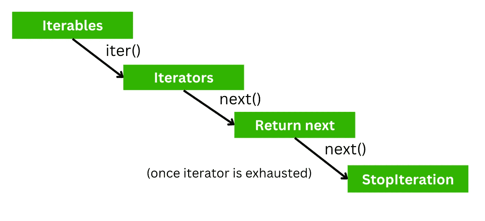

# 精通 Python 中的迭代器和生成器

> 原文：[`towardsdatascience.com/mastering-iterators-and-generators-in-python-ca30939d962?source=collection_archive---------12-----------------------#2023-01-17`](https://towardsdatascience.com/mastering-iterators-and-generators-in-python-ca30939d962?source=collection_archive---------12-----------------------#2023-01-17)

## AI 工程师和数据科学家的 Python

## 为高效数据处理创建自定义迭代器和生成器

 [Joseph Robinson, Ph.D.](https://jvision.medium.com/?source=post_page-----ca30939d962--------------------------------)

·

[关注](https://medium.com/m/signin?actionUrl=https%3A%2F%2Fmedium.com%2F_%2Fsubscribe%2Fuser%2F8049fa781539&operation=register&redirect=https%3A%2F%2Ftowardsdatascience.com%2Fmastering-iterators-and-generators-in-python-ca30939d962&user=Joseph+Robinson%2C+Ph.D.&userId=8049fa781539&source=post_page-8049fa781539----ca30939d962---------------------post_header-----------) 发表在 [Towards Data Science](https://towardsdatascience.com/?source=post_page-----ca30939d962--------------------------------) ·11 分钟阅读·2023 年 1 月 17 日

--

由作者创建的视觉效果。

本文深入探讨了 Python 中的迭代器和生成器，提供了如何使用它们来优化代码、提升程序性能和效率的详细指南。文章涵盖了迭代器和生成器的概念，包括它们的工作原理以及如何为特定用例创建自定义的生成器。博客还探讨了将迭代器和生成器结合起来以实现特定功能并创建复杂的数据处理管道的高级技术。最后，我们回顾了一个在 Keras 中用于训练深度网络的示例数据加载器。通过本指南，你将学习如何掌握 Python 中迭代器和生成器编程的艺术，并将数据处理能力提升到一个新水平。

# 目录

· 介绍

· 理解迭代器

· 创建自定义迭代器

· 理解生成器

· 创建自定义生成器

· 结合迭代器和生成器

· 深度学习中的迭代器和生成器

· 结论

· 附加资源

· 联系
