# 精通线性回归：有志数据科学家的终极指南

> 原文：[`towardsdatascience.com/mastering-linear-regression-the-definitive-guide-for-aspiring-data-scientists-7abd37fcb9ed`](https://towardsdatascience.com/mastering-linear-regression-the-definitive-guide-for-aspiring-data-scientists-7abd37fcb9ed)

## 你需要知道的关于线性回归的所有信息都在这里（包括 Python 中的应用）

[](https://federicotrotta.medium.com/?source=post_page-----7abd37fcb9ed--------------------------------)[](https://towardsdatascience.com/?source=post_page-----7abd37fcb9ed--------------------------------) [Federico Trotta](https://federicotrotta.medium.com/?source=post_page-----7abd37fcb9ed--------------------------------)

·发表于[Towards Data Science](https://towardsdatascience.com/?source=post_page-----7abd37fcb9ed--------------------------------) ·22 分钟阅读·2023 年 4 月 17 日

--


图片由[Dariusz Sankowski](https://pixabay.com/it/users/dariuszsankowski-1441456/?utm_source=link-attribution&utm_medium=referral&utm_campaign=image&utm_content=1052010)提供，来自[Pixabay](https://pixabay.com/it//?utm_source=link-attribution&utm_medium=referral&utm_campaign=image&utm_content=1052010)

如果你正在接触机器学习，你可能会遇到的第一个模型就是线性回归。它可能是最容易理解的模型，但不要低估它：有很多东西需要理解和掌握。

如果你是数据科学领域的初学者或有志成为数据科学家的人员，你可能会遇到一些困难，因为市面上有很多资源，但都比较零散。我了解你的感受，这也是我创建这本完整指南的原因：我想给你所有需要的知识，而不必再去寻找其他资源。

所以，如果你想对线性回归有全面的了解，这篇文章就是为你准备的。你可以深入学习并在需要时随时重读。此外，请注意，为了覆盖这一主题，我们需要一些通常与回归分析相关的知识：我们会深入探讨这些内容。

而且……请原谅我如果我要链接一个你需要的资源：过去我曾创建了一篇关于线性回归相关主题的文章，为了全面了解，我建议你阅读它（当我们需要时我会在稍后提供链接）。

```py
**Table of Contents:**

What do we mean by "regression analysis"?
Understanding correlation
The difference between correlation and regression
The Linear Regression model
Assumptions for the Linear Regression model
Finding the line that best fits the data
Graphical methods to validate your model
An example in Python
```

# 我们所说的“回归分析”是什么意思？

在这里我们研究线性回归，但我们所说的“回归分析”是什么意思？根据[维基百科](https://en.wikipedia.org/wiki/Regression_analysis)的解释：

> 回归分析是一种数学技术，用于找到因变量与一个或多个自变量之间的功能关系。

换句话说，我们知道在数学中我们可以这样定义一个函数：`y=f(x)`。一般来说，`y`被称为因变量，而`x`是自变量。因此，我们用某个函数`f`来表示`y`与`x`的关系。回归分析的目标就是找到函数`f`。

现在，这看起来简单，但其实不然。我知道你也知道。之所以不容易，是因为：

+   我们知道`x`和`y`。例如，如果我们使用表格数据（例如使用`Pandas`），`x`是特征，而`y`是标签。

+   不幸的是，数据很少遵循非常明确的路径。因此，我们的任务是找到一个最能**近似**`x`和`y`之间关系的函数`f`。

总结一下：回归分析旨在找到一个（好的）估计关系，在因变量和自变量之间。

现在，让我们可视化一下为什么这个过程可能很困难。考虑以下代码及其结果：

```py
import numpy as np
import matplotlib.pyplot as plt

# Create random linear data
a = 130

x = 6*np.random.rand(a,1)-3
y = 0.5*x+5+np.random.rand(a,1)

# Labels
plt.xlabel('x')
plt.ylabel('y')

# Plot a scatterplot
plt.scatter(x,y)
```

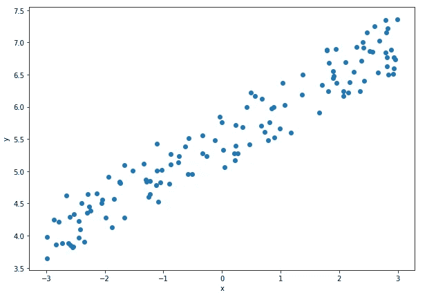

上述代码的结果。图片由 Federico Trotta 提供。

现在，告诉我：`x`和`y`之间的关系能是直线吗？那么……这些数据可以被直线近似吗？例如如下：

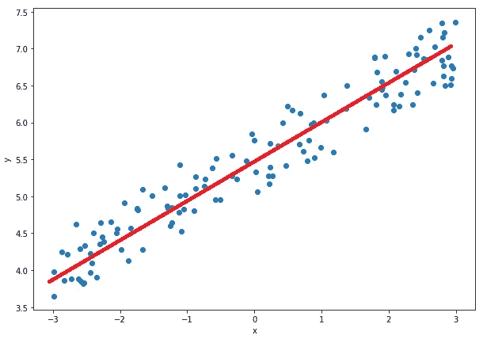

一条接近给定数据的直线。图片由 Federico Trotta 提供。

停下来想一想。

好吧，可能的。那么接下来呢？

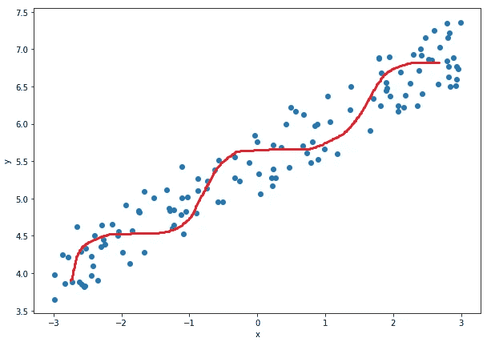

一条曲线接近给定数据。图片由 Federico Trotta 提供。

好吧，即便如此也可能！那么，哪一个最好？为什么不是另一个呢？

这就是回归的目的：找到最佳的估计函数来近似给定数据。它通过一些方法来实现这一点：我们稍后会在本文中讨论它们。我们将它们应用于线性回归模型，但其中一些可以用于任何其他回归技术。别担心：我会非常具体，以免你感到困惑。

# 理解相关性

引用自[维基百科](https://en.wikipedia.org/wiki/Correlation)：

> 在统计学中，相关性是指两个随机变量之间的任何统计关系，无论是否有因果关系。虽然在最广泛的意义上，“相关性”可能指任何类型的关联，但在统计学中，它通常指的是一对变量之间线性相关的程度。

换句话说，**相关性**是一个统计测量，表示**变量之间的线性关系**。

我们可以说两个变量是相关的，如果第一个变量的每个值对应第二个变量的一个值，遵循某条路径。如果两个变量高度相关，路径将是线性的，因为相关性描述了变量之间的线性关系。

## 相关性的数学基础

这是一个全面的指南，如承诺的那样。所以，我想讲解相关性的数学背景，但不要担心：我们会让它简单易懂，即使你不擅长数学也能理解。

我们通常提到相关系数，也称为 **皮尔逊相关系数**。这给出了两个变量之间相关性的估计。假设我们有两个变量`a`和`b`，它们可以达到`n`个值。我们可以按如下方式计算相关系数：

皮尔逊系数的定义，由作者通过 embed-dot-fun 提供。

在哪里：

+   `a`的均值（但它适用于两个变量`a`和`b`）：

均值的定义，由作者通过 embed-dot-fun 提供。

+   标准差：

标准差和方差的定义，由作者通过 embed-dot-fun 提供。

所以，总结一下：

皮尔逊系数的定义，由作者通过 embed-dot-fun 提供。

正如你所知道的：

+   **均值**是变量所有值的总和除以值的数量。因此，例如，如果我们的变量`a`具有值 1, 3, 7, 13, 25，则`a`的均值将是：

对 5 个值的均值计算，由作者通过 embed-dot-fun 提供。

+   **标准差**是统计离散度的一个指标，是变量（或我们在统计学中所说的人群）的变异性的估计。它是表达数据围绕一个指标的离散度的方式之一；对于相关系数，计算离散度的指标是均值（参见上述公式）。标准差越高，均值周围的离散度越高：大多数数据点距离均值较远。

从数值上讲，我们必须记住相关系数的值被限制在 1 和 -1 之间；这意味着：

+   如果 *r=1*：变量高度正相关；这意味着如果一个变量的值增加，另一个变量也会增加，遵循线性路径。

+   如果 *r=-1*：变量高度负相关；这意味着如果一个变量的值增加，另一个变量的值会减少，遵循线性路径。

+   如果 *r=0*：变量之间没有相关性。

最后，如果`r>0.75`，通常认为两个变量具有很高的相关性。

## 相关性不等于因果性

我们需要非常清楚“**相关性不等于因果性**”这一事实；我们想举一个可能有用的例子来记住它。

现在是炎热的夏天；我们不喜欢我们城市的高温，所以我们去山上。幸运的是，我们到达山顶，测量了温度，发现它比我们城市的低。我们有点怀疑，决定去更高的山，发现温度比前一座山还低。

我们尝试不同高度的山，测量温度，并绘制图表；我们发现随着山的高度增加，温度下降，我们可以看到线性趋势。

这是什么意思？这意味着温度与山的高度相关，呈线性关系：因此温度的下降与高度（山的高度）之间存在相关性。这并不意味着山的高度导致了温度的下降；实际上，如果我们到达相同的高度，在相同的纬度，用热气球测量温度，我们会测得相同的温度。

## 相关性矩阵

那么，我们如何在 Python 中计算相关系数？通常，我们计算相关性矩阵。假设我们有两个变量，`X`和`y`*；* 我们将它们存储在一个名为`df`的数据框中，然后可以使用`seaborn`来绘制相关性矩阵：

```py
import pandas as pd
import numpy as np
import seaborn as sns
import matplotlib.pyplot as plt

# Create data
x = np.array([1, 1, 2, 3, 4, 4, 5, 6, 7, 7, 8, 9])
y = np.array([13, 14, 17, 12, 23, 24, 25, 25, 24, 28, 32, 33])

# Create the dataframe 
df = pd.DataFrame({'x':x, 'y':y})

# Plot heat map for correlation coefficient
sns.heatmap(df.corr(), annot=True, fmt="0.2")
```

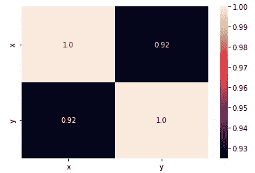

上述代码的相关性矩阵。图片由 Federico Trotta 提供。

# 相关性与回归的区别

如果我们有 0 的相关系数，这意味着数据点不倾向于沿着线性路径增加或减少，因为我们没有相关性。

让我们看一下不同值的相关系数图（图片来自 [维基百科](https://en.wikipedia.org/wiki/Correlation)）：

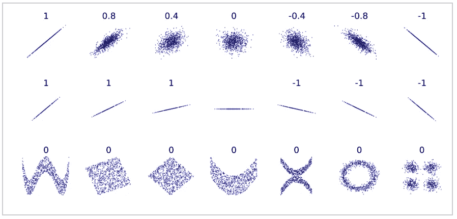

不同相关值的数据分布。图片版权分发 [在这里](https://commons.wikimedia.org/wiki/File:Correlation_examples2.svg)。

正如我们所见，当相关系数等于 1 或-1 时，数据点的趋势显然沿着一条线。但随着相关系数偏离这两个极值，数据点的分布会偏离线性路径。最后，对于相关系数为 0 的情况，数据的分布可以是任何形式。

所以，当我们得到 0 的相关系数时，我们不能对数据的分布做出任何结论，但我们可以进行回归分析（如果需要）来调查。

所以，相关性和回归是相关但不同的：

+   相关性分析变量的线性分布趋势。

+   回归是研究变量之间关系的学科。

# 线性回归模型

我们有两种线性回归模型：简单线性回归和多重线性回归。让我们来看一下它们。

## 简单线性回归模型

简单线性回归的目标是建模单个特征与连续标签之间的关系。这是描述该机器学习模型的数学方程：

```py
y = wx + b
```

参数`b`（也称为“偏置”）表示 y 轴截距（即`X=0`时`y`的值），而`w`是权重系数。我们的目标是学习描述`x`和`y`之间关系的权重`w`。这个权重将用于预测`x`的新值的响应。

让我们考虑一个实际的例子：

```py
import numpy as np
import matplotlib.pyplot as plt

# Create data
x = np.array([1, 1, 2, 3, 4, 4, 5, 6, 7, 7, 8, 9])
y = np.array([13, 14, 17, 12, 23, 24, 25, 25, 24, 28, 32, 33])

# Show scatterplot
plt.scatter(x, y)
```

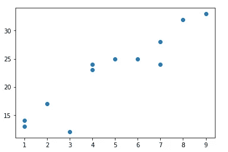

上述代码的输出。图片由 Federico Trotta 提供。

问题是：这个数据分布可以用直线来近似吗？好吧，我们可以创建类似的东西：

```py
import numpy as np
import matplotlib.pyplot as plt

# Create data
x = np.array([1, 1, 2, 3, 4, 4, 5, 6, 7, 7, 8, 9])
y = np.array([13, 14, 17, 12, 23, 24, 25, 25, 24, 28, 32, 33])

# Create basic scatterplot
plt.plot(x, y, 'o')

# Obtain m (slope) and b (intercept) of a line
m, b = np.polyfit(x, y, 1)

# Add linear regression line to scatterplot 
plt.plot(x, m*x+b)

# Labels
plt.xlabel('x variable')
plt.ylabel('y variable')
```

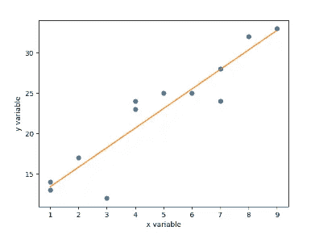

上述代码的输出。图片由 Federico Trotta 提供。

像我们上面看到的例子一样，这可能是一条直线，但也可能是一般曲线。

稍后我们将看到如何判断数据分布是否可以更好地用直线或一般曲线来描述。

## 多元线性回归模型

由于现实是复杂的，我们通常面临的情况与多元线性回归模型相关。我们指的是特征`x`不仅仅是一个：我们会有多个特征。例如，如果我们处理的是表格数据，一个具有 9 列的数据框有 8 个特征和 1 个标签：这意味着我们的问题是八维的。

如我们所理解的，这种情况非常复杂，不易可视化，直线的方程必须用向量和矩阵来表示，变成：

多元线性回归模型的方程，由 Author 提供的 embed-dot-fun 支持。

所以，直线的方程变成所有权重（`w`）与自变量（`x`）相乘的和，它甚至可以写成两个矩阵的乘积。

# 线性回归模型的假设

现在，为了应用线性回归模型，我们的数据应该符合一些假设。这些是：

1.  **线性**：因变量和自变量之间的关系应该是线性的。这意味着自变量的变化应该导致因变量的成比例变化，沿着一条线性路径。

1.  **独立性**：数据集中的观察值应该彼此独立。这意味着一个观察值的值不应依赖于另一个观察值的值。

1.  **同方差性**：残差的方差在所有自变量的水平上应该是恒定的。换句话说，残差的分布在所有自变量的水平上应该大致相同。

1.  **正态性**：残差应该是正态分布的。换句话说，残差的分布应该是一个正态（或钟形）曲线。

1.  **无多重共线性**：自变量之间不应高度相关。如果两个或多个自变量高度相关，那么很难区分每个变量对因变量的个别影响。

不幸的是，测试所有这些假设并不总是可能的，尤其是在多元线性回归模型的情况下。无论如何，有一种方法可以测试所有的假设。这被称为`p-value`检验，也许你以前听说过这个。无论如何，我们在这里不会涵盖这个测试，原因有两个：

1.  这是一种通用测试，与线性回归模型没有特别关联。因此，它需要在专门的文章中进行特定处理。

1.  我是那些（也许是少数）认为在分析数据时计算`p-value`并不总是必要的。我将来会为这个有争议的话题撰写一篇专门的文章。但出于好奇，因为我是工程师，我有非常实用的方法，喜欢应用数学。我在这里写了一篇关于这个话题的文章：

towardsdatascience.com ## 请：不要再在数据科学中抛硬币了

### 为什么数据科学中的统计学应该被工程化。

[towardsdatascience.com

# 找到最适合数据的直线

所以，上面我们在考虑以下哪一个可能是最佳拟合：

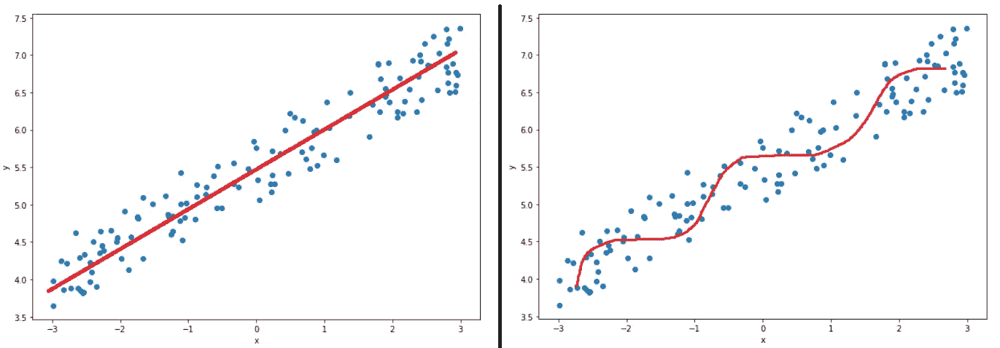

模型比较。图像由 Federico Trotta 提供。

为了理解最佳模型是左侧的（直线）还是右侧的（一般曲线），我们按如下步骤进行：

+   我们将数据分为训练集和测试集。

+   我们在两个数据集上验证这两种模型，测试我们模型的学习泛化能力。

我们这里不会涉及多项式模型（适用于一般曲线），但可以考虑验证机器学习模型的两种方法：

+   其中一种是分析方法。

+   另一种方法是图形方法。

一般来说，我们将使用两者以更好地理解模型的性能。无论如何，**泛化**意味着我们的机器学习模型从训练集中学习并**将其学习正确应用于测试集**。如果没有，我们会尝试其他机器学习模型。以下是过程：

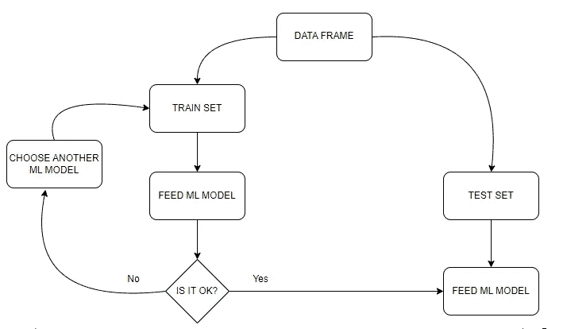

训练和验证机器学习模型的工作流程。图像由 Federico Trotta 提供。

这意味着**一个机器学习模型当它在训练集和测试集上表现良好时，泛化能力强**。

我在以下文章中讨论了线性回归情况下的机器学习模型的分析验证方法：

towardsdatascience.com ## 精通回归分析的艺术：每个数据科学家都应该知道的 5 个关键指标

### 关于回归分析中使用的指标的终极指南

[towardsdatascience.com

我建议你阅读它，因为我们将在这篇文章的最后一个例子中使用其中讨论的一些指标。

当然，上述讨论的指标可以应用于任何回归问题的机器学习模型。不过，你很幸运：我使用了线性模型作为示例。

机器学习模型在回归问题中的图形验证方法将在下一段讨论。

# 验证机器学习模型的图形方法

让我们看看三种验证机器学习模型的图形方式。

## 1\. 残差分析图

该方法特定于线性回归模型，旨在可视化残差的分布。我们期望如下：

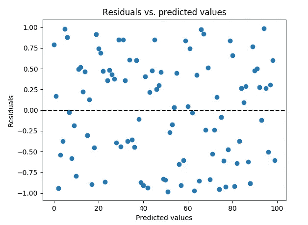

残差分析图。图片来源：Federico Trotta。

为了绘制这个图，我们可以使用`Seaborn`中的内置函数`sns.residplot()`（[这是文档](https://seaborn.pydata.org/generated/seaborn.residplot.html)）。

这样的图表很好，因为我们希望在横轴上看到随机分布的数据点。事实上，**线性回归模型的一个假设**是**残差必须符合正态分布**（上述假设第 4 项）。如果残差符合正态分布，则表示观察值与预测值之间的误差是随机分布在零周围，没有明确的模式或趋势；这正是我们图中的情况。因此，在这些情况下，我们的机器学习模型可能是一个好的模型。

相反，如果我们的残差图中存在特定的模式，那么我们的模型可能不适合我们的机器学习问题。例如，请考虑以下情况：

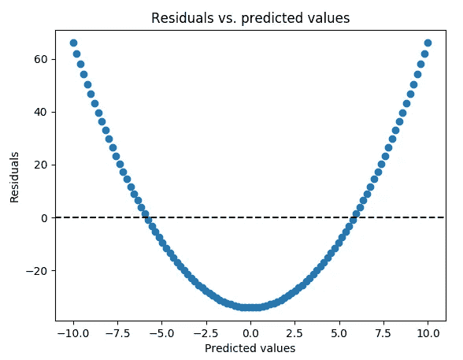

抛物线形残差分析图。图片来源：Federico Trotta。

在这种情况下，我们可以看到存在抛物线趋势：这意味着我们的模型（线性模型）不适合解决我们的机器学习问题。

## 2\. 实际值与预测值图

另一种我们可以用来验证机器学习模型的图表是**实际值与预测值图**。在这种情况下，我们绘制一个图，将实际值放在横轴上，将预测值放在纵轴上。目标是在线性回归的情况下尽可能找到数据点沿线分布。我们甚至可以在多项式回归的情况下使用这种方法：在这种情况下，我们会期望数据尽可能分布在一个通用曲线附近。

假设我们得到如下结果：

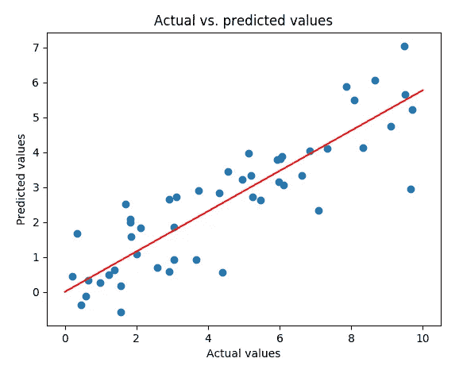

线性回归中的实际值与预测值图。图片来源：Federico Trotta。

上面的图表显示预测数据点沿一条线分布。虽然不是完美的线性分布，但线性模型可能并不理想。

如果针对我们的特定问题，我们有`y_train`（训练集上的标签），并且我们计算了`y_train_pred`（训练集上的预测值），我们可以绘制如下图表：

```py
import matplotlib.pyplot as plt

 # Scatterplot of y_train and y_train_pred
 plt.scatter(y_train, y_train_pred)
 plt.plot(y_test, y_test, color='r') # Plot the line

 # Labels
 plt.title('ACTUAL VS PREDICTED VALUES')
 plt.xlabel('ACTUAL VALUES')
 plt.ylabel('PREDICTED VALUES')
```

## 3\. 核密度估计（KDE）图

我们要讨论的最后一个图表用于验证我们的机器学习模型的是核密度估计（KDE）图。这是一种通用方法，可用于验证回归和分类模型。

KDE 是一种用于概率密度估计的**核平滑器**的应用。核平滑器是一种统计方法，用于将函数估计为邻近观察数据的加权平均值。核定义了权重，赋予离得更近的数据点更高的权重。

要了解平滑函数的有用性，请参见下图：

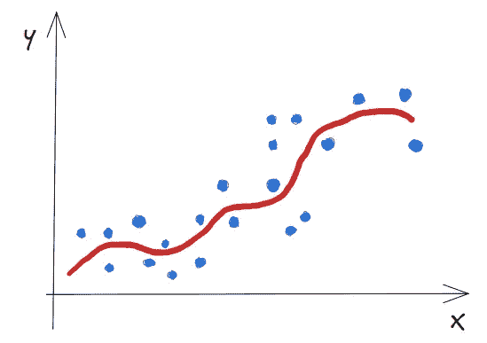

KDE 背后的想法。图片来源于 Federico Trotta。

如果我们想比较两个量，使用平滑函数来逼近数据点是有帮助的。实际上，在机器学习问题中，我们通常希望查看实际标签与模型预测标签之间的比较，因此我们使用 KDE 来比较两个平滑函数。

假设我们使用线性回归模型预测了标签。我们希望比较训练集的实际标签和预测标签的 KDE。我们可以使用 `Seaborn` 调用方法 `sns.kdeplot()` ([这是文档](https://seaborn.pydata.org/generated/seaborn.kdeplot.html)) 来完成。

假设我们有以下结果：

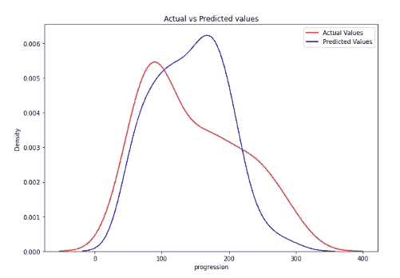

KDE 图。图片来源于 Federico Trotta。

如我们所见，实际标签和预测标签之间的比较很容易进行，因为我们是在比较两个平滑函数；在这种情况下，我们的模型是好的，因为曲线非常相似。

实际上，我们对一个“优秀”机器学习模型的期望包括：

1.  曲线应尽可能类似于钟形曲线。

1.  两条曲线之间尽可能相似。

# Python 示例

现在，让我们将到目前为止学到的所有知识应用到这里。我们将使用著名的“Ames Housing”数据集，这对我们的目的非常合适。

该数据集有 80 个特征，但为了简便，我们将仅使用其中一个子集，即：

+   `Overall Qual`：这是对房屋整体材料和装修的评分，范围从 1（差）到 10（优秀）。

+   `Overall Cond`：这是对房屋整体状况的评分，范围从 1（差）到 10（优秀）。

+   `Gr Liv Area`：这是地面以上的居住面积，以平方英尺为单位。

+   `Total Bsmt SF`：这是总地下室面积，以平方英尺为单位。

+   `SalePrice`：这是销售价格，单位为美元 $。

我们将把 `SalePrice` 列视为目标（标签）变量，其他列视为特征。

## 探索性数据分析 EDA

让我们导入数据，创建一个包含上述特征的子集，并显示一些统计信息：

```py
import pandas as pd

# Define the columns
columns = ['Overall Qual', 'Overall Cond', 'Gr Liv Area',
          'Total Bsmt SF', 'SalePrice']

# Create dataframe
df = pd.read_csv('http://jse.amstat.org/v19n3/decock/AmesHousing.txt',
                sep='\t', usecols=columns)

# Show statistics
df.describe()
```

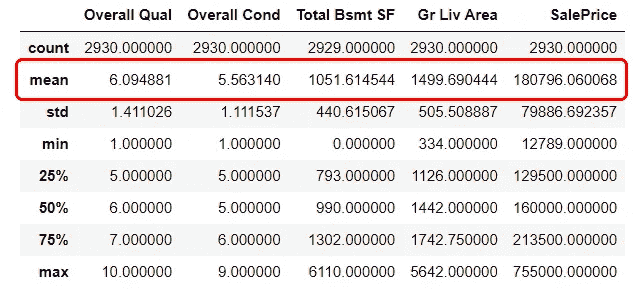

数据集的统计信息。图片来源于 Federico Trotta。

这里一个重要的观察是，所有标签的均值范围不同（`Overall Qual` 的均值为 `6.09`，而 `Gr Liv Area` 的均值为 `1499.69`）。这告诉我们一个重要的事实：我们必须对特征进行缩放。

## 数据准备

“**特征缩放**”是什么意思？

缩放一个特征意味着特征范围被缩放到 0 和 1 之间或 1 和 -1 之间。有两种典型的方法来缩放特征：

+   **均值归一化：** 均值归一化是一种缩放数值数据的方法，使其最小值为零，最大值为一，所有值都围绕均值进行归一化。假设 *c* 是我们特征的值；在归一化过程后，*c*′ 是 *c* 的新值：

均值归一化的公式，由 Author 提供的 embed-dot-fun 提供。

让我们看一个 Python 示例：

```py
import numpy as np

# Create a list of numbers
data = [1, 2, 3, 4, 5]

# Find min and max values
data_min = min(data)
data_max = max(data)

# Normalize the data
data_normalized = [(x - data_min) / (data_max - data_min) for x in data]

# Print the normalized data
print(f'normalized data: {data_normalized}')

>>>

     normalized data: [0.0, 0.25, 0.5, 0.75, 1.0]
```

+   **标准化**（或 z-score 归一化）：该方法将变量转换为均值为零、标准差为一的状态。公式如下（c′c’c′ 是 ccc 在归一化过程后的新值）：

标准化的公式，由 Author 提供的 embed-dot-fun 提供。

让我们看一个 Python 示例：

```py
import numpy as np

# Original data
data = [1, 2, 3, 4, 5]

# Calculate mean and standard deviation
mean = np.mean(data)
std = np.std(data)

# Standardize the data
data_standardized = [(x - mean) / std for x in data]

# Print the standardized data
print(f'standardized values: {data_standardized}')
print(f'mean of standardized values: {np.mean(data_standardized)}')
print(f'std. dev. of standardized values: {np.std(data_standardized): .2f}')

>>>

standardized values: [-1.414213562373095, -0.7071067811865475, 0.0, 0.7071067811865475, 1.414213562373095]
mean of standardized values: 0.0
std. dev. of standardized values:  1.00 
```

如我们所见，归一化的数据均值为 0，标准差为 1，正如我们所期望的。好消息是我们可以使用 `scikit-learn` 库来标准化特征，我们马上就会做到这一点。

特征缩放是在处理 ML 问题时需要做的一项重要工作，原因很简单：

+   如果我们用未缩放的特征进行探索性数据分析，在计算均值时（例如，在计算相关系数时），我们会得到非常不同的数字。如果我们查看之前通过 `df.describe()` 方法得到的统计数据，我们可以看到每一列的均值差异很大。如果我们缩放或归一化特征，我们会得到 0、1 和 -1，这将从数学上帮助我们。

现在，这个数据集有一些 `NaN` 值。为了简洁我们不展示这些值（可以自行尝试），但我们会去除它们。同时，我们会计算相关矩阵：

```py
import seaborn as sns
import matplotlib.pyplot as plt
import numpy as np

# Drop NaNs from dataframe
df = df.dropna(axis=0)

# Apply mask
mask = np.triu(np.ones_like(df.corr()))

# Heat map for correlation coefficient
sns.heatmap(df.corr(), annot=True, fmt="0.1", mask=mask)
```

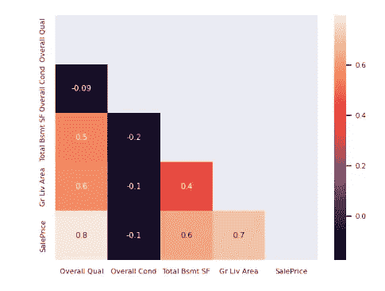

我们数据框的相关矩阵。图片由 Federico Trotta 提供。

因此，使用 `np.triu(np.ones_like(df.corr()))` 我们创建了一个掩码，这对显示三角相关矩阵非常有用，这样更易读（特别是当我们有比这更多的特征时）。

因此，`Total Bsmt SF` 和 `SalePrice` 之间有中等的 `0.6` 相关性，`Gr Liv Area` 和 `SalePrice` 之间有较高的 `0.7` 相关性，`Overall Qual` 和 `SalePrice` 之间有很高的相关性 `0.8`；此外，`Overall Qual` 和 `Gr Liv Area` 之间有中等的相关性 `0.6`，`Overall Qual` 和 `Total Bsmt SF` 之间有 `0.5` 的相关性。

这里没有多重共线性，因此没有特征彼此高度相关（所以我们的特征满足上面列出的第 5 个假设）。如果我们发现一些高度相关的特征，我们可以删除它们，因为**两个高度相关的特征对标签的影响是一样的**（**这适用于每个通用 ML 模型：如果两个特征高度相关，我们可以删除其中一个**）。

最后，我们将数据框`df`细分为`X`（特征）和`y`（标签），并对特征进行缩放：

```py
from sklearn.preprocessing import StandardScaler

# Define the features
X = df.iloc[:,:-1]

# Define the label
y = df.iloc[:,-1]

# Scale the features
scaler = StandardScaler() # Call the scaler
X = scaler.fit_transform(X) # Fit the features to scale them
```

## 拟合线性回归模型

现在我们需要将特征`X`拆分为训练集和测试集，并用线性回归模型拟合它们。然后，我们计算两个数据集的 R²：

```py
from sklearn.model_selection import train_test_split
from sklearn.linear_model import LinearRegression
from sklearn import metrics

# Split
X_train, X_test, y_train, y_test = train_test_split(X, y, test_size=0.2)

# Fit the LR model
reg = LinearRegression().fit(X_train, y_train)

# Calculate R²
coeff_det_train = reg.score(X_train, y_train)
coeff_det_test = reg.score(X_test, y_test)

# Print metrics
print(f" R² for training set: {coeff_det_train}")
print(f" R² for test set: {coeff_det_test}")

>>>

   R² for training set:  0.77
   R² for test set:  0.73
```

```py
**Notes:**
1) your results can be slightly different due to the stocastical
nature of the ML models.

2) here we can see generalization on action: 
we fitted the Linear Regression model to the train set with
*reg = LinearRegression().fit(X_train, y_train)*.
The, we've calculated R² on the training and test sets with:
*coeff_det_train = reg.score(X_train, y_train)
coeff_det_test = reg.score(X_test, y_test*

In other words: we don't fit the data to the test set.
We fit the data to the training set and we calculate the scores
and predictions (see next snippet of code with KDE) on both sets
to see the generalization of our modelon new unseen data
(the data of the test set).
```

所以我们在训练测试集上得到 R²为 0.77，在测试集上为 0.73，这些结果相当不错，表明线性模型在解决这个 ML 问题上表现良好。

让我们来看一下两个数据集的 KDE 图：

```py
# Calculate predictions
y_train_pred = reg.predict(X_train) # train set
y_test_pred = reg.predict(X_test) # test set

# KDE train set
ax = sns.kdeplot(y_train, color='r', label='Actual Values') #actual values
sns.kdeplot(y_train_pred, color='b', label='Predicted Values', ax=ax) #predicted values

# Show title
plt.title('Actual vs Predicted values')
# Show legend
plt.legend()
```

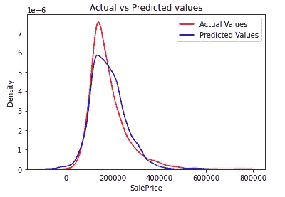

训练集的 KDE。图片由 Federico Trotta 提供。

```py
# KDE test set
ax = sns.kdeplot(y_test, color='r', label='Actual Values') #actual values
sns.kdeplot(y_test_pred, color='b', label='Predicted Values', ax=ax) #predicted values

# Show title
plt.title('Actual vs Predicted values')
# Show legend
plt.legend()
```

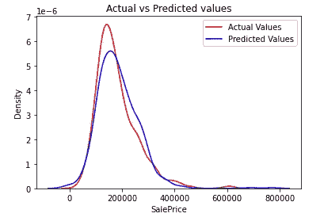

测试集的 KDE。图片由 Federico Trotta 提供。

尽管我们在测试集上获得了 0.73 的 R²，这个结果已经很好（但记住：越高越好），这个图表显示了线性模型确实是解决这个 ML 问题的一个好模型。这就是我喜欢 KDE 图的原因：它是一个非常强大的工具，正如我们所看到的。

同时，这也说明了为什么不应该仅依赖一种方法来验证我们的 ML 模型：将一种分析方法与一种图形方法结合使用，通常能为我们提供正确的见解，以决定是否需要更改我们的 ML 模型。在这种情况下，线性回归模型非常适合进行预测。

# 结论

希望你能觉得这篇文章有用。我知道它很长，但我想给你提供所有你需要的知识，以便你在最需要的时候可以回顾它。

我们在这里讨论的一些内容是通用话题，而其他一些则特定于线性回归模型。让我们总结一下：

+   **回归**的定义当然是一个通用定义。

+   **相关性**通常被称为线性模型**。** 实际上，正如我们之前所说，相关性是两个变量线性依赖的趋势。然而**，** 也有定义非线性相关性的方法，但我们将其留给其他文章（不过，作为知识补充：请考虑它们的存在）。

+   我们已经讨论了简单线性回归和多重线性回归模型及其假设（这些假设适用于这两种模型）。

+   当谈到如何找到最适合数据的回归线时，我们参考了文章“掌握回归分析艺术：每个数据科学家都应该知道的 5 个关键指标”。在这里，我们找到了解决回归分析所需了解的所有指标。因此，这是一个通用话题，适用于任何回归模型，包括线性模型。

+   我们展示了验证 ML 模型的三种方法：1) **残差分析图**：适用于线性回归模型，2) **实际值与预测值图**：适用于线性和多项式模型，3) **KDE 图**：适用于任何 ML 模型，即使是分类问题。

最后，我想提醒你，我们花了几行文字强调我们可以避免使用 `p-values` 来检验 ML 模型的假设。我很快会写一篇关于这个话题的文章，但正如你所看到的，KDE 已经向我们展示了我们的线性模型能够解决这个 ML 问题，并且我们没有用 `p-values` 来验证我们的假设。

*到目前为止，在本文中，我们使用了一些图表。你可以* [*克隆这个仓库*](https://github.com/federico-trotta/plots_custom_functions) *我创建的，以便你可以导入代码并轻松绘制图表。如果你遇到困难，可以在我的 GitHub 项目中找到用法示例。如果你有其他困难，你可以* [*联系我*](https://bio.link/federicotrotta) *我会帮助你。*

**免费 Python 电子书：**

刚开始学习 Python 数据科学但感到困难？ [***订阅我的新闻通讯并获取我的免费电子书：这将为你提供正确的学习路径，通过实际操作学习 Python 数据科学。***](https://federico-trotta.ck.page/a3970f33f4)

觉得这个故事有趣吗？通过我的推荐链接以 5$/月 成为 Medium 会员 [点击这里](https://medium.com/@federicotrotta/membership)：我会赚取少量佣金，你无需额外费用。

[](https://federicotrotta.medium.com/membership?source=post_page-----7abd37fcb9ed--------------------------------) [## 通过我的推荐链接加入 Medium - Federico Trotta

### 阅读 Federico Trotta 的每一个故事（以及 Medium 上成千上万其他作家的故事）。您的会员费直接支持…

federicotrotta.medium.com](https://federicotrotta.medium.com/membership?source=post_page-----7abd37fcb9ed--------------------------------)
