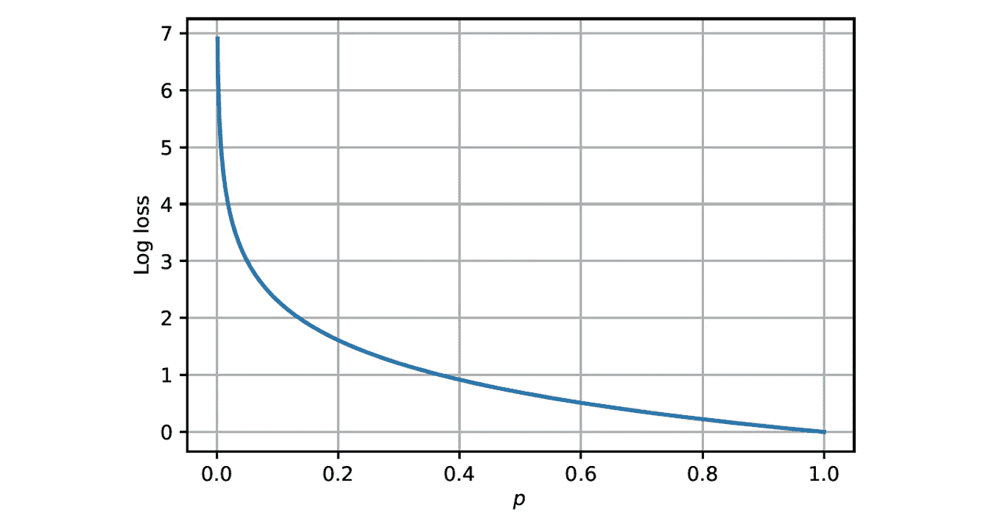

# 精通逻辑回归

> 原文：[`towardsdatascience.com/mastering-logistic-regression-3e502686f0ae`](https://towardsdatascience.com/mastering-logistic-regression-3e502686f0ae)

## 从理论到 Python 实现

[](https://medium.com/@roiyeho?source=post_page-----3e502686f0ae--------------------------------)[](https://towardsdatascience.com/?source=post_page-----3e502686f0ae--------------------------------) [Roi Yehoshua 博士](https://medium.com/@roiyeho?source=post_page-----3e502686f0ae--------------------------------)

·发表于 [Towards Data Science](https://towardsdatascience.com/?source=post_page-----3e502686f0ae--------------------------------) ·17 分钟阅读·2023 年 5 月 20 日

--


图片来自 [Gerd Altmann](https://pixabay.com/users/geralt-9301/?utm_source=link-attribution&utm_medium=referral&utm_campaign=image&utm_content=1044090) 的 [Pixabay](https://pixabay.com//?utm_source=link-attribution&utm_medium=referral&utm_campaign=image&utm_content=1044090)

逻辑回归是最常见的机器学习算法之一。它可以用来预测事件发生的概率，例如预测来邮件是否为垃圾邮件，或者肿瘤是否为恶性肿瘤，基于给定的标记数据集。

由于其简单性，逻辑回归通常被用作评估其他更复杂模型的基准。

该模型的名称中包含“逻辑”一词，因为它使用**逻辑函数**（Sigmoid）将输入特征的线性组合转换为概率。

它的名称中也包含“回归”一词，因为它的输出是一个介于 0 和 1 之间的连续值，尽管它通常作为**二分类器**使用，通过选择一个阈值（通常为 0.5），并将概率大于阈值的输入分类为正类，而将低于阈值的输入分类为负类。

在本文中，我们将深入讨论逻辑回归模型，从头开始在 Python 中实现它，然后展示其在 Scikit-Learn 中的实现。

# 背景：二分类问题

回顾一下在 [监督机器学习](https://medium.com/@roiyeho/introduction-to-supervised-machine-learning-313730eb5aa2) 问题中，我们会得到一个包含 *n* 个标记样本的训练集：*D* = {(**x**₁, *y*₁), (**x**₂, *y*₂), … , (**x***ₙ, yₙ*)}，其中 **x***ᵢ* 是一个 *m* 维向量，包含样本 *i* 的**特征**，*yᵢ* 代表该样本的**标签**。我们的目标是构建一个预测尽可能接近真实标签的模型。

在**分类问题**中，标签 *yᵢ* 可以取 *k* 个值之一，表示样本所属的 *k* 个类别。更具体地说，在**二分类问题**中，标签 *yᵢ* 只能取两个值：0（表示负类）和 1（表示正类）。

此外，我们区分两种类型的分类器：

1.  **确定性分类器**为每个样本输出一个**硬标签**，而不提供类别的概率估计。这类分类器的例子包括[感知机](https://medium.com/towards-data-science/perceptrons-the-first-neural-network-model-8b3ee4513757)、[K-近邻](https://medium.com/@roiyeho/k-nearest-neighbors-knn-a-comprehensive-guide-7add717806ad)和支持向量机（SVM）。

1.  **概率分类器**输出类别的概率估计，然后根据这些概率为给定样本分配标签（通常是具有最高概率的类别标签）。这类分类器的例子包括逻辑回归、朴素贝叶斯分类器和使用 sigmoid 或 softmax 作为输出层的[神经网络](https://medium.com/towards-data-science/multi-layer-perceptrons-8d76972afa2b)。

# 逻辑回归模型

逻辑回归是一种处理二分类问题的概率分类器。给定一个样本 (**x**, *y*)，它输出样本属于正类的概率 *p*：


如果这个概率高于某个阈值（通常选择为 0.5），则样本被分类为 1，否则被分类为 0。

模型如何估计概率*p*？

逻辑回归的基本假设是**样本属于正类的事件的对数赔率是其特征的线性组合**。

**对数赔率**（也称为**logit**）是**赔率比**的对数，赔率比是样本属于正类的概率与样本属于负类的概率之间的比率：


对数赔率（logit）函数

我们在这里假设对数的底数是 *e*（即自然对数），尽管也可以使用其他底数。

logit 函数的图像如下所示：


logit 函数

如图所示，logit 函数将 (0, 1) 区间的概率值映射到 (-∞, +∞) 区间的实数值。

在逻辑回归中，我们假设对数赔率是特征的线性组合，即：


其中 **w** = (*w*₀, …, *wₘ*) 是模型的**参数**（或权重）。参数 *w*₀ 通常被称为**截距**（或偏置）。

对于 *p* = 0.5（即对数赔率等于 0）的点定义了两个类别之间的分隔超平面，其方程为：


分隔超平面的方程

权重向量 **w** 与此超平面正交。超平面上方的每个样本 (**w***ᵗ***x** > 0**)** 被分类为正样本，而超平面下方的每个样本 (**w***ᵗ***x** < 0**)** 被分类为负样本：


这使得逻辑回归成为一种**线性分类器**，因为它假设类别之间的边界是一个线性表面。其他线性分类器包括[感知器](https://medium.com/towards-data-science/perceptrons-the-first-neural-network-model-8b3ee4513757)和支持向量机（SVM）。

我们可以通过对对数几率方程两边取指数，找到 *p* 和参数 **w** 之间的直接关联：


其中 *σ* 是**Sigmoid 函数**（也称为**逻辑函数**）：


Sigmoid 函数用于将对数几率 (**w***ᵗ***x**) 转换为概率。它具有一个特征“ S”形曲线：


Sigmoid 函数

如可以看出，该函数将实数范围 (-∞, +∞) 映射为概率值范围 (0, 1)。

Sigmoid 函数具有一些优良的数学性质，这些性质在后面会很有用：


下图总结了从输入到最终预测的逻辑回归计算过程：


逻辑回归模型

# 对数损失

我们的目标是找到参数**w**，使模型的预测 *p* = *σ*(**w***ᵗ***x**) 尽可能接近真实标签 *y*。为此，我们需要定义一个**损失函数**，用来衡量模型预测与真实标签之间的差距。这个函数需要是可微分的，以便可以使用如梯度下降等技术进行优化（有关机器学习中的损失函数的更多信息，请参见[这篇文章](https://medium.com/towards-data-science/loss-functions-in-machine-learning-9977e810ac02)）。

逻辑回归使用的损失函数称为**对数损失**（或**逻辑损失**）。其定义如下：


对数损失函数

我们是如何得到这个函数的？这个函数的推导基于[最大似然原理](https://medium.com/@roiyeho/maximum-likelihood-855b6df92c43)。更具体地说，我们可以证明对数损失是在标签具有[伯努利分布](https://en.wikipedia.org/wiki/Bernoulli_distribution)（即一种二元随机变量的概率分布，其中 1 的概率为 *p*，0 的概率为 1 − *p*）假设下的负对数似然。

从数学上讲，我们将证明：


其中 *P*(*y*|*p*) 是在模型预测 *p* 给定的情况下获得标签 *y* 的概率（即，数据在我们的模型下的似然）。

**证明**：

给定一个具有参数 *p* 的贝努利分布模型（标签），样本属于正类的概率就是 *p*，即，


类似地，样本属于负类的概率是：


我们可以将这两个方程更紧凑地写成如下形式：


*解释*：当 *y* = 1 时，*pʸ* = *p* 和 (1 − *p*)¹⁻*ʸ* = 1，因此 *P*(*y*|*p*) = *p*。类似地，当 *y* = 0 时，*pʸ* = 1 和 (1 − *p*)¹⁻*ʸ* = 1 − *p*，因此 *P*(*y*|*p*) = 1 − *p*。

因此，给定模型的数据的对数似然是：


对数损失恰好是该函数的负值。因此，最大化对数似然等同于最小化对数损失。

以下图展示了当 *y* = 1 时的对数损失：



对数损失仅在预测完全准确时（*p* = 1 且 *y* = 1，或 *p* = 0 且 *y* = 0）为 0，并且当预测变差时（即，当 *y* = 1 且 *p* → 0 或 *y* = 0 且 *p* → 1）接近无穷大。

**成本函数** 计算整个数据集上的平均损失：


这个函数可以用向量化的形式表示如下：


其中 **y** = (*y*₁, …, *yₙ*) 是一个包含所有训练样本标签的向量，而 **p** = (*p*₁, …, *pₙ*) 是一个包含模型对所有训练样本的预测概率的向量。

这个成本函数是凸的，即，它有一个全局最小值。然而，由于对数函数引入的非线性，没有封闭形式的解决方案来找到最佳 **w***。因此，我们需要使用迭代优化方法如梯度下降来找到最小值。

# 梯度下降

梯度下降是一种迭代方法，用于寻找函数的最小值，其中我们沿着梯度的相反方向采取小步，以接近最小值：


梯度下降

为了使用梯度下降法找到成本 *J*(**w**)* 的最小值，我们需要计算其相对于每一个权重的偏导数。*J*(**w**)* 对于给定权重 *wⱼ* 的偏导数为：


**证明**：


因此，梯度向量可以用向量化的形式表示如下：


梯度下降更新规则为：


其中*α*是一个学习率，控制步长（0 < *α* < 1）。

请注意，每当你使用梯度下降时，你必须确保数据集已经**标准化**（否则梯度下降可能会在不同方向上采取不同大小的步伐，这会导致不稳定）。

# Python 实现

现在我们将从头实现逻辑回归模型，包括成本函数和梯度计算，使用梯度下降优化模型，模型评估以及绘制最终的决策边界。

为了演示，我们将使用[Iris 数据集](https://scikit-learn.org/stable/auto_examples/datasets/plot_iris_dataset.html)（BSD 许可证）。原始数据集包含 150 个属于三种花卉之一的鸢尾花样本（山鸢尾、变色鸢尾和维吉尼亚鸢尾）。我们将其转化为一个二分类问题，只使用前两种花卉（山鸢尾和变色鸢尾）。此外，我们只使用每朵花的前两个特征（花萼宽度和花萼长度）。

## 加载数据集

首先，我们导入所需的库并固定随机种子，以获得可重复的结果：

```py
import numpy as np
import pandas as pd
import matplotlib.pyplot as plt
import seaborn as sns

np.random.seed(0)
```

接下来，我们加载数据集：

```py
from sklearn.datasets import load_iris

iris = load_iris()
X = iris.data[:, :2]  # Take only the first two features
y = iris.target

# Take only the setosa and versicolor flowers
X = X[(y == 0) | (y == 1)]
y = y[(y == 0) | (y == 1)]
```

让我们绘制数据：

```py
def plot_data(X, y):
    sns.scatterplot(x=X[:, 0], y=X[:, 1], hue=iris.target_names[y], style=iris.target_names[y], 
                    palette=['r','b'], markers=('s','o'), edgecolor='k')
    plt.xlabel(iris.feature_names[0])
    plt.ylabel(iris.feature_names[1])
    plt.legend() 
```

```py
plot_data(X, y)
```


鸢尾花数据集

如可以看到，数据集是线性可分的，因此逻辑回归应该能够找到两个类别之间的边界。

接下来，我们需要向特征矩阵*X*中添加一列 1，以表示偏置项（*w*₀）：

```py
# Add a column for the bias
n = X.shape[0] 
X_with_bias = np.hstack((np.ones((n, 1)), X))
```

现在我们将数据集分成训练集和测试集：

```py
from sklearn.model_selection import train_test_split

X_train, X_test, y_train, y_test = train_test_split(X_with_bias, y, random_state=0)
```

## 模型实现

我们现在准备实现逻辑回归模型。我们从定义一个辅助函数来计算 sigmoid 函数开始：

```py
def sigmoid(z):
    """ Compute the sigmoid of z (z can be a scalar or a vector). """
    z = np.array(z)
    return 1 / (1 + np.exp(-z))
```

接下来，我们实现成本函数，该函数返回给定数据集（*X*，**y**）上具有参数**w**的逻辑回归模型的成本，以及相对于**w**的梯度。

```py
def cost_function(X, y, w):
    """ J, grad = cost_function(X, y, w) computes the cost of a logistic regression model 
        with parameters w and the gradient of the cost w.r.t. to the parameters. """
    # Compute the cost
    p = sigmoid(X @ w)    
    J = -(1/n) * (y @ np.log(p) + (1-y) @ np.log(1-p)) 

    # Compute the gradient    
    grad = (1/n) * X.T @ (p - y)  
    return J, grad
```

请注意，我们正在使用之前展示的成本函数和梯度函数的向量化形式。

为了对这个函数进行合理性检查，我们来计算模型在某个随机权重向量上的成本和梯度：

```py
w = np.random.rand(X_train.shape[1])
cost, grad = cost_function(X_train, y_train, w)

print('w:', w)
print('Cost at w:', cost)
print('Gradient at w:', grad)
```

我们得到的输出是：

```py
w: [0.5488135  0.71518937 0.60276338]
Cost at w: 2.314505839067951
Gradient at w: [0.36855061 1.86634895 1.27264487]
```

## 梯度下降实现

我们现在将实现梯度下降，以找到最优的**w**，使成本函数在给定训练集上最小化。该算法最多会对训练集进行*max_iter*次迭代（默认为 5000），除非成本在上一次迭代后没有至少减少*tol*（默认为 0.0001），在这种情况下训练将立即停止。

```py
def optimize_model(X, y, alpha=0.01, max_iter=5000, tol=0.0001):
    """ Optimize the model using gradient descent.
        X, y: The training set        
        alpha: The learning rate
        max_iter: The maximum number of passes over the training set (epochs)
        tol: The stopping criterion. Training will stop when (new_cost > cost - tol)
    """
    w = np.random.rand(X.shape[1])
    cost, grad = cost_function(X, y, w)

    for i in range(max_iter):
        w = w - alpha * grad
        new_cost, grad = cost_function(X, y, w)        
        if new_cost > cost - tol:
            print(f'Converged after {i} iterations')
            return w, new_cost
        cost = new_cost

    print('Maximum number of iterations reached')
    return w, cost
```

通常在这一点上你需要对数据集进行标准化，因为梯度下降对于具有不同尺度的特征效果不好。在我们的特定数据集中，由于两个特征的范围相似，因此标准化不是必需的。

现在让我们调用这个函数来优化我们的模型：

```py
opt_w, cost = optimize_model(X_train, y_train)

print('opt_w:', opt_w)
print('Cost at opt_w:', cost)
```

算法在 1,413 次迭代后收敛，我们得到的**w***是：

```py
Converged after 1413 iterations
opt_w: [ 0.28014029  0.80541854 -1.48367938]
Cost at opt_w: 0.28389717767222555
```

还有其他优化器可以使用，这些优化器通常比梯度下降更快，例如共轭梯度（CG）和截断牛顿（TNC）。有关如何使用这些优化器的更多细节，请参见[scipy.optimize.minimize](https://docs.scipy.org/doc/scipy/reference/generated/scipy.optimize.minimize.html)。

## 使用模型进行预测

现在我们已经找到了模型的最佳参数，可以使用它进行预测。

首先，我们编写一个函数，它接受新样本的矩阵*X*并返回它们属于正类的概率：

```py
def predict_prob(X, w):
    """ Return the probability that samples in X belong to the positive class
        X: the feature matrix (every row in X represents one sample)
        w: the learned logistic regression parameters  
    """
    p = sigmoid(X @ w)
    return p
```

该函数通过简单地计算*Xᵗ***w**的 sigmoid 值来计算模型的预测（即对矩阵中每一行**x**计算*σ*(**w***ᵗ***x**)）。

例如，让我们找出位于(6, 2)的样本属于 versicolor 类的概率：

```py
predict_prob([[1, 6, 2]], opt_w)
```

```py
array([0.89522808])
```

这个样本有 89.52%的概率属于 versicolor 花。这是合理的，因为这个样本位于 versicolor 花的区域内，远离类别之间的边界。

另一方面，位于(5.5, 3)的样本属于 versicolor 类的概率是：

```py
predict_prob([[1, 5.5, 3]], opt_w)
```

```py
array([0.56436688])
```

这次概率要低得多（仅 56.44%），因为这个样本接近类别之间的边界。

让我们编写另一个函数，它返回预测的类别标签而不是概率：

```py
def predict(X, w):
    """ Predict whether the label is 0 or 1 for the samples in X using a threshold of 0.5
        (i.e., if sigmoid(X @ theta) >= 0.5, predict 1)
    """
    p = sigmoid(X @ w)
    y_pred = (p >= 0.5).astype(int)
    return y_pred
```

该函数简单地在正类的概率至少为 0.5 时预测 1，否则预测 0。

让我们用上面的样本测试这个函数：

```py
predict([[1, 6, 2], [1, 5.5, 3]], opt_w)
```

```py
array([1, 1])
```

如预期的那样，这两个样本都被分类为 1。

## 评估模型

接下来，让我们编写一个函数来计算模型在给定数据集上的准确性：

```py
def evaluate_model(X, y, w):
    y_pred = predict(X, w)
    accuracy = np.mean(y == y_pred)
    return accuracy
```

该函数首先找到模型在给定数据集*X*上的预测标签，并将其与真实标签**y**进行比较。然后计算准确性，作为正确分类的平均数量：


让我们使用这个函数来找出模型在训练集和测试集上的准确性：

```py
train_accuracy = evaluate_model(X_train, y_train, opt_w)
print(f'Train accuracy: {train_accuracy * 100:.3f}%')
```

```py
Train accuracy: 98.667%
```

```py
test_accuracy = evaluate_model(X_test, y_test, opt_w)
print(f'Test accuracy: {test_accuracy * 100:.3f}%')
```

```py
Test accuracy: 100.000%
```

如预期的那样，由于数据集是线性可分的，得分非常高。

除了准确性，还有其他重要指标用于评估分类模型，如精确度、召回率和 F1 分数。这些指标将在未来的文章中讨论。

## 绘制决策边界

最后，由于我们的数据集是二维的，我们可以绘制模型找到的类别之间的边界线。为此，我们首先需要找到这条线的方程。

边界线由模型预测值恰好为 0.5 的点定义，即：


当 sigmoid 函数的输入等于 0 时，其值为 0.5，因此我们可以写成：


重新排列项后我们得到：


即，边界线的斜率为 -*w*₁/*w*₂，截距为 -*w*₀/*w*₂。我们现在可以编写一个绘制这条线的函数：

```py
def plot_decision_boundary(X, y, w):
    """ Plot the decision boundary between the classes """
    plot_data(X, y)

    line_x = np.array(plt.gca().get_xlim())
    line_y = -1 / w[2] * (w[1] * line_x + w[0])
    plt.plot(line_x, line_y, c='k', ls='--')
```

```py
plot_decision_boundary(X, y, opt_w)
```


类别之间的决策边界

我们可以看到，只有一个样本被模型误分类。训练模型更多的迭代（约 200,000 次）会找到一个完美分离两类的分界线。使用固定步长时，梯度下降的最优收敛速度非常慢。可以通过使用自适应学习率（例如，使用更激进的步长来补偿快速消失的梯度）来改进这一点。

# Scikit-Learn 中的 LogisticRegression 类

尽管从头实现逻辑回归有其自身的教育意义，但更实际的选择是使用 Scikit-Learn 提供的现成的 [LogisticRegression](https://scikit-learn.org/stable/modules/generated/sklearn.linear_model.LogisticRegression.html) 类。该类使用比普通梯度下降更高效的解算器，并且还提供了额外的选项，如正则化和提前停止。

该类的重要超参数有：

+   *penalty* — 指定要应用的正则化类型。可以是以下选项之一：None, ‘l2’（默认值）, ‘l1’ 和 ‘elasticnet’。有关正则化的更多信息，请参见 [这篇文章](https://medium.com/@roiyeho/regularization-19b1879415a1)。

+   *tol* — 停止准则的容忍度（默认为 0.0001）。

+   *C* — 正则化系数的倒数（默认为 1.0）。较小的值表示更强的正则化。

+   *solver* — 用于优化的算法。可以选择以下选项之一：‘lbfgs’（默认值），‘liblinear’，‘newton-cg’，‘newton-cholesky’，‘sag’，‘saga’。有关这些优化器的更多信息，请阅读文档。

+   *max_iter* — 解算器收敛的最大迭代次数（默认为 100）

+   *multi_class* — 处理多分类问题的方法。可以选择以下选项之一：‘ovr’（一对其余，即为每个类别构建一个二分类器与其他类别对抗）、‘multinomial’（使用多项式逻辑回归）或 ‘auto’（默认）。

使用 LogisticRegression 类时，您无需手动将一列全是 1 的列添加到设计矩阵 *X* 中，因为这会由 Scikit-Learn 自动完成。因此，在构建模型之前，我们将原始数据（没有额外的全是 1 的列）分割成训练集和测试集：

```py
from sklearn.model_selection import train_test_split

X_train, X_test, y_train, y_test = train_test_split(X, y, random_state=0)
```

我们将使用默认设置创建一个 LogisticRegression 实例，并将其拟合到训练集上：

```py
from sklearn.linear_model import LogisticRegression

clf = LogisticRegression()
clf.fit(X_train, y_train)
```

接下来，我们将在训练集和测试集上评估模型：

```py
train_accuracy = clf.score(X_train, y_train)
print(f'Train accuracy: {train_accuracy * 100:.3f}%')

test_accuracy = clf.score(X_test, y_test)
print(f'Test accuracy: {test_accuracy * 100:.3f}%')
```

```py
Train accuracy: 100.000%
Test accuracy: 100.000%
```

这次我们在训练集和测试集上都获得了完美的分数。我们还可以通过查询 *n_iter_* 属性来检查收敛所需的迭代次数：

```py
print(clf.n_iter_)
```

```py
[15]
```

仅需 15 次迭代即可收敛！显然，LogisticRegression 使用的求解器（默认使用[L-BFGS](https://en.wikipedia.org/wiki/Limited-memory_BFGS)）比我们实现的梯度下降更高效。

我们可以像之前一样绘制模型找到的决策边界。然而，这次最佳系数存储在模型的两个不同属性中：

+   *coef_* 是一个数组，包含所有权重，除了截距项

+   *intercept_* 是截距项 (*w*₀)

因此，我们需要在调用*plot_decision_boundary*()函数之前，将这两个属性连接成一个数组：

```py
opt_w = np.insert(clf.coef_, 0, [clf.intercept_])
plot_decision_boundary(X, y, opt_w)
```


LogisticRegression 找到的决策边界

正如预期的那样，LogisticRegression 找到的线完美地分隔了两个类别。

# 总结

让我们总结一下逻辑回归与其他分类模型的优缺点。

**优点**：

+   当数据是线性可分的时，算法保证能找到一个类间的分离超平面。

+   提供类概率估计

+   不容易过拟合（但通常对数据存在欠拟合）

+   高度可解释（与每个特征相关的权重表示其重要性）

+   高度可扩展（需要的参数数量与特征数量线性相关）

+   可以处理冗余特征（通过赋予它们接近 0 的权重）

+   超参数数量较少

**缺点**：

+   只能找到类别之间的线性决策边界

+   通常被更复杂的模型超越

+   仅支持二分类，但可以扩展到多分类。将逻辑回归扩展到多分类问题（称为**多项式逻辑回归**或**softmax 回归**）在这篇文章中有介绍。

+   无法处理缺失值

## 最终备注

除非另有说明，所有图像均由作者提供。

本文的代码示例可以在我的 github 上找到：[`github.com/roiyeho/medium/tree/main/logistic_regression`](https://github.com/roiyeho/medium/tree/main/logistic_regression)

感谢阅读！
