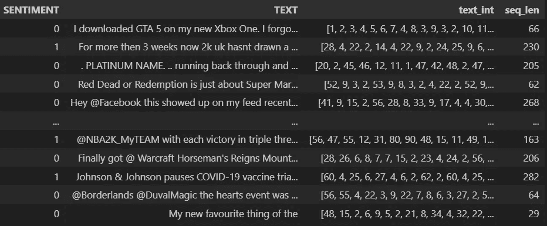
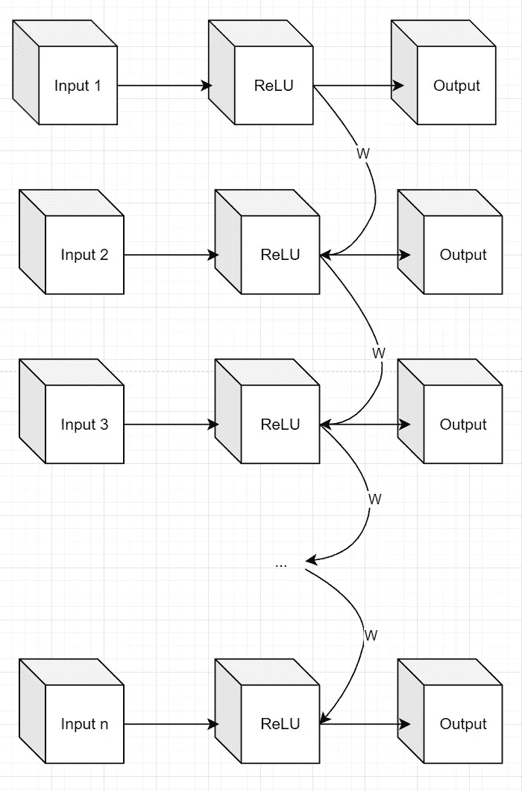
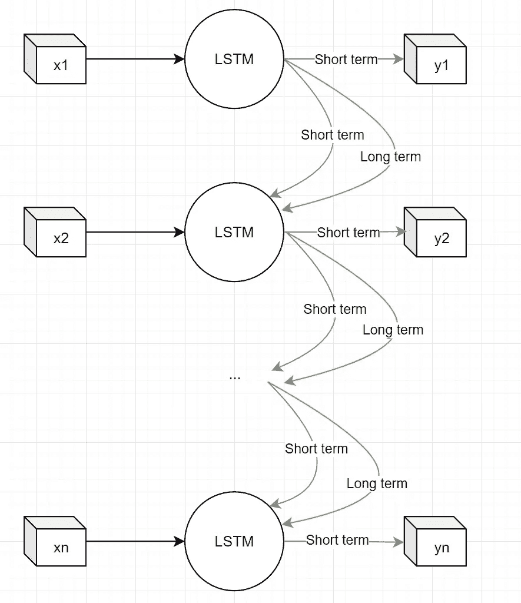
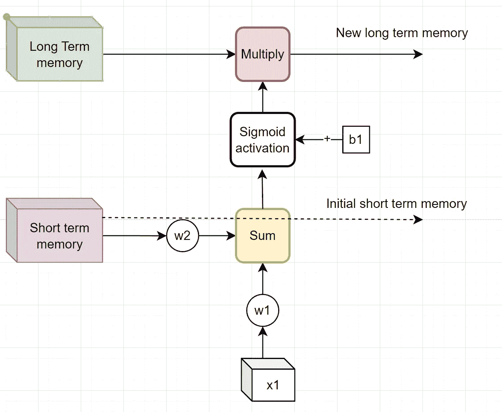
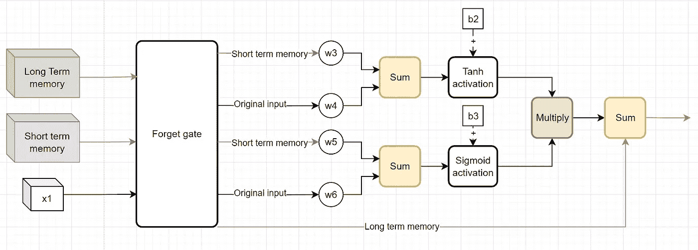
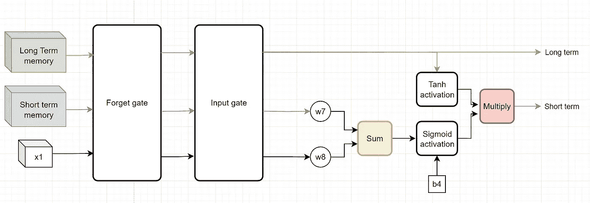
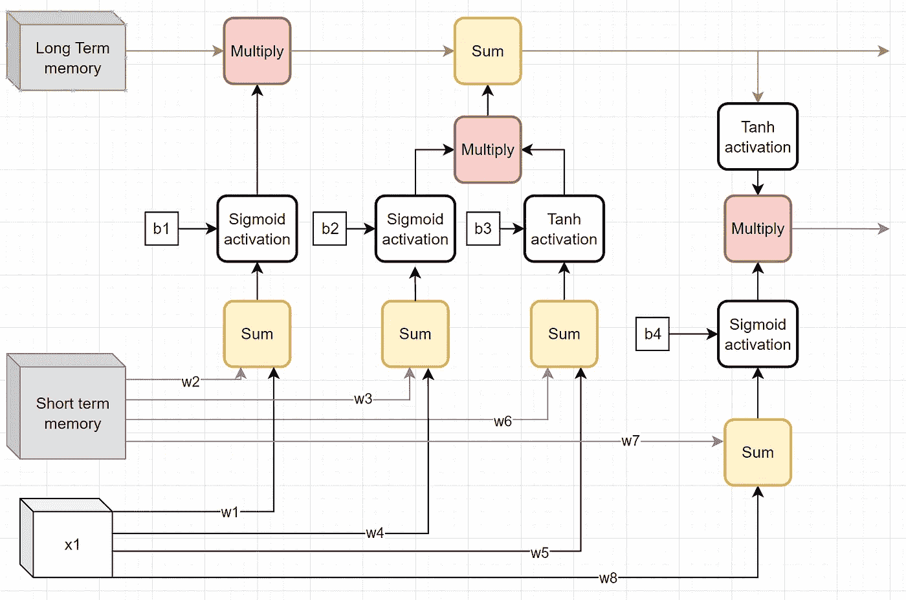

# 精通 Python 中的长短期记忆：释放 LSTM 在 NLP 中的力量

> 原文：[`towardsdatascience.com/mastering-long-short-term-memory-with-python-unleashing-the-power-of-lstm-in-nlp-381ec3430f50`](https://towardsdatascience.com/mastering-long-short-term-memory-with-python-unleashing-the-power-of-lstm-in-nlp-381ec3430f50)

## 一本关于理解和实现 LSTM 层用于 Python 自然语言处理的全面指南

[](https://eligijus-bujokas.medium.com/?source=post_page-----381ec3430f50--------------------------------)[](https://towardsdatascience.com/?source=post_page-----381ec3430f50--------------------------------) [Eligijus Bujokas](https://eligijus-bujokas.medium.com/?source=post_page-----381ec3430f50--------------------------------)

·发布于[Towards Data Science](https://towardsdatascience.com/?source=post_page-----381ec3430f50--------------------------------) ·17 分钟阅读·2023 年 11 月 28 日

--


[Sven Brandsma](https://unsplash.com/@seffen99?utm_source=medium&utm_medium=referral)拍摄的照片，来自[Unsplash](https://unsplash.com/?utm_source=medium&utm_medium=referral)。

这项工作是我[关于 RNN 和 Python NLP 的文章](https://medium.com/towards-data-science/mastering-nlp-in-depth-python-coding-for-deep-learning-models-a15055e989bf)的延续。一个简单的递归层的深度学习网络的自然发展是带有**长短期记忆**（**LSTM**）层的深度学习网络。

与 RNN 和 NLP 一样，我将尝试详细解释 LSTM 层，并从头编写该层的前向传播代码。

所有代码可以在这里查看: [`github.com/Eligijus112/NLP-python`](https://github.com/Eligijus112/NLP-python)

我们将使用与上一篇文章相同的¹数据集：

```py
# Data wrangling
import pandas as pd

# Reading the data 
d = pd.read_csv('input/Tweets.csv', header=None)

# Adding the columns 
d.columns = ['INDEX', 'GAME', "SENTIMENT", 'TEXT']

# Leaving only the positive and the negative sentiments 
d = d[d['SENTIMENT'].isin(['Positive', 'Negative'])]

# Encoding the sentiments that the negative will be 1 and the positive 0
d['SENTIMENT'] = d['SENTIMENT'].apply(lambda x: 0 if x == 'Positive' else 1)

# Dropping missing values
d = d.dropna()
```


数据集中的随机行；作者拍摄的图片

请记住，SENTIMENT=1 表示负面情感，SENTIMENT=0 表示正面情感。

我们需要将文本数据转换为整数序列。不过，与上一篇文章不同的是，我们现在将创建一个字符序列，而不是单词序列。

例如，文本“*Nice Game*”可以转换为以下示例向量：

*[1, 2, 3, 4, 5, 6, 7, 8, 3]*

每个字符，包括空格和标点符号，都会有一个索引。

```py
def create_word_index(
    x: str, 
    shift_for_padding: bool = False, 
    char_level: bool = False) -> Tuple[dict, dict]: 
    """
    Function that scans a given text and creates two dictionaries:
    - word2idx: dictionary mapping words to integers
    - idx2word: dictionary mapping integers to words

    Args:
        x (str): text to scan
        shift_for_padding (bool, optional): If True, the function will add 1 to all the indexes.
            This is done to reserve the 0 index for padding. Defaults to False.
        char_level (bool, optional): If True, the function will create a character level dictionary.

    Returns:
        Tuple[dict, dict]: word2idx and idx2word dictionaries
    """
    # Ensuring that the text is a string
    if not isinstance(x, str):
        try: 
            x = str(x)
        except:
            raise Exception('The text must be a string or a string convertible object')

    # Spliting the text into words
    words = []
    if char_level:
        # The list() function of a string will return a list of characters
        words = list(x)
    else:
        # Spliting the text into words by spaces
        words = x.split(' ')

    # Creating the word2idx dictionary 
    word2idx = {}
    for word in words: 
        if word not in word2idx: 
            # The len(word2idx) will always ensure that the 
            # new index is 1 + the length of the dictionary so far
            word2idx[word] = len(word2idx)

    # Adding the <UNK> token to the dictionary; This token will be used 
    # on new texts that were not seen during training.
    # It will have the last index. 
    word2idx['<UNK>'] = len(word2idx)

    if shift_for_padding:
        # Adding 1 to all the indexes; 
        # The 0 index will be reserved for padding
        word2idx = {k: v + 1 for k, v in word2idx.items()}

    # Reversing the above dictionary and creating the idx2word dictionary
    idx2word = {idx: word for word, idx in word2idx.items()}

    # Returns the dictionaries
    return word2idx, idx2word
```

让我们将数据拆分为训练集和测试集，并应用我们创建的函数：

```py
# Spliting to train test 
train, test = train_test_split(d, test_size=0.2, random_state=42)

# Reseting the indexes 
train.reset_index(drop=True, inplace=True)
test.reset_index(drop=True, inplace=True)

print(f'Train shape: {train.shape}')
print(f'Test shape: {test.shape}')
Train shape: (34410, 4)
Test shape: (8603, 4)

# Joining all the texts into one string
text = ' '.join(train['TEXT'].values)

# Creating the word2idx and idx2word dictionaries
word2idx, idx2word = create_word_index(text, shift_for_padding=True, char_level=True)

# Printing the size of the vocabulary
print(f'The size of the vocabulary is: {len(word2idx)}')
The size of the vocabulary is: 274
```

我们的数据中有 274 个独特的字符。让我们打印**word2idx**字典中的前 10 项：

```py
{'I': 1,
 ' ': 2,
 'd': 3,
 'o': 4,
 'w': 5,
 'n': 6,
 'l': 7,
 'a': 8,
 'e': 9,
 'G': 10
}
```

让我们将文本转换为序列：

```py
# For each row in the train and test set, we will create a list of integers
# that will represent the words in the text
train['text_int'] = train['TEXT'].apply(lambda x: [word2idx.get(word, word2idx['<UNK>']) for word in list(x)])
test['text_int'] = test['TEXT'].apply(lambda x: [word2idx.get(word, word2idx['<UNK>']) for word in list(x)])

# Calculating the length of sequences in the train set 
train['seq_len'] = train['text_int'].apply(lambda x: len(x))

# Describing the length of the sequences
train['seq_len'].describe()
count    34410.000000
mean       103.600262
std         79.972798
min          1.000000
25%         41.000000
50%         83.000000
75%        148.000000
max        727.000000
```

回顾一下，按词级别拆分文本导致序列的平均长度为**~22** 个令牌。现在，我们有长度为**~103** 个令牌的序列。标准差非常高，因此我们将使用最大序列长度为**200** 进行填充。

```py
def pad_sequences(x: list, pad_length: int) -> list:
    """
    Function that pads a given list of integers to a given length

    Args:
        x (list): list of integers to pad
        pad_length (int): length to pad

    Returns:
        list: padded list of integers
    """
    # Getting the length of the list
    len_x = len(x)

    # Checking if the length of the list is less than the pad_length
    if len_x < pad_length: 
        # Padding the list with 0s
        x = x + [0] * (pad_length - len_x)
    else: 
        # Truncating the list to the desired length
        x = x[:pad_length]

    # Returning the padded list
    return x

# Padding the train and test sequences 
train['text_int'] = train['text_int'].apply(lambda x: pad_sequences(x, 200))
test['text_int'] = test['text_int'].apply(lambda x: pad_sequences(x, 200))
```

到目前为止，训练集和验证集的数据集如下：



一段数据；作者拍摄的照片

为什么我们应该从普通的 RNN 切换到 LSTM 网络？问题有两个方面：

+   一个简单的 RNN 有所谓的**消失梯度问题²**或**爆炸梯度问题**，与网络中***for*** 循环使用的权重相关。

+   网络往往会**“忘记”**长序列数据的初始步骤输入。

为了说明***遗忘***，请考虑以下示例：

在我们的数据中，平均而言，有 103 个时间步（文本中从左到右的令牌数量）。回顾 RNN 文章中的图表：



展开 n 步 RNN；作者拍摄的照片

我们有相同的权重**W**，用来乘以 ReLU 层的输出。然后，我们将该信号添加到下一个时间步，依此类推。如果我们为**W**选择一个相对较小的值（例如 0.5），并且我们有 103 步时间序列数据，从第一次时间步输入到最终输出的影响大致为**0.5¹⁰³ * input1**，这大致等于零。

第二次输入的信号将是**0.5¹⁰² * input2**，以此类推。

可以看出，随着时间步的增加，初始时间步的信息在最终输出中的占比越来越少。

为了应对遗忘过去的问题，伟大的思想家们提出了用于时间序列问题的 LSTM 层³。

从内部来看，LSTM 层使用两个激活函数：

+   Sigmoid 函数

+   Tanh 函数

关于这些函数要记住的关键事实是：

+   **sigmoid** 激活函数接受实数平面上的任何值，并输出一个**在 0 和 1 之间**的值。

+   **tanh** 函数接受实数平面上的任何值，并输出一个**在 -1 和 1 之间**的值。

```py
def sigmoid(x: float) -> float: 
    """
    Function that calculates the sigmoid of a given value

    Args:
        x (float): value to calculate the sigmoid

    Returns:
        float: sigmoid of the given value in (0, 1)
    """
    return 1 / (1 + np.exp(-x))

def tanh(x: float) -> float: 
    """
    Function that calculates the tanh of a given value

    Args:
        x (float): value to calculate the tanh

    Returns:
        float: tanh of the given value in (-1, 1)
    """
    return (np.exp(x) - np.exp(-x)) / (np.exp(x) + np.exp(-x))
```

既然我们已经了解了 sigmoid 和 tanh 激活函数，让我们回到 LSTM 层。

LSTM 层由 2 部分组成（因此得名）：

+   长期记忆块

+   短期记忆块

在每个时间步（或令牌步），LSTM 层输出两个预测：**长期预测**和**短期预测**。LSTM 单元的高层次图示可以这样可视化：



展开的简单 LSTM 网络；作者拍摄的图表

在每个时间步骤，LSTM 层输出一个数字，这就是我们所称的**短期记忆输出**。它通常只是一个标量。此外，**长期记忆**标量也在 LSTM 层中计算，但它不被输出并传递到序列的第二步。值得注意的是，在每个时间步骤中，短期和长期记忆都会被更新。

现在让我们深入探讨 LSTM 层。LSTM 层的第一部分是所谓的**忘记门**操作：



忘记门；图表由作者提供

忘记门得名于我们**计算希望保留的长期记忆百分比**。这是因为 sigmoid 激活函数会输出一个介于 0 和 1 之间的数字，我们将这个数字乘以长期记忆并传递到网络中。

我们可以开始看到在训练时会更新的权重：**w1, w2** 和 **b1**。这些权重直接影响保持的长期记忆量。

请注意，在这个步骤中，短期记忆没有调整，而是传递到网络的第二步。

```py
class ForgetGate: 
    """
    Class that implements the forget gate of an LSTM cell
    """
    def __init__(
            self, 
            w1: float = np.random.normal(), 
            w2: float = np.random.normal(),
            b1: float = np.random.normal(),
            long_term_memory: float = np.random.normal(), 
            short_term_memory: float = np.random.normal(), 
            ):
        """
        Constructor of the class

        Args:
            long_term_memory (float): long term memory
            short_term_memory (float): short term memory
            w1 (float): weight 1
            w2 (float): weight 2
            b1 (float): bias term 1
        """
        # Saving the input
        self.long_term_memory = long_term_memory
        self.short_term_memory = short_term_memory
        self.w1 = w1
        self.w2 = w2
        self.b1 = b1

    def forward(self, x: float) -> float: 
        """
        Function that calculates the output of the forget gate

        Args:
            x (float): input to the forget gate

        Returns:
            float: output of the forget gate
        """
        # Calculates the percentage of the long term memory that will be kept
        percentage_to_keep = sigmoid((self.w1 * x  + self.w2 * self.short_term_memory) + self.b1)

        # Updating the long term memory
        self.long_term_memory = self.long_term_memory * percentage_to_keep

        # The output of the forget gate is the new long term memory and the short term memory
        return self.long_term_memory, self.short_term_memory
```

```py
# Initiating 
forget_gate = ForgetGate()

print(f'Initial long term memory: {forget_gate.long_term_memory}')
print(f'Initial short term memory: {forget_gate.short_term_memory}')

# Calculating the output of the forget gate
lt, st = forget_gate.forward(0.5)

print(f'Long term memory: {lt}')
print(f'Short term memory: {st}')

Initial long term memory: -0.8221542907288696
Initial short term memory: -0.5617438418718841
Long term memory: -0.37335827895028
Short term memory: -0.5617438418718841
```

接下来在 LSTM 层的是输入门：



输入门；图表由作者提供

输入门仅调整 LSTM 网络的长期记忆部分，但为此，它使用当前输入和当前短期记忆值。

从图表来看，在乘法步骤之前，我们有两个输出：一个来自 sigmoid 激活函数，另一个来自 tanh 激活层。宽泛地说，sigmoid 层输出要记住的记忆百分比（0，1），而 tanh 输出记住的潜在记忆（-1，1）。

然后我们将当前长期记忆（在忘记门中稍作调整）与输入门输出相加。

```py
class InputGate:
    def __init__(
            self, 
            w3: float = np.random.normal(), 
            w4: float = np.random.normal(),
            w5: float = np.random.normal(),
            w6: float = np.random.normal(),
            b2: float = np.random.normal(),
            b3: float = np.random.normal(),
            long_term_memory: float = np.random.normal(), 
            short_term_memory: float = np.random.normal(), 
            ):
        """
        Constructor of the class

        Args:
            long_term_memory (float): long term memory
            short_term_memory (float): short term memory
            w3 (float): weight 3
            w4 (float): weight 4
            w5 (float): weight 5
            w6 (float): weight 6
            b2 (float): bias 2
            b3 (float): bias 3
        """
        # Saving the input
        self.long_term_memory = long_term_memory
        self.short_term_memory = short_term_memory
        self.w3 = w3
        self.w4 = w4
        self.w5 = w5
        self.w6 = w6
        self.b2 = b2
        self.b3 = b3

    def forward(self, x: float) -> float:
        """
        Function that calculates the output of the input gate

        Args:
            x (float): input to the input gate

        Returns:
            float: output of the input gate
        """
        # Calculating the memory signal 
        memory_signal = tanh((self.w3 * x + self.w4 * self.short_term_memory) + self.b2)

        # Calculating the percentage of memory to keep 
        percentage_to_keep = sigmoid((self.w5 * x + self.w6 * self.short_term_memory) + self.b3) 

        # Multiplying the memory signal by the percentage to keep
        memory_signal = memory_signal * percentage_to_keep

        # Updating the long term memory
        self.long_term_memory = self.long_term_memory + memory_signal

        # The output of the input gate is the new long term memory and the short term memory
        return self.long_term_memory, self.short_term_memory
```

```py
# Creating the input gate object with the forget gates' output 
input_gate = InputGate(long_term_memory=lt, short_term_memory=st)

# Forward propagating 
lt, st = input_gate.forward(0.5)

print(f'Long term memory: {lt}')
print(f'Short term memory: {st}')

Long term memory: -1.028998511766425
Short term memory: -0.5617438418718841
```

从上面的代码片段可以看出，唯一变化的是长期记忆。

LSTM 层的最后一部分是**输出门**。输出门是我们将调整**短期**记忆的步骤：



输出门；图表由作者提供

逻辑与之前门的逻辑非常相似：sigmoid 激活函数计算要保留的记忆百分比，而 tanh 函数计算总体信号。

```py
class OutputGate:
    def __init__(
            self, 
            w7: float = np.random.normal(), 
            w8: float = np.random.normal(),
            b4: float = np.random.normal(),
            long_term_memory: float = np.random.normal(), 
            short_term_memory: float = np.random.normal(), 
            ):
        """
        Constructor of the class

        Args:
            long_term_memory (float): long term memory
            short_term_memory (float): short term memory
            w7 (float): weight 7
            w8 (float): weight 8
            w9 (float): weight 9
            w10 (float): weight 10
            b4 (float): bias 4
            b5 (float): bias 5
        """
        # Saving the input
        self.long_term_memory = long_term_memory
        self.short_term_memory = short_term_memory
        self.w7 = w7
        self.w8 = w8
        self.b4 = b4

    def forward(self, x: float) -> float:
        """
        Function that calculates the output of the output gate

        Args:
            x (float): input to the output gate

        Returns:
            float: output of the output gate
        """
        # Calculating the short term memory signal 
        short_term_memory_signal = tanh(self.long_term_memory)

        # Calculating the percentage of short term memory to keep 
        percentage_to_keep = sigmoid((self.w7 * x + self.w8 * self.short_term_memory) + self.b4) 

        # Multiplying the short term memory signal by the percentage to keep
        short_term_memory_signal = short_term_memory_signal * percentage_to_keep

        # Updating the short term memory
        self.short_term_memory = short_term_memory_signal

        # The output of the output gate is the new long term memory and the short term memory
        return self.long_term_memory, self.short_term_memory
```

```py
# Creating the output gate object
output_gate = OutputGate(long_term_memory=lt, short_term_memory=st)

# Forward propagating
lt, st = output_gate.forward(0.5)

print(f'Long term memory: {lt}')
print(f'Short term memory: {st}')

Long term memory: -1.028998511766425
Short term memory: -0.7233077589896045
```

如我们所见，输出门仅调整了短期记忆标量。



LSTM 层；图表由作者提供

上图显示了忘记门、输入门和输出门的合成图⁴。

当我们有一个 x 变量的输入序列时，使用 LSTM 层的内部循环是这样的：

1.  随机初始化短期和长期记忆。

2. 对于每个**x1**到**xn**：

2.1 通过 LSTM 层向前传播。

2.2 输出短期记忆

将长期和短期记忆保存到层中。

让我们将每个门封装到一个类中，并创建一个 Python 示例。

```py
# Redefining the forget, input and output gates as functions 
def forget_gate(x: float, w1: float, w2: float, b1: float, long_term_memory: float, short_term_memory: float) -> Tuple[float, float]:
    """
    Function that calculates the output of the forget gate

    Args:
        x (float): input to the forget gate
        w1 (float): weight 1
        w2 (float): weight 2
        b1 (float): bias 1
        long_term_memory (float): long term memory
        short_term_memory (float): short term memory

    Returns:
        Tuple[float, float]: output of the forget gate
    """
    # Calculates the percentage of the long term memory that will be kept
    percentage_to_keep = sigmoid((w1 * x  + w2 * short_term_memory) + b1)

    # Updating the long term memory
    long_term_memory = long_term_memory * percentage_to_keep

    # The output of the forget gate is the new long term memory and the short term memory
    return long_term_memory, short_term_memory

def input_gate(x: float, w3: float, w4: float, w5: float, w6: float, b2: float, b3: float, long_term_memory: float, short_term_memory: float) -> Tuple[float, float]:
    """
    Function that calculates the output of the input gate

    Args:
        x (float): input to the input gate
        w3 (float): weight 3
        w4 (float): weight 4
        w5 (float): weight 5
        w6 (float): weight 6
        b2 (float): bias 2
        b3 (float): bias 3
        long_term_memory (float): long term memory
        short_term_memory (float): short term memory

    Returns:
        Tuple[float, float]: output of the input gate
    """
    # Calculating the memory signal 
    memory_signal = tanh((w3 * x + w4 * short_term_memory) + b2)

    # Calculating the percentage of memory to keep 
    percentage_to_keep = sigmoid((w5 * x + w6 * short_term_memory) + b3) 

    # Multiplying the memory signal by the percentage to keep
    memory_signal = memory_signal * percentage_to_keep

    # Updating the long term memory
    long_term_memory = long_term_memory + memory_signal

    # The output of the input gate is the new long term memory and the short term memory
    return long_term_memory, short_term_memory

def output_gate(x: float, w7: float, w8: float, b4: float, long_term_memory: float, short_term_memory: float) -> Tuple[float, float]:
    """
    Function that calculates the output of the output gate

    Args:
        x (float): input to the output gate
        w7 (float): weight 7
        w8 (float): weight 8
        b4 (float): bias 4
        long_term_memory (float): long term memory
        short_term_memory (float): short term memory

    Returns:
        Tuple[float, float]: output of the output gate
    """
    # Calculating the short term memory signal 
    short_term_memory_signal = tanh(long_term_memory)

    # Calculating the percentage of short term memory to keep 
    percentage_to_keep = sigmoid((w7 * x + w8 * short_term_memory) + b4) 

    # Multiplying the short term memory signal by the percentage to keep
    short_term_memory_signal = short_term_memory_signal * percentage_to_keep

    # Updating the short term memory
    short_term_memory = short_term_memory_signal

    # The output of the output gate is the new long term memory and the short term memory
    return long_term_memory, short_term_memory 

class simpleLSTM: 
    def __init__(
            self, 
            w1: float = np.random.normal(),
            w2: float = np.random.normal(),
            w3: float = np.random.normal(),
            w4: float = np.random.normal(),
            w5: float = np.random.normal(),
            w6: float = np.random.normal(),
            w7: float = np.random.normal(),
            w8: float = np.random.normal(),
            b1: float = np.random.normal(),
            b2: float = np.random.normal(),
            b3: float = np.random.normal(),
            b4: float = np.random.normal(),
            long_term_memory: float = np.random.normal(),
            short_term_memory: float = np.random.normal(),
            ):
        """
        Constructor of the class

        Args:
            long_term_memory (float): long term memory
            short_term_memory (float): short term memory
            w1 (float): weight 1
            w2 (float): weight 2
            w3 (float): weight 3
            w4 (float): weight 4
            w5 (float): weight 5
            w6 (float): weight 6
            w7 (float): weight 7
            w8 (float): weight 8
            b1 (float): bias 1
            b2 (float): bias 2
            b3 (float): bias 3
            b4 (float): bias 4
        """

        # Saving the input
        self.long_term_memory = long_term_memory
        self.short_term_memory = short_term_memory
        self.w1 = w1
        self.w2 = w2
        self.w3 = w3
        self.w4 = w4
        self.w5 = w5
        self.w6 = w6
        self.w7 = w7
        self.w8 = w8
        self.b1 = b1
        self.b2 = b2
        self.b3 = b3
        self.b4 = b4

    def forward(self, x: float) -> float:
        """
        Function that calculates the output of the simple LSTM cell

        Args:
            x (float): input to the simple LSTM cell

        Returns:
            float: output of the simple LSTM cell
        """
        # Calculating the output of the forget gate
        lt, st = forget_gate(x, self.w1, self.w2, self.b1, self.long_term_memory, self.short_term_memory)

        # Updating the long term memory
        self.long_term_memory = lt

        # Calculating the output of the input gate
        lt, st = input_gate(x, self.w3, self.w4, self.w5, self.w6, self.b2, self.b3, self.long_term_memory, self.short_term_memory)

        # Updating the long term memory
        self.long_term_memory = lt

        # Calculating the output of the output gate
        lt, st = output_gate(x, self.w7, self.w8, self.b4, self.long_term_memory, self.short_term_memory)

        # Updating the short term memory
        self.short_term_memory = st

        # The output of the simple LSTM cell is the new long term memory and the short term memory
        return self.long_term_memory, self.short_term_memory

    def forward_sequence(self, x: list) -> list:
        """
        Function that forward propagates a sequence of inputs through the simple LSTM cell

        Args:
            x (list): sequence of inputs to the simple LSTM cell

        Returns:
            list: sequence of outputs of the simple LSTM cell
        """
        # Creating a list to store the outputs
        outputs = []

        # Forward propagating each input
        for input in x: 
            # Forward propagating the input
            _, st = self.forward(input)

            # Appending the output to the list
            outputs.append(st)

        # Returning the list of outputs
        return outputs
```

```py
# Creating the simple LSTM cell object
simple_lstm = simpleLSTM()

# Creating a sequence of x
x = [0.5, 0.6, 0.7, 0.8, 0.9]

# Forward propagating the sequence
outputs = simple_lstm.forward_sequence(x)

# Rounding 
outputs = [round(output, 2) for output in outputs]

# Printing the outputs
print(f'The outputs of the simple LSTM cell are: {outputs}')
The outputs of the simple LSTM cell are: [0.63, 0.41, 0.33, 0.28, 0.25]
```

现在我们将所有内容包裹在一个漂亮的 pytorch 示例中，使用 LSTM 层。语法与基本的 RNN 模型非常相似：

```py
# Defining the torch model for sentiment classification 
class SentimentClassifier(torch.nn.Module):
    """
    Class that defines the sentiment classifier model
    """
    def __init__(self, vocab_size, embedding_dim):
        super(SentimentClassifier, self).__init__()

        self.embedding = nn.Embedding(vocab_size + 1, embedding_dim)
        self.lstm = nn.LSTM(input_size=embedding_dim, hidden_size=1, batch_first=True)
        self.fc = nn.Linear(1, 1)  # Output with a single neuron for binary classification
        self.sigmoid = nn.Sigmoid()  # Sigmoid activation

    def forward(self, x):
        x = self.embedding(x)  # Embedding layer
        output, _ = self.lstm(x)  # RNN layer

        # Use the short term memory from the last time step as the representation of the sequence
        x = output[:, -1, :]

        # Fully connected layer with a single neuron
        x = self.fc(x) 

        # Converting to probabilities
        x = self.sigmoid(x)

        # Flattening the output
        x = x.squeeze()

        return x

# Initiating the model 
model = SentimentClassifier(vocab_size=len(word2idx), embedding_dim=16)

# Initiating the criterion and the optimizer
criterion = nn.BCELoss() # Binary cross entropy loss
optimizer = torch.optim.Adam(model.parameters(), lr=0.001)
```

```py
# Defining the data loader 
from torch.utils.data import Dataset, DataLoader

class TextClassificationDataset(Dataset):
    def __init__(self, data):
        self.data = data

    def __len__(self):
        return len(self.data)

    def __getitem__(self, idx):
        # The x is named as text_int and the y as airline_sentiment
        x = self.data.iloc[idx]['text_int']
        y = self.data.iloc[idx]['SENTIMENT']

        # Converting the x and y to torch tensors
        x = torch.tensor(x)
        y = torch.tensor(y)

        # Converting the y variable to float 
        y = y.float()

        # Returning the x and y
        return x, y

# Creating the train and test loaders
train_loader = DataLoader(TextClassificationDataset(train), batch_size=32, shuffle=True)
test_loader = DataLoader(TextClassificationDataset(test), batch_size=32, shuffle=True)
```

```py
# Defining the number of epochs
epochs = 100

# Setting the model to train mode
model.train()

# Saving of the loss values
losses = []

# Iterating through epochs
for epoch in range(epochs):
    # Initiating the total loss 
    total_loss = 0

    for batch_idx, (inputs, labels) in enumerate(train_loader):
        # Zero the gradients
        optimizer.zero_grad()  # Zero the gradients
        outputs = model(inputs)  # Forward pass

        loss = criterion(outputs, labels)  # Compute the loss
        loss.backward()  # Backpropagation
        optimizer.step()  # Update the model's parameters

        # Adding the loss to the total loss
        total_loss += loss.item()

    # Calculating the average loss
    avg_loss = total_loss / len(train_loader)

    # Appending the loss to the list containing the losses
    losses.append(avg_loss)

    # Printing the loss every n epochs
    if epoch % 20 == 0:
        print(f'Epoch: {epoch}, Loss: {avg_loss}')

Epoch: 0, Loss: 0.6951859079329055
Epoch: 20, Loss: 0.6478807757224292
Epoch: 40, Loss: 0.6398377026877882
Epoch: 60, Loss: 0.6353290403144067
Epoch: 80, Loss: 0.6312290856884758
```

```py
# Setting the model to eval model
model.eval()

# List to track the test acc 
total_correct = 0
total_obs = 0

# Iterating over the test set
for batch_idx, (inputs, labels) in enumerate(test_loader):
    outputs = model(inputs)  # Forward pass

    # Getting the number of correct predictions 
    correct = ((outputs > 0.5).float() == labels).float().sum()

    # Getting the total number of predictions
    total = labels.size(0)

    # Updating the total correct and total observations
    total_correct += correct
    total_obs += total

print(f'The test accuracy is: {total_correct / total_obs}')
The test accuracy is: 0.6447750926017761
```

这篇文章深入探讨了 LSTM 单元的内部工作细节。某些 LSTM 层的实现可能与这里展示的有所不同，但长期和短期记忆的整体部分在绝大多数实现中都存在。

我希望读者现在对 LSTM 层有了更好的理解，并希望他们能够立即将其实施到他们的工作流程中！

特别感谢 StatQuest 提供的精彩讲解视频⁵。

[1]

**名称：** 推特情感分析

**网址：** [`www.kaggle.com/datasets/jp797498e/twitter-entity-sentiment-analysis`](https://www.kaggle.com/datasets/jp797498e/twitter-entity-sentiment-analysis)

**数据集许可证：** [`creativecommons.org/publicdomain/zero/1.0/`](https://creativecommons.org/publicdomain/zero/1.0/)

[2]

**名称：** 梯度消失问题

**网址：** [`k21academy.com/datascience-blog/machine-learning/recurrent-neural-networks/#:~:text=Two%20Issues%20of%20Standard%20RNNs&text=RNNs%20suffer%20from%20the%20matter,of%20long%20data%20sequences%20difficult`](https://k21academy.com/datascience-blog/machine-learning/recurrent-neural-networks/#:~:text=Two%20Issues%20of%20Standard%20RNNs&text=RNNs%20suffer%20from%20the%20matter,of%20long%20data%20sequences%20difficult)

[3]

**名称：** 长短期记忆

**网址：** [`www.bioinf.jku.at/publications/older/2604.pdf`](https://www.bioinf.jku.at/publications/older/2604.pdf)

**年份：** 1997

[4]

**名称：** 理解 LSTM 网络

**网址：** [`colah.github.io/posts/2015-08-Understanding-LSTMs/`](https://colah.github.io/posts/2015-08-Understanding-LSTMs/)

**年份：** 2015

[5]

**名称：** 长短期记忆（LSTM），清晰解释

**网址：** [`www.youtube.com/watch?v=YCzL96nL7j0`](https://www.youtube.com/watch?v=YCzL96nL7j0&t=358s)

**年份：** 2022
