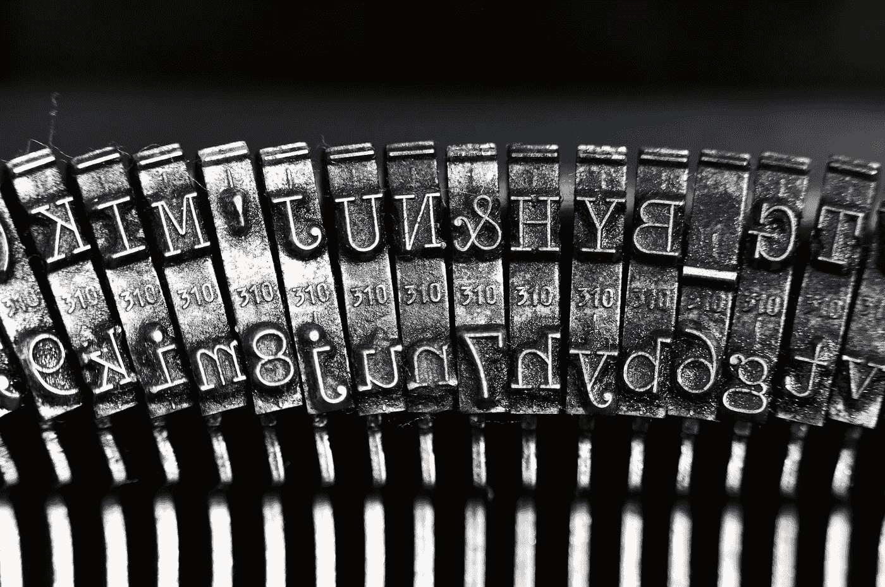

# 掌握 NLP：深度学习模型的 Python 编码详解

> 原文：[`towardsdatascience.com/mastering-nlp-in-depth-python-coding-for-deep-learning-models-a15055e989bf?source=collection_archive---------3-----------------------#2023-10-13`](https://towardsdatascience.com/mastering-nlp-in-depth-python-coding-for-deep-learning-models-a15055e989bf?source=collection_archive---------3-----------------------#2023-10-13)

## 一步一步的指南，提供了用于文本分类的深度学习 Python 代码的全面解释

 [Eligijus Bujokas](https://eligijus-bujokas.medium.com/?source=post_page-----a15055e989bf--------------------------------)

·

[关注](https://medium.com/m/signin?actionUrl=https%3A%2F%2Fmedium.com%2F_%2Fsubscribe%2Fuser%2Fd61597e07b4d&operation=register&redirect=https%3A%2F%2Ftowardsdatascience.com%2Fmastering-nlp-in-depth-python-coding-for-deep-learning-models-a15055e989bf&user=Eligijus+Bujokas&userId=d61597e07b4d&source=post_page-d61597e07b4d----a15055e989bf---------------------post_header-----------) 发表在 [Towards Data Science](https://towardsdatascience.com/?source=post_page-----a15055e989bf--------------------------------) · 21 分钟阅读 · 2023 年 10 月 13 日

--

照片由[Waypixels](https://unsplash.com/@waypixels?utm_source=medium&utm_medium=referral)提供，刊登在[Unsplash](https://unsplash.com/?utm_source=medium&utm_medium=referral)

本文在阅读了大量文档资源并查看了 YouTube 上关于文本数据、分类、递归神经网络及其他如何使用文本数据开发机器学习项目的热门主题的视频后完成。很多信息不太用户友好，有些部分难以理解，因此，我希望节省读者的时间，并阐明在任何机器学习项目中使用文本数据的最重要概念。

这里展示的示例的支持代码可以在：[`github.com/Eligijus112/NLP-python`](https://github.com/Eligijus112/NLP-python) 找到

本文将涵盖的主题包括：

+   ***将文本转换为序列***

+   ***将序列索引转换为嵌入向量***

+   ***深入的 RNN 解释***

+   ***分类的损失函数***

+   ***完整的 NLP 流水线使用 Pytorch***

**NLP** 代表 **N**atural **L**anguage **P**rocessing¹。这是一个关于如何在诸如以下任务中使用硬件和软件的大话题：
