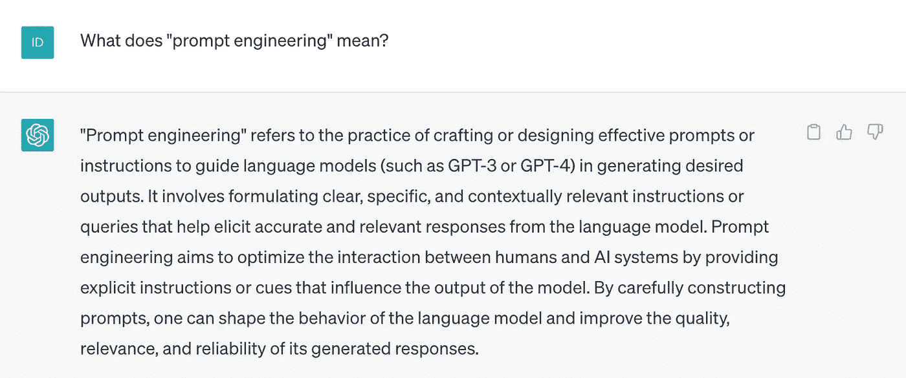
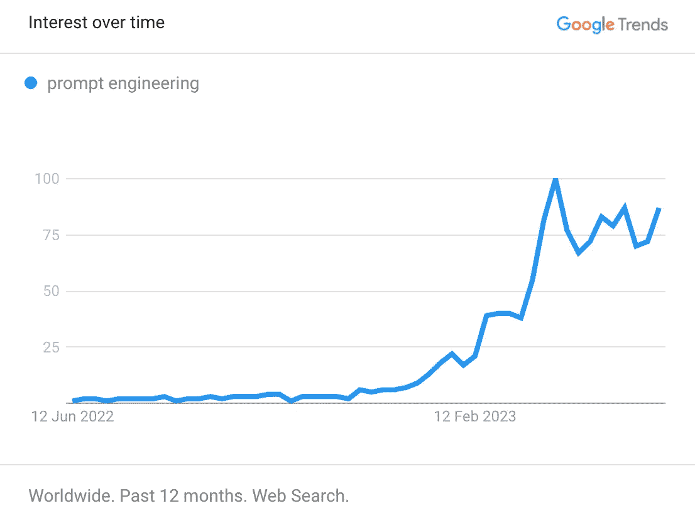

# 掌握提示工程以释放 ChatGPT 的潜力

> 原文：[`towardsdatascience.com/mastering-prompt-engineering-to-unleash-chatgpts-potential-9578a3fe799c?source=collection_archive---------1-----------------------#2023-06-24`](https://towardsdatascience.com/mastering-prompt-engineering-to-unleash-chatgpts-potential-9578a3fe799c?source=collection_archive---------1-----------------------#2023-06-24)

## 探索最佳实践，并提升你的提示语以获得更好的结果

 [Idil Ismiguzel](https://idilismiguzel.medium.com/?source=post_page-----9578a3fe799c--------------------------------)

·

[关注](https://medium.com/m/signin?actionUrl=https%3A%2F%2Fmedium.com%2F_%2Fsubscribe%2Fuser%2F6d965c736f2&operation=register&redirect=https%3A%2F%2Ftowardsdatascience.com%2Fmastering-prompt-engineering-to-unleash-chatgpts-potential-9578a3fe799c&user=Idil+Ismiguzel&userId=6d965c736f2&source=post_page-6d965c736f2----9578a3fe799c---------------------post_header-----------) 发表在 [Towards Data Science](https://towardsdatascience.com/?source=post_page-----9578a3fe799c--------------------------------) · 11 分钟阅读 · 2023 年 6 月 24 日 

--

图片由 [Léonard Cotte](https://unsplash.com/@ettocl?utm_source=medium&utm_medium=referral) 提供，发布在 [Unsplash](https://unsplash.com/?utm_source=medium&utm_medium=referral)

提示工程已经迅速融入我们的生活，就像一阵微风，这都要归功于 ChatGPT 和其他大型语言模型。虽然这并不是一个全新的领域，但目前正经历着巨大的热潮。也就是说，我认为现在是提升你的技能并在提示工程中更进一步的最佳时机。

如果你想了解提示工程的真正含义，不妨问问 ChatGPT 吧！

根据 [Google Trends 数据](https://trends.google.com/trends/explore?q=prompt+engineering&hl=en-GB)， “prompt engineering” 在过去几个月的搜索兴趣达到了顶峰。搜索“prompt engineering”的用户对后续主题如“课程”、“学习”和“薪资” 🤑 表现出浓厚的兴趣。有关“prompt engineering courses”的查询数量也出现了激增。

[过去 12 个月“prompt engineering”的 Google Trends 数据](https://trends.google.com/trends/explore?q=prompt+engineering&hl=en-GB)。值为 100 代表该术语的最高受欢迎程度。这里我筛选了过去 12 个月的数据，你可以根据需要进行调整。

无论你是将 prompt engineering 应用于简单的日常查询，还是寻找食谱…
