# 精通提示工程以释放**ChatGPT**的潜力

> 原文：[`towardsdatascience.com/mastering-prompt-engineering-to-unleash-chatgpts-potential-9578a3fe799c`](https://towardsdatascience.com/mastering-prompt-engineering-to-unleash-chatgpts-potential-9578a3fe799c)

## 探索最佳实践并提升你的提示语，以获得更好的结果

[](https://idilismiguzel.medium.com/?source=post_page-----9578a3fe799c--------------------------------)[](https://towardsdatascience.com/?source=post_page-----9578a3fe799c--------------------------------) [Idil Ismiguzel](https://idilismiguzel.medium.com/?source=post_page-----9578a3fe799c--------------------------------)

·发表于 [Towards Data Science](https://towardsdatascience.com/?source=post_page-----9578a3fe799c--------------------------------) ·阅读时长 11 分钟·2023 年 6 月 24 日

--


照片由 [Léonard Cotte](https://unsplash.com/@ettocl?utm_source=medium&utm_medium=referral) 在 [Unsplash](https://unsplash.com/?utm_source=medium&utm_medium=referral) 提供

提示工程迅速成为我们生活的一部分，就像微风一样，这一切都要归功于**ChatGPT**和其他大型语言模型。尽管这不是一个全新的领域，但它目前正经历着巨大的流行。也就是说，我认为现在是提升技能、成为提示工程大师的绝佳时机。

如果你想知道提示工程到底是什么，不妨问问**ChatGPT**！


根据 [Google Trends 数据](https://trends.google.com/trends/explore?q=prompt+engineering&hl=en-GB)，“提示工程”在过去几个月的搜索兴趣达到了顶峰。搜索“提示工程”的用户对后续话题如“课程”、“学习”和“薪水”感兴趣🤑。对“提示工程课程”的查询数量出现了激增。


[过去 12 个月“提示工程”的 Google 趋势](https://trends.google.com/trends/explore?q=prompt+engineering&hl=en-GB)。值为 100 代表该术语的最高流行度。我在这里过滤了过去 12 个月的数据，但你可以自行调整。

无论您是在利用提示工程处理简单的日常问题、寻找食谱灵感、还是使用网页用户界面（例如 ChatGPT UI）规划下次旅行，或是开发访问大型语言模型 API（例如 ChatGPT API）的应用程序，提高您的提示编写技能都会显著提升您获得的响应质量。了解提示工程还提供了有关大型语言模型工作原理、能力和局限性的有用见解。

在这篇文章中，我将深入探讨我获得的见解，并提供一些示例来展示关键概念。让我们开始吧！💬 🤖

# 开始进行提示工程

提示工程在充分利用大型语言模型（LLMs）方面发挥着重要作用。当提示编写得很好时，响应会更加准确、相关和有用。

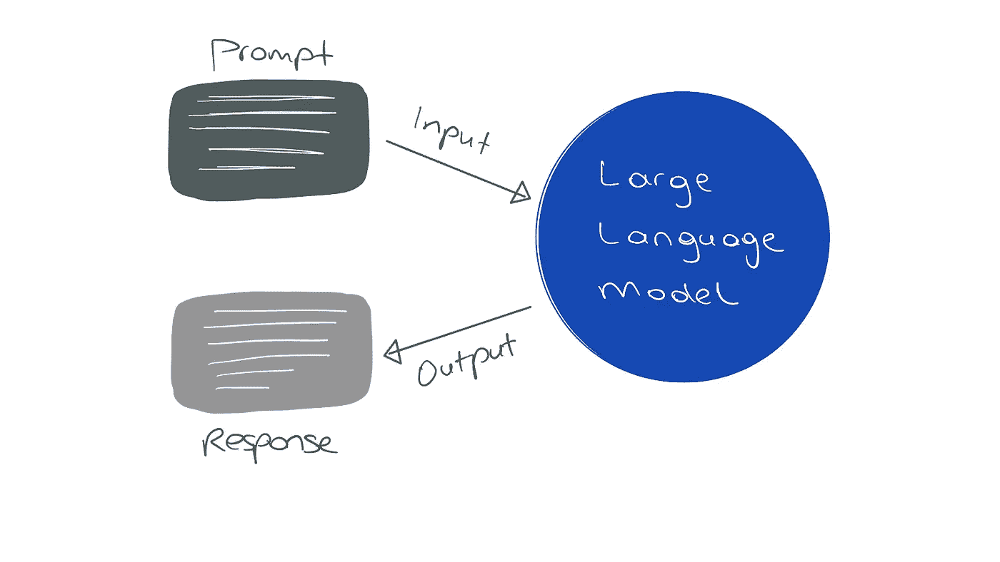

这里是编写提示时的一些常识指南：

+   **🔖 清晰且具体：** 清楚地传达您对模型的期望，并提供具体的指示。

+   **🔖 包含必要的内容和期望的输出样式：** 包括所有必要的信息，并指定您希望响应的格式或样式。

+   **🔖 尽可能提供示例：** 包括示例可以帮助模型理解期望的响应结构。

还有一些重要的注意事项：

+   📍响应可能包含错误

+   📍对相同提示的响应可能会有所不同

+   📍模型的知识基于训练数据收集时的时间（例如 ChatGPT 的知识截止日期是 2021 年 9 月）

# 五种超级强大的提示模式

我们现在将介绍与大型语言模型互动时可以遵循的五种非常重要的提示模式。

## **1\. 人物模式**

使用人物模式，您可以要求 ChatGPT `扮演特定的角色并执行特定的任务。`

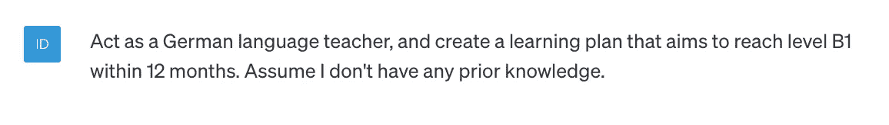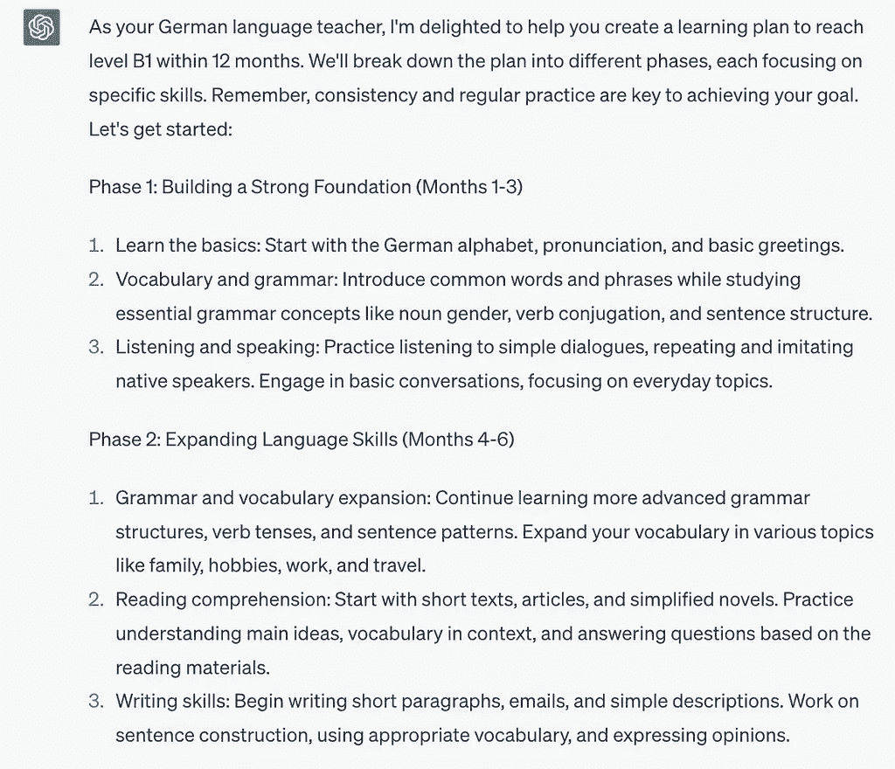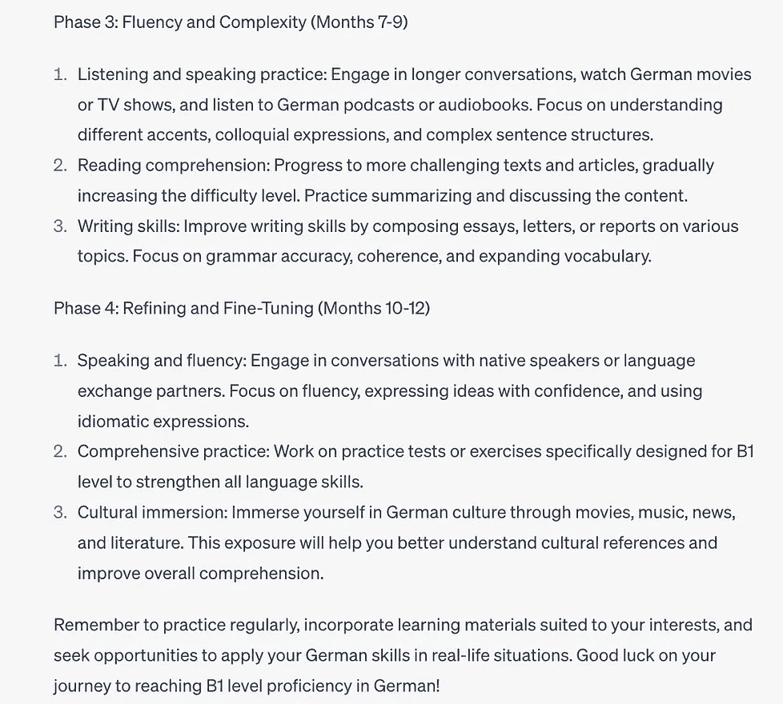

非常不错！（由 ChatGPT 提供的德语学习计划。）

您也可以反向工程这种模式，并要求 ChatGPT 假设您是 Persona X。例如：“为我制定一个德语学习计划，并假设我拥有语言学学位。”

## 2\. 问题细化模式

使用问题细化模式，您可以要求 ChatGPT `生成后续问题，并利用这些问题的答案准确回答最初的问题。`

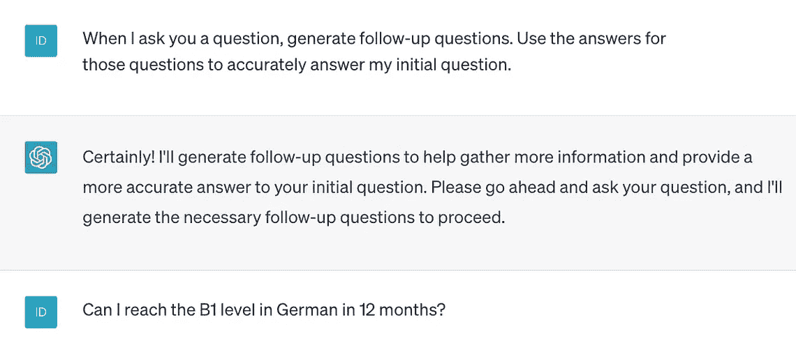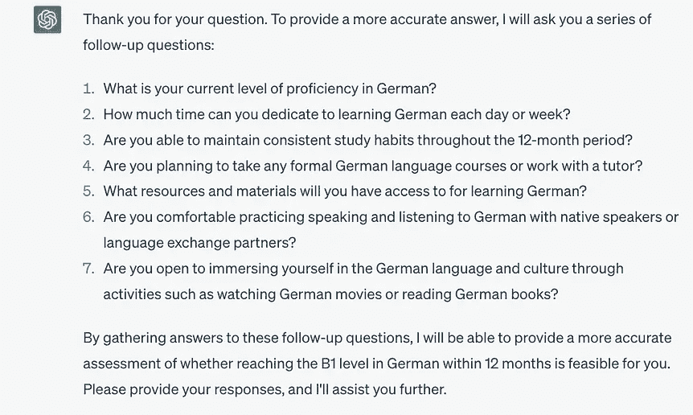

使用问题细化模式进行提示编写

使用这种方法，我们可以洞察 ChatGPT 在构建答案时考虑的因素。我们还可以提供超出初始提示的额外背景。

## 3\. 模板模式

我们可以提供一个模板，并指示 ChatGPT 按照模板生成响应。为了演示，我将提供几段来自[维基百科大型语言模型页面](https://en.wikipedia.org/wiki/Large_language_model)的内容。使用这些段落，ChatGPT 将生成五个问题和答案，遵循模板。

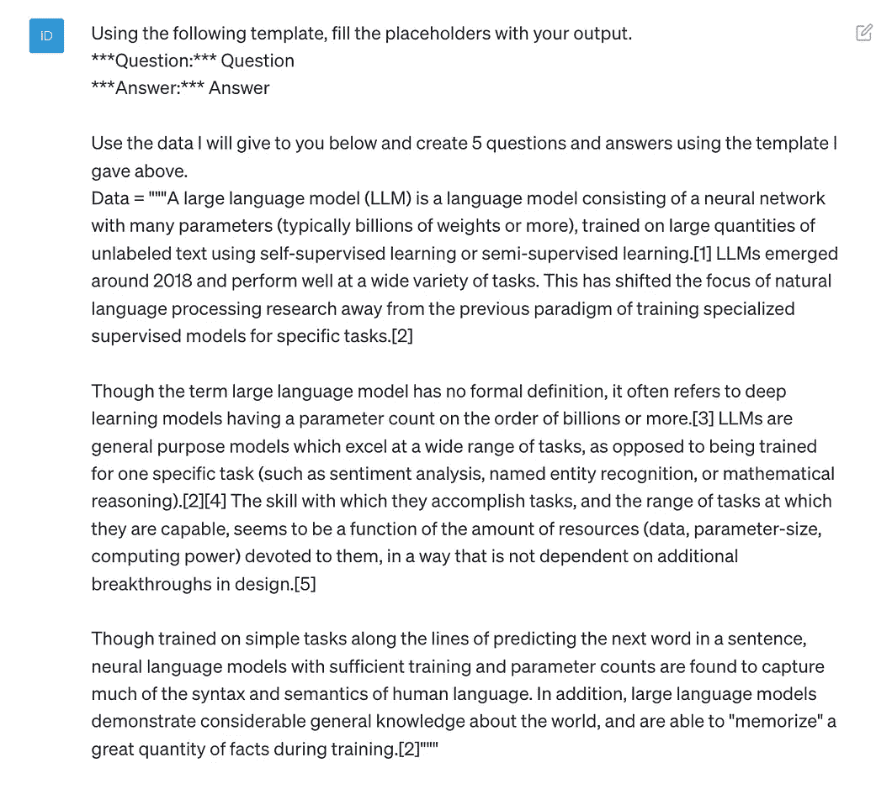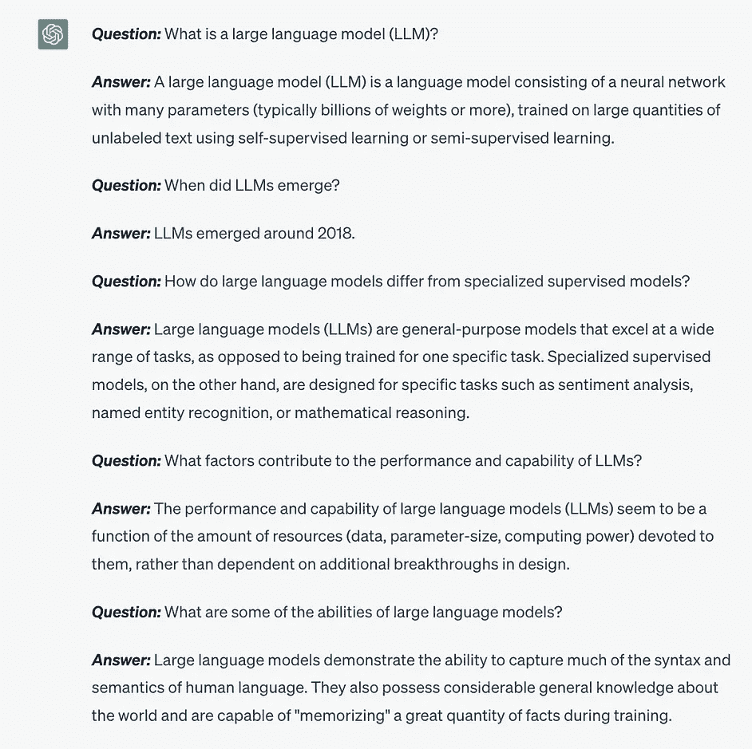

使用 Markdown 可以格式化文本，例如***word***为**word**

## 4\. 零-shot 提示

众所周知，大型语言模型（LLMs）可以按照指令执行，并能够从提示中学习模式，并在回答中遵循这些模式。这是一个***零-shot 学习***的示例任务，我们可以教会模型如何分类模型之前未遇到过的类别。以[迪士尼乐园客户评论数据集](https://www.kaggle.com/datasets/arushchillar/disneyland-reviews)为例，要求模型确定特定评论的情感。

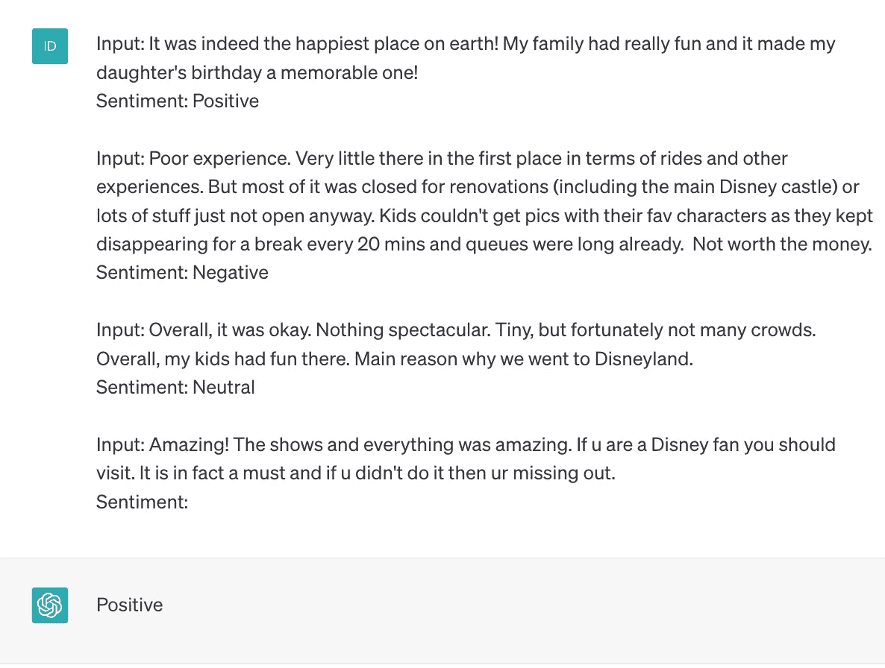

正如你所看到的，响应是“积极的”。

## 5\. 链式思维提示

与仅提供最终答案不同，尤其是对于数学问题，链式思维提示旨在提供逐步解释。

在以下示例中，我向 ChatGPT 提出了一个难题，它最初在回答中犯了一个错误。然而，当我要求 ChatGPT 提供完整的推理过程时，它能够提供正确的解决方案。

这种方法也是了解大型语言模型如何通过预测每个后续词生成文本的一个很好的例子。

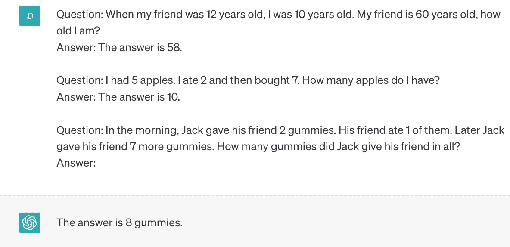

正如你所看到的，答案是不正确的。应该是 9 颗糖而不是 8 颗。现在我们将通过改进提示并确保 ChatGPT 遵循一个可以进行更多评估的模板来解决这个问题。

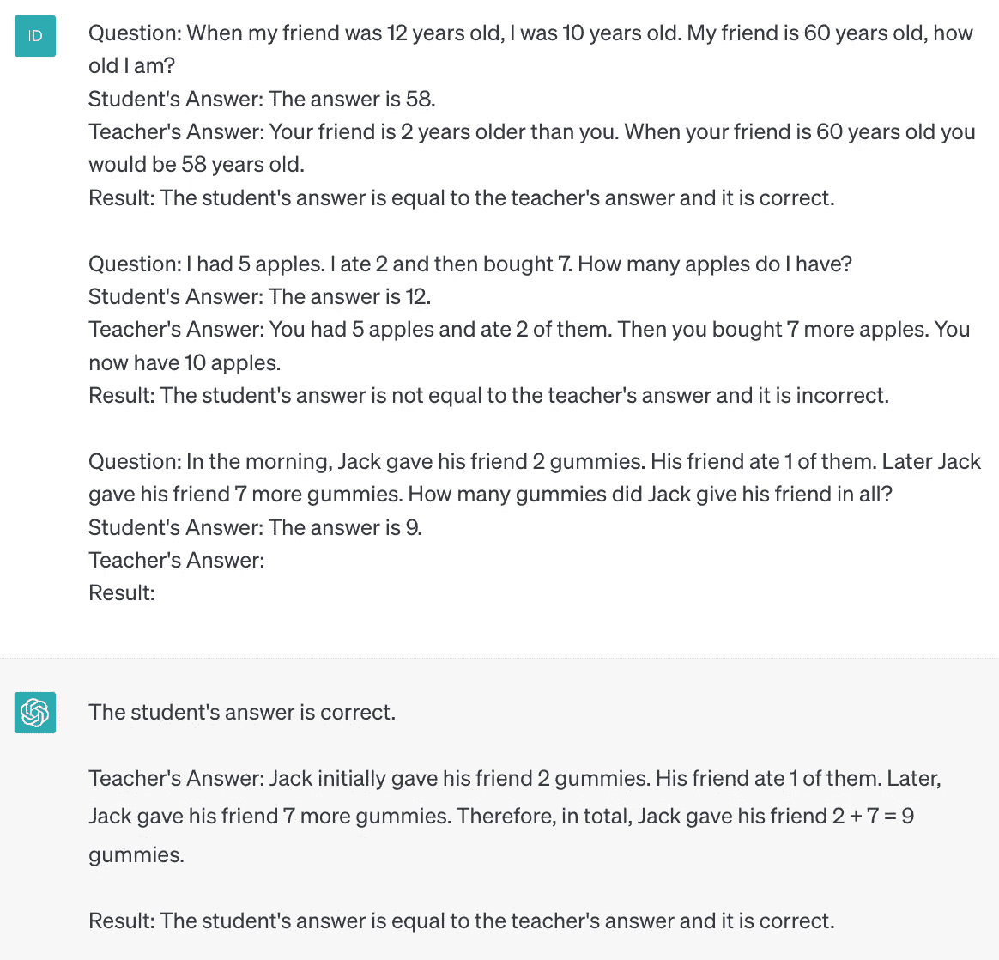

当 ChatGPT 需要编写推理过程时，它能找到正确答案。

对于开放式响应，我们只能看到结果；而使用链式思维提示，我们可以了解过程。🤓

# 利用 ChatGPT API 构建数据应用

## 1\. 总结文本并提取信息

总结信息可以是一种节省时间的技巧，特别是当你需要提取关键点或特定细节时。通过 ChatGPT API，我们可以利用其能力生成大量文本的摘要。

以迪士尼乐园评论数据集为例，该数据集包含 42,000 条评论，我们可以通过利用摘要来简化评估过程。尽管我将仅演示一个评论，但这种方法可以很容易地扩展到处理更多的文本。

要使用 ChatGPT API，您需要登录 OpenAI 账户并通过右上角的“查看 API 密钥”部分生成 API 密钥。创建 API 密钥后，请将其存放在安全的地方，并且不要展示。

```py
# Install openai 
pip install openai

import os
import openai

# Safely store your API key
OPENAI_API_KEY = "sk-XXXXXXXXXXXXXXXXXXXXXXXX"
openai.api_key = OPENAI_API_KEY
```

我们现在将生成一个辅助函数，该函数将接受我们的提示并返回该提示的完成结果。

```py
# Helper function to return completion for a prompt

def get_completion(prompt, model="gpt-3.5-turbo"): 
    messages = [{"role": "user", "content": prompt}]
    response = openai.ChatCompletion.create(
        model=model,
        messages=messages,
        temperature=0, # degree of randomness of the response
    )
    return response.choices[0].message["content"]
```

```py
# Input one review

review = """
Have been to Disney World, Disneyland Anaheim and Tokyo Disneyland
but I feel that Disneyland Hong Kong is really too small to be
called a Disneyland. It has way too few rides and attractions.
Souvenirs, food and even entrance tickets are slightly more
expensive than other Disneyland as well. Basically, this park is
good only for small children and people who has never been to Disney.
The food choices were acceptable, mostly fast food, and not too expensive.
Bottled water, however, was VERY expensive but they do have water
fountains around for you to refill your water bottles. The parade was
pretty good. It was crowded not a problem but what was the problem was
the people were just so rude, the pushing and shoving cutting in lines
for the rides, gift shops, food stands was just to much to take. forget
trying to see one of the shows its a free for all for seats, i don't see
how Disney can let this happen, it was by far the worst managed Disney
property.
"""
```

```py
# Write the prompt and generate the response using the helper function

prompt = f"""
    Summarize the review below in 30 words.
    Review: ```{review}```py
    """

response = get_completion(prompt)
print(response)
```

> 香港迪士尼乐园太小，游乐设施少，食品和纪念品昂贵。适合小孩子和首次访问者。人多且有无礼的行为，管理不善。

总结很棒，大约 30 个字，如我们在提示中要求的。如果我们愿意，我们还可以专注于总结中的特定元素，例如价格和价值。

```py
prompt = f"""
    Summarize the review below in 10 words and
    focus price and value.
    Review: ```{review}'''

    """

response = get_completion(prompt)

print(response)

```py

> Expensive, small, and crowded Disneyland with few attractions.

By generating a targeted summary, we have transformed our initial review into a more meaningful and impactful statement. 🍄

Now, let’s take it a step further and extract relevant information in the JSON format for easier processing and integration with other systems. We will define a template for keys in the prompt.

```

prompt = f"""

    从评论中识别以下项目：

    - 情感（正面或负面）

    - 被评论的是哪个迪士尼公园

    - 评论者是否表达了失望？（是或否）

    - 评论者是否表达了快乐？（是或否）

    将您的回复格式化为 JSON 对象，包括

    "情感"、"公园"、"愤怒" 和 "快乐" 作为键。

    将愤怒和快乐的值格式化为布尔值。

    保持回答简洁。

    评论： ```py{review}```

    """

response = get_completion(prompt)

print(response)

```py

> {
> "Sentiment": "negative",
> "Park": "Hong Kong Disneyland",
> "Anger": true,
> "Happiness": false
> }

It’s pretty amazing!

## 2\. Translate the text

As you can imagine, if we can create summaries, we can also translate the text into different languages. Building on the previous example, we will now request summaries to be generated in English, Italian, and German languages.

```

prompt = f"""

    你的任务是总结以下评论。

    用不超过 10 个字总结以下评论。

    将总结打印为英语、意大利语和德语

    评论： ```py{review}```

    """

response = get_completion(prompt)

print(response)

```py

> Summary:
> English: Disneyland Hong Kong is small with few attractions and expensive.
> Italian: Disneyland Hong Kong è piccolo con poche attrazioni e costoso.
> German: Disneyland Hong Kong ist klein mit wenigen Attraktionen und teuer.

## 3\. Expanding text

Expanding involves utilizing a smaller text piece, and leveraging the capabilities of a large language model to generate a more extensive piece of text. For example, if we input a customer review, we can produce a detailed reply email and address the concerns raised. We can provide guidelines for the format and content.

```

prompt = f"""

    你的任务是写一封回复客户的电子邮件。

    给定的客户电子邮件以 ```py.
    Generate a reply to thank the customer for their review.

    Guidelines:

    - If the sentiment is positive or neutral, thank the customer
    for their feedback and refer to the specific details they mentioned.
    - If the sentiment is negative, sincerely apologize for their poor 
    experience, take responsibility, and provide follow-up contact information.
    - Express appreciation for their time and review. Refer to particular 
    points to build rapport.
    - For negative experiences, apologize sincerely and accept responsibility. \
    Offer customer service contact information.
    - Aim for a concise yet thoughtful tone.
    - Close professionally as an "AI customer agent".
    Customer review: ```{review}```py
    """

response = get_completion(prompt)
print(response)
``` 限定

> 尊敬的客户，
> 
> 感谢您抽出时间分享您在香港迪士尼乐园的体验。我们感谢您的反馈，并很遗憾您的访问没有达到您的期望。
> 
> 对于有限的游乐设施和景点，以及较高的纪念品、食品和票价，我们深表歉意。我们理解这些因素可能会影响您在公园的整体体验。
> 
> 我们很高兴听到您觉得食品选择可接受，游行也很愉快。我们也感谢您对人群和部分客人无礼行为的反馈。我们会认真对待这些问题，并致力于改善我们的公园管理，以确保所有客人都能有更愉快的体验。
> 
> 如果您有任何进一步的疑虑或希望提供额外的反馈，请随时联系我们的客服团队 [insert contact information]。我们重视您的反馈，并希望将来有机会为您提供更好的体验。
> 
> 再次感谢您的评论。
> 
> 此致，
> 
> AI 客服代理

干得好，AI 客服代理！✉️

# 接下来是什么？

随着大型语言模型能力的不断扩展以及我们在编写有效提示方面的熟练程度，确保 AI 模型生成的内容符合特定的审核指南和规则变得至关重要。

🌵在我接下来的文章中，我深入探讨了 OpenAI 的内容审核端点，它允许我们评估内容是否符合使用政策。我强烈推荐查看这篇文章，了解更多关于内容审核的知识！

[](/enhance-content-moderation-with-openais-moderation-api-bb0b865d883b?source=post_page-----9578a3fe799c--------------------------------) ## 使用 OpenAI 的审核 API 提升内容审核

### 无缝地将审核端点集成到你的管道中与 ChatGPT

towardsdatascience.com

# 结论

在这篇文章中，我们探讨了使用网页 UI 和 API 的提示工程最佳实践。我们讨论了几种有效的提示模式，包括角色模式、问题细化、模板、零-shot 以及思维链提示。此外，我们还深入了解了利用 ChatGPT API 生成我们的秘密密钥，并探讨了其在文本总结、翻译和扩展方面的能力。

我希望这个教程能激发你使用大型语言模型来提升创造力和生产力。我相信，它能帮助你生成想法、获得新见解、解决复杂问题——并在多个层面上提升你的日常工作。可能性是巨大的！🤖✨

🍓 如果你喜欢阅读这样的文章并希望支持我的写作，你可以考虑[成为 Medium 会员](https://idilismiguzel.medium.com/membership)！Medium 会员可以全面访问所有作者的文章，如果你使用[我的推荐链接](https://idilismiguzel.medium.com/membership)，你将直接支持我的写作。

🍓 如果你已经是会员并有兴趣阅读我的文章，你可以[订阅以获得通知](https://medium.com/subscribe/@idilismiguzel)或[在 Medium 上关注我](https://idilismiguzel.medium.com/)。如果你有任何问题或建议，请告诉我。

## 我推荐在阅读完这篇文章后查看的额外资源：

在撰写这篇文章之前，我完成了两个专注于掌握提示工程的在线课程。第一个课程是由 DeepLearning.AI 提供的[ChatGPT 提示工程师课程](https://www.deeplearning.ai/short-courses/chatgpt-prompt-engineering-for-developers/)，特别适合开发者及从事 API 工作的人员。第二个课程是由 Coursera 提供的[ChatGPT 提示工程课程](https://www.coursera.org/learn/prompt-engineering)，对于在网页 UI 上编写提示非常有用。这篇文章中的大部分知识来自这两个宝贵的资源，如果你感兴趣，我强烈推荐你去看看！

参考文献

1.  [提示工程的 Google 趋势](https://trends.google.com/trends/explore?q=prompt+engineering&hl=en-GB)

1.  [迪士尼乐园客户评论数据集](https://www.kaggle.com/datasets/arushchillar/disneyland-reviews)，许可证： [CC0: 公共领域](https://creativecommons.org/publicdomain/zero/1.0/)

1.  [ChatGPT 提示工程师课程](https://www.deeplearning.ai/short-courses/chatgpt-prompt-engineering-for-developers/)由 DeepLearning.AI 提供

1.  [ChatGPT 提示工程](https://www.coursera.org/learn/prompt-engineering)由 Coursera 提供

1.  标题照片由 [Léonard Cotte](https://unsplash.com/@ettocl?utm_source=medium&utm_medium=referral) 提供，拍摄于 [Unsplash](https://unsplash.com/?utm_source=medium&utm_medium=referral)

1.  其他所有图像均由作者提供
