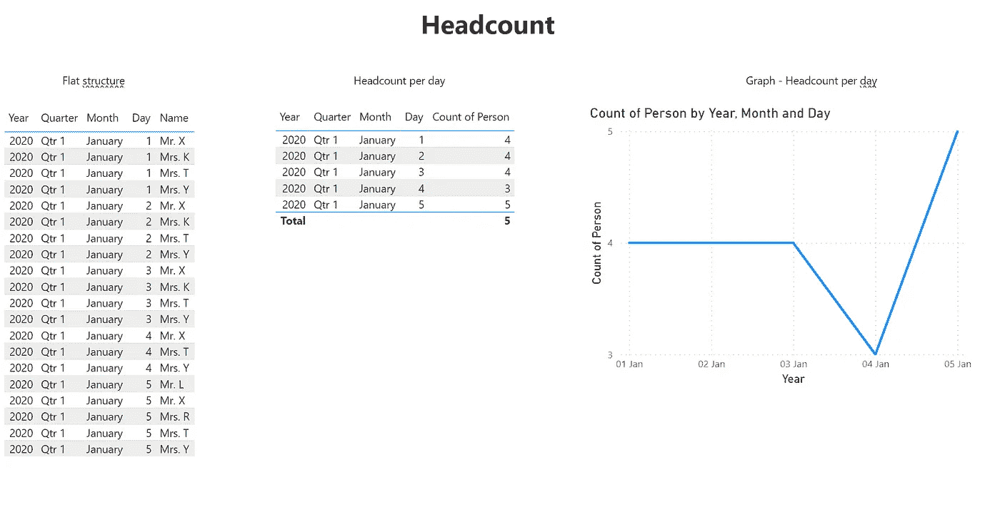
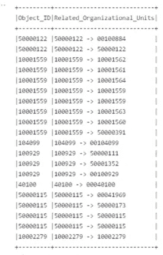

# 掌握来自 SAP 系统的数据集成与快速工程

> 原文：[`towardsdatascience.com/mastering-sap-data-integration-tasks-with-prompt-engineering-4cb03a57463a?source=collection_archive---------13-----------------------#2023-10-07`](https://towardsdatascience.com/mastering-sap-data-integration-tasks-with-prompt-engineering-4cb03a57463a?source=collection_archive---------13-----------------------#2023-10-07)

[](https://medium.com/@markus.stadi?source=post_page-----4cb03a57463a--------------------------------)[](https://towardsdatascience.com/?source=post_page-----4cb03a57463a--------------------------------) [Markus Stadi](https://medium.com/@markus.stadi?source=post_page-----4cb03a57463a--------------------------------)

·

[跟进](https://medium.com/m/signin?actionUrl=https%3A%2F%2Fmedium.com%2F_%2Fsubscribe%2Fuser%2F88759409b50c&operation=register&redirect=https%3A%2F%2Ftowardsdatascience.com%2Fmastering-sap-data-integration-tasks-with-prompt-engineering-4cb03a57463a&user=Markus+Stadi&userId=88759409b50c&source=post_page-88759409b50c----4cb03a57463a---------------------post_header-----------) 发表在 [Towards Data Science](https://towardsdatascience.com/?source=post_page-----4cb03a57463a--------------------------------) ·8 分钟阅读·2023 年 10 月 7 日[](https://medium.com/m/signin?actionUrl=https%3A%2F%2Fmedium.com%2F_%2Fvote%2Ftowards-data-science%2F4cb03a57463a&operation=register&redirect=https%3A%2F%2Ftowardsdatascience.com%2Fmastering-sap-data-integration-tasks-with-prompt-engineering-4cb03a57463a&user=Markus+Stadi&userId=88759409b50c&source=-----4cb03a57463a---------------------clap_footer-----------)

--

[](https://medium.com/m/signin?actionUrl=https%3A%2F%2Fmedium.com%2F_%2Fbookmark%2Fp%2F4cb03a57463a&operation=register&redirect=https%3A%2F%2Ftowardsdatascience.com%2Fmastering-sap-data-integration-tasks-with-prompt-engineering-4cb03a57463a&source=-----4cb03a57463a---------------------bookmark_footer-----------)

建筑工程师调查他的工作 — 稳定扩散

# 简介

在我们之前的出版物中，[从数据工程到提示工程](https://medium.com/towards-data-science/from-data-engineering-to-prompt-engineering-5debd1c636e0)，我们展示了如何利用 ChatGPT 解决数据准备任务。除了我们收到的良好反馈外，还有一个关键问题被提出：提示工程可能对简单任务有所帮助，但在更具挑战性的环境中是否真的有用？这是一个合理的观点。在最近几十年，数据架构变得越来越多样化和复杂。因此，数据工程师越来越多地需要整合他们不一定熟悉的各种数据源。提示工程在这种情况下能否提供帮助？

本文基于来自人力资源管理的实际用例来探讨这个问题。我们应用少量示例学习将 SAP HCM 数据模型引入 ChatGPT，并使用 Apache Spark 分析收集到的信息。通过这种方式，我们展示了提示工程在先进的数据工程环境中如何提供价值。

# 关于业务案例

每个中型到大型公司都需要完成的一项常见任务是确定其员工数量及其组织分配。我们场景中的相关数据存储在 SAP HCM 系统中，这是一款领先的企业人力资源管理应用程序。

为了实现这种目标，每个数据工程师需要建立大量与业务相关的知识，这些知识与基础数据模型密切相关。

本文将提供一个逐步指南，通过创建 PySpark 代码来解决描述的业务问题，这些代码可用于构建数据模型，并因此作为任何报告解决方案的基础。



PowerBi 示例报告显示了人员数量

# 第一步：确定需要哪些信息

数据科学的主要挑战之一是根据业务用例选择必要的信息，并确定其在源系统中的来源。为了解决这个问题，我们需要向 ChatGPT 传递一些业务知识。为此，我们向 ChatGPT 介绍了 SAP HCM 基本表的一些信息，这些信息可以在 SAP 参考手册中找到：[人力资源 | SAP 帮助门户](https://help.sap.com/docs/HR_RENEWAL/4946a4f5c2d7427c96d89242e1ff2d9a/48d5d5537c004308e10000000a174cb4.html?locale=en-US)，并结合每个表的 CSV 示例记录。

在这个初步场景中，我们的目的是报告某一特定时间点的所有在职员工。结果还应包括员工的个人编号、姓名、状态和组织分配。

为了收集所有必要的信息，我们需要向 ChatGPT 推断一个数据库模式，包括示例数据集和字段描述，使用少量示例提示。我们将从向 ChatGPT 传播数据库模式和一些示例数据开始。

每个了解 SAP HCM 数据模型的人都应该对 infotypes 和透明表的概念非常熟悉。infotype 包含所有事务信息，而透明表包含每个实体的业务信息（主数据）。

对于以下场景，我们将使用*OpenAIs GPT-4*来创建所需的代码。让我们首先向 ChatGPT 提供基本的表格信息。

```py
Prompt:
Given the following Tables
1\. Table PA0000 - Employee Actions
Field;Key;Data Element;Domain;Data Type;Length;Decimal;Short Description;Check table
MANDT;;MANDT;MANDT;CLNT;3;0;Client;T000
PERNR;;PERSNO;PERSNO;NUMC;8 ;0;Personnel number;PA0003
SUBTY;;SUBTY;SUBTY;CHAR;4;0;Subtype;
OBJPS;;OBJPS;OBJPS;CHAR;2;0;Object Identification
...
containing the following sample Datasets:
100;99992228;;;;9999-12-31T00:00:00.0000000;2023-07-01T00:00:00.0000000;0;2023-01-10T00:00:00.0000000;TRP0001;;;;;;;;;;;;;;10;3;;0;0
100;99992229;;;;9999-12-31T00:00:00.0000000;2023-07-01T00:00:00.0000000;0;2023-03-29T00:00:00.0000000;TRP0001;;;;;;;;;;;;;;10;6;;0;0

2\. Table T529U - Status Values
Field;Key;Data Element;Domain;Data Type;Length;Decimal Places;Short Description;Check table
MANDT;;MANDT;MANDT;CLNT;3;0;Client;*
SPRSL;;SPRAS;SPRAS;LANG;1;0;Language Key;T002
STATN;;STATN;STATN;NUMC;1;0;Status number;
...
containing the following sample datasets:
MANDT,SPRSL,STATN,STATV,TEXT1
100,D,2,3,active
100,D,2,0,resigned
....
```

# 第 2 步：连接必要的基本表并仅筛选活跃员工

现在让我们创建连接基本表的代码：

```py
Prompt:
Give me the pyspark code to restrict "Employee Actions" to contain 
only employees indicated as active according to their corresponding 
"Status Values" for English Language texts. Use "structuredzone.PA0000" 
as the source for Table PA0000 and "structuredzone.T529U" as the source 
for Table T529U. Use meaningful column aliases.
```

这将生成相当不错且格式良好的 PySpark 代码：

```py
from pyspark.sql import SparkSession
from pyspark.sql.functions import col

# Initializing Spark Session
spark = SparkSession.builder.appName("EmployeeActionsFilter").getOrCreate()

# Reading the tables into DataFrames
df_pa0000 = spark.read.table("structuredzone.PA0000")
df_t529u = spark.read.table("structuredzone.T529U")

# Filtering T529U for the relevant status description and language
df_active_status = df_t529u.filter(
    (col("TEXT1") == "Active") &
    (col("SPRSL") == "E")
)
# Joining PA0000 with the filtered T529U based on the status field STAT2
df_active_employees = df_pa0000.join(
    df_active_status,
    (df_pa0000.STAT2 == df_active_status.STATV) &
    (df_active_status.STATN == 2)  # Assuming STATN=2 indicates employment status based on given data
).select(
    df_pa0000["PERNR"].alias("EmployeeNumber"),
    df_pa0000["MASSN"].alias("ActionType"),
    df_pa0000["MASSG"].alias("ReasonForAction"),
    df_active_status["TEXT1"].alias("StatusDescription")
)
# Show the result
df_active_employees.show()
# Optionally, you can write this DataFrame to a destination or further process it.
```

注意 GPT-4 识别了两个表的连接条件，基于表 PA0000 的列 STAT2 和表 T529U 的列 STATV，后者是对应的透明表。此外，创建的代码包含业务描述作为列别名，以提高其可读性。

# 第 3 步：构建一个时间轴以反映公司的员工历史

现在我们将创建一个包含从 2020–01–01 到 2024–01–01 期间的日期值的 DataFrame，并根据员工的入职日期（BEGDA）和可能的离职日期（ENDDA）连接所有有效员工，我们需要创建一个人工时间轴以将员工关联起来。

```py
Prompt
In Pyspark: Create a dataframe containing one row for each date beginning 
at 2020-01-01 ending at 2024-01-01\. The Date column should be formatted as 
a date. Afterwards join all valid employees according to their start and 
end date. The output should contain only active employees according to their 
Employment status.
```

```py
from pyspark.sql import SparkSession
from pyspark.sql.functions import explode, sequence, to_date, lit, col

# Start a Spark Session

spark = SparkSession.builder.appName("EmployeeTimeline").getOrCreate()

# Define start and end dates
start_date = to_date(lit("2020-01-01"))
end_date = to_date(lit("2024-01-01"))

# Create a DataFrame with one row for each date
date_df = (spark.range(1)
          .select(explode(sequence(start_date, end_date)).alias("date")))

# Load the PA0000 and T529U tables
pa0000_df = spark.read.table("structuredzone.PA0000")
t529u_df = spark.read.table("structuredzone.T529U")

# Filter T529U for 'Active' employees with language key = E
active_t529u_df = t529u_df.filter((col("SPRSL") == "E") & (col("TEXT1") == "Active"))

# Join PA0000 with filtered T529U to get active employees
active_pa0000_df = pa0000_df.join(active_t529u_df, pa0000_df.STAT2 == active_t529u_df.STATV)

# Join with date range DataFrame to get timeline of active employees
active_employee_timeline_df = date_df.join(active_pa0000_df, (date_df.date >= active_pa0000_df.BEGDA) & (date_df.date <= active_pa0000_df.ENDDA))

# Show the DataFrame
active_employee_timeline_df.show()
```

# 第 4 步：通过确定最高级别的组织对象来拆解父子关系表

在最后一步，我们希望构建一个表示公司组织结构的 DataFrame，并确定每个对象的组织分配。具体来说，我们要确定每个子对象分配到哪个最高级别的组织单元（例如区域或部门）。

组织结构可以用于将员工时间轴连接起来，并在后续步骤中获取每个员工组织分配的详细信息。我们需要利用 SAP 的 HRP1001 表来实现这一点：

```py
Prompt:
The following table is containing the organizational assignment 
of each employee: 
Table HRP1001 – Organization structure
Field;Data Element;Domain;Data Type;Length;Decimal Places;Short Description;Check table
MANDT;MANDT;MANDT;CLNT;3;0;Client;T000
OTYPE;OTYPE;OTYPE;CHAR;2;0;Object Type;T778O
OBJID;HROBJID;HROBJID;NUMC;8;0;Object ID;PLOGI
...
containing the following sample datasets:
MANDT,OTYPE,OBJID,PLVAR,RSIGN,RELAT,ISTAT,PRIOX,BEGDA,ENDDA,VARYF,SEQNR,INFTY,OTJID,SUBTY,AEDTM,UNAME,REASN,HISTO,ITXNR,SCLAS,SOBID,PROZT,ADATANR
100,P,00998833,A,209,1,,2018-01-01T00:00:00.0000000,9999-12-31T00:00:00.0000000,CP50035300,000,1001,P 00100769,A209,2020-12-11T00:00:00.0000000,TRP1000,,,00000000,CP,60095300,0.00,
```

```py
Prompt:
Table HRP1001 contains parent-child information on the companies organization 
structure. Column OBJID is containing the object ID and SOBID is containing 
the related parent object ID. The column SCLAS is containing the information 
weather the object ID is a position 'S', organizational unit 'O' or role 'K'. 
In Pyspark: Give me the code that creates a dataframe containing the 
object id of the highest available organizational unit of each object by 
recursively dissolving the hierarchy. Use meaningful column aliases.
```

语言模型生成一个递归函数，搜索每个对象的最高级别组织单元（‘O’）：

```py
from pyspark.sql import SparkSession
from pyspark.sql.functions import col

# Initialize a Spark session
spark = SparkSession.builder.appName("HighestAvailableOrgUnit").getOrCreate()

HRP1001_df = spark.read.table("structuredzone.HRP1001")

# Recursive function to find the highest available organizational unit
def find_highest_org_unit(df, obj_id):
    # Filter rows for the current object ID
    object_df = df.filter(col("OBJID") == obj_id)

    if object_df.count() == 0:
        return None

    # Get the parent object ID (SOBID) and SCLAS for the current object
    parent_obj_id = object_df.select("SOBID").first()[0]
    sclas = object_df.select("SCLAS").first()[0]

    # Recursively find the highest available organizational unit
    highest_org_unit = find_highest_org_unit(df, parent_obj_id)

    # If the current object is an organizational unit ('O') or the highest_org_unit is None, update the result
    if sclas == 'O' or highest_org_unit is None:
        highest_org_unit = obj_id

    return highest_org_unit

# Create a UDF (User-Defined Function) to apply the recursive function
from pyspark.sql.functions import udf
from pyspark.sql.types import StringType

find_highest_org_unit_udf = udf(find_highest_org_unit, StringType())

# Apply the UDF to find the highest available organizational unit for each object
highest_org_unit_df = df.withColumn("HighestAvailableOrgUnit", find_highest_org_unit_udf(df, col("OBJID")))

# Select meaningful columns and aliases
result_df = highest_org_unit_df.select(
    col("OBJID").alias("ObjectID"),
    col("HighestAvailableOrgUnit").alias("HighestAvailableOrgUnit")
)

# Show the resulting DataFrame
result_df.show()

# Stop the Spark session
spark.stop()
```

即使生成的代码没有很好地优化，它也包含一个递归函数来拆解层级。那些偏好使用公共表表达式（CTE）的用户应在输入提示中给出提示（使用公共表表达式），以创建更具可读性和可理解性的 PySpark 语句。

```py
from pyspark.sql import SparkSession

# Create a Spark session
spark = SparkSession.builder.appName("OrganizationalUnitHierarchy").getOrCreate()

# Define the HRP1001 DataFrame (assuming you have it loaded already)
# Replace 'hrp1001_df' with your actual DataFrame
# Make sure you have the appropriate columns: 'OBJID', 'SOBID', and 'SCLAS'

# Register the HRP1001 DataFrame as a temporary SQL table
hrp1001_df.createOrReplaceTempView("hrp1001")

# Define the recursive query to dissolve the hierarchy and find the highest organizational unit
recursive_query = """
WITH RECURSIVE OrgHierarchy AS (
  SELECT OBJID, SOBID, SCLAS
  FROM hrp1001
  WHERE SCLAS = 'O'  -- Start with organizational units

  UNION ALL

  SELECT h.OBJID, p.SOBID, p.SCLAS
  FROM OrgHierarchy h
  JOIN hrp1001 p ON h.SOBID = p.OBJID
)
SELECT DISTINCT
  h.OBJID AS EmployeeID,
  h.SOBID AS HighestOrganizationalUnit
FROM OrgHierarchy h
"""

# Execute the recursive query and create the resulting DataFrame
result_df = spark.sql(recursive_query)

# Show the result
result_df.show()

# Stop the Spark session when done
spark.stop()
```

两个代码版本将创建一个用于扁平化层级组织结构的 DataFrame，该 DataFrame 可以通过简单地将其连接到之前生成的 DataFrame 来用于进一步的数据集成步骤。



包含层级信息的数据集

# 结论

我们已经展示了如何通过提取和集成来自 SAP 系统的数据来解决更高级的数据工程任务，使用 ChatGPT 生成 PySpark 代码。虽然大型语言模型可能尚不完美，但每个人或许已经可以想象这些技术对数据工程师的强大潜力。这里有几个关键要点：

+   ChatGPT 能够理解数据模型的基本原理。你可以通过利用提示技术来精细化它的理解，从而提供更深入的知识。

+   即使这种方法第一次尝试时不会产生完美的代码，我们仍然可以轻松调整生成的代码以适应我们个人的场景。

+   由于开放参考文档和 SAP 知识库的广泛可用性，该方法可以扩展为一种检索增强生成（RAG）解决方案。

在提示工程最佳实践方面，尽量做到尽可能精确，并提供 Spark 环境返回的错误代码，以利用 LLM 的能力来重构生成的代码。可能需要多次尝试来完善代码，不过在提示中添加像“精确”这样的关键词可能会帮助 ChatGPT 产生更好的结果。要求对解决方案方法进行详细解释，这将迫使 ChatGPT 的 Transformer 模型深入挖掘。

注意：由于本文长度限制，包含 csv 示例数据集的提示不得不被截断。

# 关于作者

*马克斯·斯塔迪* 是 Dehn SE 的高级云数据工程师，多年来从事数据工程、数据科学和数据分析领域的工作。

*克里斯蒂安·科赫* 是 BWI GmbH 的企业架构师，同时也是纽伦堡工业大学乔治·西蒙·欧姆的讲师。
