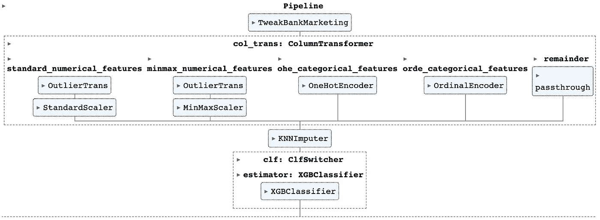

# 掌握机器学习工作流的艺术：变压器、估算器和管道的全面指南

> 原文：[`towardsdatascience.com/mastering-the-art-of-machine-learning-workflows-a-comprehensive-guide-to-transformer-estimator-6254f4e2d2f8?source=collection_archive---------7-----------------------#2023-06-09`](https://towardsdatascience.com/mastering-the-art-of-machine-learning-workflows-a-comprehensive-guide-to-transformer-estimator-6254f4e2d2f8?source=collection_archive---------7-----------------------#2023-06-09)

## 编写无缝代码以获得最佳结果

[](https://medium.com/@andreas030503?source=post_page-----6254f4e2d2f8--------------------------------)[](https://towardsdatascience.com/?source=post_page-----6254f4e2d2f8--------------------------------) [Andreas Lukita](https://medium.com/@andreas030503?source=post_page-----6254f4e2d2f8--------------------------------)

·

[关注](https://medium.com/m/signin?actionUrl=https%3A%2F%2Fmedium.com%2F_%2Fsubscribe%2Fuser%2F955ef38ea7b&operation=register&redirect=https%3A%2F%2Ftowardsdatascience.com%2Fmastering-the-art-of-machine-learning-workflows-a-comprehensive-guide-to-transformer-estimator-6254f4e2d2f8&user=Andreas+Lukita&userId=955ef38ea7b&source=post_page-955ef38ea7b----6254f4e2d2f8---------------------post_header-----------) 发布于 [Towards Data Science](https://towardsdatascience.com/?source=post_page-----6254f4e2d2f8--------------------------------) ·14 min read·2023 年 6 月 9 日[](https://medium.com/m/signin?actionUrl=https%3A%2F%2Fmedium.com%2F_%2Fvote%2Ftowards-data-science%2F6254f4e2d2f8&operation=register&redirect=https%3A%2F%2Ftowardsdatascience.com%2Fmastering-the-art-of-machine-learning-workflows-a-comprehensive-guide-to-transformer-estimator-6254f4e2d2f8&user=Andreas+Lukita&userId=955ef38ea7b&source=-----6254f4e2d2f8---------------------clap_footer-----------)

--

[](https://medium.com/m/signin?actionUrl=https%3A%2F%2Fmedium.com%2F_%2Fbookmark%2Fp%2F6254f4e2d2f8&operation=register&redirect=https%3A%2F%2Ftowardsdatascience.com%2Fmastering-the-art-of-machine-learning-workflows-a-comprehensive-guide-to-transformer-estimator-6254f4e2d2f8&source=-----6254f4e2d2f8---------------------bookmark_footer-----------)

图片由 [Rick Hyne](https://unsplash.com/de/@quinley1770?utm_source=medium&utm_medium=referral) 贡献，来源于 [Unsplash](https://unsplash.com/?utm_source=medium&utm_medium=referral)

> *“只要我现在能理解它，写成这样也没关系，而好的一点是，它确实有效！我成功地用我的模型奇迹般地得到了一个相当不错的结果，真是一个不错的收尾。”*

不，我来告诉你，这还不够好。确实，当你开始一个机器学习项目时，许多新手和中级分析师都急于制作出中等水平的模型，却缺乏适当的工作流程。虽然有时候问题本身很简单，但如果不遵循适当的工作流程，常常会导致一些难以察觉的潜在问题，比如数据泄漏。

“只要有效，就足够好了。” 让我告诉你，这并不是。让我们快速模拟一个场景，你需要向高级分析师解释你的工作。这里有一些问题。如果今天有效，是否能保证明天也有效，并且容易重复？你能在包含 200 多个单元格的 Notebook 中解释你的模型工作流程的预处理步骤吗？如果你以这种方式进行交叉验证，是否会暴露测试数据集并使模型性能膨胀？这些问题很棘手，不是吗？

让我告诉你，实际上，你并不孤单，也并没有那么远。即使在参加了多个商业分析和机器学习课程后，我的任何一个讲师都没有分享我下面所要分享的工具和技巧。我会说，这些不是每个人在第一次接触 Scikit-Learn 时都关注的亮点课程。然而，它们会产生一致的结果，显著提升你的代码编写水平。想象一下，轻松处理数据，流畅地转换特征，并训练复杂的模型，同时保持代码的优雅和简洁。这就是我们在本综合指南结束时的目标，希望你能被下面的实践所说服。让我们开始吧。

**目录**

+   采用流水线的理由

+   估算器

+   变换器

+   流水线

+   自定义估算器

+   特征联合

+   真实世界数据集示例：银行营销与网格搜索交叉验证

# 采用流水线的理由

**1\. 精简的工作流程。** 利用流水线可以实现数据预处理和建模过程中的多个步骤的无缝集成。它使你能够将各种变换器和估算器串联起来，确保从数据预处理到模型训练和评估的流程清晰、简洁且自动化。通过将你的预处理和建模步骤封装在流水线中，你的代码变得更加有组织、模块化，并且更易于理解。它改善了代码的外观和可维护性，因为每一步都被清楚地定义。将流水线中的每一步视为独立的，你可以在不担心一个预处理步骤如何影响其他步骤的情况下进行更改或添加步骤！


作者提供的图片

**2\. 防止数据泄露。** 这是每个分析师都害怕的对手。数据泄露可能发生在测试数据集的信息无意中影响了预处理步骤或模型训练，从而导致过于乐观的性能估计。从某种程度上来说，你是在泄露关于将要测试的内容的信息，使你的学习模型提前看到将要测试的内容。显然，*“他在试图吹嘘”。* 通常的经验法则是只拟合训练数据集，然后同时转换训练和测试数据集。***下面的代码展示了某些人错误的地方。*** 此外，你通常会有多个预处理步骤，这些步骤通常涉及变换器，例如 `StandardScaler()`、`MinMaxScaler()`、`OneHotEncoder()` 等。想象一下在整个工作流程中多次进行拟合和转换过程，难道这不会让人困惑和不便吗？

```py
#Variation 1: Do not fit transform both training and testing dataset!
ss = StandardScaler()
X_train_scaled = ss.fit_transform(X_train)
X_test_scaled = ss.fit_transform(X_test)

#Variation 2: Remember to transform your training dataset!
X_train_scaled = ss.fit(X_train)
X_test_scaled = ss.transform(X_test)
```

**3\. 超参数调整和交叉验证。** 使用如 GridSearchCV 之类的技术轻松调整管道中所有步骤的超参数。然而，这一步骤中的错误往往被忽视。让我们看一个简单的例子。

```py
#Previously an oversight, correction contributed by @Scott Lyden

import numpy as np
from sklearn.datasets import load_breast_cancer
from sklearn.model_selection import train_test_split, cross_val_score
from sklearn.feature_selection import SequentialFeatureSelector
from sklearn.linear_model import LogisticRegression
from sklearn.ensemble import RandomForestClassifier
from sklearn.pipeline import Pipeline

X, y = load_breast_cancer(return_X_y=True, as_frame=True)

#Without Pipeline
select = SequentialFeatureSelector(RandomForestClassifier(n_estimators=100, n_jobs=-1), 
                                   n_features_to_select=8, 
                                   direction='forward').fit(X,y)
X_selected = select.transform(X)
logreg = LogisticRegression()
np.mean(cross_val_score(estimator=logreg, 
                        X=X_selected, 
                        y=y, 
                        n_jobs=-1))

#With Pipeline
pipe = Pipeline([("select", SequentialFeatureSelector(RandomForestClassifier(n_estimators=100, n_jobs=-1), 
                                                      n_features_to_select=8, 
                                                      direction='forward',
                                                      n_jobs=-1)),
                 ("log", LogisticRegression())])
np.mean(cross_val_score(estimator=pipe, X=X, y=y))
```

尝试运行这两个示例：虽然交叉验证分数相差不远，但没有使用 Pipeline 的部分泄露了信息，因为特征选择步骤是在整个数据集上进行的。当我们到达交叉验证步骤时，数据集被分为训练集和验证集，它们本质上来自同一来源（训练集在进行特征选择时已从验证集中学习到信息）。如果你发现这一部分难以理解，请尝试重新阅读这一段并自己编码以加深理解。

# 估算器

在我们深入了解 Pipeline 能做什么之前，让我们暂时离开，了解组成 Pipeline 的组件——估算器。我们将在下一节中讨论其他组件——变换器、预测器和模型。

许多人在使用 Scikit-learn 时常常对估算器这个术语感到困惑。人们倾向于将估算器与预测能力联系起来——也就是特别指 `predict` 方法。虽然这种说法有一定的真实性，但遗憾的是，最多只是部分真实。估算器基本上是 Scikit-learn 库的构建块。估算器是一种工具，它可以从你的训练集学习，创建一个可以对新数据进行预测或推断的模型。由于所有估算器都有 `fit` 方法来从训练集学习，它们继承自 `BaseEstimator`。

从`BaseEstimator`本身来看，没有`predict`方法，只有`fit`。一个估计器并不一定需要有`predict`方法，虽然有些有。一个具有`predict`方法的估计器试图基于学习到的模型对新的、未见过的数据进行预测。例如，像线性回归、随机森林分类器、梯度提升分类器等回归器和分类器都是具有`predict`方法的估计器。

更进一步，我们来看看`LogisticRegression`类的原始文档²。在下面的代码片段中，我们观察到该类继承了`BaseEstimator`以获得`fit`方法，并继承了`LinearClassifierMixin`以获得`predict`方法。


[Scikit-learn GitHub](https://github.com/scikit-learn/scikit-learn/blob/364c77e047ca08a95862becf40a04fe9d4cd2c98/sklearn/linear_model/_logistic.py)（BSD-3）

# 变换器

变换器是一种具有`transform`方法的估计器。请注意，这里的“变换器”特指 Scikit-learn 上下文。它不应与近年来备受关注的神经网络架构中的变换器混淆。

简而言之，变换器的作用是以某种方式转换/处理预测变量（`X`），使其可以被机器学习算法使用。这可能是使用像`StandardScaler`和`MinMaxScaler`这样的显著工具对连续预测变量进行缩放，或者使用`OneHotEncoder`或`OrdinalEncoder`对分类预测变量进行编码。

更进一步，变换器具有 fit-transform 机制，其中它使用`fit`方法从训练数据中学习，然后使用`transform`方法将学习到的转换应用于训练数据和测试数据。这确保了整个过程中的转换一致应用。

再进一步，为了遵循 Scikit-learn API 实现规则，变换器通常从`BaseEstimator`继承其`fit`方法，从`TransformerMixin`继承其`transform`方法。我们来看看`StandardScaler`库的原始文档³。


[Scikit-learn GitHub](https://github.com/scikit-learn/scikit-learn/blob/364c77e04/sklearn/preprocessing/_data.py#L644)

## ColumnTransformer⁵

有时，你可能需要根据需求仅对某些列应用特定的变换。例如，对没有特定层次结构的分类特征应用`OneHotEncoder`，对具有特定层次结构和排序的分类特征（即 T 恤尺寸，我们通常有 XS<S<M<L<XL 的排序）应用`OrdinalEncoder`。我们可以使用`ColumnTransformer`来实现这种分离。

```py
from sklearn.compose import ColumnTransformer

ohe_categorical_features = ['a', 'b', 'c']
ohe_categorical_transformer = Pipeline(steps=[
    ('ohe', OneHotEncoder(handle_unknown='ignore', sparse_output=False, drop='first'))
])

orde_categorical_features = ['d', 'e', 'f']
orde_categorical_transformer = Pipeline(steps=[
    ('orde', OrdinalEncoder(dtype='float'))
])

col_trans = ColumnTransformer(
    transformers=[
        ('ohe_categorical_features', ohe_categorical_transformer, ohe_categorical_features),
        ('orde_categorical_features', orde_categorical_transformer, orde_categorical_features),
    ], 
    remainder='passthrough', 
    n_jobs=-1,
)
```

正如你可能预料的那样，我们将把变量`col_trans`作为代码后续大整体管道的一部分放在上面。简单而优雅。

# **管道**

`Pipeline⁶`类以顺序方式执行管道中的估算器，将一个步骤的输出作为下一个步骤的输入。这本质上实现了链式操作的概念。根据[Scikit-learn 文档](https://scikit-learn.org/stable/developers/develop.html)⁴的说明，以下是估算器有资格作为管道的一部分的标准。

> 要使估算器能够与`pipeline.Pipeline`一起使用，除了最后一步之外，需要提供`fit`或`fit_transform`函数。为了能够在训练集之外的数据上评估管道，它还需要提供`transform`函数。管道中的最后一步没有特别要求，只需具有`fit`函数。

使用`Pipeline`，我们去除了在每个估算器和/或转换器上调用`fit`和`transform`方法的冗余步骤。直接从管道调用一次`fit`方法就足够了。其背后的工作原理是，首先在第一个估算器上调用`fit`，然后`transform`输入并传递给下一个估算器。实际上，管道的效果取决于最后一个估算器（它包含了管道中最后一个估算器的所有方法）。如果最后一个估算器是回归器，那么管道也可以作为回归器使用。如果最后一个估算器是转换器，管道也是如此。

以下是如何使用`Pipeline`类的示例。

```py
imputer = KNNImputer(n_neighbors=5)
feature_select = SequentialFeatureSelector(RandomForestClassifier(n_estimators=100), n_features_to_select=8, direction='forward')
log_reg = LogisticRegression()
pipe = Pipeline([("imputer", imputer),
                 ("select", feature_select),
                 ("log", log_reg)])
```

简而言之，`Pipeline`的参数是一个顺序执行的元组列表。元组的第一个元素是你任意设定的名称，用来标识估算器，有点像 ID。而第二个元素是估算器对象。简单吧？如果你不擅长起名字，Scikit-learn 提供了简写的`make_pipeline`方法，省去了起名字的麻烦。

```py
from sklearn.pipeline import make_pipeline
imputer = KNNImputer(n_neighbors=5)
feature_select = SequentialFeatureSelector(RandomForestClassifier(n_estimators=100), n_features_to_select=8, direction='forward')
log_reg = LogisticRegression()
make_pipeline(imputer, feature_select, log_reg)
```

# 自定义估算器

到目前为止，像`StandardScaler`和`MinMaxScaler`这样的方法看起来很好，并且适用于许多情况。问题是，如果你有自己定制的方法来处理和预处理数据集，可以将其整洁地整合到`Pipeline`类中吗？答案是肯定的！有两种方法可以实现这一点——利用`FunctionTransformer`或编写你自己的自定义类。

比如你想对数据集的一部分进行 Box-Cox 变换。

```py
from scipy.stats import boxcox
from sklearn.preprocessing import FunctionTransformer
from sklearn.compose import ColumnTransformer

boxcox_features = ['x1', 'x2']
boxcox_transformer = Pipeline(steps=[
    ('boxcox', FunctionTransformer(lambda x: boxcox(x)[0])
])

col_trans = ColumnTransformer(
    transformers=[
        ('boxcox_features', boxcox_transformer, boxcox_features),
        ...
    ], 
    remainder='passthrough', 
    n_jobs=-1,
)
```

第二种方法是编写一个自定义类，继承自`BaseEstimator`和`TransformerMixin`，如果你编写的是转换器估算器。例如，如果你编写一个分类任务的估算器，那么应继承自`ClassifierMixin`。

比如你想编写一个移除异常值的类，并将其整合到你的管道中。

```py
def outlier_thresholds(df: pd.DataFrame, 
                       col: str, 
                       q1: float = 0.05, 
                       q3: float = 0.95):
    #1.5 as multiplier is a rule of thumb. Generally, the higher the multiplier,
    #the outlier threshold is set farther from the third quartile, allowing fewer data points to be classified as outliers

    return (df[col].quantile(q1) - 1.5 * (df[col].quantile(q3) - df[col].quantile(q1)),
            df[col].quantile(q3) + 1.5 * (df[col].quantile(q3) - df[col].quantile(q1)))

def delete_potential_outlier_list(df: pd.DataFrame,
                                  cols: list) -> pd.DataFrame:

    for item in cols:
        low, high = outlier_thresholds(df, col)
        df.loc[(df[col]>high) | (df[col]<low),col] = np.nan
    return df

class OutlierRemove(BaseEstimator, TransformerMixin):

    def __init__(self, outlierlist):
        self.outlierlist = outlierlist

    def fit(self, X, y=None):
        return self

    def transform(self,X,y=None):
        return delete_potential_outlier_list(X, self.outlierlist)
```

我特别希望将您的注意力集中在`OutlierRemove`类上。在这里，我们有`fit`方法返回`self`以便继续链式调用，还有`transform`方法进行异常值的删除。之后，我们可以将该类简单地合并到我们的`Pipeline`中，如下所示。

```py
pipe = Pipeline([("remove_outlier", OutlierRemove(["a", "b", "c"])),
                 ("imputer", imputer),
                 ("select", feature_select),
                 ("log", log_reg)])
```

# FeatureUnion

这里是令人困惑的部分——`FeatureUnion`的作用与`Pipeline`相同，但它们的工作方式却大相径庭。在`FeatureUnion`中，`fit`和`transform`方法不是一个接一个地执行。每个转换器估算器独立地`fit`数据，然后并行地应用`transform`方法。最终结果被组合在一起。想象一下下面的代码。在这里，我们可以使用`FeatureUnion⁷`并行运行数值和分类预测的预处理，因为它们相互独立。这带来了更快和更高效的操作。

```py
from sklearn.pipeline import FeatureUnion

standard_numerical_features = ['x1', 'x2']
standard_numerical_transformer = Pipeline(steps=[
    ('remove_outlier', OutlierTrans(standard_numerical_features)),
    ('scale', StandardScaler())
])

ohe_categorical_features = ['x3', 'x4']
ohe_categorical_transformer = Pipeline(steps=[
    ('ohe', OneHotEncoder(handle_unknown='ignore', sparse_output=False, drop='first'))
])

feature_union = FeatureUnion(
    transformers=[
        ('standard_numerical_features', standard_numerical_transformer),
        ('ohe_categorical_features', ohe_categorical_transformer),
    ], 
    n_jobs=-1,
)

pipeline = Pipeline([
        ('feature_union', feature_union),
        ('model', RandomForestClassifier())
])

pipeline.fit(X_train, y_train)
```

# 真实世界数据集示例：银行营销与网格搜索 CV

在这里，我希望通过使用受葡萄牙金融机构启发的真实数据集来说明上述内容。该数据集可以在[UCI 机器学习库](https://archive.ics.uci.edu/ml/datasets/Bank+Marketing)¹上获取，供公众使用并引用。

请允许我跳过所有的探索性数据分析和可视化，直接进入管道建模部分。

**1\. 导入数据集**

```py
import pandas as pd

df = (pd
      .read_csv('../../dataset/bank_marketing/bank-11k.csv', sep=',')
      .rename(columns={'y': 'deposit'})
      .pipe(lambda df_: df_.assign(deposit=np.where(df_.deposit == "no", 0, 1)))
     )
```

简而言之，上面的代码实现了以下几个功能：

1.  使用逗号分隔符导入数据集

1.  将列‘y’重命名为‘deposit’

1.  将列中的“no”和“yes”编码为 0 和 1

**2\. 训练-测试拆分**

```py
from sklearn.model_selection import train_test_split

X_train, X_test, y_train, y_test = train_test_split(df.drop(columns=['deposit']),
                                                    df[['deposit']].values.ravel(),
                                                    test_size=0.2,
                                                    random_state=42)
```

**3\. 编写另外 3 个自定义类**

```py
from sklearn.base import BaseEstimator, TransformerMixin

#Custom class #1: switch between classifiers
class ClfSwitcher(BaseEstimator):

    #By default, run XGBClassifier
    def __init__(self, estimator = XGBClassifier()):
        self.estimator = estimator

    def fit(self, X, y=None, **kwargs):
        self.estimator.fit(X, y)
        return self

    def predict(self, X, y=None):
        return self.estimator.predict(X)

    def predict_proba(self, X):
        return self.estimator.predict_proba(X)

    def score(self, X, y):
        return self.estimator.score(X, y)

#Custom class 2: remove outliers
def outlier_thresholds(df: pd.DataFrame, 
                       col: str, 
                       q1: float = 0.05, 
                       q3: float = 0.95):

    return (df[col].quantile(q1) - 1.5 * (df[col].quantile(q3) - df[col].quantile(q1)),
            df[col].quantile(q3) + 1.5 * (df[col].quantile(q3) - df[col].quantile(q1)))

def delete_potential_outlier_list(df: pd.DataFrame,
                                  cols: list) -> pd.DataFrame:

    for item in cols:
        low, high = outlier_thresholds(df, col)
        df.loc[(df[col]>high) | (df[col]<low),col] = np.nan
    return df

class OutlierTrans(BaseEstimator, TransformerMixin):

    def __init__(self, outlierlist):
        self.outlierlist = outlierlist

    def fit(self, X, y=None):
        return self

    def transform(self,X,y=None):
        return delete_potential_outlier_list(X, self.outlierlist)

#Custom class #3: add new columns, drop column, and modify data types
class TweakBankMarketing(BaseEstimator, TransformerMixin):
    def fit(self, X, y=None):
        return self

    def transform(self, X, y=None):
        return (X
                .assign(pdays_cat=lambda df_: np.where(df_.pdays < 0, "no contact", "contacted"),
                        previous_cat=lambda df_: np.where(df_.previous == 0, "no contact", "contacted"),
                        job=lambda df_: np.where(df_.job == "unknown", np.nan, df_.job),
                        education=lambda df_: np.where(df_.education == "unknown", np.nan, df_.education),
                        contact=lambda df_:np.where(df_.contact == "unknown", np.nan, df_.contact),
                        poutcome=lambda df_: np.where(df_.poutcome == "other", np.nan, df_.contact),
                       ) #add new predictors
                .drop(columns=['duration']) #drop predictor due to data leakage
                .astype({'age': 'int8', 
                         'balance': 'int32', 
                         'day': 'category', 
                         'campaign': 'int8', 
                         'pdays': 'int16', 
                         'previous': 'int16',})
                .pipe(lambda df_: df_.astype({column: 'category' for column in (df_.select_dtypes("object").columns.tolist())})) #convert data type from object to category
               ) 
```

简而言之，上面的代码实现了以下几个功能：

1.  类`ClfSwitcher`继承自`BaseEstimator`。此类的目的是方便地在分类器之间切换。我们将默认分类器设置为 XGBoost 分类器。

1.  方法`outlier_thresholds`和`delete_potential_outlier_list`识别每列中的异常值并将其设置为`NaN`。类`OutlierTrans`是一个继承自`BaseEstimator`和`TransformerMixin`的转换器。`transform`方法返回之前提到的两个方法。

1.  类`TweakBankMarketing`是一个自定义类，用于执行自定义转换，例如创建新列、删除不需要的列以及相应地更改数据类型。

**4\. 准备管道**

```py
from sklearn.preprocessing import StandardScaler, MinMaxScaler, OrdinalEncoder, OneHotEncoder,
from sklearn.impute import KNNImputer

from sklearn.compose import ColumnTransformer
from sklearn.pipeline import Pipeline

standard_numerical_features = ['age', 'campaign', 'pdays', 'previous'] #drop pdays
standard_numerical_transformer = Pipeline(steps=[
    ('remove_outlier', OutlierTrans(standard_numerical_features)),
    ('scale', StandardScaler())
])

minmax_numerical_features = ['balance']
minmax_numerical_transformer = Pipeline(steps=[
    ('remove_outlier', OutlierTrans(minmax_numerical_features)),
    ('scale', MinMaxScaler())
])

ohe_categorical_features = ['job', 'marital', 'default', 'housing', 'loan', 'contact', 'poutcome', 'pdays_cat', 'previous_cat']
ohe_categorical_transformer = Pipeline(steps=[
    ('ohe', OneHotEncoder(handle_unknown='ignore', sparse_output=False, drop='first'))
])

orde_categorical_features = ['education', 'day', 'month']
orde_categorical_transformer = Pipeline(steps=[
    ('orde', OrdinalEncoder(dtype='float'))
])

col_trans = ColumnTransformer(
    transformers=[
        ('standard_numerical_features', standard_numerical_transformer, standard_numerical_features),
        ('minmax_numerical_features', minmax_numerical_transformer, minmax_numerical_features),
        ('ohe_categorical_features', ohe_categorical_transformer, ohe_categorical_features),
        ('orde_categorical_features', orde_categorical_transformer, orde_categorical_features),
    ], 
    remainder='passthrough', 
    verbose=0, 
    verbose_feature_names_out=False, 
    n_jobs=-1,)

pipeline = Pipeline(steps = [
    ('tweak_bank_marketing', TweakBankMarketing()),
    ('col_trans', col_trans),
    ('imputer', KNNImputer(n_neighbors=5)),
    ('clf', ClfSwitcher()),
])
pipeline
```

简而言之，上面的代码实现了以下几个功能：

1.  使用`StandardScaler`和`MinMaxScaler`对数值列进行缩放

1.  使用`OneHotEncoder`和`OrdinalEncoder`对分类列进行编码

1.  使用`ColumnTransformer`对数据集中的不同列分别进行转换。

1.  最终，`Pipeline`无缝地封装了所有内容。

在这个阶段，这是我们构建的管道。



作者图片

**5\. 为网格搜索 CV 定义超参数**

```py
#We define all the hyperparameters for 4 classifiers so that we can easily switch from one to another
params_grid = [
    {'clf__estimator': [SGDClassifier()],
     'clf__estimator__penalty': ('l2', 'elasticnet', 'l1'),
     'clf__estimator__max_iter': [500],
     'clf__estimator__tol': [1e-4],
     'clf__estimator__loss': ['hinge', 'log_loss', 'modified_huber'],
    },

    {'clf__estimator': [LogisticRegression()],
     'clf__estimator__C': [0.01, 0.1, 1, 10, 100],
     'clf__estimator__max_iter': [1000]
    },

    {'clf__estimator': [RandomForestClassifier(n_estimators=100)], 
     'clf__estimator__max_features': [3,4,5,6,7],
     'clf__estimator__max_depth': [3,4,5]
    },

    {'clf__estimator': [XGBClassifier()], 
     'clf__estimator__max_depth': [4,5,6],
     'clf__estimator__learning_rate': [0.01, 0.1],
     'clf__estimator__n_estimators': [80, 100],
     'clf__estimator__booster': ['gbtree'],
     'clf__estimator__gamma': [7, 25, 100],
     'clf__estimator__subsample': [0.3, 0.6],
     'clf__estimator__colsample_bytree': [0.5, 0.7],
     'clf__estimator__colsample_bylevel': [0.5, 0.7],
     'clf__estimator__eval_metric': ['auc']
    },
]
```

简而言之，上述代码执行的操作如下：

1.  为 4 种不同的分类器定义参数网格，即`SGDClassifier`，`LogisticRegression`，`RandomForestClassifier`，`XGBClassifier`。

**6\. 执行网格搜索 CV**

```py
from sklearn.model_selection import GridSearchCV

%%time
grid = GridSearchCV(pipeline, params_grid, cv=5, n_jobs=-1, return_train_score=False, verbose=0)
grid.fit(X_train, y_train)
```

简而言之，上述代码执行的操作如下：

1.  将我们的管道对象作为`GridSearchCV`参数的第一个参数。

**7\. 打印最佳估计器**

```py
print(f'Best params: {grid.best_params_}')
print(f'Best CV score: {grid.best_score_}')
print(f'Validation-set score: {grid.score(X_test, y_test)}')

print(f'Accuracy score: {accuracy_score(y_test, grid.predict(X_test))}')
print(f'Precision score: {precision_score(y_test, grid.predict(X_test))}')
print(f'Recall score: {recall_score(y_test, grid.predict(X_test))}')
print(f'ROC-AUC score: {roc_auc_score(y_test, grid.predict(X_test))}')
```

在这里，我们获得了 0.74 的验证分数，以及 0.74 的 AUC 分数。

**8\. 绘制 ROC-AUC 曲线**

```py
fpr, tpr, thresholds = skmet.roc_curve(y_test, grid.predict(X_test))
roc_auc = skmet.auc(fpr, tpr)
display = skmet.RocCurveDisplay(fpr=fpr, 
                                tpr=tpr, 
                                roc_auc=roc_auc,
                                estimator_name='XGBoost Classifier')
display.plot();
```


图片来源：作者

# 后记

就是这样！使用估计器和转换器的管道。下次当你处理 ML 项目时，考虑使用这个技术。起初可能觉得难以采用，但持续练习，很快你就能创建出稳健而高效的机器学习管道。

如果你从这篇文章中获得了有用的信息，请考虑在 Medium 上给我一个[***关注***](https://medium.com/@andreas030503)。简单，每周一篇文章，保持更新并走在前沿！

# 关注我！

+   [*LinkedIn*](https://www.linkedin.com/in/andreaslukita7/)👔

+   [*Twitter*](https://twitter.com/andreaslukita7)🖊

# 参考文献

1.  银行营销数据集 [Moro et al., 2014] S. Moro, P. Cortez, 和 P. Rita。基于数据的方法来预测银行电话营销的成功。决策支持系统，Elsevier，62:22–31，2014 年 6 月：[`archive.ics.uci.edu/ml/datasets/Bank+Marketing`](https://archive.ics.uci.edu/ml/datasets/Bank+Marketing) (CC BY 4.0)

1.  Scikit-learn 线性模型逻辑回归：[`github.com/scikit-learn/scikit-learn/blob/364c77e047ca08a95862becf40a04fe9d4cd2c98/sklearn/linear_model/_logistic.py`](https://github.com/scikit-learn/scikit-learn/blob/364c77e047ca08a95862becf40a04fe9d4cd2c98/sklearn/linear_model/_logistic.py)

1.  Scikit-learn 预处理：[`github.com/scikit-learn/scikit-learn/blob/364c77e04/sklearn/preprocessing/_data.py#L644`](https://github.com/scikit-learn/scikit-learn/blob/364c77e04/sklearn/preprocessing/_data.py#L644)

1.  开发 Scikit-learn 估计器：[`scikit-learn.org/stable/developers/develop.html`](https://scikit-learn.org/stable/developers/develop.html)

1.  Scikit-learn ColumnTransformer：[`scikit-learn.org/stable/modules/generated/sklearn.compose.ColumnTransformer.html`](https://scikit-learn.org/stable/modules/generated/sklearn.compose.ColumnTransformer.html)

1.  Scikit-learn 管道：[`scikit-learn.org/stable/modules/generated/sklearn.pipeline.Pipeline.html`](https://scikit-learn.org/stable/modules/generated/sklearn.pipeline.Pipeline.html)

1.  Scikit-learn FeatureUnion：[`scikit-learn.org/stable/modules/generated/sklearn.pipeline.FeatureUnion.html`](https://scikit-learn.org/stable/modules/generated/sklearn.pipeline.FeatureUnion.html)
