# 掌握回归分析的艺术：每个数据科学家应该了解的 5 个关键指标

> 原文：[`towardsdatascience.com/mastering-the-art-of-regression-analysis-5-key-metrics-every-data-scientist-should-know-1e2a8a2936f5`](https://towardsdatascience.com/mastering-the-art-of-regression-analysis-5-key-metrics-every-data-scientist-should-know-1e2a8a2936f5)

## 关于回归分析中使用的度量的所有知识的权威指南

[](https://federicotrotta.medium.com/?source=post_page-----1e2a8a2936f5--------------------------------)[](https://towardsdatascience.com/?source=post_page-----1e2a8a2936f5--------------------------------) [Federico Trotta](https://federicotrotta.medium.com/?source=post_page-----1e2a8a2936f5--------------------------------)

·发布在 [Towards Data Science](https://towardsdatascience.com/?source=post_page-----1e2a8a2936f5--------------------------------) ·阅读时间 14 分钟·2023 年 2 月 20 日

--


由作者在 Dall-E 上根据提示“一个未来派机器人在黑板上教数学”创建的图像。

在监督学习的情况下，我们可以将机器学习问题细分为两大类：回归问题和分类问题。

在本文中，我们将讨论在回归分析中使用的五个度量，以了解模型是否适合解决特定的机器学习问题。

但首先，让我们回顾一下回归分析是什么。

**回归分析**是一种数学技术，用于寻找因变量与一个或多个自变量之间的函数关系。

在机器学习中，我们将“特征”定义为自变量，将“标签”（或“目标”）定义为因变量，因此回归分析的目的是找到特征与标签之间的估计（一个好的估计！）。

```py
**Table Of Contents**

The residuals
1\. The mean squared error (MSE)
2\. The root mean square error (RMSE)
3\. The mean absolute error (MAE)
4\. The Coefficient of Determination (R²)
5\. The adjusted R²
Calculating all the Metrics in Python
```

# 残差

在讨论度量之前，我们需要讨论**残差**。

为了简化起见，我们考虑线性回归模型（但结果可以推广到任何其他机器学习模型）。

比如，假设我们有一个数据集，其中数据以某种线性方式分布。我们通常会遇到如下情况：

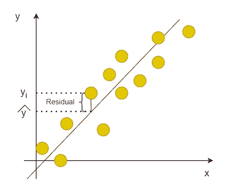

回归线。作者提供的图像。

红线称为**回归线**，它是我们将用来进行预测的线。如我们所见，数据点并不完全位于回归线上，因此我们可以将**残差**定义为回归线（预测值）与实际数据点之间的误差，方向为垂直方向。

因此，对于上述图像，我们从数学上定义残差为：

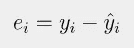

残差的定义。图像由作者提供。

我们希望得到 `e_i=0`，因为这意味着所有数据点都恰好位于回归线上的，但不幸的是，这不可能实现，因此我们在回归问题中使用以下度量来验证我们的 ML 模型。

我们定义 *“帽子” y* 为 **拟合值** 或 **预测值**（由模型拟合/预测：在这种情况下是线性回归模型），而 *y* 是 **真实值**。因此，预测值可以计算为：

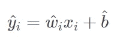

如何计算预测值。图像由作者提供。

在上述公式中，系数 *w*（称为 *权重*）和 *b*（称为 *偏置* 或 *常数*）是估计值，这意味着它们在学习过程中由 ML 模型学习得到。

这些知识很重要，因为现在我们可以将 **残差平方和（RSS）** 定义为：

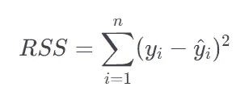

残差平方和的公式。图像由作者提供。

现在，如果我们将之前看到的预测值公式代入括号中，我们得到：

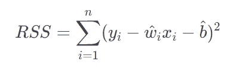

残差平方和的扩展公式。图像由作者提供。

估计的系数 *w* 和 *b* 是那些最小化 RSS 的系数。

实际上，我们必须记住，学习过程要求所选的 **度量**（也称为 **成本函数** 或 **损失函数**）必须被最小化。

在数学中，最小化一个函数意味着计算它的导数并将其等于 0。因此，我们应该执行类似的操作：

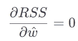

RSS 函数对 w 的导数。图像由作者提供。

和

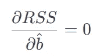

RSS 函数对 b 的导数。图像由作者提供。

我们不会在这里进行计算；请考虑这些计算的结果是：

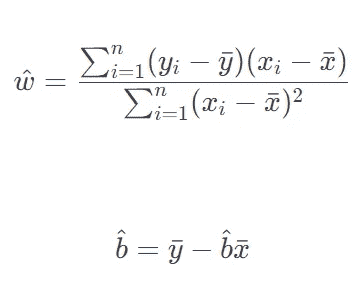

最小化 RSS 函数的值。图像由作者提供。

在上述公式中，带“上划线”的 x 和 y 是均值。因此它们可以计算为：

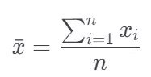

x 的均值（也适用于 y）。图像由作者提供。

现在，考虑到这些，我们将定义和计算 5 个成本函数。

我们将使用表格中的 5 个数字来展示各种度量之间的差异。该表格包含以下内容：

+   真实值。

+   预测值（由线性回归模型预测的值）。

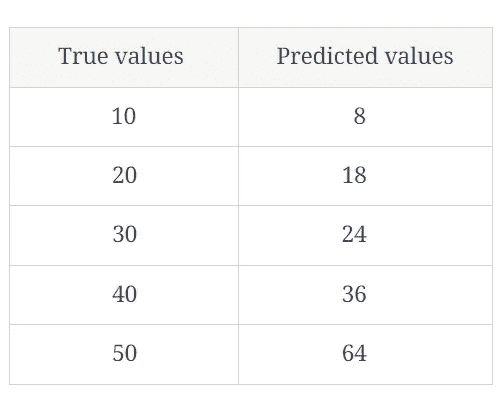

我们将用于后续计算的表格。图像由作者提供。

```py
**NOTE**: consider these data as calculated on the train set. In the following
calculations we'll give for granted that we refer just to the train set
and we won't discuss the test set.
```

# 1\. 均方误差（MSE）

我们定义 **均方误差** (**MSE**) 如下：

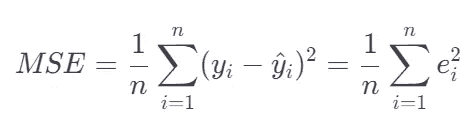

MSE 的定义。图片来源：作者。

其中 *n* 是观察值的数量。换句话说，它表示我们总共有多少个值。在我们的例子中，由于我们有一个包含 5 个数字的表格，因此 n=5。

MSE 衡量预测值与实际值之间的平均平方差。换句话说，它告诉我们我们的预测值与实际值的平均偏差。

让我们根据表格中的值进行计算：

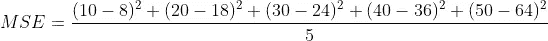

使用给定数字计算 MSE。图片来源：作者。

我们得到：MSE = 51.2

# 2\. 均方根误差 (RMSE)

**均方根误差** (**RMSE**) 只是 MSE 的平方根；所以它的公式是：

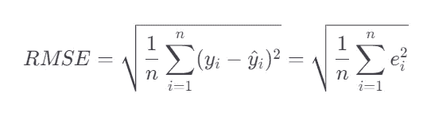

RMSE 的定义。图片来源：作者。

现在，让我们考虑上述表格中的值，并计算 RMSE：

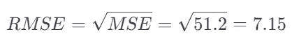

使用给定数字计算 RMSE。图片来源：作者。

MSE 和 RMSE 之间没有很大的差别。它们指的是相同的量，唯一的数学区别在于 RMSE 有一个平方根。然而，RMSE 更容易解释，因为它与输入值（预测值和真实值）具有相同的单位，因此更直接地与它们进行比较。

让我们举个例子来理解这个问题。

想象一下，我们已经训练了一个线性回归模型，以预测房屋的价格，基于其面积和卧室数量。我们计算 MSE 和 RMSE 的值并进行比较。

假设模型预测一座 1000 平方英尺、2 间卧室的房子的价格为 200,000 美元。然而，房子的实际价格为 250,000 美元。我们将得到：

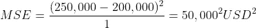

房子的价格的 MSE（在这种情况下，n=1，因为我们只计算了一个值）。图片来源：作者。

和

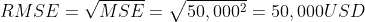

房子的价格的 RMSE（在这种情况下，n=1，因为我们只计算了一个值）。图片来源：作者。

所以，这里要点是：RMSE 很容易与输入数据进行比较，因为在这种情况下，我们如何解释 USD² 作为度量单位？这是无法解释的，但它是正确的！

所以，这就是这两个指标之间的区别。

# 3\. 均值绝对误差 (MAE)

**均值绝对误差** (**MAE**) 是另一种计算实际数据点和预测数据点之间距离的方法。其公式是：

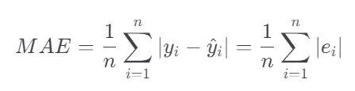

MAE 的定义。图片来源：作者。

这里，实际值和估计值之间的距离是通过范数（有时称为“曼哈顿距离”）计算的。

从公式中我们可以看到，尽管 MAE 也与输入值具有相同的单位，因此也容易解释。

现在，让我们考虑表格中的值，并计算 MAE：

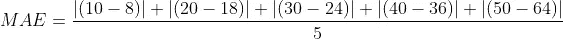

使用给定数字计算 MAE。作者提供的图像。

我们得到：MAE = 5.6。

现在，在解释其他两个指标之前，我们需要说一下上面提到的三个指标。

我们已经看到 MAE 和 RMSE 比 MSE 更容易解释，因为我们得到的结果与输入数据具有相同的单位，但这并不是唯一需要说明的事。

另一个需要说明的是，任何这些指标接近 0 的值都表示模型的预测更接近实际值；换句话说，模型对数据的预测效果很好。

相反，远离 0 的值表明模型的预测值远离实际值；换句话说，模型对数据的预测效果很差。

另一个我们可以说的事是，MSE 和 RMSE 对异常值非常敏感，因为它们基于预测值和真实值之间的平方差。在实际值与预测值之间有少量大误差的情况下，平方误差将非常大，这会显著影响 MSE 和 RMSE。在这些情况下，使用对异常值不那么敏感的 MAE 可能更为合适。

如果我们分析上面的表格，可以看到第五个数据点的预测值非常偏离（真实值为 50，而预测值为 64），这对 MSE 产生了显著影响，但对 MAE 的影响较小，如我们从获得的结果中所见。

所以，我们首先要做的事情之一是正确处理异常值（这里有一篇文章解释了如何做到这一点）。

另一点需要考虑的是，我们不会仅仅使用一个模型来解决我们的机器学习问题：通常，我们从 4 到 5 个模型开始，调整它们的超参数，最后选择最佳模型。

但作为起点，如我们所知，我们无法为 4 到 5 个模型计算 MAE、MSE 和 RMSE，因为这会耗费大量时间。

所以，让我们看看我们通常面临的情况：我们决定使用 5 个机器学习模型的池，并且例如，我们计算了 MAE 并得到了以下结果：

+   ML_1 的 MAE：115

+   ML_2 的 MAE：351

+   ML_3 的 MAE：78

+   ML_4 的 MAE：1103

+   ML_5 的 MAE：3427

我们知道 MAE 的值（但这同样适用于 MSE 和 RMSE）必须尽可能接近 0；因此，我们可以立即理解 ML_1 和 ML_3 在我们选择的 5 个模型中表现最好，但问题是：它们有多好？

这些指标中的每一个都可以达到任何值，甚至 100 万或更多。我们只知道我们必须尽可能接近 0 才能说我们的模型在解决这个机器学习问题上表现良好；但是结果必须离 0 有多近？MAE 为 78 足以说明 ML_3 在解决这个机器学习问题上非常好吗？

因为这些指标都可以达到任意值，统计学家定义了另外两个值在 0 到 1 之间的指标。这对于一些数据科学家在比较不同模型的结果时可能更有帮助。

# 4\. 决定系数（R²）

我们定义 **决定系数**（或 **R²**）如下：

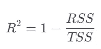

决定系数的定义。图片由作者提供。

在这里，我们之前定义了 RSS 为残差平方和。然后我们得到了总平方和，其定义为：

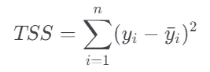

总平方和的定义。图片由作者提供。

TSS 简单来说就是预测变量 *y* 的方差；实际上，我们可以将分子和分母都乘以并除以 *1/n*：

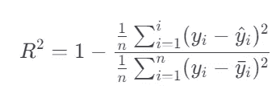

决定系数的修改定义。图片由作者提供。

现在，分子正好是 *MSE*，分母是 *y* 的方差；所以我们可以写：

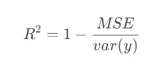

决定系数的另一种定义方式。图片由作者提供。

如果 R²=1，这意味着 MSE=0，因此模型完全符合数据。相反，R²=0 表示我们的模型完全不符合数据。

R² 的范围在 0 和 1 之间，正如我们希望的，但仅适用于训练集。这意味着 TSS>RSS 或 var(y)> MSE。相反，在测试集上，R² 可能变成负值，这意味着我们的模型对测试集的拟合很差（但我们在这里不会进一步讨论）。

现在，让我们回顾一下之前的工作。使用上面提供的表格，我们得到了：

+   MSE = 51.2

+   RMSE = 7.15

+   MAE = 5.6

因此，从 RMSE 和 MAE 来判断，我们用于这些计算的（唯一）模型似乎很好，因为我们接近 0。

但如果你熟悉数学分析，你可能会同意 5.6 可以认为离 0 很远。这是因为我们没有参考标准来进行判断。

现在，让我们看看计算 R² 会发生什么。

让我们计算 *y* 的均值：

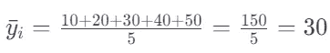

表中提供的 y 的均值。图片由作者提供。

现在我们可以计算方差：

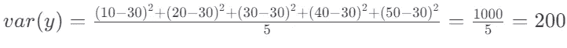

表中提供的 y 的方差。图片由作者提供。

我们之前计算了 MSE（MSE = 51.2），所以，最后我们有：

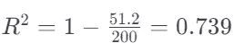

使用提供的值计算决定系数。图片由作者提供。

记住，在训练集上，R² 的范围在 0 和 1 之间，且离 1 越近模型越好，一般认为 R² 为 0.7 或更高是一个良好的拟合。

因此，我们可以立即且毫无疑问地说，我们的模型对数据的拟合相当好，因为我们知道我们可以获得的最佳值是 1，由于我们得到了 0.739，我们可以说，就比较而言，这个结果相当不错。

R²的问题在于，当我们向模型中添加额外的解释变量时，它往往会增加。这是因为额外的变量可能会改善模型的拟合度。因此，当我们向模型中添加更多的解释变量时，它对预测变量的信息更多，这可能使预测更准确。然后，这可能导致预测变量的方差减少，从而使 R²增加。

要确定一个变量是否对我们的模型具有解释性，我们必须考虑它是否可能对因变量产生影响。例如，如果我们研究收入与幸福之间的关系，假期花费的钱可能被认为是一个解释变量，因为它可能对幸福产生影响。另一方面，受访者的汽车颜色在这种情况下可能不会被认为是解释变量，因为它不太可能对幸福产生影响。

为了应对 R²这种行为，统计学家定义了调整后的 R²。

# 5\. 调整后的 R²

**调整后的 R²**是 R²的一种特殊形式，用于修正由于模型中新增解释变量而可能导致的 R²过高的情况。我们可以定义为：

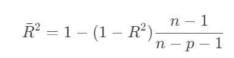

调整后的 R²的定义。图像由作者提供。

其中：

+   *n*是我们数据中的样本数量。

+   *p*是特征的数量（在回归问题中有时称为预测变量：这就是我们使用字母*p*的原因）。

假设我们有一个包含 2 个自变量和 10 个样本的模型，该模型的 R²为 0.8。我们有：

调整后的 R²的计算。图像由作者提供。

通常，当模型中有大量自变量时，建议使用调整后的 R²，因为它比“标准”R²提供了更准确的度量。

# 在 Python 中计算所有指标

幸运的是，在 Python 中我们无需计算这些指标：`sklearn`库会为我们计算，除了调整后的 R²：在这种情况下，我们必须通过编码来计算公式的参数。

让我们看一个例子。我们生成一些随机数据，用线性回归模型拟合训练集，并打印所有指标的结果。

```py
import numpy as np
from sklearn.model_selection import train_test_split
from sklearn.linear_model import LinearRegression
from sklearn.metrics import mean_absolute_error, mean_squared_error, r2_score

# generate random data
np.random.seed(42)
X = np.random.rand(100, 5)
y = 2*X[:,0] + 3*X[:,1] + 5*X[:,2] + np.random.rand(100)

# split data into train and test sets
X_train, X_test, y_train, y_test = train_test_split(X, y, test_size=0.2,
  random_state=42)

# fit linear regression model to the train set
reg = LinearRegression()
reg.fit(X_train, y_train)

# make predictions on the train set
y_pred_train = reg.predict(X_train)

# calculate metrics on the train set with 2 decimals
mae_train = round(mean_absolute_error(y_train, y_pred_train), 2)
mse_train = round(mean_squared_error(y_train, y_pred_train), 2)
rmse_train = round(np.sqrt(mse_train), 2)
r2_train = round(r2_score(y_train, y_pred_train), 2)

# calculate adjusted r-squared on the train set with 2 decimals
n = X_train.shape[0] #number of features
p = X_train.shape[1] #number of predictors
adj_r2_train = round(1 - (1 - r2_train) * (n - 1) / (n - p - 1), 2)

# print the results
print("Train set - MAE:", mae_train)
print("Train set - MSE:", mse_train)
print("Train set - RMSE:", rmse_train)
print("Train set - r-squared:", r2_train)
print("Train set - adjusted r-squared:", adj_r2_train)

>>>

  Train set - MAE: 0.23
  Train set - MSE: 0.07
  Train set - RMSE: 0.26
  Train set - r-squared: 0.98
  Train set - adjusted r-squared: 0.98
```

现在，在这种情况下，R²和调整后的 R²之间没有差异，因为数据是故意创建的，而且我们只有 5 个特征。

这段代码只是为了展示我们如何在 Python 中将本文所学的知识应用于实际案例。

此外，我们可以清楚地看到 MAE、MSE 和 RMSE 接近 0 的含义。由于 R² 是 0.98，实际上这些指标是“0.xx”，这比我们在表格示例中找到的 5.6 更接近 0。

# 结论

到目前为止，我们已经全面了解了与机器学习回归分析相关的所有指标。

即使我们写了很长的文章，我们希望这能帮助读者更好地理解这些指标的底层内容，更好地理解如何使用它们，以及它们之间的区别。

*你可能也喜欢：*

[](/classification-metrics-the-complete-guide-for-aspiring-data-scientists-9f02eab796ae?source=post_page-----1e2a8a2936f5--------------------------------) ## 分类指标：有志数据科学家的完整指南

### 成为掌握机器学习分类指标的唯一指南

towardsdatascience.com

**免费 Python 电子书：**

开始学习 Python 数据科学但感到困惑？ [***订阅我的新闻通讯，获取我的免费电子书：这将为你提供正确的学习路径，以通过实践经验学习 Python 数据科学。***](https://federico-trotta.ck.page/a3970f33f4)

享受这个故事了吗？成为 Medium 会员每月 5$ [通过我的推荐链接](https://medium.com/@federicotrotta/membership)：我会获得小额佣金，对你没有额外费用：

[](https://medium.com/@federicotrotta/membership?source=post_page-----1e2a8a2936f5--------------------------------) [## 通过我的推荐链接加入 Medium — Federico Trotta

### 阅读 Federico Trotta 的每一个故事（以及 Medium 上成千上万其他作家的故事）。您的会员费用直接支持…

medium.com](https://medium.com/@federicotrotta/membership?source=post_page-----1e2a8a2936f5--------------------------------)

**Python：**

+   Python 中的循环和语句：深入理解（附示例）

+   Python 循环：如何在 Python 中迭代的完整指南

+   学习的 5 个 Python 库来开始你的数据科学职业生涯

+   如何学习 Python 数据科学

**数据科学：**

+   如何处理数据科学中的缺失值

+   如何在数据科学项目中进行特征选择

+   如何在数据科学项目中检测异常值

+   条形图和直方图有什么区别？

+   相关性与回归的区别

+   理解 l1 和 l2 正则化
