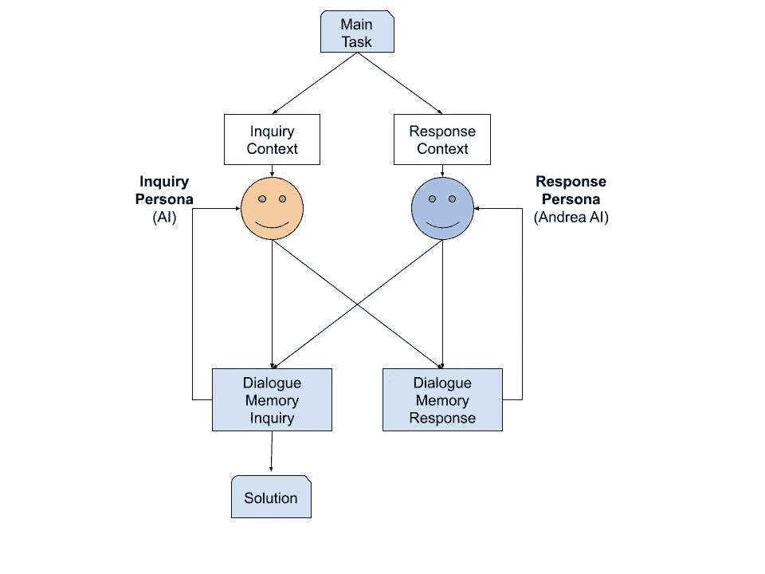

# 掌握未知领域与 GPT-4 和翻转互动模式

> 原文：[`towardsdatascience.com/mastering-the-unknown-with-gpt-4-and-the-flipped-interaction-pattern-1f23acbc4c91`](https://towardsdatascience.com/mastering-the-unknown-with-gpt-4-and-the-flipped-interaction-pattern-1f23acbc4c91)

## 利用 GPT-4 生成高质量问题，重新定义问题解决和决策制定

[](https://medium.com/@andrea.ialenti?source=post_page-----1f23acbc4c91--------------------------------)[](https://towardsdatascience.com/?source=post_page-----1f23acbc4c91--------------------------------) [Andrea Ialenti](https://medium.com/@andrea.ialenti?source=post_page-----1f23acbc4c91--------------------------------)

·发表于 [Towards Data Science](https://towardsdatascience.com/?source=post_page-----1f23acbc4c91--------------------------------) ·19 min 阅读·2023 年 7 月 13 日

--


由 [Ali Kazal](https://unsplash.com/@lureofadventure?utm_source=unsplash&utm_medium=referral&utm_content=creditCopyText) 提供的照片，来源于 [Unsplash](https://unsplash.com/photos/UU69D-_nwPI?utm_source=unsplash&utm_medium=referral&utm_content=creditCopyText)

# 介绍

像我一样，你可能也被生成 AI 领域最近取得的进展所惊艳。这感觉就像我们生活在科幻现实中，机器理解了我们。

在这场革命的核心，**OpenAI 的 GPT-4 已经成为语言模型领域的一项奇迹**。作为曾有幸尝试过它的人，我可以证明它令人惊叹的能力。

在这篇文章中，我想分享一种让我非常感兴趣的技术。在文献中，这种技术被称为 **翻转互动模式**，我发现它是一个非常强大的框架，可以帮助解决问题。这个提示工程方法的独特之处在于其“倒置”的（即翻转的）方法：它并不直接要求 AI 提供答案或解决方案，而是**主要集中在让 AI 提出能够有效引导我们找到期望解决方案的正确问题**。

在本文中，我将带你了解它的工作原理，解释它的好处，并提供其有效性的真实案例。希望到最后，你能掌握一个有用的技巧——一个可以应用于各种问题的技巧，结果可能会令你惊讶。

# 为什么选择 **翻转互动模式**？

在今天的世界中，我们的知识深度常常可以比作一个池塘——长而窄。我们深入某些专业领域，成为某些特定领域的专家。这种超专业化使我们在各自领域中表现出色，但同时，也可能让我们在遇到自己不擅长的问题时感到迷茫。作为一名软件工程师，我可能对算法、数据结构和编码非常熟悉，但当我手握铁锹，被要求照料花园时，我将把任何绿地变成荒地。

这时，达宁-克鲁格效应可能会发挥作用。根据这一心理假设，**存在一种认知偏差，即能力较低的人高估了自己执行任务的能力**。本质上，**我们不知道我们不知道什么**，这可能导致过度自信和错误。

然而，问题不仅仅在于我们在一个陌生领域里是业余的。**问题在于我们甚至无法提出正确的问题来引导我们找到解决方案**。园艺时需要考虑哪些关键因素？我应该注意什么？我应该从哪里开始？这些是我们在跨出专业领域时可能不知道要问的问题。

**这就是翻转互动模式的这个版本发挥作用的地方**。这种方法承认**解决方案的有效性取决于之前问题的质量**。我们不会让 GPT 提供问题的解决方案，而是使用 GPT-4 帮助识别需要提出的问题以找到解决方案。

# 翻转互动模式的实际应用

让我们将这一技术应用到园艺上。挑战是什么？给我那片荒废的前院带来新生。

要应用这一模式，我们从精心设计的提示开始。这个提示为我们与 GPT-4 的对话奠定了基础。以下是基本模板：

```py
Act as a **{{Relevant Professional}}**. 
I want to **{{Problem to Solve}}**

You will ask me 10 questions, one at the time.
After each question you will wait for my answer, after my answer you
will ask the next question. When all the 10 questions
have been answered, you will write me the exact steps
I have to do to solve my problem
```

在我们具体的案例中，我们将使用以下初始提示：

```py
Act as a **professional gardener**. I want to **renew a front garden that
is in a pretty bad shape, but I don't know where to start**.

You will ask me 10 questions, one at the time. After each question you 
will wait for my answer, after my answer you will ask the next question.
When all the 10 questions have been answered, you will write me the exact
steps I have to do to solve my problem.
```

让我们分析不同的元素。

1.  **角色分配：** 我们提示的第一部分设定了 GPT-4 将采用的角色来帮助我们解决问题——在这种情况下，是*专业园艺师*。为 GPT-4 分配角色是一种被广泛认可的策略，它在使 GPT 输出更相关和准确的回答方面证明了其有效性。

1.  **问题陈述：** 我们提示的下一部分明确了我们的问题。理想情况下，我们希望包括尽可能多的细节；因为提供的上下文越多，模型可以更好地调整其问题。

1.  **顺序提问：** 最后，我们的提示强调 GPT-4 的**提问应遵循顺序格式**。这一技术元素至关重要，因为它确保了 AI 的后续问题**基于之前的回答**。

让我们看看对话如何展开。

## GAIrdening

你可以在这个 [链接](https://chat.openai.com/share/69934c41-c498-4676-ae0b-9266b9c5f12d) 找到完整的对话记录。为了参考，我也在下面写出了对话内容。

```py
**Question 1**
*GPT-4*: What is the size of your garden area?
*Andrea*: It's around 15 squares meters. There is an area that has a weed lawn, and another area that has tiles. i only want to renew the weedy lawn, which is 15 squares meters. In that area I also have a cherry tree

**Question 2**
*GPT-4*: Could you describe the condition of the soil? Is it sandy, loamy, clayey? And do you know the pH level of your soil?
*Andrea*: It's loamy. I have no idea about the ph

**Question 3**
*GPT-4*: Do you have a preference for a certain type of plants or a specific look you want for your garden? For instance, do you want flowering plants, ornamental grasses, shrubs, perennials, or annuals?
*Andrea*: In the side I want to plant a periennals, the most part would be grass. I'd like to have some plants around the cherry tree, and a hedge on the front of the garden (the part that sees the street)

**Question 4**
*GPT-4*: What is the sunlight situation in your garden? Does it receive full sunlight, partial sun, or is it mostly in the shade?
*Andrea*: Full sun, besides the area under the tree that is mostly in shade

**Question 5**
*GPT-4*: For the hedge, do you have any particular preferences for height, thickness, and color (green, variegated, etc.)?
*Andrea*: Green High plants

**Question 6**
*GPT-4*: Could you tell me a bit more about your local climate? For instance, where are you located and what kind of temperatures, rainfall, and seasons do you experience?
*Andrea*: I live in Ireland, it rains quite a lot, but there is some level of sun almost every day.

**Question 7**
*GPT-4*: Do you have a preference in terms of maintenance? Would you prefer a low-maintenance garden or are you comfortable with investing a bit more time in upkeep?
*Andrea*: I'm comfortable in investing some time

**Question 8**
*GPT-4*: What is the main purpose of this garden? Is it mainly for aesthetics, to create a private space, to attract wildlife, or maybe for growing fruits and vegetables?
*Andrea*: Aesthetic, but I also want to support pollinators 

**Question 9**
*GPT-4*: What's your budget for this project? This will help determine what type of plants, grass, and amendments you can afford.
*Andrea*: 500 euro

**Question 10**
*GPT-4*: Lastly, do you have any known allergies to specific plants, trees, or flowers that we should avoid including in your garden?
*Andrea*: No
```

很明显，ChatGPT 询问了重要的细节，例如花园的大小、土壤状况、光照情况、偏好的植物类型、当地气候、我对维护的准备情况（笑）、花园的主要用途、预算以及潜在的过敏反应。

回顾起来，在走过 AI 的问题之后，我很感激这些提问促使我考虑到花园翻新中可能被忽视的方面。

两个例子：

1.  **ChatGPT 关于阳光的询问**："*你的花园阳光情况如何？是全天候阳光、部分阳光，还是大部分时间在阴影中？*" 这个问题突显了理解花园光照条件的重要性，以便选择合适的植物。说实话，这是一个关键细节，如果我单独处理这个任务，很可能会忽视。

1.  GPT-4 询问：“*你是否对* ***任何已知的过敏源*** *（如特定植物、树木或花卉）有过敏反应，我们应该避免在你的花园中包括这些吗？*”，提醒了我一个如果没有指导可能会轻易遗漏的方面。

总之，GPT-4 实施的逐步提问策略不仅加深了我对当前问题的理解，还使得 AI 能够生成更详细和个性化的解决方案。

这是 GPT 给我的关于花园翻新的最终建议：

```py
Step 1: Clear the Area and Check the Soil
Start by removing the weeds and any other debris from the area.
To check the pH of your soil, you can purchase an inexpensive soil
testing kit from your local garden center or online.
Loamy soil is typically around neutral but knowing the exact pH will help you
choose the best plants.

Step 2: Improve the Soil
Based on your soil test results, you may need to add amendments to your soil
to improve its fertility. For loamy soil, adding compost or well-rotted
manure can improve its nutrient content.

Step 3: Plan Your Plantings
You mentioned you wanted a hedge, grass, perennials, and plants around
the cherry tree. Here are some suggestions:

    Hedge: Yew (Taxus baccata) can make a good, tall green hedge.
It's evergreen and can handle Ireland's wet climate.

    Grass: Ryegrass is durable and can handle full sun and frequent rain.
    Perennials for sunny areas: Consider Lavender, Sedum, and Echinacea.
These will attract pollinators and can handle full sun.

    Plants for the shaded area under the cherry tree: Ferns and hostas
are shade-loving and will add some texture and visual interest.

Step 4: Purchase and Plant
Purchase your chosen plants, keeping your budget in mind. Start planting with
the hedge, as it will be your primary structural element. After that,
plant the grass, then your perennials, and finally, the shade-loving plants
around the cherry tree.

Step 5: Water and Care
After planting, water everything well. Remember that new plants will need
more frequent watering until they establish. After they are established,
adjust watering based on the weather and the needs of each type of plant.
In general, the grass will likely need watering once a week, the hedge
every 1-2 weeks, and the perennials every 1-2 weeks, but adjust as needed.
The plants under the cherry tree will likely need less water due to the
shade and potential rain protection from the tree.

Step 6: Ongoing Maintenance
Mow the grass as needed, trim the hedge to maintain its shape and height,
and prune the perennials after flowering to encourage new growth.
Remove any fallen leaves or debris regularly to keep the garden tidy.

Remember, gardening is a process, and it's okay if everything doesn't
look perfect right away. Over time, as the plants grow and fill in,
you'll see your garden transform into a beautiful, pollinator-friendly
space. Enjoy the process and the result!
```

# 自动化反转互动模式

我已经多次测试了这种技术，所以我很有信心它在大多数情况下会有效，**尤其是使用 GPT-4 作为 LLM（而不是 GPT-3）**。接下来我们转向一种更具实验性的方式：**是否可以自动化这种方法？** 为了回答这个问题，我们需要一些编码（终于）。

**我们将创建两个 AI 代理进行对话**，一个提问，即 `inquiry_persona`，另一个回答，即 `response_persona`。我们将用一些指令来初始化我们的代理，**使他们共享一个共同的目标**。最后，我们将让这两个 AI 对话，直到 `inquiry_persona` 提供最终回应。值得注意的是，**这些代理必须保持对话历史**，记住他们自己的回答以及对方的回答。系统的组织结构如下图所示。



采用 Google Drawings 手工制作 ❤

## 实施

首先让我们看看如何初始化这两个代理：

`inquiry_persona` 代理的初始提示与我们之前看到的非常相似。由于我们将用于此次实验的模型是 GPT-3.5，因此有一些**小差异，我不得不付出额外的努力使其正常工作**。

`response_persona`代理被初始化为相同的`TASK`，并意识到其他代理是谁。

下一步是用我们需要的信息填充这些变量，以解决我们的难题。

考虑一个场景，其中一个软件工程师正在寻求加薪，并需要制定请求薪资增加的策略。此人可能会设置如下提示：

现在提示已经准备好，我们只需调用 API 并处理对话。以下是调用 OpenAI API 的函数；该函数只需返回回应，我们将手动处理此回应。

最后，我们可以编写处理对话的代码段。

如你所见，我们使用了两个对话。这样我们可以分别初始化两个代理（即设置不同的角色以定义“谁”是代理）。对话以我们的起始消息初始化，这些消息存储在`main_conversation`和`side_conversation`列表中。**这些列表允许代理记住对话内容。**

然后，代码使用`complete()`函数生成每个 AI 角色的初步回应：该函数将获取完整的对话历史，并输出“下一个回应”。请注意，对于 Chat 模型（如 GPT-3.5），可以使用[ChatML](https://learn.microsoft.com/en-us/azure/cognitive-services/openai/how-to/chatgpt)标记语言自定义消息/角色（这就是通过设置`role`和`content`在`dicts`中发生的情况）。

循环是对话的核心。**在每次迭代中，两位代理将看到迄今为止的整个对话历史**。

让我们执行代码，看看对话如何展开。

```py
**AI:** 1\. Can you provide specific examples of 
 how you have maintained a good performance over the past 5 years?
**Andrea AI:** Certainly! Over the past 5 years, I have consistently delivered high-quality software solutions on time and within budget. I have received positive feedback from clients and colleagues on my ability to understand and meet their requirements effectively. Additionally, I have actively participated in team collaborations, contributing valuable ideas and solutions to complex problems. My performance evaluations have consistently been positive, highlighting my strong work ethic, attention to detail, and ability to adapt to changing project requirements.

**AI:** 2\. Have you taken on any additional responsibilities 
 or projects beyond your initial job description during these 5 years?
**Andrea AI:** Yes, I have taken on additional responsibilities and projects beyond my initial job description during these 5 years. I have actively sought out opportunities to expand my skill set and contribute to the company's success. For example, I have volunteered to mentor junior engineers, providing guidance and support in their professional development. I have also taken the initiative to lead cross-functional teams on critical projects, demonstrating my ability to handle increased responsibilities and manage complex tasks. These additional responsibilities have allowed me to contribute to the company's growth and success while further developing my own expertise.

**AI:** 3\. How has your performance directly impacted the company's success or bottom line?
**Andrea AI:** My performance has directly impacted the company's success and bottom line in several ways. First, by consistently delivering high-quality software solutions, I have helped to enhance the company's reputation and client satisfaction. This has resulted in repeat business from existing clients and positive referrals, contributing to revenue growth. Additionally, my ability to meet project deadlines and stay within budget has helped to minimize project overruns and maximize profitability. I have also proactively identified and implemented process improvements, resulting in increased efficiency and cost savings for the company. Overall, my performance has played a significant role in driving the company's success and financial performance.

**AI:** 4\. Can you provide any evidence or metrics to support your claim of maintaining a good performance?
**Andrea AI:** Certainly! Here are some evidence and metrics to support my claim of maintaining a good performance:
    1\. Performance evaluations: I have consistently received positive performance evaluations from my managers over the past 5 years, highlighting my strong work ethic, technical expertise, and ability to meet project goals.
    2\. Client feedback: I have received positive feedback from clients on multiple projects, commending my professionalism, attention to detail, and ability to deliver high-quality software solutions that meet their needs.
    3\. Project success rate: I have successfully delivered 95% of the projects assigned to me on time and within budget, demonstrating my ability to effectively manage and execute complex software development tasks.
    4\. Team collaboration: I have actively participated in cross-functional team collaborations, contributing valuable ideas and solutions to complex problems. This has resulted in successful project outcomes and positive feedback from team members.
    5\. Training and certifications: I have consistently pursued professional development opportunities, obtaining relevant certifications and attending training sessions to enhance my skills and stay updated with the latest industry trends.

These evidence and metrics highlight my consistent performance and dedication to delivering high-quality work, which has contributed to the success of both individual projects and the overall company.

**AI:** 5\. Have you researched the current market 
 value for your role and level of experience in your industry?
**Andrea AI:** Yes, I have researched the current market value for my role and level of experience in the industry. I have conducted thorough research and analysis to understand the prevailing salary ranges and compensation packages for software engineers with similar experience, skills, and responsibilities. I have taken into account factors such as industry standards, geographical location, and company size to ensure that my expectations are aligned with the market value. Based on my research, I believe that my skills and experience warrant a fair and competitive compensation package.

**AI:** 6\. Have you prepared a list of specific 
 reasons why you believe you deserve a raise based on your 
 performance and contributions to the company?
**Andrea AI:** Yes, I have prepared a list of specific reasons why I believe I deserve a raise based on my performance and contributions to the company. Here are some key points:
    1\. Consistently high-quality work: Over the past 5 years, I have consistently delivered high-quality software solutions, meeting or exceeding client expectations. This has contributed to the company's reputation and client satisfaction.
    2\. Meeting project goals: I have a track record of successfully meeting project deadlines and staying within budget. This has helped to minimize project overruns and maximize profitability for the company.
    3\. Additional responsibilities: I have voluntarily taken on additional responsibilities beyond my initial job description, such as mentoring junior engineers and leading cross-functional teams. These contributions have added value to the company and its employees.
    4\. Process improvements: I have proactively identified and implemented process improvements, resulting in increased efficiency and cost savings. These improvements have positively impacted the company's bottom line.
    5\. Positive feedback: I have received positive feedback from clients and colleagues on my professionalism, attention to detail, and ability to deliver results. This feedback demonstrates the value I bring to the company.
    6\. Professional development: I have consistently pursued professional development opportunities, obtaining relevant certifications and staying updated with industry trends. This investment in my skills and knowledge directly benefits the company.

Based on these reasons, I believe that my performance and contributions warrant a raise in recognition of my value to the company.

**AI:** 7\. Have you scheduled a meeting with your manager 
 to discuss your request for a raise?
**Andrea AI:** No, I have not scheduled a meeting with my manager yet to discuss my request for a raise. However, I am planning to request a meeting in the near future to have a conversation about my performance, contributions, and the possibility of a raise. I believe it is important to have a formal discussion with my manager to present my case and provide them with the opportunity to consider my request.

**AI:** 8\. Have you prepared a well-structured and persuasive 
 argument to present during the meeting with your manager?
**Andrea AI:** Yes, I have prepared a well-structured and persuasive argument to present during the meeting with my manager. My argument highlights my consistent performance, contributions to the company, and the market value for my role and level of experience. Here is an outline of my argument:

    1\. Opening: Express gratitude for the opportunity to discuss my performance and contributions with my manager.
    2\. Recap of performance: Provide a brief summary of my performance over the past 5 years, emphasizing my consistent delivery of high-quality work, meeting project goals, and positive feedback received from clients and colleagues.
    3\. Additional responsibilities: Discuss the extra responsibilities I have taken on voluntarily, such as mentoring junior engineers and leading cross-functional teams, and how they have added value to the company.
    4\. Process improvements: Highlight the process improvements I have identified and implemented, resulting in increased efficiency and cost savings for the company.
    5\. Market value research: Share the research I have conducted on the current market value for my role and level of experience, demonstrating that my expectations are aligned with industry standards.
    6\. Financial impact: Discuss how my performance and contributions have directly impacted the company's success and bottom line, providing specific examples of projects, client satisfaction, and cost savings.
    7\. Professional development: Highlight my commitment to continuous learning and professional development, emphasizing how it benefits both myself and the company.
    8\. Request for a raise: Clearly and confidently state my request for a raise, based on my performance, contributions, and market value.
    9\. Closing: Express my commitment to the company and reiterate that my intention is not to leave, but rather to be fairly compensated for my value and contributions.

By following this well-structured argument, I believe I can effectively present my case and persuade my manager to consider my request for a raise.

**AI:** 9\. Are you prepared to negotiate and consider 
 alternative forms of compensation if a salary increase is not 
 immediately possible?
**Andrea AI:** Yes, I am prepared to negotiate and consider alternative forms of compensation if a salary increase is not immediately possible. While a salary increase would be ideal, I understand that there may be constraints or limitations within the company's budget. In such a case, I am open to discussing alternative forms of compensation that may still provide value and meet my financial needs. This could include options such as performance-based bonuses, stock options, additional paid time off, professional development opportunities, or other benefits that align with my career growth and financial goals. I believe in maintaining open and constructive communication during the negotiation process to find a mutually beneficial solution.

**AI:** 10\. Have you considered the potential outcomes and next 
 steps if your request for a raise is not approved?
**Andrea AI:** Yes, I have considered the potential outcomes and next steps if my request for a raise is not approved. While I am hopeful that my manager will recognize my contributions and grant the raise, I understand that it may not always be possible due to various factors. In such a scenario, I am committed to maintaining a positive attitude and continuing to perform at a high level in my current role.

If my request for a raise is not approved, I would seek feedback from my manager on areas of improvement and opportunities for growth within the company. I would also explore other avenues for professional development, such as attending training sessions or pursuing certifications, to enhance my skill set and increase my value to the company.
Additionally, I would consider discussing the possibility of a performance-based plan or timeline with my manager, where I can work towards specific goals or milestones that would make me eligible for a raise in the future. This would allow me to have a clear path for advancement and provide an opportunity to revisit the topic of a raise at a later date.
Ultimately, my goal is to continue contributing to the success of the company and growing in my career. If a raise is not immediately possible, I am committed to exploring alternative paths for growth and advancement within the company while keeping an open mind about potential opportunities outside the organization as well.
```

这是 AI 的最终建议。

```py
**AI**: Based on your responses, here are the exact steps you can 
take to address your situation:

    1\. Schedule a meeting with your manager: Request a 
meeting with your manager to discuss your performance, 
contributions, and the possibility of a raise.

    2\. Present your case: During the meeting, present a 
well-structured argument that highlights your consistent performance, 
additional responsibilities, process improvements, 
market value research, financial impact, and commitment 
to professional development. Clearly state your request for a 
raise based on these factors.

    3\. Be open to negotiation: Be prepared to negotiate and 
consider alternative forms of compensation if a salary increase 
is not immediately possible. Discuss options such as 
performance-based bonuses, stock options, additional paid time off, 
or professional development opportunities.

    4\. Seek feedback and growth opportunities: If your request for 
a raise is not approved, seek feedback from your manager on areas 
of improvement and opportunities for growth within the company. 
Explore avenues for professional development to enhance your skills 
and increase your value to the company.

    5\. Discuss a performance-based plan: Consider discussing the 
possibility of a performance-based plan or timeline with your manager, 
where you can work towards specific goals or milestones that would make 
you eligible for a raise in the future. This provides a clear path 
for advancement and an opportunity to revisit the topic of a 
raise at a later date.

    6\. Maintain a positive attitude and performance: Regardless 
of the outcome, maintain a positive attitude and continue to 
perform at a high level in your current role. Stay committed to 
contributing to the success of the company and explore growth opportunities 
within or outside the organization.

Remember, it's important to approach the meeting with professionalism, confidence, and a focus on the value you bring to the company. Good luck with your meeting and your pursuit of a raise!
```

当然，我的初步提示可能过于笼统，无法生成针对我们具体案例的最终回应，但请考虑以下学习点：

1.  **你知道应该关注什么**，如果你面对那个特定问题（研究市场以查看同行的薪酬，收集你对公司的贡献信息）。

1.  你有一个关于**软件工程师应该如何回答这些问题**的想法。

1.  你实际上有一个最终建议，虽然很通用，但**是一个很好的起点**。

最后，请记住，在这个阶段你可以手动跟进，以帮助 GPT 纠正/改进其最终回应。也许是我，所有这些看起来都像魔法。

# 结论

翻转互动模式利用 GPT 帮助集中于问题而非答案。这种方法使你能够更深入地理解当前问题，并为 AI 提供一个框架，以提供个性化和准确的回应；基本上，你只需要能够提出你的问题！

总的来说，我发现这种方法非常有用，所以我鼓励你尝试一下，但请注意：将自动化部分仅视为有趣的练习，避免将可能的与经理的对话交给它！

如果你尝试了这个方法，或者有改进的想法，请随时联系我！

[## 如何用旅行推销员问题拯救圣诞节](https://towardsdatascience.com/how-i-saved-christmas-with-the-travelling-salesman-problem-3d85c190ed9d?source=post_page-----1f23acbc4c91--------------------------------)

### 一名数据科学家在需求高/供应低的市场中寻找物业的探险

[## 数据科学的好处：我如何在都柏林找到新家](https://towardsdatascience.com/the-perks-of-data-science-how-i-found-my-new-home-in-dublin-5ff84fc97ec4?source=post_page-----1f23acbc4c91--------------------------------) [## 如何用旅行推销员问题拯救圣诞节](https://towardsdatascience.com/how-i-saved-christmas-with-the-travelling-salesman-problem-3d85c190ed9d?source=post_page-----1f23acbc4c91--------------------------------)

### 圣诞老人最佳旅行路线的一个很好的可视化

[## 数据科学的好处：我如何在都柏林找到新家](https://towardsdatascience.com/the-perks-of-data-science-how-i-found-my-new-home-in-dublin-5ff84fc97ec4?source=post_page-----1f23acbc4c91--------------------------------)

# 附录

如果你想直接复制粘贴并尝试的话，下面是完整代码！
