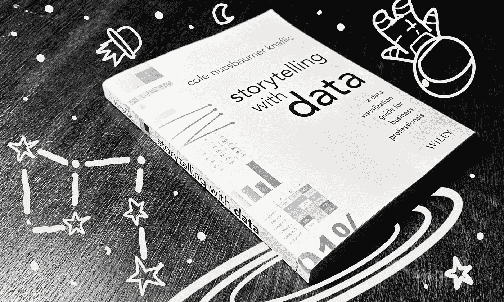
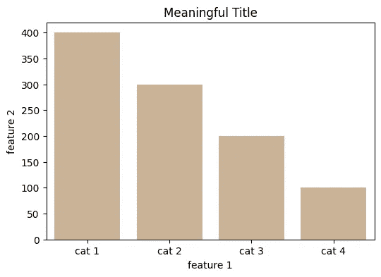
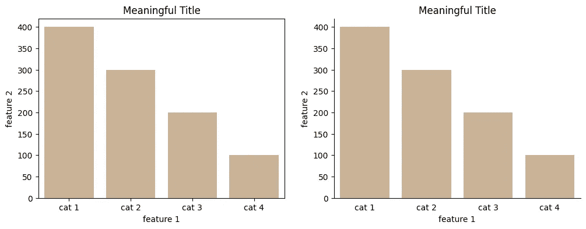
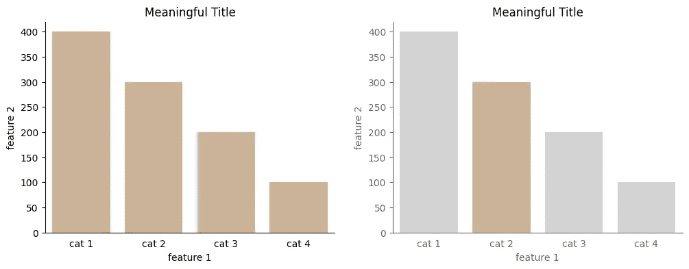
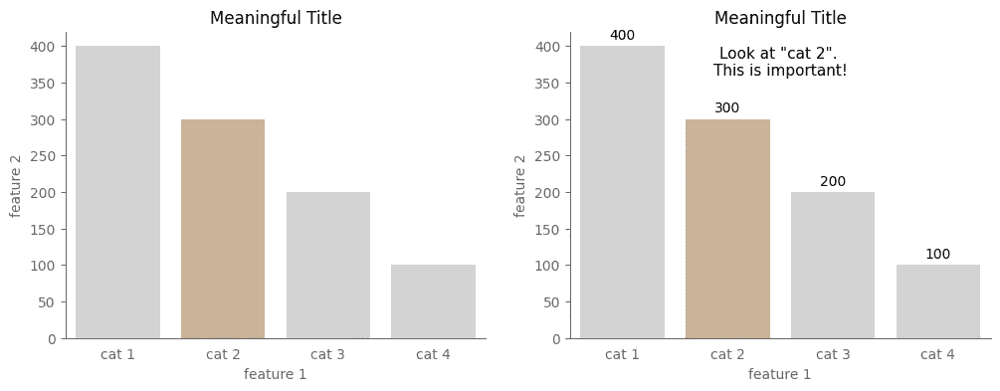
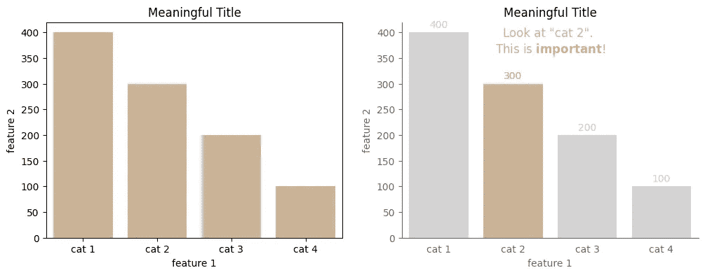

# Matplotlib 提示，以立即提升你的数据可视化——根据《数据故事讲述》

> 原文：[`towardsdatascience.com/matplotlib-tips-to-instantly-improve-your-data-visualizations-according-to-storytelling-with-8e75601b38cb`](https://towardsdatascience.com/matplotlib-tips-to-instantly-improve-your-data-visualizations-according-to-storytelling-with-8e75601b38cb)

## 使用 Matplotlib 在 Python 中重现**Cole Nussbaumer Knaflic**书中的经验教训

[](https://medium.com/@iamleonie?source=post_page-----8e75601b38cb--------------------------------)[](https://towardsdatascience.com/?source=post_page-----8e75601b38cb--------------------------------) [Leonie Monigatti](https://medium.com/@iamleonie?source=post_page-----8e75601b38cb--------------------------------)

·发布于[数据科学前沿](https://towardsdatascience.com/?source=post_page-----8e75601b38cb--------------------------------) ·阅读时间 9 分钟·2023 年 6 月 19 日

--



能够有效地用数据进行沟通是一项适用于所有数据相关工作的技能——不仅仅是数据科学家和数据分析师。

我最喜欢的一本关于这个主题的书是**Cole Nussbaumer Knaflic**的《数据故事讲述》。这本书里充满了如何改进数据可视化的实用示例。

[](https://www.amazon.com/Cole-Nussbaumer-Knaflic/dp/1119002257?source=post_page-----8e75601b38cb--------------------------------) [## 数据故事讲述：面向商业专业人士的数据可视化指南

### 《数据故事讲述：面向商业专业人士的数据可视化指南》 [Nussbaumer Knaflic, Cole] 在 Amazon.com 上…

[www.amazon.com](https://www.amazon.com/Cole-Nussbaumer-Knaflic/dp/1119002257?source=post_page-----8e75601b38cb--------------------------------)

我认为这本书唯一不幸的地方是，其示例是使用 Microsoft Excel 创建的。

如果你知道一个喜欢在 Excel 中创建数据可视化的工程师，请举手——是的，我也没有。

> “你可能是一个工程师，但理解你的图表不应该需要一个工程学学位。” ——**Cole Nussbaumer Knaflic**在《数据故事讲述》中

这就是为什么这篇文章将涵盖我自从阅读**Nussbaumer Knaflic**的《数据故事讲述》以来使用过的 Matplotlib 代码片段。

```py
import matplotlib.pyplot as plt
```

这篇文章假设你已经掌握了 Matplotlib 和 Seaborn 的数据可视化基础知识，比如创建条形图、折线图或散点图，修改颜色调色板，并添加基本标签。文章还假设你知道何时使用哪种类型的图表。

这篇文章重点介绍一些不太常见的技巧，而不是 Matplotlib 的基础知识，例如：

+   如何去除 Matplotlib 图的顶部和右侧边框

+   如何从 Matplotlib 图中移除刻度线

+   如何自定义 Matplotlib 图中每个条形的颜色

+   如何更改 Matplotlib 图中 x 轴和 y 轴的颜色

+   如何向 Matplotlib 图中添加文本注释

+   如何在 Matplotlib 图中为条形图添加数值

+   如何在 Matplotlib 注释中将整段或部分文本设为粗体

+   如何在 Matplotlib 注释中为文本上色

我们从一个简单的例子开始。以下数据是虚构的，以便我们能够专注于数据可视化技术：

```py
import pandas as pd

# Define fictional example dataframe
df = pd.DataFrame(
          {'feature 1' : ['cat 1', 'cat 2', 'cat 3', 'cat 4'],
           'feature 2' : [400, 300, 200, 100]
          })
```

让我们以一个简单的单色条形图为起点，使用 Seaborn 并添加标题：

```py
import seaborn as sns

# Create a basic bar chart from the example dataframe
fig, ax = plt.subplots(1,1, figsize = (6, 4))
sns.barplot(data =  df, 
            x = 'feature 1', 
            y = 'feature 2', 
            color = 'tan')

# Add title
ax.set_title('Meaningful Title')

plt.show()
```



# 移除杂乱

在《杂乱是你的敌人！》一章中，Nussbaumer Knaflic 讨论了如何识别并消除数据可视化中的视觉杂乱——这一部分将展示如何在 Matplotlib 图中去除视觉杂乱。

> “[……E]每一个元素都会增加观众的认知负担。”—— Cole Nussbaumer Knaflic 在《数据讲故事》中

## 如何去除 Matplotlib 图的顶部和右侧边框

默认情况下，Matplotlib 图的边缘有一个所谓的脊线框。尤其是顶部和右侧的脊线会使数据可视化显得杂乱，因此应该被去除。

你可以通过以下代码片段简单地去除不相关的脊线：

```py
# Remove top and right spines
ax.spines['right'].set_visible(False)
ax.spines['top'].set_visible(False)
```

如果你还想去除其他脊线，可以使用 `'bottom'` 和 `'left'`。如果你想去除边框，包括完整的 x 轴和 y 轴，可以使用 `ax.axis('off')`。

## 如何从 Matplotlib 图中移除刻度线

刻度线通常不会被认为是杂乱的。但在某些情况下，如此示例中，条形图的 x 轴刻度线是多余的。

```py
# Remove ticks on x-axis
ax.tick_params(bottom = False)
```

如果你还想去除 y 轴的刻度线，可以使用 `left = False`。

现在，去除杂乱后的例子如下所示：



在 Matplotlib 图中去除杂乱前后的对比。

新图由于去除了视觉杂乱，难道没有给你一种更加平静的感觉吗？

# 减少强调

在《像设计师一样思考》一章中，Nussbaumer Knaflic 向我们展示了如何消除必要但相关的信息。这一部分展示了如何更改 Matplotlib 图中不重要部分的颜色。

> “将必要但不会影响信息传递的项推到背景中。[……] 浅灰色在这方面效果很好。”—— Cole Nussbaumer Knaflic 在《数据讲故事》中

## 如何自定义 Matplotlib 图中每个条形的颜色

用 `palette` 参数替换 `sns.barplot` 方法中的 `color` 参数，以控制每个条形的颜色。通过这样做，你可以使用浅灰色来减少不重要的条形的强调，只用主要颜色来突出相关的条形。

```py
# Define colors of individual bars
custom_colors = ['lightgrey', 'tan', 'lightgrey', 'lightgrey']

# De-emphasize less important bars
sns.barplot(data =  df, 
            x = 'feature 1', 
            y = 'feature 2', 
            palette = custom_colors) 
```

## 如何在 Matplotlib 绘图中更改 x 轴和 y 轴的颜色

接下来，我们还想降低 x 轴和 y 轴的颜色。为此，我们需要降低轴的脊、刻度和标签的颜色：

```py
# Mute colors of spines
ax.spines['left'].set_color('grey')   
ax.spines['bottom'].set_color('grey')

# Mute colors of ticks
ax.tick_params(colors = 'grey')

# Mute colors of labels
ax.set_xlabel('feature 1', color = 'grey')
ax.set_ylabel('feature 2', color = 'grey')
```

现在，强调较不重要信息的示例如下所示：



在 Matplotlib 图中强调和不强调不重要信息的前后对比。

# 文本是你的朋友：添加注释

Nussbaumer Knaflic 强调，您应该在数据可视化中添加文本以突出关键要点。在本节中，我们将探讨 `ax.annotate()` 方法，以在 Matplotlib 图中添加文本。

> “如果您希望您的观众得出结论，请用文字说明。” — Cole Nussbaumer Knaflic 在《用数据讲故事》中

## 如何在 Matplotlib 图中添加文本注释

要在 Matplotlib 图形中添加文本，您可以使用 `ax.annotate()` 方法，该方法将文本及其在图中的位置作为参数。此外，您还可以指定水平 (`ha`) 或垂直对齐 (`va`) 以及字体大小等方面。

```py
# Add text annotations
ax.annotate('Look at "cat 2". \nThis is important!',
             xy = (1.5, 360), 
              ha = 'center',
              fontsize = 11,
           )
```

如果您想添加额外的箭头指向某个位置，则需要使用以下参数：

+   `xy`：要注释的点——即箭头指向的位置

+   `xytext`：文本的位置（以及箭头的终点）

+   `arrowprops = {'arrowstyle' : '->'}`：箭头的样式

## 如何在 Matplotlib 图中给条形图添加数值

要为每个单独的条形添加数值，我们需要遍历 `ax.patches`。对于每个 `bar`，您可以使用 `get_height()`、`get_width()` 和 `get_x()` 方法来将数值放置在条形上方。

```py
# Annotate bar chart with values
for bar in ax.patches:
    ax.annotate(int(bar.get_height()),
                xy = (bar.get_x() + bar.get_width() / 2, bar.get_height()), 
                ha = 'center', 
                va = 'center',
                xytext = (0, 8),
                textcoords = 'offset points'
                )
```

现在，添加了文本注释的示例如下所示：



在 Matplotlib 图中添加文本注释的前后对比。

# 强调

在章节“聚焦您的观众注意力”中，Nussbaumer Knaflic 讨论了如何利用预注意属性引导观众的注意力到您希望他们看到的内容。在本节中，我们将讨论可以应用于 Matplotlib 图中文本注释的一些简单调整，以利用文本中的预注意属性。

> “……如果我们战略性地使用预注意属性，它们可以帮助我们让观众在他们甚至不知道自己在看到之前，就看到我们希望他们看到的东西。” — Cole Nussbaumer Knaflic 在《用数据讲故事》中

## 如何在 Matplotlib 注释中使整段或部分文本变为 **粗体**

使用 **粗体** 文本可以帮助突出数据可视化中的重要部分。如果您只想突出注释中的一部分，可以在字符串中使用 `$\\bf{}$` 并将要强调的文本放在花括号中。如果您想突出整个注释，只需添加参数 `fontweight = 'bold'`。

```py
# Make only part of text bold
ax.annotate('Look at "cat 2". \nThis is $\\bf{important}$!', 
            #...
           )

# Make all of the text bold
ax.annotate('Look at "cat 2". \nThis is important!', 
            #...
            fontweight='bold',
           )
```

## 如何在 Matplotlib 注释中给文本上色

要将特定文本与数据可视化中的特定元素关联起来，你可以利用相同颜色的关联性。要给文本注释上色，只需将 `color` 参数添加到 `ax.annotate()` 方法中。

```py
# Remove ticks on x-axis
ax.tick_params(bottom = False)
# Add important take away to plot 
ax.annotate('Look at "cat 2". \nThis is $\\bf{important}$!', # Emphasize important terms
            xy = (1.5, 360), 
            ha = 'center',
            color = 'tan', 
            fontsize = 11,
           )
```

现在，强调重要信息的示例如下：



在 Matplotlib 绘图中应用重要信息之前和之后。

下面是创建最终数据可视化的代码。

```py
import matplotlib.pyplot as plt
import seaborn as sns

# Define color palette
highlight_color = 'tan'
muted_color = 'dimgrey'
muted_color2 = 'lightgrey'
custom_colors = [muted_color2, 'tan', muted_color2, muted_color2]

# Create a basic bar chart from the example dataframe
fig, ax = plt.subplots(1,1, figsize = (6, 4))

sns.barplot(data =  df, 
            x = 'feature 1', 
            y = 'feature 2', 
            palette = custom_colors) # De-emphasize less important bars

# Add title
ax.set_title('Meaningful Title')

# Mute colors of labels
ax.set_xlabel('feature 1', color = muted_color)
ax.set_ylabel('feature 2', color = muted_color)

# Remove unimportant spines and mute color of remaining spines
ax.spines['right'].set_visible(False)      # Remove top and right spines
ax.spines['top'].set_visible(False)        # Remove top and right spines 
ax.spines['left'].set_color(muted_color)   # Mute colors of spines
ax.spines['bottom'].set_color(muted_color) # Mute colors of spines

# Remove ticks on x-axis and mute colors of ticks
ax.tick_params(bottom = False,        # Remove ticks on x-axis
    colors = muted_color,             # Mute colors of ticks
)

# Annotate bar chart with values
for i, bar in enumerate(ax.patches):
    ax.annotate(int(bar.get_height()),
    xy = (bar.get_x() + bar.get_width() / 2, bar.get_height()), 
    ha = 'center', 
    va = 'center',
    xytext = (0, 8),
    textcoords = 'offset points',
    color = custom_colors[i])

# Add important take away to plot 
ax.annotate('Look at "cat 2". \nThis is $\\bf{important}$!', # Emphasize important terms
            xy = (1.5, 360), 
            ha = 'center',
            color = highlight_color, 
            fontsize = 11,
           )

plt.show()
```

**科尔·努斯鲍默·克纳夫利克**的《*数据讲故事*》是我最喜欢的数据可视化书籍之一。如果你对如何将数据可视化提升到更高水平感兴趣，我绝对推荐这本书。

如果你对更多的 Matplotlib 技巧感兴趣，在这个仓库中，**安德烈·加斯科夫**用 Python 和 Matplotlib 重现了书中的许多可视化：

[](https://github.com/empathy87/storytelling-with-data?source=post_page-----8e75601b38cb--------------------------------) [## GitHub - empathy87/storytelling-with-data: 来自《数据讲故事》的绘图…

### 来自《数据讲故事》的绘图实现，使用 Python 和 matplotlib - GitHub …

[github.com](https://github.com/empathy87/storytelling-with-data?source=post_page-----8e75601b38cb--------------------------------)

# 享受这个故事了吗？

[*免费订阅*](https://medium.com/subscribe/@iamleonie) *以便在我发布新故事时获得通知。*

[](https://medium.com/@iamleonie/subscribe?source=post_page-----8e75601b38cb--------------------------------) [## 每当 Leonie Monigatti 发布新内容时获取电子邮件通知。

### 每当 Leonie Monigatti 发布新内容时获取电子邮件通知。通过注册，如果你还没有 Medium 账户，你将创建一个…

[medium.com](https://medium.com/@iamleonie/subscribe?source=post_page-----8e75601b38cb--------------------------------)

*在* [*LinkedIn*](https://www.linkedin.com/in/804250ab/)、[*Twitter*](https://twitter.com/helloiamleonie)*和* [*Kaggle*](https://www.kaggle.com/iamleonie)*上找到我！*

# 参考文献

## 图片参考

如果没有其他说明，所有图片均由作者创作。

## 网络与文献

**科尔·努斯鲍默·克纳夫利克**. *《数据讲故事：商业专业人士的数据可视化指南》*, Wiley, © 2015.
