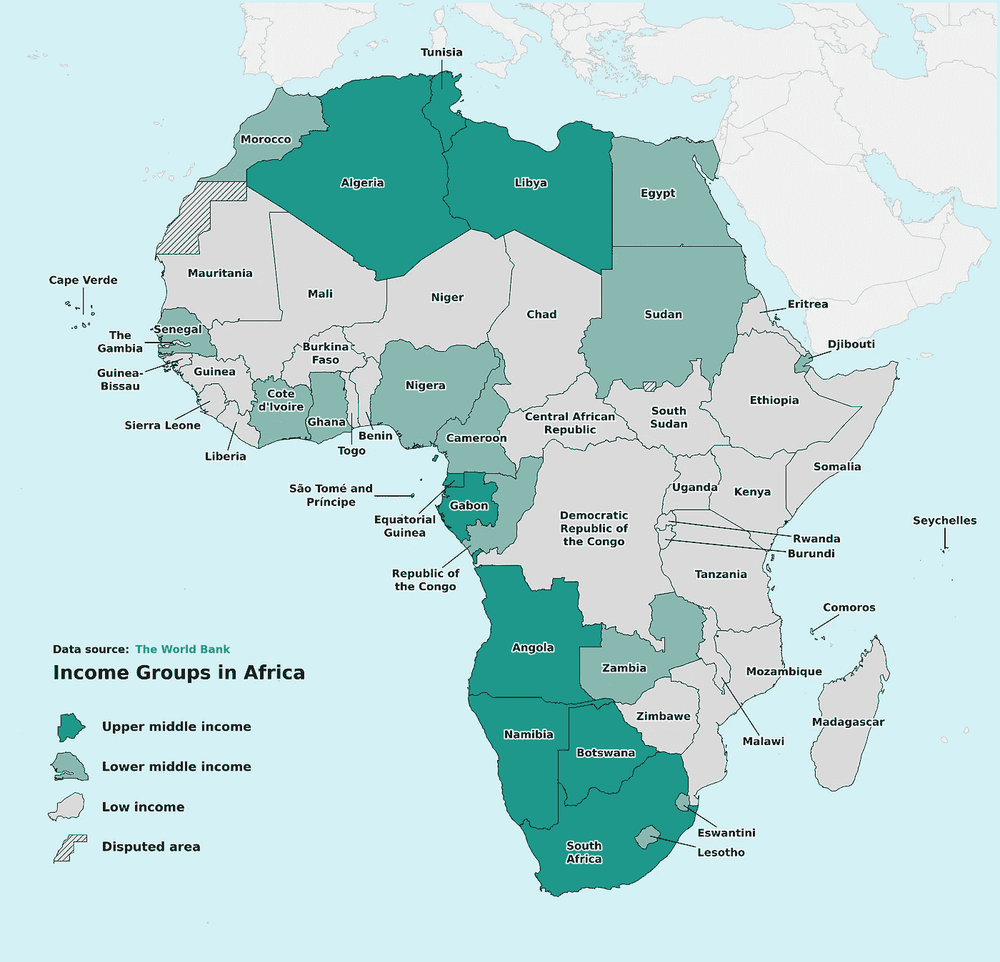

# Matplotlib 教程：让我们将你的国家地图提升到另一个层次

> 原文：[`towardsdatascience.com/matplotlib-tutorial-lets-take-your-country-maps-to-another-level-a6bd1f40fff?source=collection_archive---------3-----------------------#2023-09-24`](https://towardsdatascience.com/matplotlib-tutorial-lets-take-your-country-maps-to-another-level-a6bd1f40fff?source=collection_archive---------3-----------------------#2023-09-24)

## Matplotlib 教程

## 如何使用 Python 和 Matplotlib 绘制美丽的地图

 [Oscar Leo](https://medium.com/@oscarleo?source=post_page-----a6bd1f40fff--------------------------------)

·

[关注](https://medium.com/m/signin?actionUrl=https%3A%2F%2Fmedium.com%2F_%2Fsubscribe%2Fuser%2Fd7e5c1ca65b7&operation=register&redirect=https%3A%2F%2Ftowardsdatascience.com%2Fmatplotlib-tutorial-lets-take-your-country-maps-to-another-level-a6bd1f40fff&user=Oscar+Leo&userId=d7e5c1ca65b7&source=post_page-d7e5c1ca65b7----a6bd1f40fff---------------------post_header-----------) 发表在 [Towards Data Science](https://towardsdatascience.com/?source=post_page-----a6bd1f40fff--------------------------------) ·10 min 阅读·2023 年 9 月 24 日

--

由作者创建的地图

是的，我使用 Matplotlib 创建了上面的地图，我将在本教程中向你展示如何做。

这个想法是创建一个可重用且灵活的函数，让我可以立即绘制任何区域的美丽地图。

有了这样的函数，我在创建带有地理组件的图表或信息图时，可以节省大量时间。

我还想展示可重用代码的强大功能，因为许多从事数据可视化的程序员常常忽视这些最佳实践。

本教程包含创建上述非洲地图所需的每一行代码。

让我们开始吧。

## 步骤 1：下载地理数据

在开始教程之前，你需要做的唯一事情是从这里下载地理数据：

[`datacatalog.worldbank.org/search/dataset/0038272/World-Bank-Official-Boundaries`](https://datacatalog.worldbank.org/search/dataset/0038272/World-Bank-Official-Boundaries)

我使用的是名为 **World Boundaries GeoJSON — Very High Resolution** 的数据。
