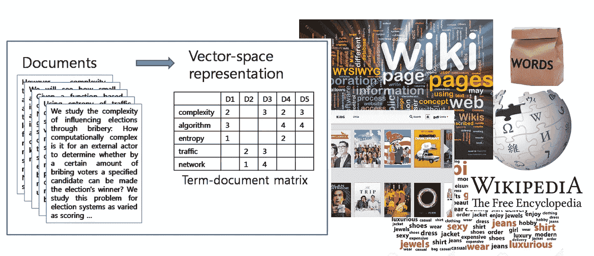

# 数据流中的矩阵近似

> 原文：[`towardsdatascience.com/matrix-approximation-in-data-streams-7585720e8671?source=collection_archive---------6-----------------------#2023-09-17`](https://towardsdatascience.com/matrix-approximation-in-data-streams-7585720e8671?source=collection_archive---------6-----------------------#2023-09-17)

## 在没有所有行的情况下进行矩阵近似

 [Mina Ghashami](https://medium.com/@mina.ghashami?source=post_page-----7585720e8671--------------------------------)

·

[关注](https://medium.com/m/signin?actionUrl=https%3A%2F%2Fmedium.com%2F_%2Fsubscribe%2Fuser%2Fc99ed9ed7b9a&operation=register&redirect=https%3A%2F%2Ftowardsdatascience.com%2Fmatrix-approximation-in-data-streams-7585720e8671&user=Mina+Ghashami&userId=c99ed9ed7b9a&source=post_page-c99ed9ed7b9a----7585720e8671---------------------post_header-----------) 发表在 [Towards Data Science](https://towardsdatascience.com/?source=post_page-----7585720e8671--------------------------------) ·13 min read·2023 年 9 月 17 日

--

图片来源：unsplash.com

矩阵近似是数据挖掘和机器学习中一个被广泛研究的子领域。大量的数据分析任务依赖于获得矩阵的*低秩近似*。例如，降维、异常检测、数据去噪、聚类和推荐系统。在这篇文章中，我们探讨了矩阵近似的问题，以及当整个数据不可用时如何进行计算！

本文内容部分摘自我在[斯坦福大学 CS246 课程](https://web.stanford.edu/class/cs246/)上的[讲座](https://web.stanford.edu/class/cs246/slides/17-matrix_sketching.pdf)。希望你觉得有用。完整内容请查看[这里](https://web.stanford.edu/class/cs246/slides/17-matrix_sketching.pdf)。

# 数据作为矩阵

大多数在网络上生成的数据可以表示为矩阵，其中矩阵的每一行都是一个数据点。例如，在路由器中，网络上发送的每一个数据包都是一个数据点，可以表示为一个包含所有数据点的矩阵中的一行。在零售中，每一笔购买都是一个包含所有交易的矩阵中的一行。

图 1：数据作为矩阵 — 作者提供的图像

与此同时，几乎所有在网络上生成的数据都是*流式的*；这意味着数据是由一个…
