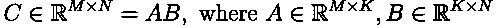
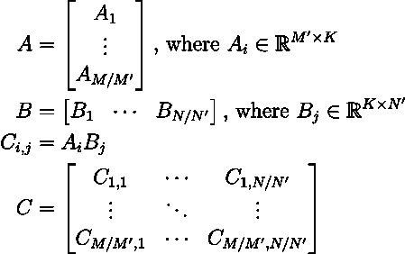
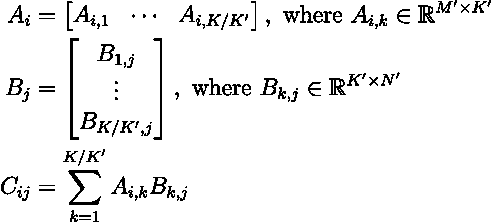
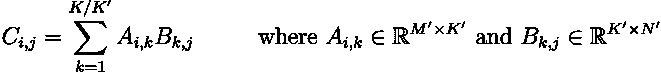
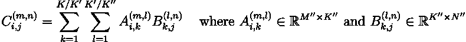
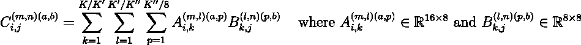
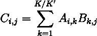
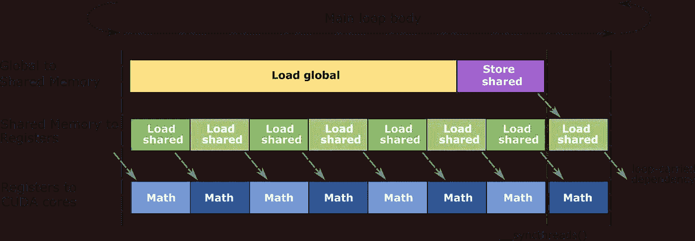

# GPU 上的矩阵乘法

> 原文：[`towardsdatascience.com/matrix-multiplication-on-the-gpu-e920e50207a8?source=collection_archive---------1-----------------------#2023-10-09`](https://towardsdatascience.com/matrix-multiplication-on-the-gpu-e920e50207a8?source=collection_archive---------1-----------------------#2023-10-09)

## 如何在 CUDA 中实现最先进的矩阵乘法性能。

 [Andy Lo](https://medium.com/@andylolu24?source=post_page-----e920e50207a8--------------------------------)

·

[关注](https://medium.com/m/signin?actionUrl=https%3A%2F%2Fmedium.com%2F_%2Fsubscribe%2Fuser%2F9b10f678560b&operation=register&redirect=https%3A%2F%2Ftowardsdatascience.com%2Fmatrix-multiplication-on-the-gpu-e920e50207a8&user=Andy+Lo&userId=9b10f678560b&source=post_page-9b10f678560b----e920e50207a8---------------------post_header-----------) 发表在 [Towards Data Science](https://towardsdatascience.com/?source=post_page-----e920e50207a8--------------------------------) ·10 分钟阅读·2023 年 10 月 9 日

--

“从矩阵乘法中汲取灵感的极简艺术，风格为 vaporwave” —— DALLE-2

这篇博客源于我突然意识到自己对矩阵乘法在 GPU 上如何运作知之甚少。做了这么多机器学习项目，我觉得我应该了解这个在机器学习中最重要的操作是如何工作的：什么是“张量核心”？为什么每个人都说“*数据移动是瓶颈*”？GPU 实际上能有多快？

为了回答这些问题，我决定必须走出我的 PyTorch 领域，**深入探索 CUDA 的深渊**。我写了这篇博客来记录我所学到的一切，希望读到这篇文章的任何人都不必像我一样经历挖掘 CUDA 文档/代码的痛苦。

如果我在这段旅程中学到了什么，那就是**并发矩阵乘法是困难的**。高效的矩阵乘法在很大程度上依赖于你使用的具体硬件和你尝试解决的问题规模。没有一刀切的解决方案。

够了，让我们深入了解吧！

# 回顾 GPU 架构

让我们回顾一下（NVIDIA）GPU 的工作原理。GPU 通过运行许多**线程**来实现并行处理。每个线程在一个 CUDA 核心上执行，但在某一时刻，只有一部分线程是活动的，因此可能有比可用的 CUDA 核心更多的线程。每个线程，无论是否活动，都有自己的**寄存器**。

一组 32 个线程称为**warp**。warp 中的所有线程必须一起执行（或一起处于非活动状态）。在大多数情况下，非活动 warp 的数量远多于活动 warp，而**warp 调度器**负责选择在特定时间执行哪些 warp。这使得 GPU 能够通过调度其他 warp 在 warp 等待数据时执行，从而隐藏内存访问的延迟。

一组 warp 称为**线程块**。所有线程块中的 warp 在同一个**流处理器**（SM）中执行。每个线程块有自己的**共享内存**，所有线程块中的线程都可以访问。

> **注意：较新的架构**
> 
> 从 Volta 架构开始，每个线程也有自己的程序计数器和调用栈等。这意味着 warp 中的每个线程可以同时执行不同的指令。
> 
> Volta 架构还引入了**Tensor Cores**，这些核心专门用于解决特定大小的矩阵乘法。每个活动 warp 可以访问一个 Tensor Core。
> 
> 在最新的 Hopper 架构中，引入了**线程块集群**的概念，它表示一组线程块。它使用户能够更细粒度地控制线程块的调度，并允许一个线程块的共享内存在同一集群中的其他线程块访问。

# 并行化矩阵乘法

假设我们想计算：

我们说在这种情况下问题的规模是(*M*, *N*, *K*)。为了并行化这个操作，我们可以将*A*和*B*拆分成更小的矩阵，分别进行矩阵乘法，然后将结果连接起来形成*C*。

具体来说，我们可以按行分割*A*（即，将*M*分成大小为*M’*的块）和按列分割*B*（即，将*N*分成大小为*N’*的块），得到：

我们可以看到*C*中的每个子矩阵彼此独立，因此我们可以轻松地并行计算每个子矩阵。

实际上，*K*可能过大，无法直接加载到内存中进行计算。相反，典型的实现也会将*K*分割成大小为*K’*的块，迭代每个块，并对部分结果进行累加（求和）。这被称为串行-*K*归约。（与*parallel-K reduction*相对，见下节）。从数学上看，这样表示：

> **注意：Padding**
> 
> 在任何问题大小不能被分区大小整除的情况下，我们需要添加**padding**。这通常在我们将分区输入（𝐴ᵢ,ₖ 和 𝐵ₖ,ⱼ）加载到低级内存时隐式完成，我们通过添加零确保加载的分区（𝐴ᵢ,ₖ的大小为 M’×K’，𝐵ₖ,ⱼ的大小为 K’×N’）总是“满”的。在将结果写回全局内存时需要特别小心，以避免越界错误。

从高层次看，**三层嵌套分区**用于在 GPU 上并行化矩阵乘法：

1. 第一次分区发生在**threadblock**级别。每个线程块负责计算*Cᵢ,ⱼ = Aᵢ Bⱼ*。

2. 第二次分区发生在**warp**级别。线程块级别的问题*Cᵢ,ⱼ* 进一步被分区，每个 warp 负责计算*Cᵢ,ⱼ⁽ᵐⁿ⁾ = Aᵢ⁽ᵐ⁾ Bⱼ⁽ⁿ⁾*。

3. 第三次分区发生在**instruction**级别。有些指令需要特定大小的输入。例如，第二代 Tensor Cores 操作大小为(16, 8, 8)的*fp16*问题，而在 CUDA 核心上通过标量乘法直接实现则仅操作大小为(1, 1, 1)的问题。因此，warp 级别的问题被进一步分区，使得每个块有适合指令的大小：*Cᵢ,ⱼ⁽ᵐⁿ⁾⁽ᵃᵇ⁾ = Aᵢ⁽ᵐ⁾⁽ᵃ⁾ Bⱼ⁽ⁿ⁾⁽ᵇ⁾*。

我们需要三个分区级别是有充分理由的，正如我们在下一节中将看到的。

# 数据冗余

矩阵乘法如果我们每次计算时都从全局内存重新获取数据，很容易变成内存瓶颈。关键观察是，许多子输入*Aᵢ*和*Bⱼ*在不同的子矩阵乘法中被重复使用。例如，*Aᵢ*需要用于*Cᵢ,₁ , Cᵢ,₂* , ... 和*Bⱼ*需要用于*C*₁*,ⱼ* , *C*₂*,ⱼ* , … 。如果我们能最小化冗余数据移动并尽可能多地重用加载的数据，就能获得最佳的吞吐量。

在 CUDA 中，有三种用户可访问的内存类型：

下面是每种内存类型如何使用的高级视图：

1.  每个线程块将首先**从全局内存加载其所需输入到共享内存中**。之后对这些数据的访问将由共享内存提供，而不是较慢的全局内存。

1.  在每个线程块中，每个 warp 将首先**从共享内存加载其所需输入到寄存器中**。随后对这些数据的访问将直接由快速寄存器提供。

# 深入细节

## 线程块级别

在线程块级别，问题被划分为大小为 (*M’*, *N’*, *K’*) 的子问题。因此，每个线程块负责计算 *C* 的一个片段，记作：

通过将子输入 *Aᵢ,ₖ* 和 *Bₖ,ⱼ* 加载到共享内存中来最小化冗余的数据移动。当我们完成 *Aᵢ,ₖ Bₖ,ⱼ* 的计算后，下一个块 (*Aᵢ,ₖ₊₁* 和 *Bₖ₊₁,ⱼ*) 将被加载。

## warp 级别

在 warp 级别，子问题进一步划分为大小为 (*M’’, N’’, K’’*) 的子子问题。因此，每个 *warp* 负责计算 *Cᵢ,ⱼ,* 记作 *Cᵢ,ⱼ⁽ᵐ ⁿ⁾*：

通过将子子输入 *Aᵢ,ₖ⁽ᵐ ˡ⁾* 和 *Bₖ,ⱼ⁽ˡ ⁿ⁾* 加载到**寄存器**中来最小化冗余的数据移动。任何对 *Aᵢ,ₖ⁽ᵐ ˡ⁾* 和 *Bₖ,ⱼ⁽ˡ ⁿ⁾* 的访问*在*warp 内将由快速寄存器提供服务。

> **注意：在寄存器之间分配数据**
> 
> 值得注意的是，寄存器是**线程级的**。这意味着寄存器中的输入不能被 warp 中的其他线程访问。如何将 Aᵢ,ₖ⁽ᵐ ˡ⁾ 和 Bₖ,ⱼ⁽ˡ ⁿ⁾ 分配到每个线程的寄存器中，取决于使用的具体指令。NVIDIA 文档中的 [Warp Level Matrix Multiply-Accumulate Instructions](https://docs.nvidia.com/cuda/parallel-thread-execution/index.html#warp-level-matrix-instructions) 对每条指令进行了详细描述。

## 张量核心级别

为了实际执行矩阵乘法，我们使用 GPU 上的**张量核心**。我的 GPU (RTX 2060) 具有第二代张量核心，专门解决大小为 (*M’’’, N’’’, K’’’*) = (16, 8, 8) 的 fp16 问题。因此，我们进一步将 *Cᵢ,ⱼ⁽ᵐ ⁿ⁾* 划分为符合指令预期大小的片段：

在这里，所有输入已经在寄存器中，因此数据移动开销最小。

> **注意：张量核心**
> 
> 张量核心操作是**warp 级指令**，意味着 warp 中的所有线程需要同时执行张量核心指令，协同准备要被**一个**张量核心消费的数据。

# 选择分区大小

所以，鉴于我们希望最小化数据移动，我们应该选择尽可能大的分区大小来利用所有的共享内存和寄存器，*对吗？* 其实并不是这样。

## 线程块分区大小

从渐近的角度来看，随着问题大小的增加，是的，我们确实希望尽可能使用更多的共享内存和寄存器。然而，对于小问题大小，我们可能会遇到两个问题：

1.  大的分区大小意味着我们将有更少的线程块。由于每个线程块只能在一个 SM 上执行，这可能意味着我们不能利用所有的 SM。

1.  对于不能被分区大小整除的问题大小，我们需要为输入添加更多的填充。这会降低效率，因为对有意义的输入计算较少。

典型的实现可能使用分区大小为 (*M’, N’, K’*) = (128, 256, 32)。

## Warp 分区大小

通常，较大的 warp 分区大小意味着会有更少的冗余数据移动，但代价是拥有更少的 warps。拥有过少的 warps 意味着我们将无法隐藏内存访问的延迟（因为当当前 warp 等待数据时，我们可能没有其他 warp 来调度）。

典型的实现可能使用分区大小为 (*M’’, N’’, K’’*) = (64, 64, 32)。

## 指令分区大小

这完全取决于你的 GPU 支持什么指令。对于我的 RTX 2060，fp16 Tensor Core 矩阵乘法（带有 fp16 累积）的 ptx 指令是 `mma.sync.aligned.m16n8k8.row.col.f16.f16.f16.f16`，它期望输入的大小为 (16, 8, 8)。

# 进一步优化

上述技术在问题规模较大时可以使我们接近 GPU 的理论峰值性能。然而，对于较小的问题规模，它们的效率不是很高。进一步提高矩阵乘法性能的两种常见技术是 **并行-K 减少** 和 **软件流水线**。

## 并行-K 减少

在 *M* 和 *N* 较小时，我们可能只有少量的线程块。例如，如果 (*M’, N’*) = (128, 256) 且原始问题规模具有 *M* ≤ 128 和 *N* ≤ 256，我们将只有一个线程块，因此我们只利用了 GPU 计算能力的一小部分！（例如，我的 RTX 2060 有 30 个 SM，因此为了最大化利用率，我们希望至少有 30 个线程块。）

在 *K* 较大（尽管 *M* 和 *N* 较小）的情况下，我们可以通过进行 **并行-*K* 减少** 来利用更多的并行性。回想一下，在串行-*K* 减少中，每个线程块遍历以下和： 

并将中间结果累积到 *Cᵢ,ⱼ*。在并行-*K* 减少中，我们将每个线程块分配为仅计算 *一个和的元素*（即 *Aᵢ,ₖ Bₖ,ⱼ*）。这使我们可以将线程块的数量增加 *K/K’* 倍，从而利用更多的 SMs。

需要注意的是，现在我们需要 *分配更多内存* 来存储每个线程块的结果，并且 *调用第二个内核* 来对部分结果进行最终的归约以获得 *Cᵢ,ⱼ*。

## 软件流水线

通常，CUDA 通过调度其他 warps 执行来隐藏内存访问的延迟，而当一个 warp 等待数据时。这要求我们拥有足够的 warps 来掩盖延迟。

然而，在进行 GEMM 时，warps 的数量通常相对较少。这是因为 warp 的数量受到“每个线程块的可用寄存器数除以每个 warp 需要的寄存器数”的限制。对于矩阵乘法，我们使用大量寄存器以最大化数据重用。因此，我们可能没有足够的 warps 来掩盖延迟。

> “累加器元素通常占用至少一半的线程总寄存器预算。” — CUTLASS 文档

为了缓解这一效果，我们可以使用**软件流水线**。本质上，我们可以（手动）使用特殊指令异步预加载下一个迭代的输入。在输入被加载的同时，我们可以继续在当前迭代上进行计算。其总结如下图所示：

来自[CUTLASS](https://github.com/NVIDIA/cutlass/blob/main/media/docs/efficient_gemm.md)的软件下载流水线

这得益于 GPU 的特性：它像任何现代 CPU 一样，可以在没有数据依赖关系的情况下流水化内存访问和算术操作。这被称为**指令级并行**。

# 矩阵乘法的实际应用

如果你想了解这些概念如何在实际实现中结合起来，可以查看我用 CUDA 从零开始训练 MNIST 的实现。在那里，我使用 CUDA 训练了一个多层感知器，并在隐藏层大小为 128 时实现了**比优化后的 PyTorch 快 6 倍**：

 [## GitHub - andylolu2/cuda-mnist

### 通过在 GitHub 上创建账户来参与 andylolu2/cuda-mnist 的开发。

[github.com](https://github.com/andylolu2/cuda-mnist?source=post_page-----e920e50207a8--------------------------------)

# 参考资料

1\. [CUTLASS 文档](https://github.com/NVIDIA/cutlass/blob/main/media/docs/)

2\. [CUDA 文档](https://docs.nvidia.com/cuda/cuda-c-programming-guide/index.html)

3\. [CUTLASS 示例](https://github.com/NVIDIA/cutlass/tree/main/examples)
