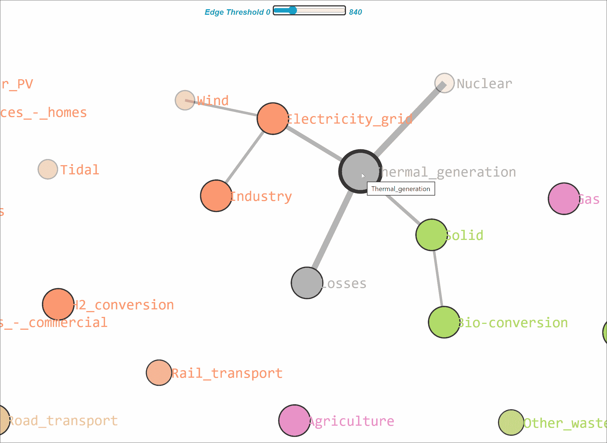
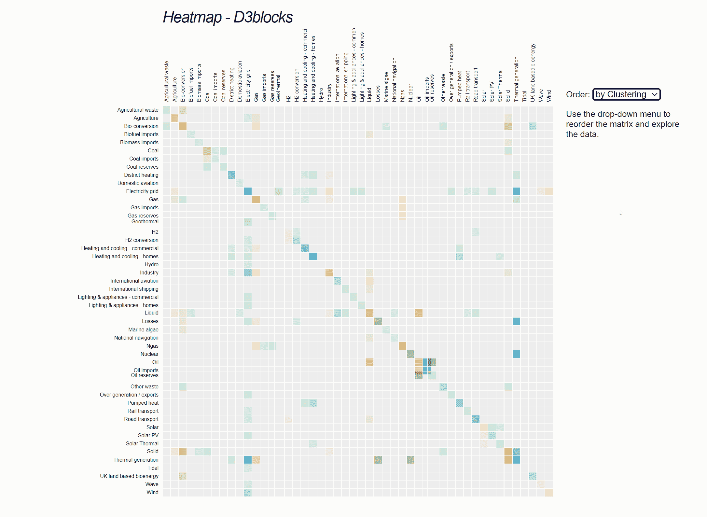
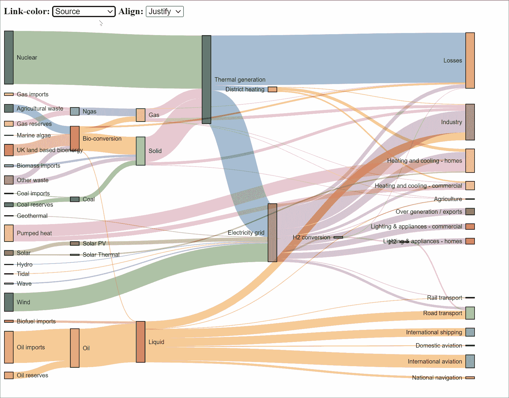
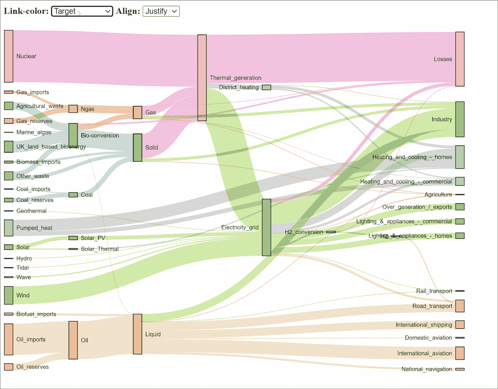

# 通过选择最佳图表：网络图、热图还是桑基图来最大化你的洞察力？

> 原文：[`towardsdatascience.com/maximize-your-insights-by-choosing-the-best-chart-network-heatmap-or-sankey-d9b4165d7f16`](https://towardsdatascience.com/maximize-your-insights-by-choosing-the-best-chart-network-heatmap-or-sankey-d9b4165d7f16)

## 美丽的可视化是很棒的，但为了最大化其可解释性，你需要仔细选择图表。

[](https://erdogant.medium.com/?source=post_page-----d9b4165d7f16--------------------------------)[](https://towardsdatascience.com/?source=post_page-----d9b4165d7f16--------------------------------) [Erdogan Taskesen](https://erdogant.medium.com/?source=post_page-----d9b4165d7f16--------------------------------)

·发表于 [Towards Data Science](https://towardsdatascience.com/?source=post_page-----d9b4165d7f16--------------------------------) ·阅读时间 9 分钟·2023 年 8 月 13 日

--


图片来源于 [David Pisnoy](https://unsplash.com/@davidpisnoy?utm_source=unsplash&utm_medium=referral&utm_content=creditCopyText) 在 [Unsplash](https://unsplash.com/photos/46juD4zY1XA?utm_source=unsplash&utm_medium=referral&utm_content=creditCopyText)

可视化是数据分析中的重要部分，因为它可以将数据转化为洞察力，并帮助你讲述故事。在这篇博客文章中，我将重点介绍网络图、热图和桑基图。这些图表使用相同的输入数据，但我们应该记住，它们是为特定目标设计的，因此其可解释性可能有所不同。 ***我将描述网络图、热图和桑基图之间的差异、应用，并通过实际示例展示它们的可解释性。*** 所有示例均使用 *D3Blocks library* 在 Python 中创建。

# 输入数据用于 ***热图和桑基图。***

作为数据科学家，一个常见但重要的任务就是制作图表。有时这些图表作为理智检查，有时它们会出现在演示文稿中，成为故事的基础。尤其是在后者的情况下，我们的目标是将复杂的信息转化为逻辑的图形可视化。

> 创建图表就像摄影一样。你想捕捉到讲述故事的风景。

然而，决定使用哪种图表并不总是容易的，因为尽管图表可能有类似的输入，但它们设计用于描述场景的特定部分。三个图表的输入需要 `***source***`***、*** `***target***`*** 和*** `***weight***` 信息。下面展示了一个小示例。它描述了变量（或节点）之间的连接及其强度。换句话说，Penny 与 Leonard 之间的连接强度为 5。第二个节点的名称再次是 Penny，它也与 Amy 连接，但强度略低，值为 3，依此类推。

```py
# Source node names
source = ['Penny', 'Penny', 'Amy', 'Bernadette', 'Bernadette', 'Sheldon', 'Sheldon', 'Sheldon', 'Rajesh']
# Target node names
target = ['Leonard', 'Amy', 'Bernadette', 'Rajesh', 'Howard', 'Howard', 'Leonard', 'Amy', 'Penny']
# Edge Weights
weight = [5, 3, 2, 2, 5, 2, 3, 5, 2]
```

节点即为 `source` 和 `target` 的联合名称集。边表示 `source` 和 `target` 之间的关系。图表可以处理有向或无向的源-目标值关系。`weight` 值描述了关系的强度。值得注意的是，*source-target-weight* 的值也可以是（稀疏）邻接矩阵的形式，其中列和索引是节点，值大于 0 的元素被认为是边。这种形式通常用于热力图的创建，但它本质上包含相同的信息。*在下一节中，我将描述这些信息如何转换为图表。*

```py
# Install d3blocks for the following examples
pip install d3blocks

# Install cluster evalation (required for the heatmaps)
pip install clusteval
```

```py
# Import
from d3blocks import D3Blocks
# Initialize
d3 = D3Blocks()
# Convert
adjmat = d3.vec2adjmat(source, target, weight)
# Print
print(adjmat)

# target      Amy  Bernadette  Howard  Leonard  Penny  Rajesh  Sheldon
# source
# Amy         0.0         2.0     0.0      0.0    0.0     0.0      0.0
# Bernadette  0.0         0.0     5.0      0.0    0.0     2.0      0.0
# Howard      0.0         0.0     0.0      0.0    0.0     0.0      0.0
# Leonard     0.0         0.0     0.0      0.0    0.0     0.0      0.0
# Penny       3.0         0.0     0.0      5.0    0.0     0.0      0.0
# Rajesh      0.0         0.0     0.0      0.0    2.0     0.0      0.0
# Sheldon     5.0         0.0     2.0      3.0    0.0     0.0      0.0
```

# 图表以不同的方式翻译数据。

*网络图、桑基图和热力图* 各有其特性，因此可以以不同的方式呈现相同的数据。简要总结如下：

+   ***网络图*** 直观地展示实体之间的关系，其中节点代表实体，边代表它们之间的关系。**优点**：这种图表适用于理解复杂的行为，并且你也需要知道（一些）实体之间的确切关系。**缺点** 是当数据集较大时，图表会变得混乱且难以阅读。然而，通过使用不同的布局或按权重拆分网络，它可以再次变得有效。有关如何使用交互功能的更多详细信息，请阅读以下博客 [1]。

[## 使用 Python 创建美观的独立交互式 D3 图表](https://towardsdatascience.com/creating-beautiful-stand-alone-interactive-d3-charts-with-python-804117cb95a7?source=post_page-----d9b4165d7f16--------------------------------)

### 应用于 D3 力导向网络图

[towardsdatascience.com](https://towardsdatascience.com/creating-beautiful-stand-alone-interactive-d3-charts-with-python-804117cb95a7?source=post_page-----d9b4165d7f16--------------------------------)

+   ***热力图*** 有效地可视化变量之间关系的强度或大小，其中值由（不同的）颜色表示。 **优点：** 这种类型的图表对识别具有多个变量的大数据集中的模式和趋势非常有用。当网络图变得复杂时，热力图可以提供结构化的见解。 **缺点：** 你很容易失去对个别关系的跟踪。然而，当你提供清晰的标签并对行和/或列进行聚类时，变量之间的关系可以更容易解读。

+   ***桑基图*** ***可以*** 直观地显示数据或资源在实体之间的流动，其中节点代表不同的阶段或实体，链接代表数据或资源在它们之间的流动。 **优点：** 对于理解复杂的过程或系统以及识别优化或改进的领域非常有用。 **缺点** 是当阶段或实体过多时可能会变得难以阅读。有关更多详细信息，请阅读以下博客[2]：

[](/hands-on-guide-to-create-beautiful-sankey-charts-in-d3js-with-python-8ddab43edb43?source=post_page-----d9b4165d7f16--------------------------------) ## 使用 Python 在 d3js 中创建美丽的桑基图的实践指南。

### 桑基图是一种出色的方法，通过查看个别项目在各状态之间的流动，可以发现最突出的贡献。

towardsdatascience.com

# 网络图、热力图和桑基图的应用

网络图、热力图和桑基图可以使用*D3Blocks 库*创建。有关 D3blocks 的更多详细信息，请参阅[3]：

[](/d3blocks-the-python-library-to-create-interactive-and-standalone-d3js-charts-3dda98ce97d4?source=post_page-----d9b4165d7f16--------------------------------) ## D3Blocks: 用于创建互动和独立的 D3js 图表的 Python 库

### 创建基于 d3 javascript（d3js）图形但可以用 Python 配置的交互式和独立图表。

towardsdatascience.com

网络图、热力图和桑基图的应用各不相同。***网络图***常用于可视化社交媒体网络，例如 Twitter 帖子或 Facebook，其中节点代表用户，边代表他们之间的关系。***热力图***用于许多数据点较多的应用场景，如股票价格、基因表达数据和气候数据等。***桑基图***用于可视化流量，例如客户旅程数据中不同阶段（例如，网站访问、注册、购买）。另一个例子是能源流动或供应链流动，涉及能源的不同来源和用途或供应链的不同阶段（例如，原材料、制造、分销）。

# 网络图、热力图和桑基图的实操比较

让我们加载*能源*数据集[4]，并比较这三种图表的可解释性。*能源数据集*包含 48 个节点和 68 个加权（无向）关系，我们可以可视化能源流动。你会发现网络图使理解角色之间的确切关系变得容易。另一方面，热力图展示了所有关系的整体视图，而桑基图则显示了角色之间的流动。例如，在这个数据集中，*John*似乎是一个重要的角色，在网络图中占据中心点，并且有许多流动进出。你可以使用以下代码块重现这些结果：

```py
# ######################
# Create network graph #
# ######################

# Load library
from d3blocks import D3Blocks
# Initialize
d3 = D3Blocks()
# Load energy data sets
df = d3.import_example(data='energy')

# Create the network graph
d3.d3graph(df, cmap='Set2')
# Extract the node colors from the network graph.
node_colors = d3.D3graph.node_properties
```



使用 D3Blocks 创建的 D3graph。交互式 HTML 版本可以在我的[Github 页面](http://erdogant.github.io\docs\medium\heatmap_StormofSwords.html)上查看。

热力图的聚类使用*clusteval 库[5]*创建。该库使用聚类评估指标，如*轮廓系数、DB 指数或 DBscan*，来确定最优的聚类切割点。默认值可以如代码部分所示进行更改。数据已进行 z-score 标准化。

```py
# ################
# Create Heatmap #
# ################

# Initialize
d3 = D3Blocks()
# Load Energy data sets
df = d3.import_example(data='energy')

# Create the default heatmap but do hide it. We will first adjust the colors based on the network colors.
d3.heatmap(df, showfig=False)

# Update the colors of the network graph to be consistent with the colors
for i, label in enumerate(d3.node_properties['label']):
    if node_colors.get(label) is not None:
        d3.node_properties['color'].iloc[i] = node_colors.get(label)['color']

# The colors in the dataframe are used in the chart.
print(d3.node_properties)

# Make the chart
d3.show(showfig=True, figsize=[600, 600], fontsize=8, scaler='zscore')

# You can make adjustments in the clustering:
d3.heatmap(df, cluster_params={'evaluate':'dbindex',
                               'metric':'hamming',
                               'linkage':'complete',
                               'normalize': False,
                               'min_clust': 3,
                               'max_clust': 15}) 
```



使用 D3Blocks 创建的热力图。交互式 HTML 版本可以在我的[Github 页面](http://erdogant.github.io\docs\medium\heatmap_StormofSwords.html)上查看。

```py
# ###############
# Create Sankey #
# ###############
# Initialize
d3 = D3Blocks()

# Create sankey graph
d3.sankey(df, showfig=True)
```



使用 D3Blocks 创建的桑基图。交互式 HTML 版本可以在我的[Github 页面](http://erdogant.github.io\docs\medium\heatmap_StormofSwords.html)上查看。*供应*在左侧，*需求*在右侧。链接显示了能源在被消耗或丢失之前是如何转换或传输的。

我们还可以调整节点的颜色以与其他图表匹配。

```py
# Initialize
d3 = D3Blocks(chart='Sankey', frame=True)
# Load data set
df = d3.import_example(data='energy')

# Set default node properties
d3.set_node_properties(df)

# Update the colors of the network graph to be consistent with the colors
for i, label in enumerate(d3.node_properties['label']):
    if node_colors.get(label) is not None:
        d3.node_properties['color'].iloc[i] = node_colors.get(label)['color']

# The colors in the dataframe are used in the chart.
print(d3.node_properties)
#   id                               label    color
#    0                  Agricultural_waste  #66c2a5
#    1                      Bio-conversion  #66c2a5
#    2                              Liquid  #e5c494
#    3                              Losses  #e78ac3
#    4                               Solid  #66c2a5
#    5                                 Gas  #fc8d62
#    ...

# Create edge properties
d3.set_edge_properties(df, color='target', opacity='target')
# Show the chart
d3.show()
```



使用 D3Blocks 创建的桑基图。节点颜色与其他两个图表匹配，边缘颜色自动设置。

# 通过交互式图表提高可解释性

使用交互式图表可以帮助增强解释和/或突出感兴趣的区域。一种方式是平移和缩放功能，这在 d3graph 图表中也得到了演示。另一种获得更多洞察的方法是使用自动创建的滑块根据边的强度来拆分网络。这使我们能更快地理解节点之间的关系。

# 使用堆叠方法构建你的故事

你可能已经从前面的部分注意到，没有一种最佳的图表适用于所有用例。通常，使用堆叠方法从不同的角度和/或深度描述数据是有益的。例如，你可以开始使用热力图来展示整体的弱关系和强关系。然后，选择一个感兴趣的集群或区域，使用网络图更深入地分析精确关系。最后，如果你现在需要描述节点之间的流动和依赖关系，可以使用 Sankey 图。

# 摘要

总之，选择正确的可视化技术对于有效洞察数据集至关重要。图表的选择取决于数据集的类型以及研究问题。在本博客中，我们比较了 3 种流行的可视化图表：*网络图、热力图和 Sankey 图*，并使用了实际示例。需要注意的是，创建图表是分析中的重要部分。如果你特别关注解释，故事情节可以更有效地传达给观众。

*保持安全。保持冷静。*

干杯，E.

*如果你觉得这篇文章有帮助，欢迎* [*关注我*](http://erdogant.medium.com/) *，因为我会写更多关于可视化技术的文章。如果你考虑订阅 Medium 会员，可以通过我的* [*推荐链接*](https://medium.com/@erdogant/membership)*支持我的工作。价格相当于一杯咖啡，但允许你每月无限制阅读文章！*

# 让我们联系吧！

+   [在 LinkedIn 上与我联系](https://www.linkedin.com/in/erdogant/)

+   [在 Github 上关注我](https://github.com/erdogant)

+   [在 Medium 上关注我](https://erdogant.medium.com/)

# 参考文献

1.  E. Taskesen, 使用 Python 创建美丽的独立交互式 D3 图表，Medium（Towards Data Science），2022 年 2 月

1.  E. Taskesen, 动手指南：用 Python 在 d3js 中创建美丽的 Sankey 图表，Medium（Towards Data Science），2022 年 10 月

1.  E. Taskesen, D3Blocks: 用于创建交互式和独立 D3js 图表的 Python 库，Medium（Towards Data Science），2022 年 9 月

1.  [能源与气候变化部](http://www.decc.gov.uk/en/content/cms/tackling/2050/calculator_on/calculator_on.aspx)，[汤姆·康塞尔](https://tamc.github.io/Sankey/)（[开放政府许可证 v3.0](https://www.nationalarchives.gov.uk/doc/open-government-licence/version/3/)）

1.  E. Taskesen, [从数据到聚类：你的聚类何时足够好？](https://medium.com/towards-data-science/from-data-to-clusters-when-is-your-clustering-good-enough-5895440a978a) Medium, 2023 年 4 月
