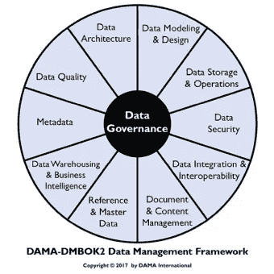
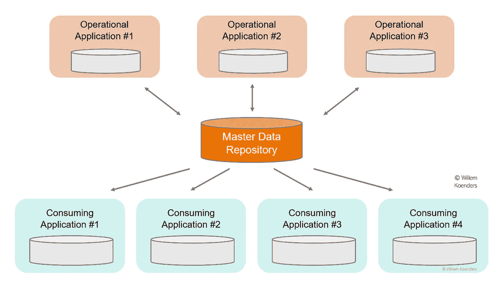
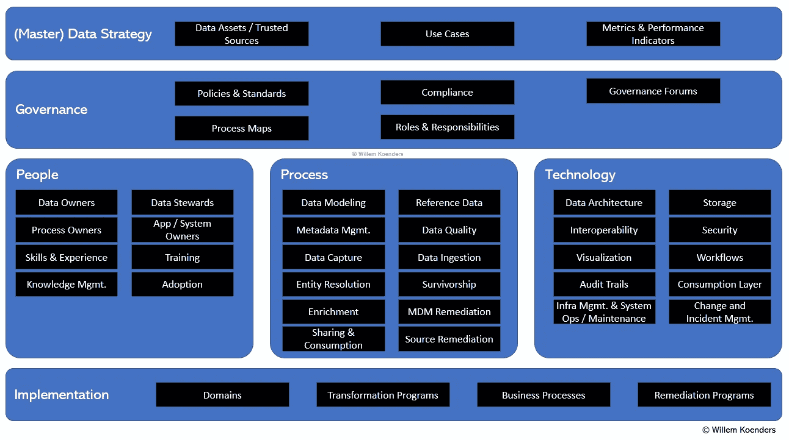
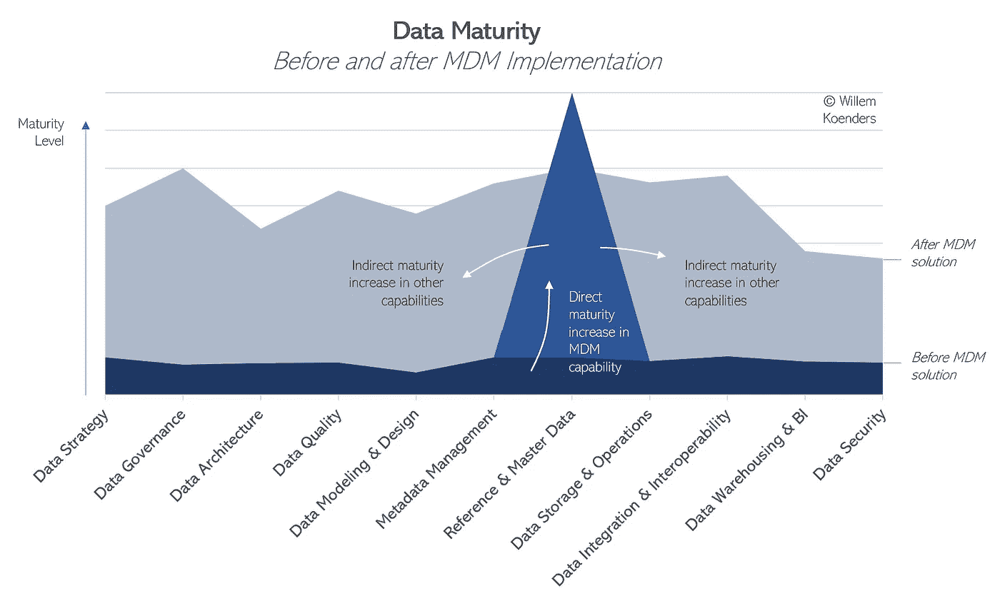

# **MDM**作为您数据治理之旅的起点

> 原文：[`towardsdatascience.com/mdm-as-the-launching-pad-for-your-data-governance-journey-ebb8ee13f64d?source=collection_archive---------4-----------------------#2023-05-25`](https://towardsdatascience.com/mdm-as-the-launching-pad-for-your-data-governance-journey-ebb8ee13f64d?source=collection_archive---------4-----------------------#2023-05-25)

## 企业级数据管理成熟度路线图

 [Willem Koenders](https://medium.com/@willemkoenders?source=post_page-----ebb8ee13f64d--------------------------------)

·

[关注](https://medium.com/m/signin?actionUrl=https%3A%2F%2Fmedium.com%2F_%2Fsubscribe%2Fuser%2Fa754b81446b6&operation=register&redirect=https%3A%2F%2Ftowardsdatascience.com%2Fmdm-as-the-launching-pad-for-your-data-governance-journey-ebb8ee13f64d&user=Willem+Koenders&userId=a754b81446b6&source=post_page-a754b81446b6----ebb8ee13f64d---------------------post_header-----------) 发布于 [Towards Data Science](https://towardsdatascience.com/?source=post_page-----ebb8ee13f64d--------------------------------) · 11 分钟阅读 · 2023 年 5 月 25 日

--

图片来源：[Joshua Sortino](https://unsplash.com/@sortino) 通过 [Unsplash](https://unsplash.com/)。

许多组织面临的一个问题是——如何开始数据治理这一复杂的旅程？

尽管数据管理的许多不同方面都可以作为起点，本文提出了将主数据管理（MDM）作为组织建立初步数据治理成熟度的基础。MDM 实施可以帮助你将一组核心数据治理学科整合在一起，将其应用于有限但具有影响力的范围，学习经验并设定标准，然后再在组织的其他部分进行扩展。

理论上，任何数据管理能力领域都可以成为数据治理之旅的起点。来源：[DAMA International](https://www.dama.org/cpages/dmbok-2-wheel-images)，根据 CC-BY-ND 许可。

这一观点将首先通过检查典型 MDM 实施的各个方面来实现，然后将 MDM 实施组件映射到标准数据管理框架中。案例研究将描述一家领先的保险公司如何使用 MDM 启动其整体数据治理之旅。

# 什么是 MDM，MDM 实施项目包括哪些内容？

主数据管理（“MDM”）是一种能力，确保在组织的系统、应用程序和流程中关键业务实体的数据准确且一致。MDM 对于提供主数据属性（如客户、产品、供应商或原材料数据）的单一、可靠的数据来源至关重要。（有关更详细的定义，请参见 [这里](https://medium.com/@willemkoenders/my-mdm-framework-4d2233f7e3f)。）

主数据管理的概念概述。

MDM 实施项目通常包括以下几个阶段：

1.  *策略、政策和标准*：描述了 MDM 解决方案和过程的预期成果，并明确了如何管理关键主数据的规则和期望。

1.  *发现和分析*：评估和理解组织内数据的当前状态，并识别需要管理的主数据实体。

1.  *数据治理框架*：定义了数据治理框架，包括数据管理员、数据所有者和数据治理论坛的角色和责任，以及将这些角色分配给“真实”的人员和团队，并动员治理论坛。

1.  *数据建模和映射*：创建数据模型，定义主数据实体之间的关系以及描述它们的属性，并将主数据映射到使用它的系统和应用程序。

1.  *数据集成*：数据集成是通过创建连接器从源系统中提取数据，将其转换为符合数据模型的格式，并将其加载到 MDM 平台中来构建的。同样，也会从 MDM 解决方案中建立数据流，以供消费过程和用例使用。

1.  *数据质量管理*：定义和执行数据质量规则、计算指标、建立报告，并确定解决数据质量问题的过程。这还可能包括实体解析和生存分析。

1.  *培训和变更管理*：为利益相关者提供培训，以确保他们了解 MDM 平台以及他们在数据治理框架中的角色和责任。建立变更管理过程，以管理对平台或框架的任何变更。

1.  *监控和维护*：在此阶段，建立持续改进的过程，包括数据质量监控和报告、数据治理审计，以及识别改进机会。可以遵循问题管理过程来记录和解决观察到的问题。

MDM 解决方案组件的示意图。

# 映射到标准数据管理框架能力

当然，实施 MDM 解决方案并使围绕它的过程实现操作化将提升参考和主数据的维度成熟度。然而，在上述描述的典型 MDM 实施程序的 8 个步骤中，也与更广泛的数据管理框架有关联。

实施 MDM 解决方案当然直接提升参考和主数据管理维度的成熟度。然而，如果从战略上使用，它还会提高其他数据管理能力的成熟度。

让我们明确描述这些连接，以准确识别如何在这些能力领域建立成熟度。

## 数据战略

+   如果 MDM 解决方案没有配套的更广泛战略来解释为什么掌握某些关键数据至关重要，它将无法驱动价值。如果已有数据战略，可以用来加强现有战略；如果没有，它实际上可以作为组织的首个明确的数据战略。

+   对于特定平台的实现，应该在程序开始前确定用例和消费过程，以确保将相关要求纳入其中。这可以将 MDM 解决方案转变为真正的数据产品，并使数据办公室能够开始管理数据产品组合和跟踪数据驱动的用例（以及价值创造！）。

## *数据治理*

+   在 MDM 解决方案及其掌握的数据周围，建立基础治理，包括通过定义一套政策和标准来概述 MDM 的一般期望，以及具体的角色和责任。这些可以增强现有的数据政策和标准，或者如果还不存在，形成第一版。

+   数据或领域所有者被指定为对主数据负责的责任方。可以确定数据管理员，他们被赋予了照看数据的责任（由数据所有者委托）。这包括确保数据适用性的责任，并可以使得创建更广泛的数据治理 RACI 矩阵成为可能，该矩阵可以在后续扩展到非 MDM 领域。因此，可以引入和定义主数据的数据治理角色，培养数据所有权和问责文化，然后将其在组织中推广，以确保数据治理实践的一致性。

+   定义了用于跟踪平台健康状况和使用情况的指标，并跟踪风险。这些指标可以形成第一组数据治理指标，之后可以进行扩展。如果目前还没有，可以召集一个论坛来监控这些指标并解决问题。该论坛可以扩展或为未来涵盖其他数据治理主题的新论坛提供灵感，从而推动治理实践中的关键数据成熟度。

## 架构

+   对于 MDM 平台本身，创建了解决方案和数据架构。这可以通过一套明确识别的架构标准来指导。可以建立最佳实践，即任何解决方案架构应受到适用数据标准的指导。实际的标准本身也可用于其他未来的转型倡议。

+   只有当平台成为组织交易中的可信来源时，MDM 才会创造价值。这不应是可选的——如果存在主数据，那么其消费对任何使用该数据的人来说应该是强制性的。这有助于建立更广泛的参考数据架构，其中的指导方针、原则、最佳实践和实施模式可以推动组织内部架构设计的稳健性和一致性，以及供应商和技术的合理化。

+   对于 MDM 解决方案，记录了数据从哪些来源获取，以及主数据如何提供给下游消费。记录的数据流和谱系可以作为捕捉更广泛组织数据景观的起点。

## 数据质量

+   MDM 的一个关键组成部分是测量和管理主数据的质量。如果没有受控（且量化的）质量，就无法建立信任，缺乏信任将导致采用困难。围绕业务规则识别、创建可执行的数据质量规则和编制数据质量指标的过程在任何未来的数据质量工作中都非常可重复使用。

+   如果使用了特定工具来测量数据质量，那么它可以在后续进行额外的扩展。同样，总结主数据数据质量的仪表板也可以很容易地扩展以包括非 MDM 数据的数据质量指标。

+   理想情况下，“设计中质量”这一概念应嵌入到 MDM 解决方案的架构中。即，数据捕捉、集成和转换的处理方式要尽可能保证数据质量。例如，对于国家字段，只允许出现相应 ISO 标准中的选项。这建立了一个模式、最佳实践和肌肉记忆，这对任何未来的现代化和转型努力同样适用。

+   创建了一个问题管理流程，以确保解决主数据中的问题。识别、跟踪和解决数据问题的相应过程可以扩展到其他数据领域。

## 建模与设计及元数据

+   如上所述，任何 MDM 解决方案都需要一个数据模型，以定义主数据实体之间的关系及其描述属性，并将主数据映射到使用它的系统和应用程序。为主数据（例如客户、产品）创建的概念模型和逻辑模型（以及[底层元模型](https://medium.com/towards-data-science/a-maturity-model-for-data-modeling-and-design-b516d978655c)）可以扩展到其他领域（例如财务、人力资源、供应链、交易）。

+   作为 MDM 的一部分，可以采用一种技术来设计和捕捉数据模型和元数据。这项技术以及使用它的过程，可以用于后续解决方案和领域的数据模型。

+   捕捉的数据模型和元数据越多，未来范围的增量工作就越少。例如，如果需要描述数据元素并捕捉元数据以用于客户入职过程，如果关键客户数据和相关业务需求已经在概念和逻辑层面上定义过，那么所需的时间会少得多。

## 数据存储与操作

+   在 MDM（主数据管理）程序中，考虑主数据的存储和操作需求至关重要。这一需求推动了数据存储最佳实践的实施以及数据操作标准的制定。作为这一部分，组织需要设计和实施一种最佳的数据存储策略，考虑因素包括数据量、速度、种类以及对可扩展性和弹性的需求。

+   为 MDM 开发的操作流程，包括数据备份、归档和恢复流程，可以作为其他数据管理领域类似流程的基础，从而为数据存储和操作的成熟度建设铺平道路。

## 集成与互操作性

+   MDM 本质上需要将来自不同来源的数据整合在一起，从而促进了集成和互操作性的坚实基础。为主数据在不同系统中的合并、去重和同步设置的程序可以作为未来数据集成计划的蓝图。

+   在 MDM 实施过程中建立数据标准、创建通用数据模型，并执行一致的数据格式，可以为系统之间的互操作性奠定基础。作为 MDM 过程的一部分建立的集成模式和实践可以在整个组织中重复使用，有助于建立成熟的集成和互操作性实践。

+   具体来说，有机会定义一套互操作性标准——例如，定义使用通用数据模型的数据并采用一组选定的 API 和 ETL 技术——这些标准可以在整个组织中更广泛地采用。

## 数据仓库与商业智能（BI）

+   实施良好的 MDM 程序可以确保输入数据仓库的数据是干净、一致和可靠的。它提供了进行有效报告和分析所需的唯一真实来源，从而为稳固的 BI 战略奠定基础。

+   在 MDM 过程中建立的数据质量规则、指标和流程可以用来维护数据仓库的完整性。此外，主数据的强大元数据管理可以推动高效的数据血缘追踪、影响分析以及对 BI 目的的数据理解。

## 数据安全

+   在实施 MDM 程序时，组织会建立并执行具体的数据访问、修改和删除安全政策。这些政策在组织内统一应用，使得对谁可以访问或操作主数据进行严格控制。

+   这为建立更全面的数据安全框架提供了机会。在设置解决方案的过程中，组织可以定义安全角色和职责，并制定加密、匿名化和伪匿名化敏感数据的协议，从而为更广泛的数据安全成熟度奠定初步基础。

# 案例研究：一家保险公司在 MDM 方面的历程

图片由 [Vlad Deep](https://unsplash.com/@vladdeep) 提供，通过 [Unsplash](https://unsplash.com/) 获取。

作为 MDM 如何推动更广泛成熟度的实际说明，我们来看一个涉及领先保险公司的案例研究。我有机会与这家公司合作，这家公司在其主要市场中市场份额排名前三。该公司启动了一个项目，旨在为其客户数据实施 MDM 解决方案。

在这个倡议中，我的角色是确保技术解决方案不仅被实施，而且在企业内真正实现。这包括建立正确的流程、记录这些流程、创建强大的数据模型、开发数据质量解决方案和仪表盘，以及一个元数据模型和基本的元数据管理流程。我们还识别并建立了关键角色，如数据拥有者、数据管理员和数据质量分析师。

在实际应用方面，这里的主数据主要针对公司的市场部门，使用案例包括客户细分和营销活动管理。在实施 MDM 之前，公司由于难以协调来自各种来源的客户数据，甚至无法实现基本的 360 度客户视图。

实施一年后，成功的业务影响已经显而易见。通过整合和可靠的客户数据视图，营销团队能够判断一个与某个业务线有互动的客户是否也拥有其他业务线的产品。这促成了更深层次的数据驱动客户细分，取代了之前基于规则的分析。新获取的数据使得预测建模成为可能，从而确定“下一步最佳行动”，并使营销活动能够在更具个性化的层面上启动。

一个意外但重要的好处是联系数据（如电子邮件地址、电话号码和实际地址）的管理得到改善。通过将来自各种输入渠道（如呼叫中心、实体分支机构或客户电子邮件）的更新整合到 MDM 解决方案中，所有使用这些信息的人员都能获取到最新的详细信息。因此，通过书面营销材料或电话联系到目标受众的成功率提高了超过 20%。根据团队的估计，他们在营销活动上的投资回报率提高了多达 50%。

# 结论

MDM 可以作为组织数据治理之旅的强大起点。它提供了一种全面的方法来建立一个可靠的关键业务实体信息源，构建一个强大的数据治理框架，并推动各项数据管理能力的成熟。通过将特定领域的 MDM 作为一个可管理的范围，组织可以引入关键数据治理概念，在受控环境中测试这些概念，并逐步扩展到整个组织。

# 参考文献和进一步阅读建议

+   [*什么是主数据管理（MDM）？*](https://www.informatica.com/resources/articles/what-is-master-data-management.html#:~:text=Master%20data%20management%20(MDM)%20involves,becoming%20a%20consistent%2C%20reliable%20source.), Informatica。

+   [*我的 MDM 框架*](https://medium.com/@willemkoenders/my-mdm-framework-4d2233f7e3f), Medium。

+   [*实践中的主数据管理：实现真正的客户 MDM*](https://www.wiley.com/en-us/Master+Data+Management+in+Practice:+Achieving+True+Customer+MDM-p-9780470910559), Dalton Cervo 和 Mark Allen。

+   [*数据产品有什么大不了的？*](https://medium.com/@willemkoenders/whats-the-big-deal-about-data-products-26ac347b7d7a), Medium。

+   [*智能数据治理设计 — 一个实际示例*](https://medium.com/@willemkoenders/intelligent-data-governance-by-design-a-practical-example-30f2bbf1bf91), Medium。

除非另有说明，所有图片均由作者提供。
