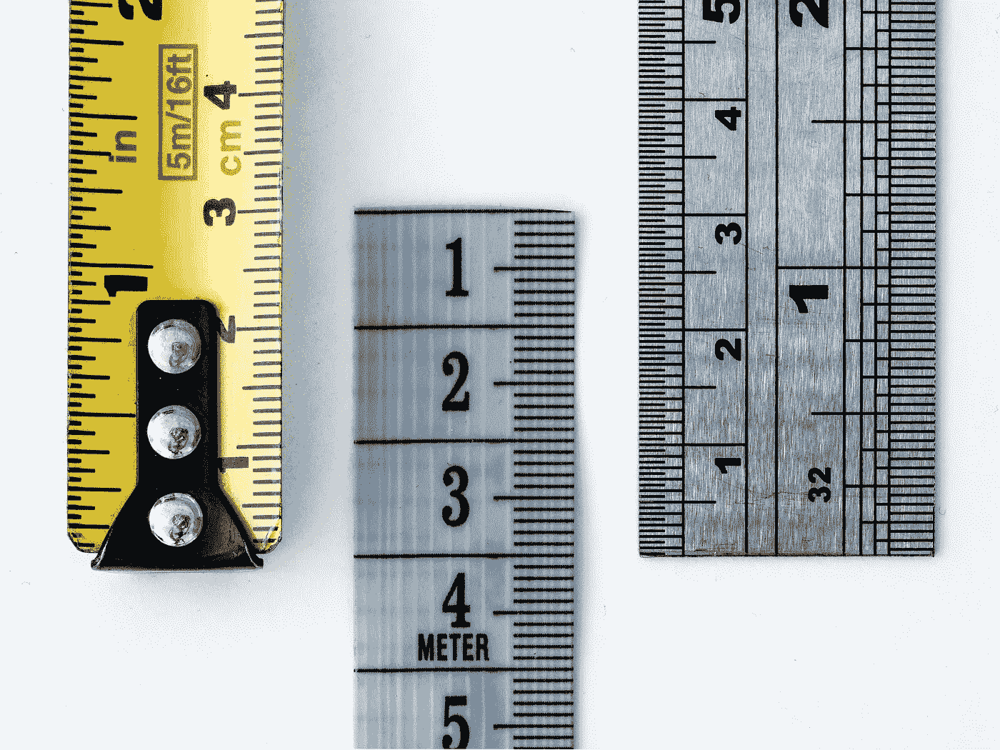
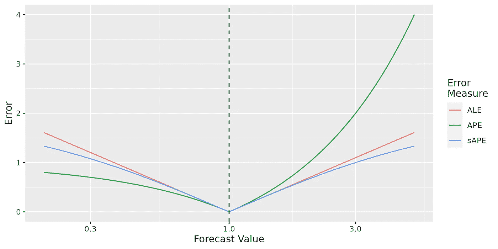

# 平均绝对对数误差（MALE）：一种更好的“相对”性能指标

> 原文：[`towardsdatascience.com/mean-absolute-log-error-male-a-better-relative-performance-metric-a8fd17bc5f75?source=collection_archive---------3-----------------------#2023-01-18`](https://towardsdatascience.com/mean-absolute-log-error-male-a-better-relative-performance-metric-a8fd17bc5f75?source=collection_archive---------3-----------------------#2023-01-18)

## 介绍“相对”性能指标的 MAE 和 MSE

[](https://medium.com/@chrismcdonald1?source=post_page-----a8fd17bc5f75--------------------------------)[](https://towardsdatascience.com/?source=post_page-----a8fd17bc5f75--------------------------------) [Christopher McDonald](https://medium.com/@chrismcdonald1?source=post_page-----a8fd17bc5f75--------------------------------)

·

[关注](https://medium.com/m/signin?actionUrl=https%3A%2F%2Fmedium.com%2F_%2Fsubscribe%2Fuser%2Fafe20c406abe&operation=register&redirect=https%3A%2F%2Ftowardsdatascience.com%2Fmean-absolute-log-error-male-a-better-relative-performance-metric-a8fd17bc5f75&user=Christopher+McDonald&userId=afe20c406abe&source=post_page-afe20c406abe----a8fd17bc5f75---------------------post_header-----------) 发表在 [Towards Data Science](https://towardsdatascience.com/?source=post_page-----a8fd17bc5f75--------------------------------) ·11 分钟阅读·2023 年 1 月 18 日[](https://medium.com/m/signin?actionUrl=https%3A%2F%2Fmedium.com%2F_%2Fvote%2Ftowards-data-science%2Fa8fd17bc5f75&operation=register&redirect=https%3A%2F%2Ftowardsdatascience.com%2Fmean-absolute-log-error-male-a-better-relative-performance-metric-a8fd17bc5f75&user=Christopher+McDonald&userId=afe20c406abe&source=-----a8fd17bc5f75---------------------clap_footer-----------)

--

[](https://medium.com/m/signin?actionUrl=https%3A%2F%2Fmedium.com%2F_%2Fbookmark%2Fp%2Fa8fd17bc5f75&operation=register&redirect=https%3A%2F%2Ftowardsdatascience.com%2Fmean-absolute-log-error-male-a-better-relative-performance-metric-a8fd17bc5f75&source=-----a8fd17bc5f75---------------------bookmark_footer-----------)

图片来源：[William Warby](https://unsplash.com/@wwarby?utm_source=medium&utm_medium=referral) 在 [Unsplash](https://unsplash.com/?utm_source=medium&utm_medium=referral)。

在预测领域，以及更广泛的机器学习和统计学领域中，性能指标扮演着至关重要的角色。

它们在模型拟合、超参数调优和模型选择过程中被使用，以找到最佳的模型；同时也用于理解和解释模型如何在绝对术语上预测未来。

在这篇文章中，我的目的是说服你，对于许多预测¹问题，你应该使用均值绝对对数误差（MALE）或紧密相关的均方根对数误差（RMSLE）来衡量模型性能。

就像 MAE 和 RMSE 使用预测值与真实值之间的“原始”距离一样，MALE 和 RMSLE 使用“相对”（对数）距离；你可以将 MALE 和 RMSLE 视为“相对”指标的 MAE 和 RMSE。

事实上，我有信心可以说服你，这些指标不仅是最佳选择，而且在许多情况下是*显而易见*的选择。

在解释原因之前，让我们快速回顾一下性能指标解决了什么问题，以及现有指标的不足之处。

# 问题

## 错误度量和性能指标

首先，让我们区分两个密切相关的概念：错误度量和性能指标。

*错误度量*（或称*错误*）告诉你预测值*f*与观测值*y*的“距离”有多远。例如，“原始”错误 RE = f — y 和百分比误差 PE = (f — y) / y。

相比之下，*性能指标*（或称*指标*）使用错误度量来告诉你某个模型（或一组预测）的整体表现如何。一个例子是 MSE，它计算数据集中所有点的“原始”误差的平方均值：

## 它们有什么用处？

错误度量和性能指标在模型拟合过程中作为模型损失函数的一部分使用；在模型调整过程中，用于选择合适的超参数；以及在模型选择过程中，用于选择最佳的模型类型。它们在决定最终模型时扮演重要角色，因此确保它们能捕捉到你关心的内容非常重要。

当试图理解和解释模型的表现时，它们也会被使用：例如在“我们可以以平均 15%的误差预测下一季度的销售额”这样的陈述中。因此，它们也需要具备可解释性。

到目前为止，都是显而易见的（希望如此）。这些概念稍后会派上用场。

## 严格为正的数据和相对误差

正如我将在另一篇文章中讨论的（敬请期待！），不同的预测指标在不同的情况下是合适的。

例如，如果你关注的是百分比误差（并且你的数据严格为正），那么“相对”指标如 MAPE 或 sMAPE 通常被推荐；如果你关注的是以实际单位（例如苹果数量）衡量的误差，或者你的数据可以为零或负数，那么“原始”指标如 MAE 或 MSE 更为合适。

如果你想比较或聚合时间序列中的性能指标，那么你可能需要使用标准化指标[1]。

在这篇文章中，我将专注于某种特定问题的指标。具体来说，问题是：

1.  数据是*严格为正*的：它们不取零或负值。

1.  预测者（即你！）关心的是*相对*误差而非*原始*误差²。

虽然许多预测问题属于这种类型，但并非所有问题都如此——选择适合你问题的指标非常重要。

# 当前解决方案

## 预测者使用什么误差？

Gneiting [2] 发现，到 2000 年代中期，平均绝对百分比误差（MAPE）是商业和组织中最广泛使用的预测准确性度量。

查看流行的统计预测包，例如 R 中的 “[fable](https://fabletools.tidyverts.org/reference/index.html#section-accuracy-evaluation)” 包，或 Python 中的 “[gluonts](https://ts.gluon.ai/v0.11.x/api/gluonts/gluonts.evaluation.metrics.html?highlight=metrics#module-gluonts.evaluation.metrics)” 包，表明 MAPE（及其相关的 sMAPE）仍然是实际预测应用中使用的主要“相对”性能指标。

MAPE 之所以受欢迎，是因为它能够处理尺度随时间变化的数据；它在时间序列之间具有相对的可比性；对异常值的处理相对较好；并且具有简单的解释。

然而，MAPE 和 sMAPE 存在问题——让我们看看它们是什么。

## MAPE 的问题

MAPE 的问题是什么？

正如其名称所示，MAPE 使用 *百分比误差* 作为其误差度量：

这种误差度量以惩罚高估比低估更著名。

作为一个极端的例子，如果你高估观察值 10 倍，你会得到一个绝对百分比误差（APE = |PE|）为 9；而如果你低估它 10 倍，你得到的 APE 仅为 0.9——仅为误差的 1/10！

在更现实的情况下，这是一个较小的问题（但仍然是一个问题），即你的预测更接近实际情况。

另一种看待 PE 问题的方法是，低估的误差被压缩到 -1 到 0 的范围内（即 -100% 到 0%），而高估的误差可以取任何从 0 到无穷大的值。

## sMAPE 的问题

解决这个低估问题的提议是对称 MAPE（sMAPE），它使用“对称百分比误差”作为误差度量：

sPE *压缩* 高估的误差，使其与低估的误差处于相同的尺度；这意味着低估和高估会受到同样严格的惩罚。

但虽然 sMAPE 成功解决了“低估”问题，但它也带来了另外两个问题³：

1.  这个指标现在更难以解释。

1.  由于 sPE 错误是有界的，它不会告诉你数据中的极端异常值。（这可以是一个特性或缺陷，取决于你的观点。）

## （次）最优模型

最后，让我们稍微考虑一下 MAPE 和 sMAPE *优化的是什么*。

作为提醒，当你使用 MAE 或 MSE 优化模型时，你的模型最终会预测分布的中位数或均值。（前提是你有足够的数据和足够好的模型。）

相反，当你为 MAPE 或 sMAPE 进行优化时，你的模型最终预测的……并没有什么特别的东西。

也就是说，模型最终预测的量将取决于目标 *y* 的分布，但它通常不会是分布的均值或中位数。

这种行为并不特别好。我们能做得更好吗？

# 对数误差

## 更好的误差度量…

我们已经看到，MAPE 和 sMAPE 的问题来自于它们的*误差度量*——百分比误差（PE）和对称百分比误差（sPE）。

我们能找到一种更好的方法来测量预测 *f* 和观测值 *y* 之间的相对误差吗？（也许类似于 MAE 和 MSE 使用的“原始”误差 *f* — *y*？）

我的解决方案⁵是*对数误差*（LE）：

简而言之，它是预测值和观测值对数之间的差异⁶——或者等效地，预测值和观测值之间比例的对数⁷。它与百分比误差紧密相关：LE = log(1 + PE)。

这种误差度量具有许多优良属性：

+   如果且仅如果预测完全正确（*f* = *y*），它才为零。

+   低估和高估受到同等严厉的惩罚：例如，低估 *y* 2 倍的绝对对数误差（ALE = |LE|）与高估 *y* 2 倍的误差是一样的。

+   错误相加⁸：在数学中，LE(*x*, *y*) + LE(*y*, *z*) = LE(*x*, *z*)。这使得 LE 不同于 PE 和 sPE，使其看起来像是 MSE 和 MAE 使用的“原始”误差度量。

一种思考 LE 的方式是，它通过使用对数变换将误差低估*拉伸*，并将误差高估*压缩*到完整的实数线上（-∞，∞）。

另一种思考它的方式是作为*对数尺度*上的*原始误差*——即只是预测值和观测值之间在数据对数上的原始距离。

正如我稍后将解释的，它与 MAE 和 MSE 使用的“原始”误差度量非常相似。

## …导致更好的指标

现在我们有了一个更好的相对误差度量，让我们回到我们真正感兴趣的内容：性能指标。

对于 MAPE 或 sMAPE，为了从我们的误差度量中获得一个指标，我们取其绝对值在所有数据点上的均值：

结果是*均方绝对对数误差*度量，简称“MALE”。

另外，我们可以使用 LE 的平方来得到*均方根对数误差*（RMSLE）：

与 MALE 相比，这一度量对离群值更为敏感。

这些指标相比其他“相对”指标具有一些优势，我将在下面讨论。

## 它们估计的是什么

当你优化 MALE 时，你会得到预测你分布中位数的模型。

（或者更正式一点：在 MALE 损失下，贝叶斯估计器是中位数。）

当你使用“平方误差”版本（RMSLE）时，你会得到预测数据几何均值的模型。

这与 MAPE 和 sMAPE 相对，它们通常存在偏差。

## 可解释性

为了将 MALE 度量转换成你的老板能理解的东西，你可以通过取指数来将其转换回相对尺度，即：

这给出了 *(几何) 平均相对误差*。例如，EMALE 为 1.2 意味着你期望平均上在任一方向上错误因子为 1.2。（向你的老板解释为 20% 平均百分比误差。）

这是对 sMAPE 的改进，sMAPE 没有直接解释，而 MAPE 尽管技术上简单，但可能有点误导⁹。

你可以对 RMSLE 使用相同的技巧：

像 RMSE 一样，这不能直接解释，但它给出了你误差在相对术语中的大小感。

## 实证证据

尽管关于哪个指标在“实际环境”中表现更好的实证证据较弱，但现有的证据略微表明 MALE 和 RMSLE 至少与 sMAPE 在实际中表现相当。

例如，Tofallis [3] 显示 RMSLE 指标

1.  在几个示例数据集上，比 MAPE 拟合效果更好。（这并不意外。）

1.  在使用模拟数据的模型选择任务中表现优于 MAPE 和 sMAPE。

Koutsandreas 等人 [4] 没有发现不同指标（包括 MALE 但不包括 RMSLE）在模型选择中的性能差异。但他们发现的小差异支持了 MALE 指标倾向于选择准确模型的说法。

## 简单性

MALE 和 RMSLE 易于理解、记忆和编码——甚至比 MAPE 或 sMAPE 更简单。例如，在 Python 中：

```py
male = mean(abs(log(f / y)))
rmsle = sqrt(mean(log(f / y)**2))
```

# MALE 与其他指标的比较

## MAE 和 MSE

如果你一直在关注，你可能已经注意到 MAE / MSE 和 MALE / RMSLE 之间的一些相似之处。

实际上，这两组指标之间有密切的联系：具体来说，优化 MALE（或 RMSLE）等同于在数据的对数上优化 MAE（或 MSE）。

也许这很明显，但让我们明确看一下 MAE：

实际上，你可以将 MAE 和 MALE 视为同一家族的指标：唯一的区别是 MAE 使用预测值和观察值之间的原始距离，而 MALE 使用相对（对数）距离。

这意味着什么？

一个含义是，对于在训练过程中使用 MSE（或 MAE）作为损失函数的模型，你可以通过在训练之前对数据取对数来优化 RMSLE（或 MALE）¹⁰。

（只要记得之后转换回原始尺度！）

## MAPE 和 sMAPE

绝对百分比误差（APE）、对称绝对百分比误差（sAPE）和绝对对数误差（ALE）在预测值接近真实值时是相似的，如下图所示：



绝对百分比误差（APE）、对称绝对百分比误差（sAPE）和绝对对数误差（ALE）的比较，观察值为 y = 1。图片来源于作者。

所以实际上，只要你的误差足够小（例如，少于 10%），使用 MALE、sMAPE 还是 MAPE 可能没有太大区别。

ALE 在对异常值的敏感性上介于 APE 和 sAPE 之间。例如，与错估 +10 倍相比，错估 +100 倍会使你的原始 sAPE 增加 1.2 倍，原始 ALE 增加 2 倍，原始 APE 增加 9 倍。

## 缩放指标

由于 MALE 和 RMSLE 是相对单位（而不是实际单位），它们可以用于比较模型在时间序列中的表现，或在不同时间序列之间汇总性能指标。（就像其他相对指标一样。）

当噪声的水平（相对而言）在不同时间序列之间相似时，这种方法效果很好。但如果，例如，你的一些序列非常嘈杂/难以预测，而其他序列则不那么困难怎么办？

在这种情况下，你可以通过基准方法的误差（例如，天真的或季节性天真的方法）来[规范化](https://otexts.com/fpp3/accuracy.html#scaled-errors)你的误差，以将它们放在相同的尺度上 [1]。

例如，给定时间*t* = 1, 2, …, *T* 的训练数据，时间 *T + h* 的预测的 *scaled* 对数误差（SLE）为

均值绝对缩放对数误差为

# 总结

在这篇文章中，我论证了对于某些预测问题，你应该使用对数误差（LE）来衡量预测误差，而不是“原始”或百分比误差。这意味着使用基于 LE 的指标来衡量模型性能：具体来说是均值绝对对数误差（MALE）和均方根对数误差（RMSLE）。

这些指标仅应在数据严格为正且你对相对（百分比）度量的准确性感兴趣时使用。在这种情况下，它们有以下好处：

1.  它们具有明确且简单的解释。

1.  优化这些指标会产生中位数（MALE）或几何平均数（RMSLE）的估计值。

1.  它们可以在不同时间序列之间轻松比较和汇总。

1.  它们避免了均值绝对百分比误差（MAPE）和对称均值绝对百分比误差（sMAPE）的著名问题。

MALE 和 RMSLE 可以被视为“相对”性能指标的 MAE 和 RMSE。我认为，如果你有兴趣以相对方式衡量误差，它们应该是默认选择。

我说服你了吗？为什么/为什么没有？在评论中告诉我。

## 参考文献

[1] R. Hyndman 和 A. Koehler, [预测准确性测量的另一种看法](https://doi.org/10.1016/j.ijforecast.2006.03.001) (2006), 国际预测学期刊 22(4)。

[2] T. Gneiting, [制作和评估点预测](https://doi.org/10.1198/jasa.2011.r10138) (2011), 美国统计协会期刊 106(494)。

[3] C. Tofallis, [一种更好的相对预测准确性测量方法用于模型选择和模型估计](https://doi.org/10.1057/jors.2014.103) (2015), 运营研究学会期刊 66(8)。

[4] D. Koutsandreas, S. Evangelos, P. Fotios 和 A. Vassilios, [关于预测准确性度量的选择](https://doi.org/10.1080/01605682.2021.1892464)（2022），《运筹学会期刊》73(5)。

## 脚注

1.  我主要关注预测领域——因为这里似乎是“相对”误差度量目前最常用的地方——但相同的论点适用于其他机器学习领域。

1.  相对误差仅在讨论严格正的数据时才有意义。

1.  值得注意的是，通常这些问题并不太严重，sMAPE 已经在实际应用中成功使用。

1.  更准确地说，这对于这个损失函数来说是最佳预测器（“贝叶斯估计量”）。

1.  这个误差度量已被 Tofallis [3] 和 [其他人](https://doi.org/10.1002/2017SW001669) 讨论；我认为这个想法足够明显，很多人一定已经想到并使用了它。

1.  对数中可以使用任何底数；在这里我假设使用的是底数 *e*，即自然对数。

1.  因此，这也被称为“对数准确性比”。我更喜欢称之为“对数误差”，因为这样更简洁，并且明确它是一个误差度量。

1.  这个属性并不严格用于误差测量，但它是一个很好的特性。

1.  特别是，+20% 的百分比误差意味着你的误差因子是 1.2，而 -20% 的百分比误差意味着你的误差因子是 1.25（1 / 0.8）。这种不对称性容易造成混淆。

1.  你可能会想，如果使用这些新度量与在数据对数上使用 MAE / RMSE 相当，那么定义和命名这些新度量的意义何在。在我看来，明确地定义和命名这些度量可以帮助你更清楚地理解在处理对数尺度数据时优化的内容，并且更易于沟通。（说“我优化了 / 评估了 MALE”比“我优化了 / 评估了数据对数上的 MAE”更简洁且不容易混淆。）
