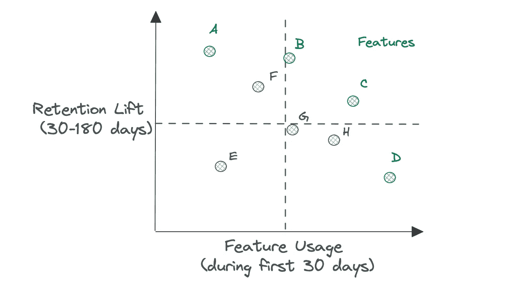
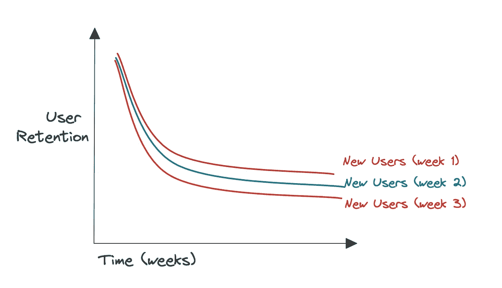
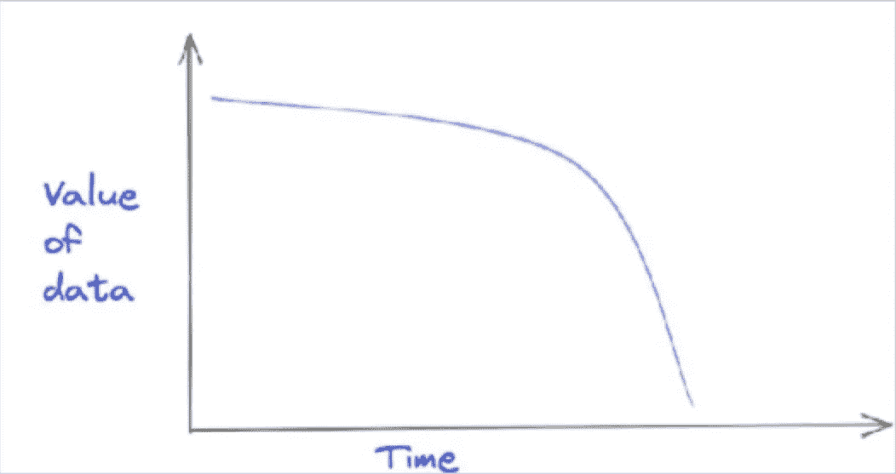

# 有意义的实验：5 个有影响力的数据项目，帮助打造更好的产品

> 原文：[`towardsdatascience.com/meaningful-experimentation-5-impactful-data-projects-to-help-build-better-products-1fb84afdfb2?source=collection_archive---------19-----------------------#2023-01-06`](https://towardsdatascience.com/meaningful-experimentation-5-impactful-data-projects-to-help-build-better-products-1fb84afdfb2?source=collection_archive---------19-----------------------#2023-01-06)

## *实际数据领导者系列的第二部分，介绍如何与各部门及其所有奇特特性进行最佳合作*

 [shane murray](https://medium.com/@shane.murray5?source=post_page-----1fb84afdfb2--------------------------------)

·

[关注](https://medium.com/m/signin?actionUrl=https%3A%2F%2Fmedium.com%2F_%2Fsubscribe%2Fuser%2F8aa0d9ae3ebd&operation=register&redirect=https%3A%2F%2Ftowardsdatascience.com%2Fmeaningful-experimentation-5-impactful-data-projects-to-help-build-better-products-1fb84afdfb2&user=shane+murray&userId=8aa0d9ae3ebd&source=post_page-8aa0d9ae3ebd----1fb84afdfb2---------------------post_header-----------) 发表在 [Towards Data Science](https://towardsdatascience.com/?source=post_page-----1fb84afdfb2--------------------------------) ·14 分钟阅读·2023 年 1 月 6 日 

--

图片由 Shane Murray 提供。

理解并与每个业务领域独特的激励机制和工作流程对齐，这才是让数据团队不仅高效而且卓越的关键。

[本系列的第一部分](https://medium.com/towards-data-science/how-data-and-finance-teams-can-be-friends-and-stop-being-frenemies-7ecc357f51ef)讨论了大家最喜欢的电子表格强用户——财务团队。本文将探讨数据团队如何更好地识别共同原因并避免与产品团队的摩擦点。

虽然这些互动根据交付产品的性质会有所不同，但这篇文章适用于主要提供数字化、面向消费者产品的广泛组织。通常在这些组织中，跨职能的产品团队（产品经理、设计师、工程师等）共同拥有从头到尾的消费者体验，并各自拥有该体验的某些方面，如功能或产品。

让我们先看看一些有影响力的项目示例，其中数据和产品团队可以找到共享的成功点，然后再深入探讨推动有意义协作的技巧。

# 赢得你产品团队的项目

产品团队可能负责从电子邮件到应用程序的任何东西。他们可以专注于一个新功能，也可以广泛评估全新的货币化策略。然而，有一些共性可以作为产品分析最佳实践的参考。

这里是我看到的推动结果的五个最佳实践：

## 1. 数据驱动的产品策略

产品团队在产品生命周期的所有阶段都需要以数据为依据，从创意生成和产品定义，到验证原型和构建商业成功的产品。

多年来我遇到的一个不幸的情况是，有些产品团队希望数据来决定他们的策略，可能会问他们的数据合作伙伴，“我们接下来应该构建什么功能？”

这可以理解——开发新功能是一个资源密集型的过程，风险很高。这给产品经理带来了做出正确决策的压力，这通常会产生一定程度的确定性需求，或者至少是可以辩护的理由。但分析师只有过去实验和决策的数据，而没有可能允许他们推断未来决策的反事实数据。

*图片由 JUVART 提供，来源于* [*Shutterstock*](https://www.shutterstock.com/image-vector/development-team-creating-mobile-application-set-2108335400)*。*

当有明确的产品假设需要测试或探索，以及一组可以根据明确定义的结果或成功标准进行评估的选项时，分析团队会做出最佳的工作。

例如，“‘发现’标签会比‘最近播放’标签在日常互动中表现更好”是一个可以通过历史数据（以及一些关于标签使用的假设）或提议的实验来探索的假设。另一方面，如果问题是，“我们应该构建一个发现标签还是其他什么？”你可能需要回到用户研究。

*那么这使我们处于何种境地呢？*

数据团队应该主导(~年度)建模工作，探索与增长（即客户获取和留存）相关的最重要的产品杠杆。早期的工作通常会附带“这是相关性，而非因果性”的警告，因为对产品机制的因果理解将随着时间和多次迭代而建立。

这些模型可以作为投资产品的有价值的指引，但绝不应过于规定性。**那个迫使你抛弃当前模型的大胆想法，可能比你从当前产品杠杆对业务的影响中推导出的想法更具影响力。**

我发现这些工作会产生对更精细模型的需求，这些模型深入研究小型产品（如新闻通讯、应用）或客户旅程不同阶段中的产品杠杆的重要性。

此外，数据团队可以利用对业务的更深入、整体理解来定义“北极星指标”或“重要指标”套件，这些指标可以作为产品团队在构建产品战略和路线图时的指南针。

## 2\. 基础知识：跟踪、报告和发布后评估

产品分析中最基础的实践是指标的定义、跟踪和报告，这使得产品或功能在发布后能够可靠地进行评估。但数据往往在产品发布中并不被重视。

**事实上，数据往往是发布前最后考虑的事物，但发布后首先被询问的内容。**

数据领导者和产品领导者有责任使优质数据成为产品发布的核心。我合作过的最佳产品领导者的态度是，“如果我们无法测量它，那么我们就不能发布它。”

在发布前，讨论通常从数据团队询问哪些指标重要以及哪些用户细分有意义开始。产品团队的回答几乎总是“所有和每一个”。

最佳的产品分析团队既像人类学家，又像工程师。他们首先研究希望在接触新功能的用户群体中观察的行为，定义成功的明确标准，然后将这些标准转化为可实施的结果指标和用户细分。前期做好这些工作会在后期节省大量时间，当高层询问发布是否成功时。

## 3\. 实验

实验是产品经理的生命线。随着大多数数字产品开发团队以敏捷方式进行交付，进行实验的能力现在通常被认为是“基本要求”。

但做得*好*的产品实验远非“基本要求”。这不仅仅是将电子邮件营销活动拆分为对照组和测试组，调整文案，然后测量响应率那么简单。

+   **风险通常更高** — 例如，用户体验的变化可能需要多天的设计、构建和部署。

+   **存在多个集成点**——例如，你可能需要通过 SDK 或 CDN 部署你的实验分配库，此外还要提供通过浏览器中的 JavaScript 进行集成。

+   **结果不容易立即知晓**——例如，一个推荐系统可能需要根据它对用户参与度和留存率的影响来衡量，而不是其点击率，这可能需要几周或几个月的时间。

+   **权衡可能更复杂**——例如，主页实验可能需要测量多个业务结果，每个结果对业务的价值不同，并且需要管理不同的利益相关者。

+   **方法可能根据产品类型有所不同**——例如，根据优化问题的形状，你可能会使用离散（A/B 和多变量）或自适应（“土匪”）实验模式。

因此，数据领导者积极标准化平台或工具以支持产品实验是有益的。特别是当实验的执行可能会分散到多个跨职能产品团队时，这一点尤为重要。

不要认为可以购买或构建支持所有用例的平台。但应明确平台将支持的用例，并在实施和数据收集上提供足够的灵活性，以便可靠地完成不常见或更复杂的实验。

图片由 [Hans Reniers](https://unsplash.com/@hansreniers?utm_source=unsplash&utm_medium=referral&utm_content=creditCopyText) 提供，来自 [Unsplash](https://unsplash.com/s/photos/lab-experimentation?utm_source=unsplash&utm_medium=referral&utm_content=creditCopyText)。

实验速度通常被产品团队视为构建和扩展成功产品的关键，这通常通过谷歌（严重缺陷的）“[41 种蓝色](https://www.theguardian.com/technology/2014/feb/05/why-google-engineers-designers)”实验来体现。

但虽然速度和迭代学习至关重要，**你无法通过迭代方式达到新的商业模式。** 大型组织中的实验往往受限于当前用户体验的可能性和/或单个产品团队所能控制的范围，而实际任务可能是重新构想体验的可能性。

这就是为什么数据团队还应该推动实验设计和分析的最佳实践，比如：

+   以行为假设为主导，而不是产品功能的变体

+   将假设转化为独立的实验属性（也许将蓝色的阴影留给设计团队）

+   考虑合适的实验设计——是连续的 A/B 测试系列，还是需要多变量方法，以便理解实验属性之间的交互？

不要陷入局部最优。过去 15 年中，我见过的最具影响力的实验都要求团队超越自身范围，定义那些从根本上改变用户体验和商业模式的假设。

## 4\. 队列分析

仅次于进行受控实验，队列分析是产品团队最有用的分析工具。这种方法涉及将用户划分为具有共同特征的组，以评估用户健康状况并制定产品假设。

没有一种正确的方法来进行队列分析——可能性是无限的——但有很多方法会使其变得错误。我将解释一些我见过的这种技术误用的方法，以及如何正确地进行。

*首先，让我们考虑一个产品团队，希望了解他们的用户基础的健康状况，以及产品体验是否随着时间变得更“粘性”。*

在这里，“健康”可以由用户保留、较为具体的活跃度，或者用户转化为付费客户来定义。

避免对队列定义过于宽泛，例如逐周比较*所有用户*，这可能会因为不同队列中的回访用户比例不同而混淆分析。

为了使这种分析有用，至关重要的是，你必须比较“苹果与苹果”，例如关注每周到来的*新用户*。你还可以进一步细分这些队列（例如，按地域或设备），以诊断用户健康状况的增加和减少。

*这张图表绘制了每周新用户的用户保留随时间的变化，显示了每个队列的健康状况。* 图片由 Shane Murray 提供。

*其次，让我们考虑一个产品团队，希望了解哪些特征在推动健康用户方面最有价值。*

避免返回那些分析说“做 x 的人更可能留下”的结论。这些陈述因几个原因几乎毫无用处。

首先，执行任何操作的用户更可能留存——你可能只是挑选数据；其次，你没有提供关于特征使用情况的背景信息——它可能是最不受欢迎的特征；最后，缺乏时间意识使得这种说法更可能只是相关性的。

相反，你应该：

+   对队列操作进行时间限制（例如前 30 天），以将潜在原因与后续效果（例如第 30 天至第 180 天）分开。

+   比较多个操作，以避免挑选感兴趣的特征。

+   提供关于特征使用情况及其对用户保留影响的背景信息。

特征散点图。图片由 Shane Murray 提供。

上述功能散点图显示了一个标记为 A 到 H 的产品功能集的功能使用与保留提升的关系。例如，功能 A 被轻度采纳，但与最大的保留提升相关联；功能 D 被大量采纳，但与较小的保留提升相关联。

尽管这项分析没有规定投资的具体方向，但它可以为未来的产品开发提供信息：

+   你可能会因功能 E 缺乏采用和对保留的影响而逐步淘汰它

+   你可能会选择推动高影响力功能 A、B 或 F 的更多采用

+   你可能会选择重建一个表现不佳的功能，以提升其潜在采纳或影响力

产品分析工具，如 Amplitude 和 Mixpanel，通过前期的实施使得分组变得简单。但你也可以选择在 BI 工具或自定义应用中自行构建，从基本的行为分组开始，然后添加维度以支持更多的探索。

## 5. 自助访问数据

在上述所有产品数据需求中，你会面临一个共同的问题 —— *我们如何使其自助服务？*

尽管数据团队变得越来越灵活，产品团队仍然期望能够随时得到看似简单的问题的答案（例如，“与推送通知交互的用户的保留差异如何？”），即使之前没有人考虑过这个具体问题。

此外，分析工作仍然承载着 *自己动手做* 的期望，而设计或工程则没有。虽然很容易把产品利益相关者看作是不理解我们领域的人，但实际上往往是因为分析师被困在回答一些基础问题上，这些问题 *本可以* 通过更高质量的数据访问得到解决，而不是花时间进行更复杂、全面或深刻的分析来展示他们的专业知识。

数据团队需要解决的问题是如何为产品利益相关者提供正确的自助访问，以实现以下目标：

+   更广泛地访问可靠数据，以便更快地做出良好的决策

+   从以服务为导向的响应转向数据洞察路线图的分析师工作转变

在工具配置和访问上花费的时间通常是值得的，但自助使用的回报必须大于构建和维护它所花费的努力。你可能会发现，为基本指标访问构建自助服务非常有意义，但如果你进一步推动更精细或复杂的分析，只有在你能够将解决方案普遍化并在许多产品团队中驱动显著采用时，才值得付出额外的努力。

你可以通过多种路径来实现这些能力——从现成的到自制的，以及介于两者之间。数据团队将希望在其数据仓库中保持单一的数据来源，以最小化治理成本并维持数据的可信度。但今天的技术栈需要一系列工具来实现自助服务的承诺——BI、产品分析和实验往往是值得投资的独立工具，因为它们有针对性的用户界面。

# 成功与产品团队合作的技巧

随着产品团队越来越注重数据，数据团队越来越注重产品，数据与产品学科之间的关系可能变得复杂或充满挑战。

但这并非必须——这是一个关键的合作关系，如果你能为产品团队设定正确的期望，了解数据能带来什么好处，它可以高效运作。以下是方法。

**调动他们的能量**——产品经理因推动影响力而获得奖励，而最常见的路径是通过专注于产品工程团队并使用实验来实现渐进式的产品改进。

分析师或数据科学家应成为产品的专家伙伴，确保实验设计的质量、完美的执行和对实验数据的严格解释。在这些以实验为驱动的产品团队中，分析师通常会获得一个战略合作伙伴的席位，贡献假设，对产品路线图进行评估，并校准团队在何时使用数据与何时依赖直觉或定性方法的指南针。

实验不会全部都是突破性的，但动能是成功产品团队的必要属性。

**用好奇的数据团队提升战略**——虽然分析师在支持*每个*产品团队目标方面成为专家伙伴至关重要，但强大且协作的数据团队的独特优势在于其观察多个产品团队之间的重叠、差距和权衡的能力。

一个协作的分析师团队会看到不同产品团队之间指标和报告的重叠，并可以构建出没人意识到他们需要的分析数据产品。

或者，他们可能会观察到用于理解用户行为的指标存在差距，然后研究并实施一套新的指标，以更好地体现驱动产品战略的行为。例如，一位对多个产品团队有全面了解的数据科学家可能会将多种结果纳入其目标设定或推荐算法中，例如平衡短期增长与长期参与。

培养一种鼓励好奇心和批判性思维的文化，使分析师和数据科学家能够挑战现状，并在产品合作伙伴的直接方向之外产生影响。

**总会有权衡**——没有免费的午餐。当你为一种行为优化时，按定义，你是在抑制其他行为。实验越雄心勃勃，需要参与的利益相关者就越多，试验的时间也就越长。

产品首页上的实验通常是这些复杂性出现的地方，你可能会在非常小的一部分用户上运行长期实验（例如<1%）。

了解利益相关者及其目标，事先定义成功标准（例如你将如何评估与浏览、导航和购买相关的不同结果），并期望提供一系列解决方案，以便产品团队进行权衡。

**嵌入数据团队成员以提高速度，但保持强大的核心**——产品团队对数据需求旺盛，乐于实验，并感受到速度的必要性。因此，大多数数据团队会发现利用分散的方法，并嵌入数据分析师以增加与产品团队的接近度、避免瓶颈并提高速度是有帮助的。

然而，我建议只在以下情况下这样做：

+   数据平台在工具和流程方面已经相当成熟，能够支持高效的分析工作（同样适用于数据科学/机器学习工作）。

+   数据团队拥有足够的资源来嵌入主管/经理以及个别贡献者，以便你可以在分布式模型下进行管理，同时继续构建更强大的核心（或“[卓越中心](https://medium.com/@shane.murray5/organizing-talent-return-of-the-data-center-of-excellence-3c6a2b4a3190)”）。

+   产品组织有明确而独特的目标，否则你分析师的工作将充其量只是重叠，最糟糕的情况是毫无意义。

另一个需要考虑的挑战是，一旦你开始在每个产品团队中嵌入分析师，你就会转移管理这些团队所需的关键数据产品。你可能会无意中创建一个孤岛，错过生产有利于多个产品团队的分析或数据产品的机会。

通过共享平台和服务可以捕获协同效应。关于费用分摊模型的问题可能会出现，最好避免这种复杂性，除非实际情况迫使你不得不面对（各团队之间成本差异较大）。

**启用自助点击流数据，但不要期望这是万能的**——数据团队需要做出的关键决策之一是如何处理其[点击流数据](https://www.techtarget.com/searchcustomerexperience/definition/clickstream-analysis-clickstream-analytics)，它在理解用户行为方面作为不同数据源之间的连接纽带发挥了关键作用。

这个决策很少是容易的——虽然数据团队的客户通常说他们希望访问原始数据，但他们通常指的是希望访问经过高度筛选、可信的数据，并以一种他们可以轻松操作的方式提供。

自助解决方案（例如 Amplitude、Mixpanel）提供了许多现成的可视化和可下载报告，这些是你的产品客户急需的，但这将要求你遵循他们的数据模型，并且需要数据团队在仪表化、治理、培训和对所选工具的支持上投入大量精力。

另一方面，在你的数据仓库之上构建以产品为中心的报告，通过 BI 工具或更多自定义的数据应用，可能为数据团队提供他们所需的一致性和灵活性，但通常需要为每个新的指标、报告或屏幕进行开发。

无论你选择哪条路径，最终目标都应是为了更好或更快的产品决策。因此，你应考虑更广泛访问的好处，以及数据团队从采用这一解决方案中工作负载的变化。一个好的、轻量级的自服务实施将使你的分析师能够从事更有意义的工作。

图片由 Shane Murray 提供。

另一个需要记住的关于点击流数据的决定性特征是其短暂的价值。产品和市场的根本变化使得从五年前的点击流数据中提取见解几乎是徒劳的。[有些人建议](https://www.linkedin.com/feed/update/urn:li:activity:6997982529827811328?commentUrn=urn%3Ali%3Acomment%3A%28activity%3A6997982529827811328%2C6998001949992259584%29&dashCommentUrn=urn%3Ali%3Afsd_comment%3A%286998001949992259584%2Curn%3Ali%3Aactivity%3A6997982529827811328%29) 时间衰减可以表示为 1/x。这里的要点是，在迁移或其他数据重组项目中，你通常可以将其留在冷存储中（如果你还保留的话）。

# “真正的艺术家会发布作品”

著名的史蒂夫·乔布斯名言恰如其分地总结了有效的数据产品团队关系。在最佳状态下，两个团队共同协作，发布新的有效功能和产品，并由最佳的数据驱动决策…以及一些艺术直觉指导。

关注我以获取更多关于数据领导力、数据科学应用及相关主题的故事。订阅以将我的故事送到你的收件箱。
