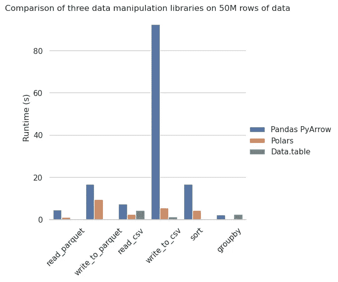

# 测量新 Pandas 2.0 相对于 Polars 和 Datatable 的速度——仍然不够好

> 原文：[`towardsdatascience.com/measuring-the-speed-of-new-pandas-2-0-against-polars-and-datatable-still-not-good-enough-e44dc78f6585`](https://towardsdatascience.com/measuring-the-speed-of-new-pandas-2-0-against-polars-and-datatable-still-not-good-enough-e44dc78f6585)

## 尽管新的 PyArrow 后端为 Pandas 带来了令人兴奋的功能，但在速度方面仍然令人失望。

[](https://ibexorigin.medium.com/?source=post_page-----e44dc78f6585--------------------------------)[](https://towardsdatascience.com/?source=post_page-----e44dc78f6585--------------------------------) [Bex T.](https://ibexorigin.medium.com/?source=post_page-----e44dc78f6585--------------------------------)

·发表于 [Towards Data Science](https://towardsdatascience.com/?source=post_page-----e44dc78f6585--------------------------------) ·7 分钟阅读·2023 年 3 月 29 日

--


作者提供的图像来自 Midjourney

自从第一次尝试用 `read_csv` 读取一个大小为一千兆字节的数据集，并意识到需要等待 - *喘息* - 五秒钟以来，人们一直在抱怨 Pandas 的速度。是的，我也是那些抱怨者之一。

五秒钟听起来可能不多，但当加载数据集本身需要这么长时间时，通常意味着后续操作也会需要这么久。而且，由于速度是快速、简便的数据探索中最重要的因素之一，这可能让你感到*非常*沮丧。

因此，PyData 的人员最近宣布了计划发布带有全新 PyArrow 后端的 Pandas 2.0。对于完全不了解的人，PyArrow 本身是一个设计用于高性能、内存高效处理数组的小巧库。

人们真心希望新的后端能带来比原生 Pandas 更显著的加速。本文将通过将 PyArrow 后端与两种最快的数据框库 Datatable 和 Polars 进行比较来测试这一希望的光芒。

## 难道这些人还没有做过这个吗？

既然 H20 目前已经运行了受欢迎的 [**Database-like Ops Benchmark**](https://h2oai.github.io/db-benchmark/) 来测量几乎 15 个库在三种不同数据集大小上的三个数据操作的计算速度，那做这个基准测试还有什么意义？我的基准测试不可能做到那么全面。

好吧，首先，这个基准测试没有包括带有 PyArrow 后端的 Pandas，并且最后一次更新是在 2021 年，那已经很久了。

其次，基准测试在一台拥有 40 个 CPU 核心、128 GB 内存和 20 GB GPU 的超级机器上运行（[cuDF](https://github.com/rapidsai/cudf)，有人用过吗？）。普通用户通常无法使用这样的机器，因此比较在像我这样日常设备上的库之间的差异非常重要。它配备了一个拥有十几个核心的中等性能 CPU 和 32 GB 的内存。

最后，我提倡过程中的完全透明，所以我将详细解释基准测试代码，并将其作为 GitHub Gist 提供，供您在自己的机器上运行。

## 安装和设置

我们首先安装 Pandas 2.0 的 RC（候选版本），以及最新版本的 PyArrow、Datatable 和 Polars。

```py
pip install -U "pandas==2.0.0rc0" pyarrow datatable polars
```

```py
import datatable as dt
import pandas as pd
import polars as pl
```

```py
dt.__version__
```

```py
'1.0.0'
```

```py
pd.__version__
```

```py
'2.0.0rc0'
```

```py
pl.__version__
```

```py
'0.16.14'
```

我使用 NumPy 和 Faker 库创建了一个合成数据集，以模拟人口普查数据集中的典型特征，并将其保存为 CSV 和 Parquet 格式。以下是文件路径：

```py
from pathlib import Path

data = Path("data")
data_csv = data / "census_data.csv"
data_parquet = data / "census_data.parquet"
```

> 查看[这个 GitHub gist](https://gist.github.com/BexTuychiev/92a1fbbed96fa52cec47fe2cd725cf3e)以查看生成数据的代码。

有 5000 万行七个特征，使文件大小达到约 2.5 GB。

## 基准测试结果

在展示代码之前，我们先看看好东西——基准测试结果：



作者提供的图片

一开始，我们可以看到 PyArrow Pandas 在所有类别中都排在最后（或在`groupby`中倒数第二）。

请不要将阅读和写入 Parquet 类别中的不存在的条形图误认为是 0 运行时间。这些操作在 Datatable 中不受支持。

在其他类别中，Datatable 和 Polars 并列第一，Polars 稍微占有优势。

写入 CSV 文件一直是 Pandas 的慢速过程，我猜新后端不足以改变这一点。

## 你应该切换吗？

所以，百万美元的问题是——你应该切换到更快的 Polars 还是 Datatable？

答案是*我非常讨厌*的“这要看情况”。你是否愿意为了更快的速度牺牲 Pandas 近二十年的成熟度，以及说实话，愚蠢的容易和熟悉的语法？

在这种情况下，请记住，你花时间学习新库的语法可能会平衡其性能提升。

但是，如果你只是处理大量数据集，那么学习这些快速库中的任何一个可能从长远来看都值得付出努力。

如果你决定继续使用 Pandas，请仔细阅读[Pandas 用户指南的性能提升](https://pandas.pydata.org/docs/user_guide/enhancingperf.html)页面。它概述了一些技巧和窍门，以在不依赖第三方库的情况下为 Pandas 引擎增加额外的动力。

此外，如果你被困在一个大的 CSV 文件中，仍然想使用 Pandas，你应该记住以下代码片段：

```py
import datatable as dt
import pandas as pd

df = dt.fread("data.csv").to_pandas()
```

它以 Datatable 的速度读取文件，将其转换为 Pandas DataFrame 几乎是瞬间完成的。

## 基准测试代码

好了，最后来看代码吧。

导入库后，首先要做的是定义一个 DataFrame 来存储基准测试结果。这将使绘图过程变得更简单。

```py
import time

import datatable as dt
import pandas as pd
import polars as pl

# Define a DataFrame to store the results
results_df = pd.DataFrame(
    columns=["Function", "Library", "Runtime (s)"]
)
```

它有三列，一列用于任务名称，另一列用于库名称，还有一列用于存储运行时间。

然后，我们定义一个`timer`装饰器，执行以下任务：

1.  测量装饰函数的运行时间。

1.  提取函数的名称和其`library`参数的值。

1.  将运行时间、函数名称和库名称存储到传递的结果 DataFrame 中。

```py
def timer(results: pd.DataFrame):
    """
    A decorator to measure the runtime of the passed function. 
    It stores the runtime, the function name, and the passed 
    function's "library" parameter into the `results` DataFrame 
    as a single row.
    """
```

这个想法是定义一个通用函数，如`read_csv`，用于读取三种库中的任意一个的 CSV 文件，可以通过像`library`这样的参数进行控制：

```py
# Task 1: Reading CSVs
@timer(results_df)
def read_csv(path, library):
    if library == "pandas":
        return pd.read_csv(path, engine="pyarrow")
    elif library == "polars":
        return pl.read_csv(path)
    elif library == "datatable":
        return dt.fread(str(path))
```

注意我们是如何用`timer(results_df)`装饰函数的。

我们以类似的方式定义其他任务的函数（参见[the Gist](https://gist.github.com/BexTuychiev/dba8d1f876e1d601f530c0e8b16d5a85)中的函数体）：

```py
# Task 2: Writing to CSVs
@timer(results_df)
def write_to_csv(df, path, library):
    ...

# Task 3: Reading to Parquet
@timer(results_df)
def read_parquet(path, library):
    ...

# Task 4: Writing to Parquet
@timer(results_df)
def write_to_parquet(df, path, library):
    ...

# Task 5: Sort
@timer(results_df)
def sort(df, column, library):
    ...

# Task 6: Groupby
@timer(results_df)
def groupby(df, library):
    ...
```

然后，我们为每个库运行这些函数：

```py
from pathlib import Path

# Define the file paths
data = Path("data")
data_csv = data / "census_data.csv"
data_parquet = data / "census_data.parquet"

# libraries = ["pandas", "polars", "datatable"]
l = "datatable"

# Task 3/4
df = read_parquet(data_parquet, library=l)
write_to_parquet(df, data_parquet, library=l)

# Task 1/2
df = read_csv(data_csv, library=l)
write_to_csv(df, data_csv, library=l)

# Task 5/6
sort(df, "age", library=l)
groupby(df, library=l)
```

为了避免内存错误，我避免了循环，并在 Jupyter Notebook 中运行了三次基准测试，改变了`l`变量。

然后，我们使用可爱的 Seaborn 创建基准图形，展示以下简单的柱状图：

```py
g = sns.catplot(
    data=results_df,
    kind="bar",
    x="Function",
    y="Runtime (s)",
    hue="Library",
)
```


图片由作者提供

## 事情正在发生变化

多年来，Pandas 依赖于 NumPy 的肩膀，因为 NumPy 在流行度上迅猛增长。NumPy 慷慨地借用了其快速计算和数组操作的功能。

但这种方法受限于 NumPy 对文本和缺失值的糟糕支持。Pandas 不能使用本地 Python 数据类型如列表和字典，因为那样会在大规模上成为笑柄。

因此，Pandas 在过去几年中已悄然远离 NumPy。例如，它在 2020 年就引入了 PyArrow 数据类型用于字符串。它还使用了用其他语言编写的扩展，如 C++和 Rust，用于日期（含时区）或分类数据等复杂数据类型。

现在，Pandas 2.0 拥有一个全面的后端，支持所有数据类型，基于 Apache Arrow 的 PyArrow 实现。除了明显的速度提升外，它还提供了更好的缺失值支持、互操作性和更广泛的数据类型支持。

因此，即使后端仍然比其他 DataFrame 库慢，我仍然热切期待其正式发布。感谢阅读！

这里有一些页面可以了解更多关于 Pandas 2.0 和 PyArrow 后端的信息：

+   [`datapythonista.me/blog/pandas-20-and-the-arrow-revolution-part-i`](https://datapythonista.me/blog/pandas-20-and-the-arrow-revolution-part-i)

+   [`levelup.gitconnected.com/welcoming-pandas-2-0-194094e4275b`](https://levelup.gitconnected.com/welcoming-pandas-2-0-194094e4275b)

+   [`pandas.pydata.org/docs/dev/whatsnew/v2.0.0.html`](https://pandas.pydata.org/docs/dev/whatsnew/v2.0.0.html)

喜欢这篇文章以及它那奇特的写作风格？想象一下，获取更多类似的文章，全部由一位才华横溢、迷人幽默的作者（对了，那就是我 :）。

只需 4.99 美元的会员费用，你将不仅能访问我的故事，还能获取来自 Medium 上最聪明、最杰出思想者的宝贵知识。如果你使用[我的推荐链接](https://ibexorigin.medium.com/membership)，你将获得我超级感激的心意和一个虚拟的击掌，以支持我的工作。

[](https://ibexorigin.medium.com/membership?source=post_page-----e44dc78f6585--------------------------------) [## 通过我的推荐链接加入 Medium — Bex T.

### 独享所有⚡高级⚡内容，并在 Medium 上无限畅游。通过购买我一杯…

ibexorigin.medium.com](https://ibexorigin.medium.com/membership?source=post_page-----e44dc78f6585--------------------------------) 
