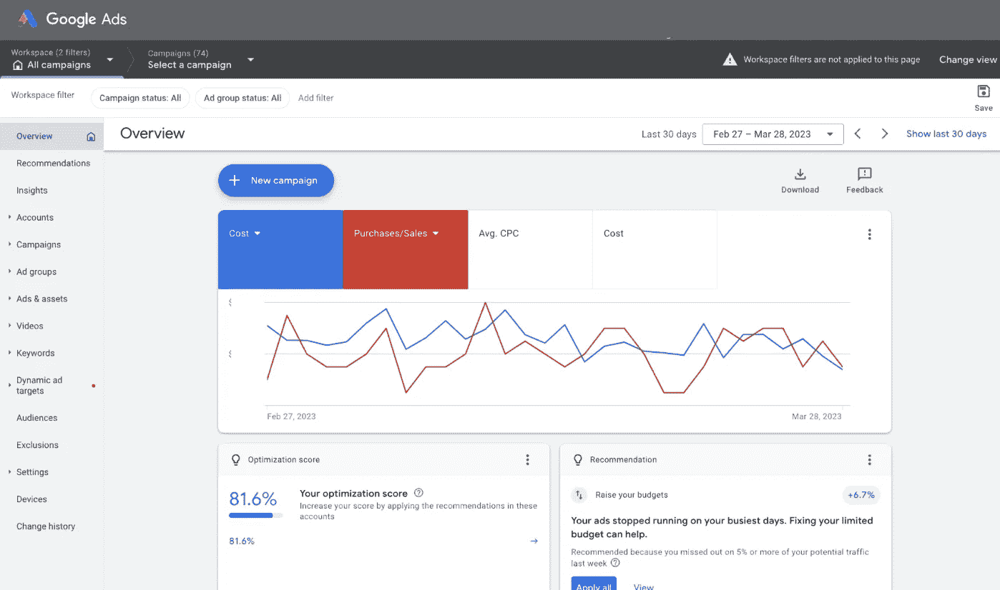
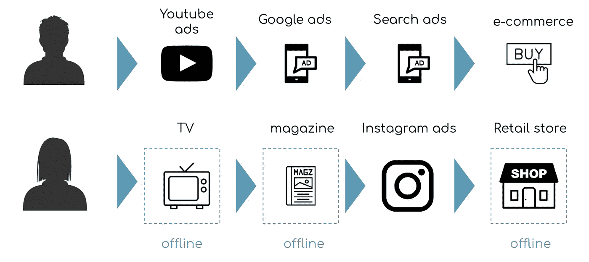

# 媒体组合建模：数据科学家避免陷阱的技术指南

> 原文：[`towardsdatascience.com/media-mix-modeling-technical-guideline-to-overcome-pitfalls-for-a-smarter-decision-making-e677165f9140?source=collection_archive---------6-----------------------#2023-03-31`](https://towardsdatascience.com/media-mix-modeling-technical-guideline-to-overcome-pitfalls-for-a-smarter-decision-making-e677165f9140?source=collection_archive---------6-----------------------#2023-03-31)

## 如何理解输出以及最大化其实际应用

 [Hajime Takeda](https://medium.com/@hajime.takeda?source=post_page-----e677165f9140--------------------------------)

·

[关注](https://medium.com/m/signin?actionUrl=https%3A%2F%2Fmedium.com%2F_%2Fsubscribe%2Fuser%2F6d7012b72e49&operation=register&redirect=https%3A%2F%2Ftowardsdatascience.com%2Fmedia-mix-modeling-technical-guideline-to-overcome-pitfalls-for-a-smarter-decision-making-e677165f9140&user=Hajime+Takeda&userId=6d7012b72e49&source=post_page-6d7012b72e49----e677165f9140---------------------post_header-----------) 发布在 [Towards Data Science](https://towardsdatascience.com/?source=post_page-----e677165f9140--------------------------------) ·6 分钟阅读·Mar 31, 2023

--

**TLDR:** 媒体组合建模（MMM）是一种用于市场测量的统计方法，但它并不是像其他技术那样“一刀切”的解决方案。我将介绍数据科学家提高建模技巧和实现改进结果的重要检查点，广告报告与 MMM 之间的区别，以及多点触摸归因（MTA）与 MMM 之间的区别。

图片由[Austin Distel](https://unsplash.com/@austindistel?utm_source=medium&utm_medium=referral)提供，来源于[Unsplash](https://unsplash.com/?utm_source=medium&utm_medium=referral)。

## 介绍

MMM 是一种统计方法，用于理解和衡量投资回报率（ROI）并优化媒体预算。

在饮料、消费品、汽车和时尚行业拥有巨额广告预算的公司中的数据科学家们一直在致力于改善 MMM。此外，广告技术公司，如谷歌和 Meta，最近也积极关注 MMM，因为 GDPR 和苹果 IDFA 弃用等隐私法规影响了数字世界的追踪准确性。

欲了解更多信息，请参考我之前发布的这篇文章。

 ## 媒体混合建模：如何使用 Python 和 LightweightMMM 衡量广告效果

### 媒体混合建模，它的实施及实用技巧

[towardsdatascience.com

在发布上述文章后，我收到了许多积极的反馈和一些来自 Towards Data Science 读者的问题。一些常见的问题包括：

(1) 成功的 MMM 项目的检查点是什么？

(2) 广告报告和 MMM 有何不同？

(3) 多触点归因（MTA）和 MMM 之间有什么区别？

在这篇文章中，我将解决这些问题，并提供见解，以帮助你更好地理解这些概念。

图片由[krakenimages](https://unsplash.com/pt-br/@krakenimages?utm_source=medium&utm_medium=referral)提供，来源于[Unsplash](https://unsplash.com/?utm_source=medium&utm_medium=referral)。

**(1) 成功的 MMM 项目的检查点是什么？**

为了确保 MMM 的可靠性和准确性，数据科学家在相信结果之前应考虑以下检查点：一些想法受到谷歌研究论文的启发：[Chan, D., & Perry, M. (2017). 媒体混合建模中的挑战与机遇。](https://static.googleusercontent.com/media/research.google.com/en//pubs/archive/45998.pdf)

1.  ✔️ 足够的数据点：

+   确保有足够的数据点来建模广告渠道及其关系。

+   通常，MMM 需要至少两年的周级数据。然而，如果你没有这么多数据，每日数据也是可以接受的，但在这种情况下，你需要更加仔细地审查异常值。

2\. ✔️ 选择适当的输入变量：

+   输入数据的变异性至关重要。例如，如果媒体频道 X 的支出在整个时间段内保持不变，模型可能难以确定其对销售的影响。在这种情况下，排除该频道作为输入变量可能会更有利。

+   保留影响销售的因素。例如，如果杂志 X 的支出显著小于其他广告且仅为暂时性支出，可能更适合将其排除。

+   输入变量可以在模型前期和模型选择阶段进行选择。

3\. ✔️ 处理相关的输入变量：

+   检查输入变量之间的潜在多重共线性，这可能导致高方差系数估计和将销售归因于特定广告渠道的困难。

+   如果你不断为 Meta 和 Tiktok 广告分配相同的预算，模型的可靠性可能会受到影响，使得评估这些媒体渠道的影响变得困难。

+   使用方法来解决相关变量，例如正则化技术或变量选择方法。

4\. ✔️ 控制选择偏差：

+   注意潜在的选择偏差问题，例如季节性。

+   例如，11 月份的销售增加可能不是由于广告，而是消费者需求或黑色星期五促销。

+   根据我的经验，内部促销数据或定价数据可以作为不可观测需求变量的有价值的控制因素。

5\. ✔️ 验证外推假设：

+   外推假设涉及对模型在可用数据范围之外的行为进行预测或得出结论。

+   在尝试回答诸如“如果将我的广告支出 X 增加十倍会发生什么”或“如果我突然停止对广告 X 的支出会发生什么”等商业问题时，请小心。

+   测试模型在不同场景下的表现，并在解释需要显著外推的结果时要小心。

6\. ✔️ 测试模型性能：

+   通过将 MMM 的预测与实际销售和营销数据进行比较来验证 MMM。

+   R-squared 和 MAPE，即均值绝对百分比误差，是 MMM 的知名度量指标。一般来说，如果 R2 大于 0.8，则被认为是好的。此外，对于 MAPE，目标是 20% 或以下。

7\. ✔️ 进行随机实验

+   使用 MMM 估计媒体预算变化的影响时，建议进行随机实验以验证发现。

+   例如，通过将区域划分为测试组和对照组并调整广告支出，你可以测量提升效果并获得更准确的结果。

通过解决这些检查点，数据科学家可以提高对 MMM 结果有效性和可靠性的信心，并根据模型提供的见解做出更明智的决策。

**(2) 广告报告和 MMM 有什么不同？** 🤔

直截了当地说，MMM 提供了关于营销表现的更广泛视角，帮助企业从长期角度分配资源并优化整体营销组合。相比之下，像 Google/Meta Ads 这样的广告报告提供了对特定广告或活动的更细致见解，允许进行调整以改善短期表现。

媒体组合建模（MMM）的特点：

1.  MMM 专注于帮助企业优化整体营销组合和资源分配。

1.  它考虑了不同媒体渠道之间的相互作用，包括在线和离线。

1.  即使转换点是离线的，也可以使用。

广告报告的特点：

1.  广告报告提供了有关特定广告或活动表现的更详细见解，如点击率（CTR）和每次点击费用（CPC）。

1.  这些报告主要关注短期表现，帮助广告主快速掌握单个活动的进展。

1.  实际客户有多个媒体接触点。多个媒体的交织效果无法在每个媒体的广告报告中考虑。

作者提供的图像：Google Ads 上的广告报告

**（3）Multi-Touch Attribution（MTA）和 MMM 之间的区别是什么？** 🤔

Multi-Touch Attribution（MTA）是另一种营销测量方法，旨在使用其访问日志将信用分配给客户旅程中的不同营销接触点。

每种方法都有其优缺点。与 MMM 检查每个营销渠道的汇总成本不同，MTA 提供了对各个接触点贡献的更细致和可靠的视角。

另一个区别是跟踪非数字客户行为。MTA 专注于数字接触点和数字转换，而 MMM 考虑了离线媒体支出的成本和离线转换的结果。

作者提供的图像：MTA 不跟踪离线活动

MMM 更适用于

+   一个品牌投资于电视和杂志等离线媒体，并希望评估其影响时，MTA 更为适用。

+   一个品牌通过离线和在线渠道销售商品/ 一个品牌主要通过离线渠道销售商品。

+   财务视角更为重要。

+   一个品牌拥有过去 2-3 年的历史广告和销售数据。

另一方面，当

+   一个品牌在 Google Ads 和 Meta Ads 等数字媒体上花费很多。

+   一个品牌主要在线销售商品。

+   优先考虑理解客户旅程。

+   需要实时评估。

**最后**

感谢阅读！如果你有任何问题/建议，请随时通过[Linkedin](https://www.linkedin.com/in/hajime-takeda/)与我联系！此外，如果你在 Towards Data Science 上关注我，我会很高兴。

**参考**

+   媒体混合建模：如何使用 Python 和 LightweightMMM 测量广告效果

+   [Chan, D., & Perry, M. (2017). 媒体混合建模中的挑战与机遇。](https://static.googleusercontent.com/media/research.google.com/en//pubs/archive/45998.pdf)

+   通过营销混合建模超级提升你的跨渠道客户获取
