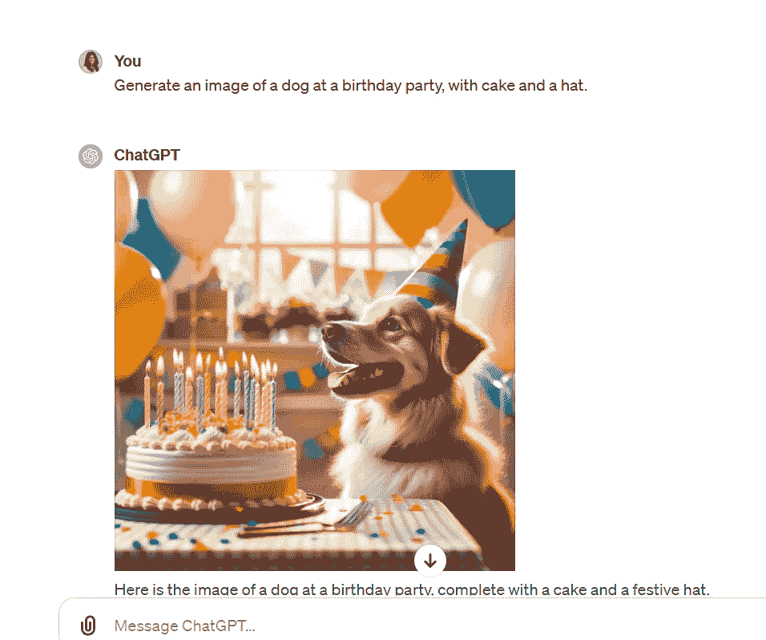
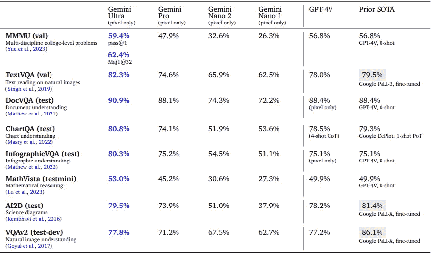

# 认识 Gemini：谷歌最大、最强大的 AI 模型

> 原文：[`towardsdatascience.com/meet-gemini-googles-largest-and-most-powerful-ai-model-2ffd2f07490f`](https://towardsdatascience.com/meet-gemini-googles-largest-and-most-powerful-ai-model-2ffd2f07490f)

## 这个下一代 AI 模型在几乎所有学术基准测试中超过了 ChatGPT。

[](https://natassha6789.medium.com/?source=post_page-----2ffd2f07490f--------------------------------)[](https://towardsdatascience.com/?source=post_page-----2ffd2f07490f--------------------------------) [Natassha Selvaraj](https://natassha6789.medium.com/?source=post_page-----2ffd2f07490f--------------------------------)

·发布于 [Towards Data Science](https://towardsdatascience.com/?source=post_page-----2ffd2f07490f--------------------------------) ·6 分钟阅读·2023 年 12 月 9 日

--


图片由 [Mitchell Luo](https://unsplash.com/@mitchel3uo?utm_content=creditCopyText&utm_medium=referral&utm_source=unsplash) 拍摄，来源于 [Unsplash](https://unsplash.com/photos/google-logo-neon-light-signage-jz4ca36oJ_M?utm_content=creditCopyText&utm_medium=referral&utm_source=unsplash)

当 OpenAI 去年 11 月发布 ChatGPT 时，每个人心中都有一个迫切的问题——科技巨头们在做什么？

像谷歌这样的公司会何时回应这一发展？

我们现在有了答案。

2023 年 12 月 6 日，谷歌宣布了他们最新的 AI 模型：Gemini。

根据公司首席执行官 Sundar Pichai 的说法，这项技术是人工智能的巨大飞跃，将影响几乎所有谷歌的产品。

# Gemini 提供 3 种尺寸

当前版本的模型称为 Gemini 1.0。它可以处理文本、图像、视频和音频，并且有 3 种不同的尺寸。

**Gemini Nano** 是一个小型、高效的版本，可以在原生环境和 Android 设备上运行。

**Gemini Pro**，中级版本，在能力和效率之间取得了平衡。这个模型的表现比谷歌之前的旗舰模型 PaLM-2 好得多。目前它为 Bard 聊天机器人提供支持。

最终，**Gemini Ultra** 是系列中最强大的模型。它在复杂推理方面表现出色，并且在各种基准测试中超越了 OpenAI 的 GPT-4 模型。

Gemini Ultra 尚未公开发布。谷歌宣布该模型将在明年初推出，尽管没有提供具体的时间框架。

# Gemini 与 OpenAI 的 GPT 模型有何不同？

OpenAI 的 ChatGPT 目前由 2 个 AI 模型提供支持——免费版的 GPT-3.5 和付费版的 GPT-4。

几个月前，OpenAI 宣布 GPT-4 具有多模态能力（即能够 [处理文本、音频和图像](https://openai.com/blog/chatgpt-can-now-see-hear-and-speak)）。

然而，尽管它可以处理各种数据类型，模型的主要设计和功能仍然集中在 **基于文本的输入和输出** 上。

> 这意味着 GPT-4 是一个基于文本的框架，视觉和音频处理模型在其基础上作为第二阶段构建。

例如，将 **GPT-4** 与图像生成模型 **DALLE-3** 结合，可以将文本转换为如下所示的图像：



虽然 GPT-4 在处理其他模态的训练与其基于文本的训练是分开的，但 Gemini 从一开始就接受了文本、图像、视频和音频的多样化数据集训练。

简而言之，**多模态能力是从基础上构建到 Gemini 中的**，以确保它能原生理解所有数据类型。

> 这种架构差异意味着 Gemini 更容易进行泛化，因为它理解来自文本、图像、音频和视频的信息。

像 GPT-4 和 DALLE-3 这样的模型，则针对 **特定任务** 进行了微调（GPT-4 针对文本，DALLE-3 针对图像）。

在 Google Deepmind 关于 Gemini 的研究论文中，提出了以下问题：

> 一个未解的问题是，这种联合训练是否能产生一个在每个领域都有强大能力的模型——即使与针对单一领域的模型和方法相比。

这个问题涉及 AI 领域中的一个基本挑战：专业化模型与通用模型之间的权衡。

针对单一领域设计的模型通常在该特定任务上的表现更好，相比之下，通过联合训练开发的模型可能表现较差。

现在让我们将 Gemini 的表现与专门针对特定领域的最先进模型进行比较。

# Gemini 在几乎所有基准测试中都超过了 ChatGPT

在 Google Deepmind 最新的 [报告](https://storage.googleapis.com/deepmind-media/gemini/gemini_1_report.pdf) 中，模型的性能与其他算法如 Claude 2、PaLM-2、GPT-3.5 和 GPT-4 进行了比较。

下面是 Gemini 在各个领域与最佳模型的对比：

## 文本

Gemini 在文本基准测试中的表现与现有模型的对比：


图片来自 [Deepmind 的技术报告](https://storage.googleapis.com/deepmind-media/gemini/gemini_1_report.pdf)

在涵盖推理能力、阅读理解、STEM 和编码的多个基于文本的基准测试中，注意到 Gemini Ultra 在 9 个评估中的 8 个中优于 OpenAI 的 GPT-4 模型。

根据 Google Deepmind 的报告，当使用一种名为“**链式思维**”的提示技术时，模型表现最佳。

在思维链提示中，你将一个问题分解，并引导 AI 通过逐步推理的过程，类似于人类解决问题的方式。

这通常比单纯地将整个问题抛给 AI 模型更有效。

你可以阅读[这个](https://www.promptingguide.ai/techniques/cot)指南，了解更多关于思维链提示的信息。

同时，请注意**Gemini Pro**（中档版本），目前为 Bard 提供支持，在几乎所有基准测试中都超越了 GPT-3.5。

自 Gemini Pro 发布以来，我一直在进行实验，个人认为它的响应与 GPT-3.5 相当。

我计划对它们的推理和编码能力进行更详细的比较，并会尽快发布后续文章。

## 图像理解

即使在特定任务上没有先前的训练，Gemini Ultra 的视觉能力仍然超过了那些为这些基准测试进行了微调的其他模型：



来源于[Deepmind 的技术报告](https://storage.googleapis.com/deepmind-media/gemini/gemini_1_report.pdf)

第一个基准测试，[MMMU](https://mmmu-benchmark.github.io/)，包含了 6 个学科的大学级问题——商业、科学、人文学科、艺术、技术和医学。

这个基准不仅要求强大的推理能力和大学级的专业知识，而且问题也**独特地基于图像**。

准确回答这些问题并不容易，因为模型必须做两件事——解释视觉元素和进行复杂的文本分析。

Gemini Ultra 在这个基准测试中超过了所有其他 AI 模型，突显了其强大的多模态能力和泛化能力。

## 视频理解

Gemini Ultra 在视频相关任务中也达到了最先进的性能——它能够**添加字幕**和**根据视频回答问题**。

例如，给定[这个](https://www.youtube.com/watch?v=VmWxjmJ3mvs)足球比赛视频，该模型被要求提供有关如何提高球员技术的建议。

这是 Gemini 在分析视频后的回应：

```py
This soccer player needs to work on their ball-striking mechanics. Their foot is not making
good contact with the ball, which is causing the ball to fly up and away from the goal. They
also need to work on their body positioning. They should be leaning into the shot with their
non-kicking leg in front of their kicking leg, and they should be following through with their
kicking leg.
```

同样，Gemini Ultra 在图像生成和音频理解任务中表现出了卓越的性能。你可以在[这里](https://storage.googleapis.com/deepmind-media/gemini/gemini_1_report.pdf)阅读完整报告。

尽管该模型在学术基准测试中的表现看起来很有前景，但请记住，在研究环境中 4-5%的改进可能未必会对现实世界产生实际影响。

在我看来，将 AI 模型整合到其他应用程序中并为特定用例（如自动化数据分析或增强搜索能力）进行产品化，将比性能的边际改进产生更大的影响。

我期待看到 Google 如何将这个新模型整合到其产品套件中，特别是 Google Analytics，以生成更先进的见解和预测。

我从关于 Gemini 的论文中得到的最大收获是，一个以多模态为核心构建的模型可以超越专为特定任务设计的算法。

这种方法可能是实现**人工通用智能**（AGI）的重要一步，其目标是建立一个可以应用于广泛任务的 AI 模型。

# 下面是如何开始使用 Gemini 的方法。

正如本文前面提到的，你可以通过访问[Bard 聊天机器人](https://bard.google.com/chat)今天开始使用 Gemini Pro。

谷歌还宣布，Gemini Nano（最轻版本）将很快被[集成到 Pixel 智能手机](https://store.google.com/intl/en/ideas/articles/pixel-feature-drop-december-2023/)中，从 Pixel 8 Pro 开始。

这将允许你使用 Recorder 应用创建对话的自动总结，并在 WhatsApp 上生成高质量的回复建议。

最后，Gemini 将于 12 月 13 日通过 Google Generative AI Studio 向开发者开放。你还可以注册谷歌的实时讲座，了解如何在 Google Cloud 上[使用 Gemini 构建应用程序](https://www.googlecloudcommunity.com/gc/Cloud-Events/Building-Transformative-Applications-with-Gemini-on-Google-Cloud/ec-p/677873#M437)。
