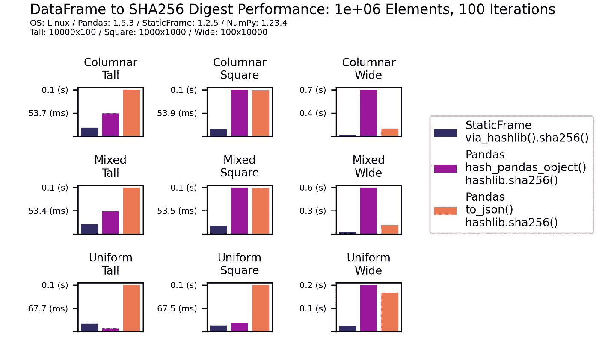

# 缓存 DataFrame 函数

> 原文：[`towardsdatascience.com/memoizing-dataframe-functions-7a27dff532f7?source=collection_archive---------5-----------------------#2023-03-03`](https://towardsdatascience.com/memoizing-dataframe-functions-7a27dff532f7?source=collection_archive---------5-----------------------#2023-03-03)

## 使用可哈希 DataFrame 和消息摘要来优化重复计算

[](https://medium.com/@flexatone?source=post_page-----7a27dff532f7--------------------------------)[](https://towardsdatascience.com/?source=post_page-----7a27dff532f7--------------------------------) [克里斯托弗·阿里萨](https://medium.com/@flexatone?source=post_page-----7a27dff532f7--------------------------------)

·

[关注](https://medium.com/m/signin?actionUrl=https%3A%2F%2Fmedium.com%2F_%2Fsubscribe%2Fuser%2F6a4f500b1e4f&operation=register&redirect=https%3A%2F%2Ftowardsdatascience.com%2Fmemoizing-dataframe-functions-7a27dff532f7&user=Christopher+Ariza&userId=6a4f500b1e4f&source=post_page-6a4f500b1e4f----7a27dff532f7---------------------post_header-----------) 发表在 [Towards Data Science](https://towardsdatascience.com/?source=post_page-----7a27dff532f7--------------------------------) ·7 分钟阅读·2023 年 3 月 3 日[](https://medium.com/m/signin?actionUrl=https%3A%2F%2Fmedium.com%2F_%2Fvote%2Ftowards-data-science%2F7a27dff532f7&operation=register&redirect=https%3A%2F%2Ftowardsdatascience.com%2Fmemoizing-dataframe-functions-7a27dff532f7&user=Christopher+Ariza&userId=6a4f500b1e4f&source=-----7a27dff532f7---------------------clap_footer-----------)

--

[](https://medium.com/m/signin?actionUrl=https%3A%2F%2Fmedium.com%2F_%2Fbookmark%2Fp%2F7a27dff532f7&operation=register&redirect=https%3A%2F%2Ftowardsdatascience.com%2Fmemoizing-dataframe-functions-7a27dff532f7&source=-----7a27dff532f7---------------------bookmark_footer-----------)

作者提供的照片

提高软件系统运行性能的一个著名技术是函数缓存。缓存是一种应用于单个函数的缓存方法。如果函数多次使用相同的参数调用，可以通过将结果存储在映射（或磁盘）中来避免重复计算。后续调用时，如果找到参数，则返回存储的结果。

这种机会伴随着权衡。记忆化以空间换时间：先前计算的结果必须存储在内存或磁盘上。此外，被记忆化的函数必须是纯粹的：输出必须完全由输入决定。最后，并非所有类型的函数参数都是合适的。在内存记忆化中，结果存储在映射中，参数必须是可哈希和不可变的。在基于磁盘的记忆化中，结果存储在文件中，参数必须能还原为唯一的文件名；从密码学哈希函数派生的消息摘要是实现此目的的最佳选择。

记忆化的另一个挑战是缓存失效：为了避免缓存过度增长，必须丢弃缓存。Python 标准库通过 `functools.lru_cache()` 装饰器提供了一种内存解决方案。该装饰器通过“最近最少使用”（LRU）缓存失效策略实现记忆化：在达到最大计数后，会丢弃最近最少使用的缓存。

对于使用 Pandas DataFrame 作为函数参数的 Python 程序员，还有更多挑战。由于 Pandas `DataFrame` 和 `Series` 是可变容器，因此它们不可哈希。如果参数是 Pandas DataFrame，则 `functools.lru_cache()` 将失败。

```py
>>> import functools
>>> @functools.lru_cache
... def cube(v):
...     return v ** 3
...
>>> import pandas as pd
>>> df = pd.DataFrame(np.arange(1_000_000).reshape(1000, 1000))
>>> cube(df)
Traceback (most recent call last):
TypeError: unhashable type: 'DataFrame'
```

[StaticFrame](https://github.com/static-frame/static-frame) 是一个替代 DataFrame 的库，为内存和基于磁盘的记忆化提供了高效的解决方案。

## 哈希函数和哈希碰撞

在展示使用 StaticFrame 的 DataFrame 记忆化之前，区分不同类型的哈希函数是重要的。

哈希函数将可变大小的值转换为较小的（通常是）固定大小的值。哈希碰撞是指不同的输入哈希到相同的结果。对于某些应用，哈希碰撞是可以接受的。密码学哈希函数旨在消除碰撞。

在 Python 中，内置的 `hash()` 函数将可哈希对象转换为整数。任意类型可以通过实现魔法方法 `__hash__()` 提供支持。重要的是，`hash()` 的结果并不具备抗碰撞能力：

```py
>>> hash('')
0
>>> hash(0)
0
>>> hash(False)
0
```

Python 字典使用 `hash()` 将字典键转换为低级 C 数组中的存储位置。预期会有碰撞，如果发生碰撞，会使用 `__eq__()` 进行相等性比较解决。因此，要使任意类型可哈希，它需要实现 `__hash__()` 和 `__eq__()`。

密码学哈希函数不同于 `hash()`：它们旨在避免碰撞。Python 在 `hashlib` 库中实现了一系列密码学哈希函数。这些函数处理字节数据，并通过 `hexdigest()` 方法返回一个消息摘要字符串。

```py
>>> import hashlib
>>> hashlib.sha256(b'').hexdigest()
'e3b0c44298fc1c149afbf4c8996fb92427ae41e4649b934ca495991b7852b855'
>>> hashlib.sha256(b'0').hexdigest()
'5feceb66ffc86f38d952786c6d696c79c2dbc239dd4e91b46729d73a27fb57e9'
>>> hashlib.sha256(b'False').hexdigest()
'60a33e6cf5151f2d52eddae9685cfa270426aa89d8dbc7dfb854606f1d1a40fe'
```

## 内存记忆化

要对以 DataFrames 作为参数的函数进行记忆化，需要一个不可变且可哈希的 DataFrame。StaticFrame 提供了 `FrameHE` 来实现这一点，其中 “HE” 代表“哈希、相等”，这是 Python 哈希功能所需的两个实现。虽然 StaticFrame 的 `Frame` 是不可变的，但它不是可哈希的。

`FrameHE.__hash__()` 方法返回索引和列标签的 `hash()`。虽然这会与任何具有相同标签但值不同的 `FrameHE` 冲突，但仅使用标签会将更昂贵的完整值比较推迟到 `__eq__()`。

`FrameHE.__eq__()` 方法的实现简单地委托给 `Frame.equals()`，这是一个始终返回单一布尔值的方法。这与 `Frame.__eq__()` 不同，后者返回的是布尔 `Frame` 中的逐元素比较结果。

```py
>>> f = sf.FrameHE(np.arange(1_000_000).reshape(1000, 1000))
>>> hash(f)
8397108298071051538
>>> f == f * 2
False
```

使用 `FrameHE` 作为参数时，可以使用装饰了 `functools.lru_cache()` 的 `cube()` 函数。如果没有 `FrameHE`，可以使用 `to_frame_he()` 方法从其他 StaticFrame 容器中高效地创建 `FrameHE`。由于底层的 NumPy 数组数据是不可变且可以在容器之间共享的，这是一种轻量级、无复制的操作。如果来自 Pandas DataFrame，可以使用 `FrameHE.from_pandas()`。

在下面的示例中，`cube()` 函数与上述创建的 `FrameHE` 一起调用。IPython 的 `%time` 工具显示，在首次调用后，使用相同参数的后续调用速度提高了三个数量级（从毫秒到微秒）。

```py
>>> %time cube(f)
CPU times: user 8.24 ms, sys: 99 µs, total: 8.34 ms
>>> %time cube(f)
CPU times: user 5 µs, sys: 4 µs, total: 9 µs
```

尽管对内存中的记忆化非常有用，`FrameHE` 实例也可以作为集合的成员，提供了一种收集唯一容器的新方法。

## 从 DataFrame 创建消息摘要

虽然内存中的记忆化提供了最佳性能，但缓存会消耗系统内存，并且在进程结束后不会持久化。如果函数结果较大或缓存需要持久化，基于磁盘的记忆化是一个替代方案。

在这种情况下，参数的可变性和可哈希性无关紧要。相反，可以从文件中检索缓存结果，该文件名源自参数。对参数应用加密哈希函数是理想的选择。

由于哈希函数通常以字节数据作为输入，因此 `Frame` 及其所有组件必须转换为字节表示。常见的方法是将 `Frame` 序列化为 JSON（或其他字符串表示），然后再转换为字节。由于底层的 NumPy 数组数据已经以字节存储，将这些数据转换为字符串是低效的。此外，由于 JSON 不支持全部 NumPy 类型，JSON 输入可能也不够独特，从而导致哈希碰撞。

StaticFrame 提供了 `via_hashlib()` 来满足这一需求，提供了一种有效的方法来将字节输入传递给 Python `hashlib` 模块中的加密哈希函数。以下是使用 SHA-256 的示例。

```py
>>> f.via_hashlib(include_name=False).sha256().hexdigest()
'b931bd5662bb75949404f3735acf652cf177c5236e9d20342851417325dd026c'
```

首先，调用 `via_hashlib()` 并选择要包括在输入字节中的容器组件。由于默认的 `name` 属性 `None` 无法进行字节编码，因此被排除。其次，调用哈希函数构造器 `sha256()`，返回一个加载了适当输入字节的实例。第三，调用 `hexdigest()` 方法以字符串形式返回消息摘要。还可以使用其他密码学哈希函数构造器，如 `sha3_256`、`shake_256` 和 `blake2b`。

为了创建输入字节，StaticFrame 连接了所有基础字节数据（包括值和标签），可选地包括容器元数据（如 `name` 和 `__class__.__name__` 属性）。使用 `via_hashlib().to_bytes()` 方法可以获得相同的字节表示。如果需要，这可以与其他字节数据结合以创建基于多个组件的哈希摘要。

```py
>>> len(f.via_hashlib(include_name=False).to_bytes())
8016017
```

StaticFrame 对创建消息摘要的内置支持显示出比 Pandas 的两种常见方法更高效。第一种方法使用 Pandas 工具函数 `pd.hash_pandas_object()` 来派生每列的整数哈希值。这个例程使用了一种定制的摘要算法，没有声称具有密码学碰撞抵抗性。为了比较，这里将这些每列的整数哈希值作为 `hashlib` 消息摘要函数的输入。第二种方法提供了整个 DataFrame 的 JSON 表示，作为 `hashlib` 消息摘要函数的输入。虽然这可能比 `pd.hash_pandas_object()` 更具碰撞抵抗性，但通常较慢。下图显示了这两种方法与 `via_hashlib()` 的性能特征比较。在各种 DataFrame 形状和类型组合中，`via_hashlib()` 表现优于所有方法，只有一个例外。



作者图表

## 基于磁盘的记忆化

给定将 DataFrame 转换为哈希摘要的方法后，可以实现基于磁盘的缓存例程。下面的装饰器适用于接收和返回单个`Frame`的函数。在这个例程中，文件名是从参数的消息摘要派生的，前缀是函数的名称。如果文件名不存在，则调用装饰的函数并写入结果。如果文件名存在，则加载并返回。这里使用了 StaticFrame NPZ 文件格式。正如最近 PyCon [讲座](https://youtu.be/HLH5AwF-jx4)中演示的，将 `Frame` 存储为 NPZ 通常比 Parquet 和相关格式要快得多，并提供完整的往返序列化。

```py
>>> def disk_cache(func):
...     def wrapped(arg):
...         fn = '.'.join(func.__name__, arg.via_hashlib(include_name=False).sha256().hexdigest(), 'npz')
...         fp = Path('/tmp') / fn
...         if not fp.exists():
...             func(arg).to_npz(fp)
...         return sf.Frame.from_npz(fp)
...     return wrapped
```

为了演示这个装饰器，它可以应用于一个迭代十行窗口、对列求和，然后将结果连接成一个单一 `Frame` 的函数。

```py
>>> @disk_cache
... def windowed_sum(v):
...     return sf.Frame.from_concat(v.iter_window_items(size=10).apply_iter(lambda l, f: f.sum().rename(l)))
```

在第一次使用后，性能降低到原始运行时间的不到 20%。虽然加载基于磁盘的缓存比检索内存缓存要慢，但避免重复计算的好处可以在不消耗内存的情况下获得，并且可以利用持久缓存。

```py
>>> %time windowed_sum(f)
CPU times: user 596 ms, sys: 15.6 ms, total: 612 ms
>>> %time windowed_sum(f)
CPU times: user 77.3 ms, sys: 24.4 ms, total: 102 ms
```

`via_hashlib()`接口可以在其他情况下作为 DataFrame 所有特征的数字签名或校验和。

## 结论

如果纯函数在相同的参数下被调用多次，记忆化可以极大地提高性能。虽然处理输入和输出 DataFrame 的函数需要特别处理，但 StaticFrame 提供了便捷的工具来实现内存和基于磁盘的记忆化。虽然必须小心确保缓存被正确失效并避免冲突，但当消除重复工作时，可以实现显著的性能提升。
