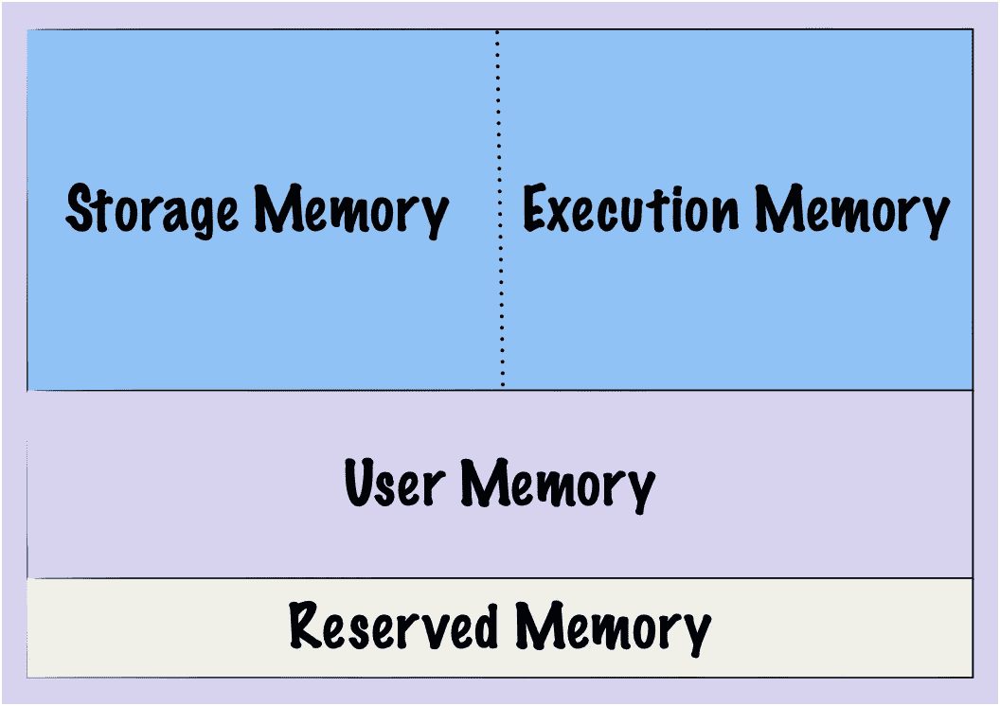
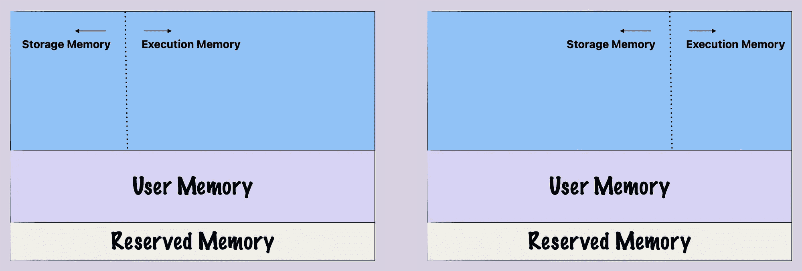
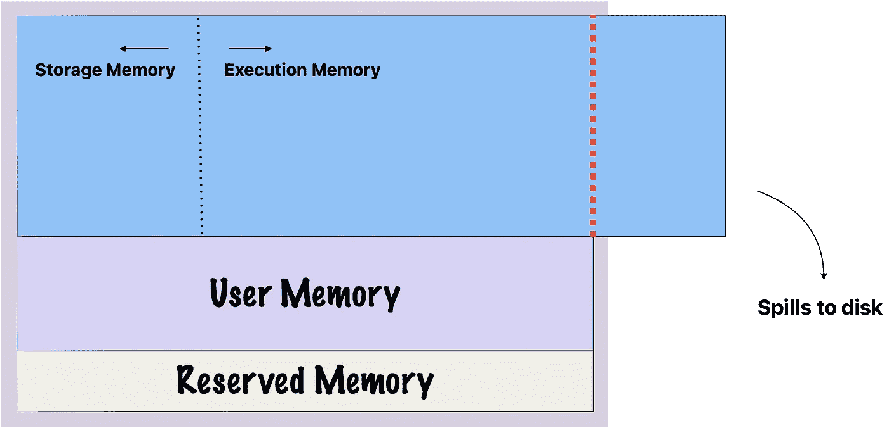
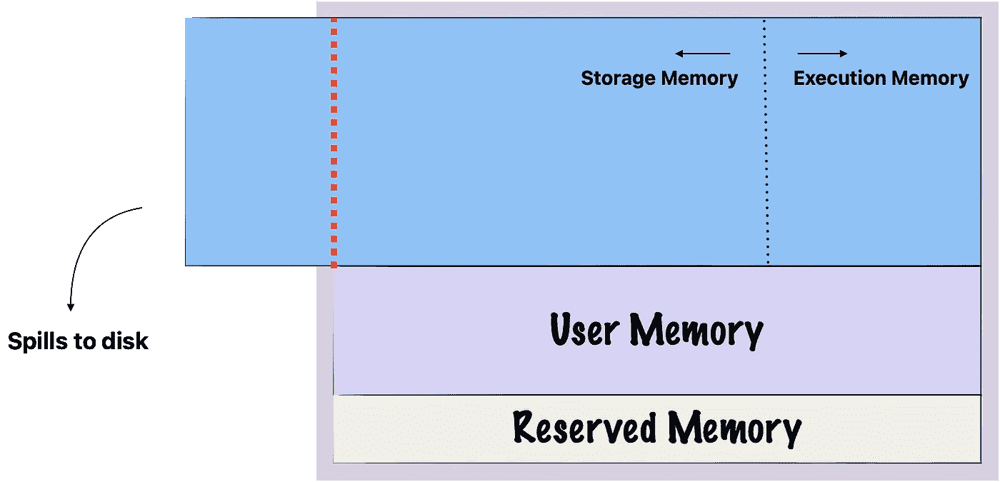
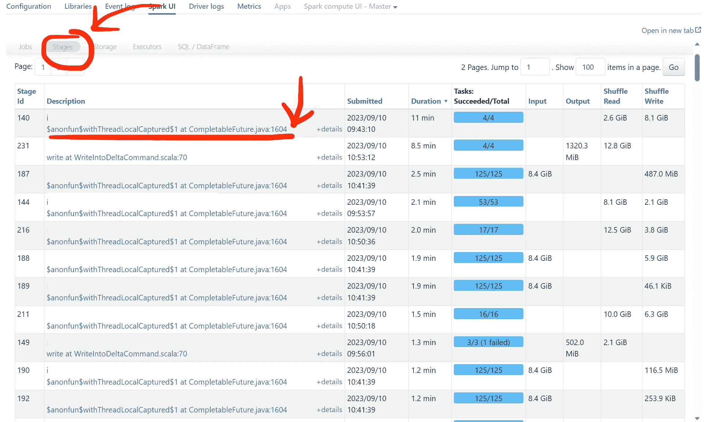
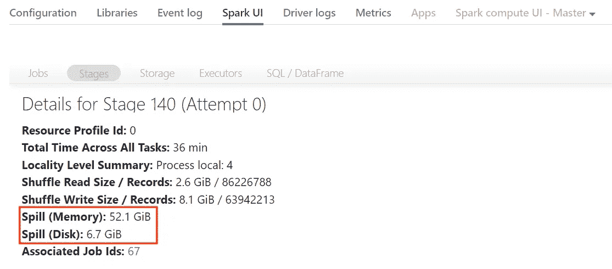

# **Apache Spark 中的内存管理：磁盘溢出**

> 原文：[`towardsdatascience.com/memory-management-in-apache-spark-disk-spill-59385256b68c`](https://towardsdatascience.com/memory-management-in-apache-spark-disk-spill-59385256b68c)

## 它是什么以及如何处理

 [Tom Corbin](https://medium.com/@tomhcorbin?source=post_page-----59385256b68c--------------------------------)

·发表于 [Towards Data Science](https://towardsdatascience.com/?source=post_page-----59385256b68c--------------------------------) ·阅读时间 12 分钟·2023 年 9 月 15 日

--

照片由 [benjamin lehman](https://unsplash.com/@benjaminlehman?utm_source=medium&utm_medium=referral) 提供，来源于 [Unsplash](https://unsplash.com/?utm_source=medium&utm_medium=referral)

在大数据领域，Apache Spark 因其极快的数据处理能力而备受喜爱。作为世界上排名第一的大数据处理引擎，学习使用这个工具是任何大数据专业人士技能组合中的基石。而这一路径中的一个重要步骤是了解 Spark 的内存管理系统及“磁盘溢出”的挑战。

磁盘溢出是指当 Spark 无法将数据全部存储在内存中时，需要将其存储到磁盘上。Spark 的主要优势之一是其内存处理能力，这比使用磁盘驱动器要快得多。因此，构建会溢出到磁盘的应用程序在一定程度上违背了 Spark 的目的。

磁盘溢出有许多不良后果，因此学习如何处理它是 Spark 开发者的重要技能。这就是本文旨在帮助的内容。我们将深入了解磁盘溢出是什么，为什么会发生，它的后果是什么，以及如何解决它。通过使用 Spark 的内置 UI，我们将学习如何识别磁盘溢出的迹象并理解其指标。最后，我们将探讨一些减轻磁盘溢出的可操作策略，例如有效的数据分区、适当的缓存和动态集群调整。

# **Spark 中的内存管理**

在深入探讨磁盘溢出之前，了解 Spark 中的内存管理如何工作是非常有用的，因为这在磁盘溢出的发生和管理中起着至关重要的作用。

Spark 被设计为一个内存数据处理引擎，这意味着它主要使用 RAM 来存储和处理数据，而不是依赖磁盘存储。这种内存计算能力是使 Spark 快速高效的关键特性之一。

Spark 为其操作分配了有限的内存，这些内存被分为不同的部分，这些部分组成了所谓的统一内存：

作者提供的图片

## 存储内存

这是 Spark 存储将来要重用的数据的地方，比如[缓存的数据](https://medium.com/me/stats/post/31a2bd7be277)和广播变量。通过将这些数据保持在随时可用的状态，Spark 可以通过快速检索数据来提高数据处理任务的性能。

你可以在第一次读取后将 DataFrame 缓存到存储内存中，而不是每次单独分析时从磁盘读取销售数据。这样，对于后续的分析，Spark 可以快速访问缓存的数据，从而提高整个过程的效率。

## 执行内存

这部分内存是 Spark 用于计算的。因此，当你执行连接或聚合时，Spark 使用执行内存。例如，要计算 DataFrame 中一列的平均值，Spark 会：

1.  将 DataFrame 的相关部分加载到执行内存中（可能从存储内存中的缓存 DataFrame 中提取）。

1.  执行聚合，将中间的和和计数存储在执行内存中。

1.  计算最终的平均值，仍然使用执行内存进行计算。

1.  输出最终结果，释放用于操作的执行内存。

## 用户内存

这是用于你创建的自定义数据结构或变量的地方，但这些不由 Spark 直接管理。这就像是你在 Spark 应用程序中的工作区。执行内存用于 Spark 主动处理的数据，而用户内存通常包含元数据、自定义哈希表或其他你可能需要的结构。

假设你有一个包含年龄列的 DataFrame，并且你想在应用程序中稍后的自定义逻辑中跟踪最大年龄。你会读取 DataFrame，计算最大年龄，然后将该年龄存储为一个变量，该变量会存储在用户内存中。这个变量是你稍后会使用的信息，但它并没有被 Spark 的内置操作主动处理，因此它属于用户内存。

与主要存储缓存 DataFrame/RDD 的存储内存不同，用户内存不由 Spark 管理。这意味着你需要确保你使用的用户内存不会超过分配的内存，以避免内存不足（OOM）错误。

## 保留内存

保留内存用于系统级操作和 Spark 的内部对象。与执行内存、存储内存或用户内存不同，这些内存用于 Spark 应用程序中的特定任务或数据，保留内存用于 Spark 自身的内部操作。

这种内存是“保留”的，因为它不能用于你的数据或任务。这就像你计算机上的操作系统保留了一些磁盘空间用于系统文件和操作——你不能将这些空间用于自己的文件。

## 存储与执行内存之间的动态分配

在 Spark 中，存储内存和执行内存之间的关系就像两个人分享一个派。这个派代表了总的可用内存，而每种内存——存储和执行——都想要这块派的一部分。

如果执行内存有更多任务需要处理并且需要更多资源，它可以占用更大的内存份额，留下较小的份额给存储内存。相反，如果存储内存需要缓存更多数据，它可以占用更大的份额，留下更少的份额给执行内存。就像这样：

作者提供的图片

如果另一个不需要，执行内存和存储内存都可能占用整个派（总的可用内存）。然而，执行内存在需要更多时对存储内存的份额有“优先权”。但有个限制——它不能占用过多，以至于存储内存留下的份额小于最低限度。

更技术性的说，执行内存和存储内存共享一个统一的内存区域，其中任何一个可以占用整个区域，如果另一个未使用；然而，执行内存可以从存储内存中驱逐数据，直到某个阈值，超过该阈值则不允许驱逐，而存储内存不能驱逐执行内存。

数据从存储内存中的驱逐通常是由最近最少使用（LRU）策略来管理的。这意味着，当执行内存需要更多空间并决定从存储内存中驱逐数据时，它通常会移除那些最近被访问最少的数据。其想法是，你很久没有使用的数据相比最近访问的数据，可能不太容易立即需要。

# Spark 中的磁盘溢出

Spark 喜欢在内存中进行大部分工作，因为这是处理数据的最快方式。但当你的数据比内存大时会发生什么？当你的总内存是 100GB，但你的 DataFrame 是 110GB 时会发生什么？当数据过大而无法放入内存时，它将被写入磁盘。这被称为磁盘溢出。

磁盘溢出可以来自存储内存（当缓存的 DataFrame 太大时）或执行内存（当操作需要大量的中间数据存储时）。回想一下，当执行内存需要额外的空间用于诸如连接或洗牌等任务时，它可以从存储内存中借用——但仅限于一定的限制。如果执行内存达到这个限制仍然需要更多空间，Spark 将会将多余的数据溢出到磁盘：

作者提供的图片

当存储内存需要更多空间但达到从执行内存借用的限制时，也会发生同样的情况：

作者提供的图片

## 分区大小对磁盘溢出的影响

当你将一个表加载到 Spark 中时，它会被拆分成可管理的块，称为分区，这些分区会被分配到工作节点上。Spark 会自动将数据拆分成 200 个分区，但你也可以指定 Spark 将数据拆分成多少个分区。了解需要使用多少个分区是理解 Spark 的一件重要事情，它也与磁盘溢出有关。

我们在前一节中讨论的统一内存是以每个节点为基础存在的。每个工作节点都有自己的统一内存，包括存储内存、执行内存、用户内存和保留内存。每个工作节点会将尽可能多的分区装入其统一内存中。但是，如果这些分区太大，部分分区会溢出到磁盘上。

想象一下你正在处理一个 160GB 大小的 DataFrame，并且你告诉 Spark 将其分成 8 个分区。因此，每个分区将为 20GB。现在，如果你的集群中有 10 个工作节点，每个节点总共有 16GB 内存，那么没有一个分区能完全适应单个节点的内存。我们最多能在内存中放入 16GB 的分区，其余 4GB 将被溢出到磁盘。

然而，如果我们将分区数增加到 10，那么每个分区将为 16GB —— 恰好能适应内存！了解分区对于理解磁盘溢出至关重要，也有助于更全面地理解 Spark。为 Spark 任务选择合适的分区数对于快速执行至关重要。

## 磁盘溢出的成本

磁盘溢出非常低效。Spark 不仅需要花时间将数据写入磁盘，还需要花费更多时间在需要数据时将其读回。这些读写操作是昂贵的，可能会对你的 Spark 应用产生重大影响。

**性能影响** 磁盘 I/O（读写）比内存访问显著慢，这可能导致作业完成时间变长。

**资源利用** 磁盘溢出可能导致资源的低效使用。本可以用于计算的 CPU 周期被浪费在读写操作上。

**操作复杂性** 频繁发生磁盘溢出的 Spark 应用程序可能更复杂。你不仅需要监控 CPU 和内存使用情况，还要监控磁盘使用情况，为你的操作考虑增加了另一层复杂性。

**成本影响** 在基于云的环境中，你通常会按使用的计算资源计费，包括存储、CPU、内存，有时还包括网络利用。如果磁盘溢出导致 Spark 任务运行变慢，你将需要更长时间运行云实例才能完成相同的工作，这会增加你的成本。

## 磁盘溢出的原因

造成内存不足进而导致磁盘溢出的常见场景有：

1.  **大数据集：** 当处理的数据超过可用内存时，Spark 会将多余的数据溢出到磁盘。

1.  **复杂操作：** 需要大量中间数据的任务，如连接、聚合和洗牌，如果执行内存不足，可能会导致磁盘溢出。

1.  **不适当的分区：** 当你有太少的分区，而分区大小大于可用内存时，Spark 会将不适合的分区部分溢出到磁盘。

1.  **多个缓存的 DataFrames/RDDs：** 如果你缓存了多个大型 DataFrames 或 RDDs，而存储内存已满，则最近最少使用的数据会被溢出到磁盘。

1.  **并发任务：** 运行多个每个需要大量内存的任务可能会导致磁盘溢出，因为它们争夺有限的内存资源。

1.  **数据倾斜：** 数据倾斜可能导致某些分区的数据远多于其他分区。负责这些“重”分区的工作节点可能会耗尽内存，迫使它们将多余的数据写入磁盘。

1.  **配置不足：** 有时候，默认或用户定义的 Spark 配置没有为某些操作分配足够的内存，导致磁盘溢出。

## 识别磁盘溢出

识别磁盘溢出的最简单方法是通过 Spark UI。进入“Stages”选项卡，然后点击一个阶段。在下面的图片中，我按“Duration”排序阶段，并选择了持续时间最长的阶段。长时间运行不一定意味着磁盘溢出，但长时间运行的阶段通常是开始调查的好地方，因为这些阶段可能表示长时间的洗牌操作或数据倾斜。

图片作者

在这里我们可以看到关于这个阶段的各种指标，包括磁盘溢出的量（如果有的话）：

图片作者

“溢出（内存）”显示了数据在溢出到磁盘之前的内存大小。而“溢出（磁盘）”则显示了溢出到磁盘后的数据大小，*在溢出之后*。

“溢出（磁盘）”比“溢出（内存）”小的原因是数据写入磁盘时，会进行序列化和压缩。序列化是将数据对象转换为字节流，以便于存储或传输，而压缩则涉及减少数据大小，以节省存储空间或加快传输速度。

## 缓解磁盘溢出

一旦识别了磁盘溢出，下一步是缓解它。你如何处理磁盘溢出将取决于你的具体情况和造成溢出的原因。以下是针对常见磁盘溢出原因的一些一般建议。

**了解根本原因** 在采取任何措施来减轻磁盘溢出之前，你需要了解它发生的原因。使用 Spark UI 识别导致溢出的操作，查看“Stages”选项卡中的“Spill (Disk)”和“Spill (Memory)”等指标。一旦确定了根本原因，采取适当的解决方案。

**有效地划分数据** 有效的数据划分是最小化 Spark 中磁盘溢出的关键策略，特别是由于 shuffle 操作。Shuffle 是一种昂贵的操作，它会在分区间重新分配数据，并且通常需要大量的中间存储。如果无法在内存中存储这些中间数据，它将溢出到磁盘。更好的数据划分可以减少对 shuffle 的需求（即使没有磁盘溢出，shuffle 也是一种计算上昂贵的操作）。

通过优化数据的划分方式并减少在任务如连接或聚合过程中数据移动的需求，你可以降低磁盘溢出的风险。

你不能总是避免 shuffle，但你可以有效地划分数据。推荐的分区大小应小于 1GB——如果更大，可能会遇到长时间的 shuffle 和磁盘溢出。

有关优化 Spark 中分区 shuffle 的策略，请参见此指南：

[## PySpark: 分区 shuffle 指南](https://medium.com/@tomhcorbin/boosting-efficiency-in-pyspark-a-guide-to-partition-shuffling-9a5af77703ea?source=post_page-----59385256b68c--------------------------------)

### 通过采用有效的 shuffle 分区策略来提升你的 Spark 性能

[medium.com](https://medium.com/@tomhcorbin/boosting-efficiency-in-pyspark-a-guide-to-partition-shuffling-9a5af77703ea?source=post_page-----59385256b68c--------------------------------)

**适当缓存数据** 在 Spark 中缓存数据可以通过将最常访问的数据保留在内存中来显著加快迭代算法。然而，这是一把双刃剑。缓存过多的数据会迅速填满你的存储内存，减少执行内存的空间，并增加磁盘溢出的可能性。

知道何时缓存数据以及何时不缓存数据是至关重要的。选择性地缓存，并考虑缓存与重新计算数据的权衡。

想了解更多关于缓存的信息，请阅读这篇文章：

[## 解锁更快的 Spark 操作：PySpark 中的缓存](https://medium.com/@tomhcorbin/unlocking-faster-spark-operations-caching-in-pyspark-31a2bd7be277?source=post_page-----59385256b68c--------------------------------)

### 在 Apache Spark 中弥合重计算与快速结果之间的差距

[medium.com](https://medium.com/@tomhcorbin/unlocking-faster-spark-operations-caching-in-pyspark-31a2bd7be277?source=post_page-----59385256b68c--------------------------------)

**解决数据倾斜** 数据倾斜发生在数据不成比例地集中在少数几个分区中，导致集群内存使用不均衡。这可能导致磁盘溢出，因为那些过载的分区可能无法完全放入内存中。

像加盐这样的策略可以帮助更均匀地重新分配数据到各个分区，从而降低溢出的风险。

要了解如何解决数据倾斜并防止它导致磁盘溢出，请参见：

[## 驯服 PySpark 中的数据倾斜：简单指南](https://medium.com/@tomhcorbin/taming-data-skew-in-pyspark-a-simple-guide-2dfdf9fc1e1b?source=post_page-----59385256b68c--------------------------------)

### 处理 PySpark 中数据倾斜的策略和技术

[medium.com](https://medium.com/@tomhcorbin/taming-data-skew-in-pyspark-a-simple-guide-2dfdf9fc1e1b?source=post_page-----59385256b68c--------------------------------)

**调整集群规模** 向集群中添加更多内存可以帮助减少磁盘溢出，因为执行内存和存储内存有更多的操作空间。这是一个简单但昂贵的解决方案——它可以立即缓解内存压力，但会增加计算成本，具体是否值得取决于磁盘溢出的严重程度。

替代简单地增加集群内存的方法是启用动态扩展，这允许 Spark 根据需要添加或移除节点。这意味着当 Spark 需要更多内存时，它可以添加一个额外的工作节点，然后在不再需要时将其移除。

然而，最好是确定溢出的原因并使用适当的解决方案来解决它。如果这不可行，才考虑扩大你的集群——有时你确实需要更多内存。

# 结论

Spark 中的磁盘溢出是一个复杂的问题，可能会显著影响 Spark 应用程序的性能、成本和操作复杂性。了解它是什么、为何发生以及如何缓解是 Spark 开发者的重要技能。

在 Spark UI 中监视你的应用程序，并注意溢出情况。当你发现它时，诊断原因，然后你可以应用适当的解决方案，无论是对数据倾斜进行加盐处理还是对大规模洗牌操作进行重新分区。

可能很诱人直接增加集群内存或启用动态扩展，因为这些可以是快速的解决方案。然而，它们通常伴随着增加的成本。因此，识别磁盘溢出的根本原因并解决那个具体问题是很重要的。有关如何处理本文中讨论的特定磁盘溢出原因的更多信息，请阅读文中推荐的帖子。

通过采取积极的磁盘溢出管理方法，你可以确保你的 Spark 应用程序以尽可能高效的方式运行，从长远来看节省金钱和时间。
