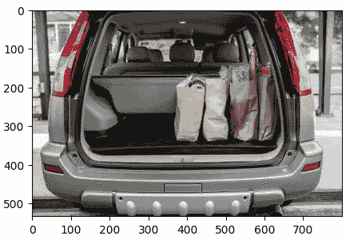

# Meta AI 推出了突破性的图像分割模型，该模型基于 10 亿个掩码进行训练。

> 原文：[`towardsdatascience.com/meta-ai-introduces-revolutionary-image-segmentation-model-trained-on-1-billion-masks-8f13c86a13a2`](https://towardsdatascience.com/meta-ai-introduces-revolutionary-image-segmentation-model-trained-on-1-billion-masks-8f13c86a13a2)

## Segment Anything - 最佳深度学习图像分割模型。

[](https://medium.com/@gkeretchashvili?source=post_page-----8f13c86a13a2--------------------------------)[](https://towardsdatascience.com/?source=post_page-----8f13c86a13a2--------------------------------) [古拉米·克雷特查什维利](https://medium.com/@gkeretchashvili?source=post_page-----8f13c86a13a2--------------------------------)

·发表在 [Towards Data Science](https://towardsdatascience.com/?source=post_page-----8f13c86a13a2--------------------------------) ·7 分钟阅读·2023 年 4 月 6 日

--

# **介绍**

在 OpenAI 的 ChatGPT 在自然语言处理领域取得革命性进展之后，人工智能的进步继续进行，Meta AI 也在计算机视觉领域取得了令人惊叹的进展。Meta AI 研究团队推出了名为 Segment Anything Model（SAM）的模型，并在 1100 万张图像上使用 10 亿个掩码的数据集。图像分割是识别哪些图像像素属于一个对象。


由 ai.facebook.com 提供的图像分割演示

该项目主要包括三个支柱：**任务**、**模型**和**数据**。

# **1. Segment Anything 任务**

Meta AI 团队的主要目标是创建一个可以根据用户输入提示工作的图像分割模型，就像 ChatGPT 一样。因此，他们提出了将用户输入与图像集成以生成分割掩码的解决方案。分割提示可以是任何指示图像中要分割内容的信息。例如，前景或背景点的集合、框、自由形式的文本等。因此，模型的输出是给定任何用户定义提示的有效分割掩码。

# 2. Segment Anything 模型

可推广的 Segment Anything Model（SAM）有三个组件，如下图所示。


Segment Anything 模型工作流程由 ai.facebook.com 提供

高级模型架构由*图像编码器*、*提示编码器*和*掩码解码器*组成。对于***图像编码器***，他们使用了具有 Vision Transformer (ViT) [2] 架构的 MAE [1] 预训练模型。ViT 模型在图像分类和分割任务中是最先进的模型。至于提示，他们将其分为两种类型——一种是*稀疏*的提示，如点、框和文本，另一种是*密集*的提示，如掩码。**提示编码器**步骤为每种类型的提示创建嵌入。至于**掩码解码器**，它仅将图像嵌入、提示嵌入和输出令牌映射到掩码上。

# 3.2 Segment Anything 数据集

## **3.1 Segment Anything 数据引擎**


垃圾进垃圾出（作者图像）

原则——垃圾进垃圾出——同样适用于 AI 领域。如果输入数据质量较差，则模型生成的结果也不会好。这就是为什么 Meta 团队试图选择高质量图像来训练他们的模型。该团队创建了一个数据引擎来筛选原始图像数据集。创建数据引擎分为三个阶段。

1.  *人工阶段*：专业的人工标注员参与手动标注图像上的掩码。

1.  *半自动阶段*：他们在标注的图像上训练了模型，并对其余图像进行了推断。然后，要求人工标注员标注模型未检测到的附加未标记对象，或纠正置信度低的分段。

1.  *完全自动阶段*：这一阶段包括自动掩码生成和自动过滤阶段，试图保留非歧义掩码，并根据置信度、稳定性和大小保留掩码。

## **3.2 Segment Anything 数据集**

Segment Anything 数据引擎创建了一个包含 10 亿个掩码的数据集（SA-1B），这些掩码基于 1100 万张多样化、高分辨率（平均 3300x4900 像素）和授权的图像。值得一提的是，99.1% 的掩码是自动生成的，但由于它们经过精心选择，质量非常高。

# 结论——为什么该模型具有革命性

Meta AI 团队与其他大型公司团队一起在 AI 发展方面取得了重大进展。Segment Anything 模型（SAM）具有为许多领域中的应用提供支持的能力，这些领域需要在任何图像中查找和分割任何对象。例如：

+   SAM 可能是一个大型多模态模型的组成部分，该模型集成了图像、文本、音频等。

+   SAM 可以基于用户的视线在 AR/VR 领域选择对象，然后将其“提取”到 3D 中。

+   SAM 可以提升创意应用，例如提取图像区域以进行视频编辑。

+   还有更多。

# 图像分割演示

在这一部分，我将尝试使用[官方 GitHub 代码](https://github.com/facebookresearch/segment-anything)来玩转算法，并使用[Google Colab](https://colab.research.google.com/)对图像进行两种类型的分割。首先，我将进行用户定义提示的分割，其次，我将进行完全自动的分割。

## 第一部分：使用用户定义提示进行图像分割

1.  设置（导入库和安装）

```py
from IPython.display import display, HTML
import numpy as np
import torch
import matplotlib.pyplot as plt
import cv2

display(HTML(
"""
<a target="_blank" href="https://colab.research.google.com/github/facebookresearch/segment-anything/blob/main/notebooks/predictor_example.ipynb">
  
</a>
"""
))

using_colab = True

if using_colab:
    import torch
    import torchvision
    print("PyTorch version:", torch.__version__)
    print("Torchvision version:", torchvision.__version__)
    print("CUDA is available:", torch.cuda.is_available())
    import sys
    !{sys.executable} -m pip install opencv-python matplotlib
    !{sys.executable} -m pip install 'git+https://github.com/facebookresearch/segment-anything.git'

    !mkdir images
    !wget -P images https://raw.githubusercontent.com/facebookresearch/segment-anything/main/notebooks/images/truck.jpg
    !wget -P images https://raw.githubusercontent.com/facebookresearch/segment-anything/main/notebooks/images/groceries.jpg

    !wget https://dl.fbaipublicfiles.com/segment_anything/sam_vit_h_4b8939.pth
```

2\. 辅助函数用于在图像上绘制掩码、点和框。

```py
def show_mask(mask, ax, random_color=False):
    if random_color:
        color = np.concatenate([np.random.random(3), np.array([0.6])], axis=0)
    else:
        color = np.array([30/255, 144/255, 255/255, 0.6])
    h, w = mask.shape[-2:]
    mask_image = mask.reshape(h, w, 1) * color.reshape(1, 1, -1)
    ax.imshow(mask_image)

def show_points(coords, labels, ax, marker_size=375):
    pos_points = coords[labels==1]
    neg_points = coords[labels==0]
    ax.scatter(pos_points[:, 0], pos_points[:, 1], color='green', marker='*', s=marker_size, edgecolor='white', linewidth=1.25)
    ax.scatter(neg_points[:, 0], neg_points[:, 1], color='red', marker='*', s=marker_size, edgecolor='white', linewidth=1.25) 
```

3\. 输入图像（初始图像进行分割）。让我们尝试选择第一袋食品的掩码。

```py
image = cv2.imread('/content/images/groceries.jpg')
image = cv2.cvtColor(image, cv2.COLOR_BGR2RGB) 
plt.figure(figsize=(5,5))
plt.imshow(image)
plt.axis('on')
plt.show()
```



输入图像（图像来自 Facebook 研究）

4\. 加载名为[*sam_vit_h_4b8939.pth*](https://dl.fbaipublicfiles.com/segment_anything/sam_vit_h_4b8939.pth)的预训练模型，该模型为默认模型。还有其他更轻量的模型版本，如[*sam_vit_l_0b3195.pth*](https://dl.fbaipublicfiles.com/segment_anything/sam_vit_l_0b3195.pth)和[*sam_vit_b_01ec64.pth*](https://dl.fbaipublicfiles.com/segment_anything/sam_vit_b_01ec64.pth)

```py
sam_checkpoint = "/content/sam_vit_h_4b8939.pth"
device = "cuda"
model_type = "default"

import sys
sys.path.append("..")
from segment_anything import sam_model_registry, SamPredictor

sam = sam_model_registrymodel_type
sam.to(device=device)

predictor = SamPredictor(sam)

predictor.set_image(image)
```

5\. 可视化图像上的点（用户提示），这将有助于识别我们的目标对象 — 第一个食品袋。

```py
input_point = np.array([[465, 300]])
input_label = np.array([1])
plt.figure(figsize=(10,10))
plt.imshow(image)
show_points(input_point, input_label, plt.gca())
plt.axis('on')
plt.show()
```


带用户提示的输入图像（图像来自 Facebook 研究）

6\. 进行预测以生成目标对象的掩码。

```py
masks, scores, logits = predictor.predict(
    point_coords=input_point,
    point_labels=input_label,
    multimask_output=True,
)
print(masks.shape)  # (number_of_masks) x H x W
```

7\. 显示前 3 个生成的掩码。当*multimask_output=True*时，算法返回三个掩码。稍后我们可以选择分数最高的一个。

```py
for i, (mask, score) in enumerate(zip(masks, scores)):
    plt.figure(figsize=(10, 10))
    plt.imshow(image)
    show_mask(mask, plt.gca())
    show_points(input_point, input_label, plt.gca())
    plt.title(f"Mask {i+1}, Score: {score:.3f}", fontsize=18)
    plt.axis('off')
    plt.show() 
```


预测结果（图像由作者提供）

突出的对象是模型预测的掩码。结果显示，模型生成了三个输出掩码，预测分数分别为：掩码 1 — 0.990，掩码 2 — 0.875 和掩码 3 — 0.827。我们选择了分数最高的掩码 1。瞧！！！模型预测的掩码就是我们最初想要分割的目标对象。结果令人惊讶，模型表现得相当好！

## 第二部分：完全自动的图像分割 — 续

1.  分段的绘图函数

```py
def show_anns(anns):
    if len(anns) == 0:
        return
    sorted_anns = sorted(anns, key=(lambda x: x['area']), reverse=True)
    ax = plt.gca()
    ax.set_autoscale_on(False)
    polygons = []
    color = []
    for ann in sorted_anns:
        m = ann['segmentation']
        img = np.ones((m.shape[0], m.shape[1], 3))
        color_mask = np.random.random((1, 3)).tolist()[0]
        for i in range(3):
            img[:,:,i] = color_mask[i]
        ax.imshow(np.dstack((img, m*0.35)))
```

2\. 自动生成掩码

```py
from segment_anything import sam_model_registry, SamAutomaticMaskGenerator, SamPredictor

sam = sam_model_registrymodel_type
sam.to(device=device)

mask_generator = SamAutomaticMaskGenerator(sam)

masks = mask_generator.generate(image)
print(len(masks))
```

3\. 显示结果

```py
plt.figure(figsize=(5,5))
plt.imshow(image)
show_anns(masks)
plt.axis('off')
plt.show() 
```


SAM 的自动分割结果（图像由作者提供）

算法使用默认参数识别了 137 个不同的对象（掩码）。每个掩码包含关于分段区域、边界框坐标、预测分数和稳定性分数的信息，这些信息可以用来过滤掉不需要的分段。

> *希望你喜欢这篇文章，并且现在可以开始自己创建美丽的应用程序了。如果你有任何问题或想分享对这篇文章的看法，请随时评论，我会很高兴回答。*
> 
> *如果你想直接支持我的工作并且获得 Medium 文章的无限访问权限，请通过我的* [*推荐链接*](https://medium.com/@gkeretchashvili/membership) *成为 Medium 会员。在此，万分感谢，祝你有美好的一天！*

[](https://medium.com/@gkeretchashvili/membership?source=post_page-----8f13c86a13a2--------------------------------) [## 通过我的推荐链接加入 Medium - Gurami Keretchashvili

### 阅读 Gurami Keretchashvili（以及 Medium 上成千上万其他作者）的每一个故事。你的会员费直接...

medium.com](https://medium.com/@gkeretchashvili/membership?source=post_page-----8f13c86a13a2--------------------------------)

# 参考文献

[1] Kaiming He, Xinlei Chen, Saining Xie, Yanghao Li, Piotr Dollar, 和 Ross Girshick. 掩蔽自编码器是可扩展的视觉学习者. CVPR, 2022.

[2] Alexey Dosovitskiy, Lucas Beyer, Alexander Kolesnikov, Dirk Weissenborn, Xiaohua Zhai, Thomas Unterthiner, Mostafa Dehghani, Matthias Minderer, Georg Heigold, Sylvain Gelly, Jakob Uszkoreit, 和 Neil Houlsby. 一张图胜过 16x16 个词：大规模图像识别的变换器. ICLR, 2021.

[3] Alexander Kirillov, Eric Mintun, Nikhila Ravi, Hanzi Mao, Chloe Rolland, Laura Gustafson, Tete Xiao, Spencer Whitehead, Alexander C. Berg, Wan-Yen Lo, Piotr Dollar, Ross Girshick. Segment Anything, 2023

## 我之前关于机器学习部署的文章

[](/how-to-deploy-machine-learning-models-end-to-end-dog-breed-identification-project-5689457d8973?source=post_page-----8f13c86a13a2--------------------------------) ## 如何部署机器学习模型？端到端狗品种识别项目！

### 在网络上部署你的机器学习模型的最简单方法。

towardsdatascience.com [](/how-to-deploy-machine-learning-models-601f8c13ff45?source=post_page-----8f13c86a13a2--------------------------------) ## 如何部署机器学习模型

### 在网络上部署机器学习模型的最简单方法

towardsdatascience.com
